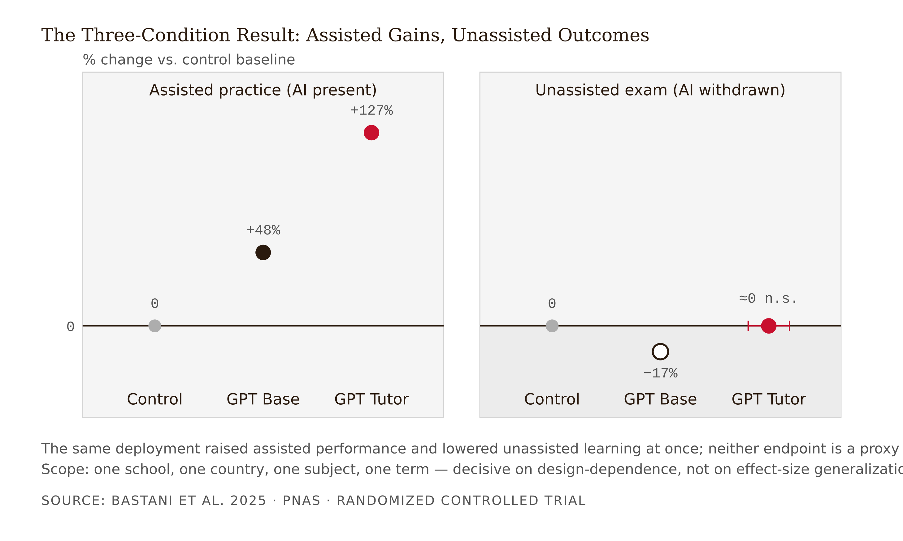
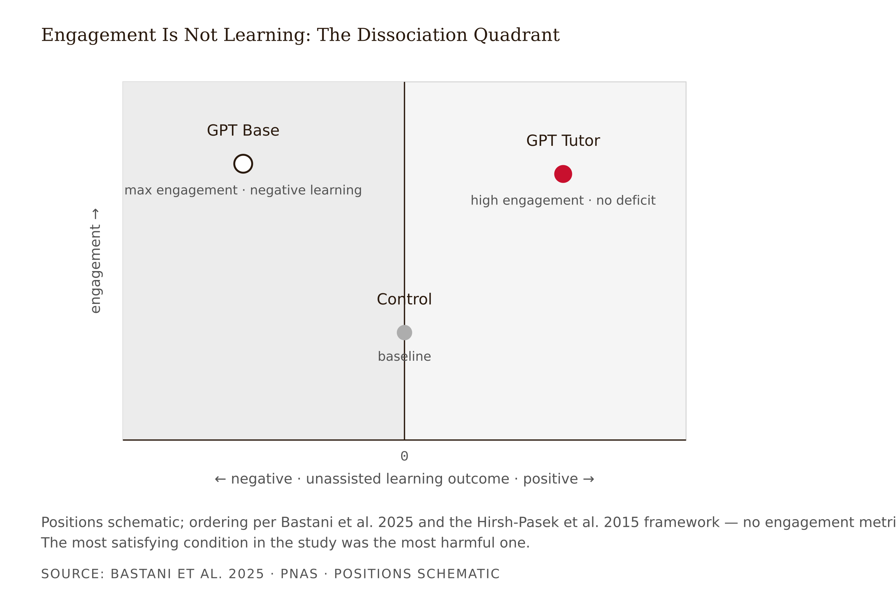

# Chapter 1 — Two Layers of Change: AI in Design Practice and in the Learning Experience
*Why the same table can show +48% and −17% for the same model, the same students, and the same math.*

In a high school in Turkey, during the 2023–24 academic year, nearly a thousand students in grades 9–11 worked through their ordinary in-class math practice sessions. A research team randomized those sessions into three conditions (Bastani et al. 2025, *PNAS* 122(26)).

The first group got **GPT Base**: an interface mimicking standard ChatGPT, running on GPT-4, unrestricted. Ask it anything; it answers.

The second group got **GPT Tutor**: the *same* GPT-4, behind a different interface, with a system prompt built to safeguard learning.

The third group was the **control**: standard practice, pencil and notes, no AI.

Here is what happened:

| Condition | Practice performance (AI available) | Subsequent exam (AI removed) |
|---|---|---|
| GPT Base | **+48%** vs. control | **−17%** vs. control |
| GPT Tutor | **+127%** vs. control | No significant deficit |
| Control | baseline | baseline |

Read it slowly, because every number is doing work.

During practice, both AI groups looked spectacular: +48% and +127% over control. If you had visited the classroom during practice — or watched the vendor demo, or read the pilot dashboard — both AI conditions would have looked like unambiguous wins, and GPT Tutor the bigger one.

Then the AI was taken away, and the students sat an ordinary unassisted exam on the same material. The GPT Tutor students did fine: statistically indistinguishable from students who never had AI at all. The GPT Base students did *worse than if the AI had never existed* — 17% below control. A tool that boosted their practice performance by nearly half had quietly made them worse at mathematics.

Now the puzzle. Same model — GPT-4 in both rows. Same students, randomly assigned. Same school, same teachers, same math. Whatever damaged one group and protected the other, it was not the technology, the curriculum, or the kids.

Sit with that, because the explanations that come to mind first are wrong, and the right one is the thesis of this book.

One administrative note, because you will encounter this study often and the internet has already garbled it: *PNAS* issued a formal correction in August 2025. The correction fixed a production error in one author's affiliation. No findings, data, or analyses changed (Bastani et al. 2025, correction 10.1073/pnas.2518204122). You will sometimes see "the study was corrected" deployed as if it meant "the study was retracted." It was not. Learning to check what a correction actually says is the first small act of evidence hygiene this book will ask of you.

---

AI is changing learning experience design in two distinct layers at once, and conflating them is the field's most common category error.

**Layer 1: AI in the practice of design.** Generative tools accelerate the designer's own workflow — ideation, persona drafting, storyboarding, content generation, question-bank production, prototyping. In Layer 1, the designer is the user. The learner never talks to this AI directly, though they inherit its outputs.

**Layer 2: AI in the learning experience.** Here the AI is a participant in the experience itself — tutor, evaluator, feedback engine, recommender, coach, and increasingly an autonomous agent that routes learners through content. In Layer 2, the learner is the user, and the AI's interaction design directly shapes what cognitive work the learner does or skips.

The layers have different evidence bases, different failure modes, and different design disciplines. A Layer 1 failure produces a mediocre design artifact and, over time, possibly a deskilled designer. A Layer 2 failure produces damaged learning — the −17% in the opening table. And here is the professionally uncomfortable part: a designer can be excellent at Layer 1 — prompt-fluent, fast, productive — while being entirely unequipped for Layer 2, because Layer 2 requires something Layer 1 never asks of you: predicting what an interaction design does to *someone else's cognition over time*.

This book's specific reader — the LX designer eighteen months into the job, told last quarter to "add an AI tutor" — was almost certainly hired and evaluated on Layer 1 skills, then handed a Layer 2 responsibility. Vendor marketing actively encourages the confusion, selling Layer 2 products on Layer 1 virtues: speed, polish, scale, demo quality. None of those virtues can produce, or rule out, a −17%.

One honest label before we go on: the two-layer taxonomy is this book's organizing lens, synthesized from the practice literature and the learning-outcome literature. It is sturdy as pedagogy, but no study has yet directly tested whether Layer 1 fluency predicts Layer 2 design errors. We flag our own constructs by the same standard we will apply to vendors.

---

How do you assign a feature to a layer? Not by product, and not by marketing category — by feature, with one question: **whose cognitive work does this AI replace or restructure?**

If the answer is "the designer's," the feature is Layer 1, and the governing questions are output quality, accuracy verification, and what skill the human stops practicing. If the answer is "the learner's," the feature is Layer 2, and the governing question is the one this course exists to teach: scaffold or crutch — does the design preserve the cognitive work that produces learning, or quietly perform it on the learner's behalf?

Consider a typical vendor "AI course assistant" with four features: (a) auto-generates quiz banks from uploaded slides; (b) drafts lesson summaries for the instructor; (c) answers student questions 24/7 in a chat window; (d) recommends each student's next module. Features (a) and (b) are Layer 1 — they compress the instructor's workflow, and the design questions are accuracy and quality control. Features (c) and (d) are Layer 2 — they restructure the learner's cognitive work, and the design questions are: does (c) give answers or hints? Is there a reasoning requirement? Does support fade? Does (d) route equitably and visibly?

A procurement review that evaluates all four features with one rubric will miss the only feature in the list capable of producing a Bastani-style deficit: feature (c).

Note that some features sit in both layers. AI-generated feedback is authored through Layer 1 tooling but delivered as a Layer 2 experience; an auto-built quiz bank is a Layer 1 convenience whose distractors, if they encode misconceptions, become a Layer 2 hazard. This is exactly why the analysis must be feature-by-feature, never product-by-product. Products do not have layers. Features do.

<!-- → [TABLE: Two-Layer Audit output format — columns: Feature (named specifically), Layer (1/2/Both), Whose cognitive work?, Governing questions, Evidence available, Evidence missing — populated with the four-feature course assistant example, showing how features (a)/(b) route to output-quality questions and (c)/(d) route to scaffold/crutch questions with a missing unassisted endpoint flagged] -->

---

Return to the table and resolve the puzzle as far as this chapter's evidence allows.

The candidate explanations students reach for first, and why each fails:

GPT Tutor was a better or fine-tuned model. No. Both conditions ran GPT-4. Same model.

The GPT Tutor students were stronger. No. Randomized assignment; with ~1,000 students, the groups were statistically equivalent.

GPT Base students just got lazy. Closer — but laziness does not explain why a design change eliminated the harm. Chapter 2 will show the behavior is rational, not lazy, which matters because it changes the remedy.

What actually differed: a system prompt and a conversation structure. GPT Tutor was instructed to give hints rather than answers, and — this is the detail everyone skips — it was supplied with teacher-written, problem-specific correct solutions and common student mistakes, so its hints and feedback were pedagogically grounded and far less error-prone (Bastani et al. 2025). The safeguard was not a magic string. It was *pedagogical labor encoded into a prompt*: teachers did real design work per problem, and the interface enforced an interaction policy on top of it.

The causal logic is the spine of this course. Model held constant; students randomized; content identical. The only variable distinguishing the −17% row from the no-deficit row is the interaction design. Therefore: **interaction design — not model capability — is the primary causal variable available to the designer.** That is this book's thesis stated as an experimental result.

The study also left a mechanism trail. GPT Base students used the tool as an answer machine: when GPT-4 made logical and arithmetic errors, those errors propagated verbatim into student work. The students were transcribing, not processing. In surveys, they did not perceive the harm — access felt like learning. The full mechanism story waits until Chapter 2; for now, what matters is that the harm was real, design-caused, and invisible from inside the experience.

Two misreadings to refuse. The table does not say "AI harms learning" — row two shows the harm is a design outcome, not a technology property. And it does not say "AI works if you prompt it nicely" — the protective design encoded per-problem teacher expertise: money, time, pedagogy. What survives contact with the table is *design decides* — a heavier sentence than it appears, because it means the responsibility cannot be delegated to the model vendor, and (as Chapter 2 will show) cannot be delegated to the learner either.

One scope caution, stated now and repeated often: this is one school, one country, one subject, one term. Its internal validity is excellent — randomization, scale, preregistration, publication in *PNAS* — so it is decisive about design-dependence. It is not a warrant for the specific effect sizes generalizing to your context.

---

The table only makes sense once you accept that "performance" names two different constructs.

**Assisted performance** is what the learner-plus-tool system can produce right now, with the tool present. **Unassisted performance** is what the learner has durably acquired — what survives the tool's withdrawal. The GPT Base row proves these can move in opposite directions in the same condition (+48% and −17%), which means neither is a proxy for the other. Ever.

This distinction did not arrive with AI. Soderstrom and Bjork (2015) reviewed decades of evidence that performance during acquisition is an unreliable — often inversely related — index of long-term learning. Conditions that inflate training performance (massed practice, predictable sequences, abundant feedback, worked solutions on demand) routinely depress retention and transfer; conditions that depress training performance (spacing, interleaving, retrieval demands) improve them. An always-available answer engine is the most powerful performance-inflater ever shipped to learners. Bastani's result is a new instance of an old, settled principle — which is precisely why the field should have predicted it, and mostly didn't.

The design implication runs through everything this course will ask you to produce: every evaluation, every vendor claim, every pilot report must be tagged by endpoint type — assisted, unassisted, transfer (novel problems), retention (delayed measurement). A "+40% improvement" claim is meaningless until you know which column it came from. The demo, the dashboard, and the satisfaction survey all measure the assisted column. The exam, the job, and the rest of the learner's life happen in the unassisted one.

This is also your first encounter with the course's signature mechanic: the **Withdrawal Test** — *what can the learner do when the AI is taken away, and how does the design make that more rather than less?* Every design-lab assignment you submit in this course must answer it. A design with no withdrawal answer is a crutch with good intentions.

---

There is a third seductive measurement, and it deserves its own ambush warning: engagement.

Hirsh-Pasek and colleagues (2015) established four conditions under which durable learning occurs: learners must be actively involved — minds-on, not just hands-on; engaged with the learning material, not with features around it; finding the material meaningful; and socially interactive around the content. The critical move is splitting engagement *with the content* from activity that merely looks engaged. An app can produce intense behavioral engagement — taps, streaks, session length — that attaches to reward mechanics rather than to the to-be-learned material.

Apply that to conversational AI and the prediction writes itself: a chatbot that answers instantly, praises warmly, and never frustrates will produce spectacular engagement telemetry while removing the active, effortful processing that the first condition requires. The GPT Base condition is that prediction come true: maximal engagement, negative learning. The most satisfying condition in the study was the most harmful one.

A principled rubric for separating engagement evidence from learning evidence already exists and predates the GenAI wave: the EdTech Evidence Evaluation Routine (EVER), operationalizing the four conditions as an evaluation checklist — what outcome was actually measured, under what comparison, and whether the evidence demonstrates learning rather than activity. <!-- FACT-CHECK FLAG: CONTRADICTED (minor, "predates the GenAI wave" only) — EVER is Kucirkova, Brod & Gaab 2023, npj Science of Learning 8:35 (published 2023-09-06, i.e., after ChatGPT's release); Hirsh-Pasek is not an author — her 2015 four-pillars paper is the framework EVER cites as foundation (its ref 2). Authorship [verify] resolved; see factchecks/01-two-layers-of-change-assertions.md --> This book's endpoint-type discipline is the AI-era extension of the same move. For any dashboard, ask of each metric: which condition, if any, does this measure — and where is the unassisted endpoint? A dashboard with no unassisted column is an engagement report, whatever its title says.

---

The adoption picture is worth having, briefly and honestly, because it sets the stakes.

The adoption question is effectively closed. A Synthesia-commissioned survey of L&D professionals (fielded late 2025) reports 87% already using AI at work — note the conflict of interest: Synthesia sells AI video, so vendor-commissioned statistics get cited here as triangulation, never as standalone claims. An independent 2025 survey of 144 instructional designers found 83% using ChatGPT, with efficiency the top-ranked benefit and accuracy verification the top-ranked challenge (via AACE Review). These converge with peer-reviewed practice studies: workflow compression is the established Layer 1 effect. The floor of novice output rises and production accelerates; in Moore et al. (2025), novice designers' AI-assisted microlessons scored higher on quality for half of assignments and never lower on average. Design judgment has not been automated, and deskilling remains a documented warning signal rather than a proven causal harm.

You are already *in* Layer 1 — 83 to 87 percent of your field is. This course's question is whether you are equipped for Layer 2, where the habits of speed and polish that make you good at Layer 1 are the precise habits that build crutches.

---

Translate the framework into the case that will carry through this book.

You are the LX designer for *DataWise 101*, an introductory statistics online course. Enrollment is healthy, completion is mediocre, and the steering committee has approved budget for "an AI homework-help tutor." A vendor demo went well. Your director forwards the deck with one line: "Looks great — anything we're missing?"

The deck claims "+40% improvement in problem-solving performance" and "satisfaction in the top decile." The demo was genuinely impressive: the tutor answered a tricky sampling-distribution question fluently, warmly, instantly. The designer's instinct says yes. The designer has also just read about a GPT tutor that made students 17% worse. Which fact describes this product?

First attempt at evaluation: read the deck looking for a verdict-shaped answer — is this a *good* AI tutor? Dead end. The deck describes one product, but the audit question only works on features.

Second attempt: check evidence quality. The designer asks for the study behind the +40%. It arrives: an internal pilot, measured on in-product problem sets, no comparison group. Better instinct, still a dead end as stated — the designer now knows the evidence is weak but not *what kind* of weak, or what to ask for instead.

Third attempt: run the Two-Layer Audit. Features: (a) auto-generates practice problem variants for instructors; (b) drafts weekly recap emails; (c) a 24/7 chat that helps with homework problems; (d) a "readiness score" recommending when students attempt the quiz. Layer assignment: (a) and (b) are Layer 1 — governing questions are accuracy and instructor skill-maintenance; nothing here can produce a −17%. (c) is Layer 2, dead center — it restructures the learner's cognitive work on exactly the tasks the course grades. (d) is Layer 2 — it routes learner behavior. Then the endpoint tagging: the +40% was measured *with the tutor present*, on *in-product tasks*, with *no control group*. An assisted number against no comparison — structurally, the +48% from the Bastani table, the column that cannot distinguish scaffold from crutch.

The designer writes a one-page memo: the claim as stated cannot distinguish a GPT Base from a GPT Tutor; feature (c) is the only feature capable of either outcome; and the cheapest decisive measurement is a delayed, tutor-unavailable problem set given to pilot users and a matched non-pilot section. The memo does not say "don't buy." It says we cannot yet tell what we would be buying, and here is the one measurement that would tell us. The director, who expected a thumbs-up, gets a question — and a plan.

The audit's power is that it converts "is this AI good?" — unanswerable — into "which features touch the learner's cognition, and what does the unassisted column show?" — answerable, and cheaply. Its limit is that it diagnoses which questions to ask; it cannot answer them. It will tell you that feature (c) needs an unassisted endpoint, but not how to design the interaction so the endpoint comes out well. That requires the mechanism (Chapter 2) and the scaffold catalog (Chapter 3).

---

## Exercises

**Warm-up**

1. *(Recall — the table)* In 200 words or fewer, explain the three-condition result to a non-technical stakeholder. You must use *assisted* and *unassisted* correctly, state what did and did not differ between conditions, and end with the one question the stakeholder should now ask about any AI tutor pitch. No jargon beyond those two terms.

2. *(Recall — endpoint types)* A vendor's case study reports "+40% improvement" for its AI tutor. Name the two questions you must ask before this number can mean anything — one about measurement conditions, one about comparison — and explain why neither is answered by knowing the sample size.

**Application**

3. *(Apply — layer assignment)* Classify each of the following by layer and justify the assignment with the "whose cognitive work?" diagnostic: (a) an AI that drafts your course's learning objectives; (b) an AI that answers learners' questions during practice; (c) an AI that generates the feedback message a learner sees after a quiz. For (c), if you find yourself hesitating — write out what the hesitation reveals rather than resolving it prematurely.

4. *(Apply — Two-Layer Audit)* Choose one real AI learning product you know or your employer uses. Produce the audit output: an enumerated feature table with layer assignments, the "whose cognitive work?" justification for each, and a flag on every feature that could in principle produce a Bastani-style unassisted deficit. Minimum four features. For every flagged feature, state the single measurement that would tell you which row of the table it resembles.

**Synthesis**

5. *(Synthesize — dashboard rewrite)* A pilot dashboard for the DataWise 101 AI tutor shows: daily active users up 22%, average session 24 minutes, satisfaction 4.7/5, 88% of hint requests resolved without human escalation. For each metric: which of the four learning conditions (active, engaged with material, meaningful, socially interactive) it measures, if any, and what it cannot tell you. Then rewrite the dashboard with one metric per condition plus one unassisted-performance metric, each with a one-line collection method.

6. *(Synthesize — procurement memo)* In 300 words, tell a decision-maker why a vendor's "+40% improvement" claim cannot distinguish scaffold from crutch, and specify the single cheapest measurement that would. Write it to be read in ninety seconds by someone who liked the demo and wants to move forward.

**Challenge**

7. *(Challenge — the scope question)* This chapter argues that interaction design, not model capability, is the primary causal variable available to the designer. Construct the strongest honest case that this claim could become false — not through a general "AI will improve" argument, but by specifying what a future model would have to do by default, without any designed interaction policy, to relocate the causal lever from the designer back toward the vendor. Then state what experiment would detect it.

---

## Chapter 1 Exercises: Two Layers of Change

**Project:** The Integration Specification
**This chapter adds:** `spec/01-two-layer-map.md` — a feature-by-feature two-layer map of your chosen AI integration, with every evidence claim tagged by endpoint type.

Before Exercise 1, make the one decision that governs the next fifteen chapters: choose the AI integration you will carry through this entire book. Three options. Your employer's AI integration — the one you'll actually be accountable for. An AI learning product you know well enough to audit honestly. Or Track A: the DataWise 101 statistics-course AI tutor from this chapter's worked example, which the book will keep developing alongside you. Whatever you choose, you are about to build its complete Integration Specification, one component per chapter, in a `spec/` directory you will still be using in Chapter 15. The AI does legwork. You do judgment. Every exercise below enforces that division.

---

### Exercise 1 — When to Use AI

**The judgment:** In this chapter's work, AI assistance is appropriate for the following tasks:

- **Extracting a complete feature inventory from your integration's documentation, marketing pages, or release notes.** — *Why AI works here:* summarizing — compressing vendor prose into an enumerated feature list is fast for the machine and cheap for you to check against the source.
- **Harvesting every evidence claim the vendor or product team makes ("+40% improvement," "students learn 2× faster") into a raw claims list.** — *Why AI works here:* pattern recognition — outcome claims have a recognizable shape in marketing text, and you will judge each one yourself in the next step.
- **Converting your finished audit into the spec file's table format.** — *Why AI works here:* reformatting — once the judgments are made, the markdown is clerical.

**The tell:** You know you are using AI appropriately when you can evaluate the output — when you have independent criteria to judge whether it is correct, complete, and fit for purpose.

---

### Exercise 2 — When NOT to Use AI

**The judgment:** The same chapter contains work that is yours alone — and not coincidentally, it is the work the chapter exists to train:

- **Assigning each feature to a layer with the "whose cognitive work?" diagnostic.** — *Why AI fails here:* missing ground truth — the AI has read the vendor's description of the feature; it has not watched your learners use it, and layer assignment turns on whose cognition the feature actually touches in your deployment, not on what the brochure says it does.
- **Tagging an evidence claim's endpoint type when the documentation is ambiguous about what was measured.** — *Why AI fails here:* hallucination risk — asked what a vendor measured, an LLM produces a confident, plausible answer whether or not the documentation says; the honest tag is often "cannot determine — ask the vendor," and fluent text resists that tag.
- **Flagging which features could in principle produce a Bastani-style unassisted deficit.** — *Why AI fails here:* calibration — this flag is a risk judgment about your learners and your stakes, and the chapter's entire argument is that assisted-column fluency systematically miscalibrates exactly this call.

**The tell:** You know you have crossed the line when you are using AI output as your reason for a conclusion rather than as a tool for reaching one. If you could not explain the conclusion without the AI, the AI did the work that should have been yours.

**Series connection:** Tier 4 Metacognitive — reading assisted versus unassisted endpoints is not preparation for the auditing skill; it *is* the auditing skill. Offload the tagging and this chapter happened to your spec file, not to you.

---

### Exercise 3 — LLM Exercise

**What you're building this chapter:** The foundation of your Integration Specification: `spec/01-two-layer-map.md` — your integration's features assigned to layers, deficit-capable features flagged, and an Endpoints Log tagging every evidence claim you can find for the product.

**Tool:** Claude (claude.ai). A plain conversation is fine this week. Starting in Chapter 2 you will create a Claude Project named "Integration Spec" to hold the spec files as they accumulate — so save this exercise's output where you can retrieve it.

**The Prompt:** Copy this in full. Note what it does: it refuses to work until you have done the cognitively load-bearing step yourself. That refusal is not pedantry — it is this course's first scaffold pattern, modeled.

> You are an evidence-discipline coach for a designer building an AI Integration Specification — a fifteen-chapter document specifying one real AI integration. Today we build its first component: the Two-Layer Map. Your job is to stress-test my map and then format it — NOT to write it for me.
>
> RULES (follow strictly):
> 1. First, ask me which integration I am carrying through this specification: my employer's AI integration, an AI learning product I know well, or the book's teaching case (the DataWise 101 statistics-course AI tutor). Ask for one paragraph of context: who the learners are, what the integration is supposed to do, and what is at stake if it becomes a crutch.
> 2. Then ask me to paste my own draft audit: an enumerated list of the integration's AI features; my layer assignment for each (Layer 1 / Layer 2 / both); my "whose cognitive work does this replace or restructure?" justification for each; my endpoint tag (assisted / unassisted / transfer / retention / cannot determine) on every evidence claim I have found for the product; and my flag on any feature that could in principle produce an unassisted deficit.
> 3. If my audit is incomplete — any feature without a layer assignment or justification, any claim without an endpoint tag — do not proceed. Name exactly what is missing and stop. Do not fill gaps for me, even if I ask. If I ask why you won't, say: because layer assignment and endpoint tagging are the skills this chapter trains, and a map I didn't make is a map I can't defend.
> 4. Once my audit is complete, do exactly three things:
>    a. Challenge my single weakest layer assignment with one pointed question about whose cognition the feature actually touches.
>    b. Identify the one place where I accepted an assisted-performance or engagement claim where an unassisted endpoint is required, and ask me what measurement would settle it.
>    c. Ask me one question about a feature that may sit in BOTH layers that my audit treats as sitting in one.
> 5. Ask me to revise the audit myself, in my own words. Do not produce a revised audit. Do not summarize what the revision should say.
> 6. Only after I paste my revision: format it — changing none of my judgments — as a markdown document titled spec/01-two-layer-map.md with three sections: (1) The Integration — my context paragraph; (2) Feature Map — a table with columns Feature / Layer / Whose cognitive work? / Deficit flag + justification; (3) Endpoints Log — a table with columns Evidence claim / Source / Endpoint type / What it can and cannot tell us. Where I tagged a claim "cannot determine," preserve that tag exactly — do not resolve it.
>
> Begin with step 1.

**What this produces:** A finished `spec/01-two-layer-map.md`, plus a transcript whose delta — first draft, challenge, revision — is the real artifact. If the challenge in step 4 found nothing to push on, your audit was either excellent or too vague to attack; reread it and decide which.

**How to adapt this prompt:**
- *Your own project:* works as written — it is designed to ask you for your specifics rather than assume them.
- *ChatGPT / Gemini:* paste unchanged. Both follow the gate, but tend to start filling gaps after one refusal; if the model drafts audit content for you, that content is contaminated — reply "stop — re-read rule 3" and supply your own.
- *Claude Project:* if you already use Projects, create "Integration Spec" now and run this inside it; you'll be one chapter ahead of the setup instructions.

**Connection to previous chapters:** None — this is the foundation stone. Every later spec file points back to the Layer 2 rows you flag today.

**Preview of next chapter:** Chapter 2 takes every Layer 2 feature in this map and asks the harder question — which of them will learners come to lean on? That becomes `spec/02-reliance-risk-map.md`.

---

### Exercise 4 — CLI Exercise

**What you're building:** The project's physical scaffolding: a `spec/` directory holding all fifteen component stubs, the Two-Layer Map template with its Endpoints Log, and the standing-rules file that will govern every agent you point at this project for the rest of the book.

**Tool:** Claude Code (terminal) or Cowork (desktop app) — this is file-system work, and you want an agent that creates real files you keep, not chat output you lose.

**Skill level:** Beginner. No code. The agent creates files; you inspect them.

**Setup:**
- [ ] Claude Code installed and authenticated (or a Cowork session with a folder connected)
- [ ] An empty project folder, e.g. `integration-spec/`
- [ ] Your Exercise 3 output on hand, if you completed it

**The Task:** Paste this into the agent:

> In this empty folder, set up an AI Integration Specification project. Do exactly this and nothing more.
>
> 1. Create a CLAUDE.md at the root containing these standing rules, verbatim:
>    - This project builds an AI Integration Specification across 15 chapters.
>    - Agents never edit existing files under spec/ without first showing a diff and getting explicit approval.
>    - Every evidence claim added to any spec file carries either a citation or a [verify] flag.
>    - Cells marked [learner to classify] or [learner to complete] belong to the human. Agents never fill them.
> 2. Create a spec/ directory containing exactly these fifteen stub files: 01-two-layer-map.md, 02-reliance-risk-map.md, 03-scaffold-pattern-selection.md, 04-evidence-audit.md, 05-ai-workflow-policy.md, 06-tutoring-interaction-spec.md, 07-adaptivity-decision.md, 08-routing-equity-audit.md, 09-content-feedback-boundaries.md, 10-assessment-redesign.md, 11-guardrail-spec.md, 12-agentic-boundaries.md, 13-learner-side-design.md, 14-evaluation-plan.md, 15-integration-spec.md. Each stub contains only a # title and one line describing what it will hold.
> 3. In spec/01-two-layer-map.md, add the working template: Section 1 "The Integration" — [learner to complete]; Section 2 "Feature Map" — an empty table with columns Feature / Layer / Whose cognitive work? / Deficit flag; Section 3 "Endpoints Log" — an empty table with columns Evidence claim / Source / Endpoint type (assisted / unassisted / transfer / retention) / What it can and cannot tell us.
> 4. Do not invent any content about any product. Structure only.
> 5. Finish by printing the directory tree and the full contents of CLAUDE.md and spec/01-two-layer-map.md so I can verify before you stop.

Then, optionally: paste your completed map from Exercise 3 and ask the agent to insert it into `spec/01-two-layer-map.md` — it should show you the diff first. If it doesn't, you have just learned which of your standing rules needs reinforcement.

**Expected output:** A CLAUDE.md with four rules, fifteen correctly named stubs, a populated template in 01, and a printed tree.

**What to inspect:** The fifteen filenames match the list character-for-character — every later chapter references them by exact name. The CLAUDE.md rules are verbatim, not paraphrased. The template contains zero invented content: every prefilled cell should be structure, not claims. The Endpoints Log column names all four endpoint types.

**If it goes wrong:** Agent invents features or example claims for "your" product — it violated instruction 4; delete `spec/01`, re-run step 3 with "structure only, no content, no examples." Wrong or creatively renamed files — paste the canonical list again and ask it to rename and re-print the tree. Agent modified something without showing a diff — restore from the printed output and treat it as the live demonstration of why the diff rule is in CLAUDE.md.

**CLAUDE.md / AGENTS.md note:** The four rules you just installed are this project's permanent contract; every CLI exercise in Chapters 2–15 assumes they are present. If you use a different agent (Cursor, Codex), copy the same four rules into AGENTS.md — the contract matters, not the filename.

---

### Exercise 5 — AI Validation Exercise

**What you're validating:** Not your own work, this once — a pre-written artifact, because the failure mode it carries is the one you must catch reliably before you can trust anything you build in this project. Below is an AI-generated "pilot endpoint summary" of exactly the kind any LLM will cheerfully produce from a pilot's assisted-side data.

**Validation type:** Claim audit — endpoint tagging against the chapter's four endpoint types.

**Risk level:** Low here — it's a training artifact. The identical document in a real procurement meeting is high stakes, which is the point of practicing on a safe one.

**Setup:** No tools needed. The artifact:

> **Pilot Summary — AI Homework Tutor, 6-Week Pilot.** Learning outcomes improved substantially across the pilot cohort. Students using the tutor scored 42% higher on weekly problem sets than the previous semester's averages, demonstrating significant learning gains. Engagement was exceptional: daily active use rose 31%, and 92% of help requests were resolved in-product without escalation. Students reported markedly deeper understanding of course concepts (4.6/5 on the end-of-pilot survey). These results confirm the tutor is effectively building durable statistical skills, and we recommend expansion to all course sections.

**The Validation Task:** Work the checklist against the artifact:

- [ ] **Correctness:** Does any reported number actually measure what the sentence around it claims it measures?
- [ ] **Completeness:** Tag every claim by endpoint type. How many of the four types appear in the document? Now count the unassisted ones.
- [ ] **Scope:** "Confirms the tutor is building durable skills" — what measurement would be required to license that sentence, and is it anywhere in the document?
- [ ] **Endpoint construct check (chapter-specific):** Mark every place an assisted or engagement measurement is reported in learning-outcome language. The swap has a shape — learn it here, where it's cheap.
- [ ] **Comparison check (chapter-specific):** "Previous semester's averages" — is that a control group? Name two things besides the tutor that differ between the cohorts.
- [ ] **Failure-mode check:** *Fluent-but-wrong* — the prose is confident, organized, recommendation-shaped; does any of that fluency survive the tagging? *Construct swap* — assisted reported as learning, this chapter's named failure mode. *Missing ground truth* — is there a single unassisted endpoint anywhere in the document?

**What to do with your findings:** This artifact fails multiple checks by design, and no revision saves it — the missing measurement was never taken. That is the When-NOT lesson in document form: an AI summarizing assisted-side data will produce learning-language, fluently, every time, because the training distribution is full of exactly this genre. File the standing rule for every chapter that follows: all checks pass → use the output; one check fails → revise the prompt or input and re-run; multiple checks fail → stop delegating — you have found judgment work wearing a task costume, and you do it yourself.

**AI Use Disclosure prompt:** From this chapter forward, every spec component you produce carries a two-sentence disclosure. Sentence one: what the AI produced and how you used it. Sentence two: one specific thing the AI could not determine that required your judgment. Write the disclosure for your `spec/01-two-layer-map.md` now — if sentence two is hard to write, that is evidence about who did the work.

**Series connection:** The failure mode trained here — the endpoint construct swap, assisted gains reported as learning gains — is the field's most common citation error and this book's first. Tier 4 Metacognitive: you validated a validator's output before trusting your own, which is the auditing skill pointed at itself.

---

## References

1. Bastani, H., Bastani, O., Sungu, A., Ge, H., Kabakcı, Ö., & Mariman, R. (2025). Generative AI without guardrails can harm learning: Evidence from high school mathematics. *Proceedings of the National Academy of Sciences*, 122(26), e2422633122. https://doi.org/10.1073/pnas.2422633122
2. Correction for Bastani et al. (2025). *Proceedings of the National Academy of Sciences*, e2518204122 (published August 20, 2025; production error in one author affiliation only — no findings, data, or analyses changed). https://doi.org/10.1073/pnas.2518204122
3. Soderstrom, N. C., & Bjork, R. A. (2015). Learning versus performance: An integrative review. *Perspectives on Psychological Science*, 10(2), 176–199. https://doi.org/10.1177/1745691615569000
4. Hirsh-Pasek, K., Zosh, J. M., Golinkoff, R. M., Gray, J. H., Robb, M. B., & Kaufman, J. (2015). Putting education in "educational" apps: Lessons from the science of learning. *Psychological Science in the Public Interest*, 16(1), 3–34. https://doi.org/10.1177/1529100615569721
5. Kucirkova, N., Brod, G., & Gaab, N. (2023). Applying the science of learning to EdTech evidence evaluations using the EdTech Evidence Evaluation Routine (EVER). *npj Science of Learning*, 8, 35. https://doi.org/10.1038/s41539-023-00186-7
6. Synthesia (2026). *AI in Learning & Development Report 2026* (vendor-commissioned survey of 421 L&D professionals, fielded October–November 2025). https://www.synthesia.io/reports/ai-in-learning-and-development-report-2026
7. McNeill, L., et al. (2025). Generative AI for instructional design: Changes, chances, challenges (survey of 144 instructional designers). *AACE Review*. https://aace.org/review/generative-ai-for-instructional-design-changes-chances-challenges/
8. Moore, S., Eckstein, M., Kwon, S., & Stamper, J. (2025). Generative AI in instructional design education: Effects on novice microlesson quality. In *Technology Enhanced Learning (EC-TEL 2025)*, Springer. https://link.springer.com/chapter/10.1007/978-3-031-98459-4_35
