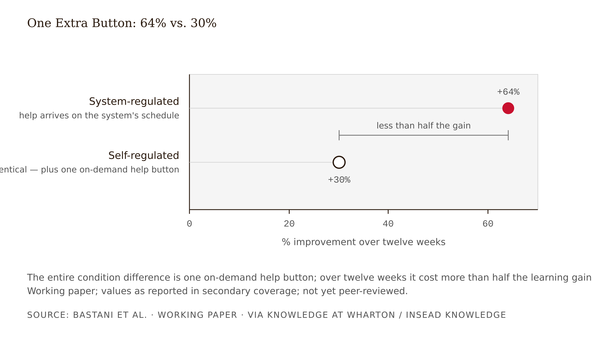

# Chapter 2 — The Crutch Effect: Shortcut-Seeking and Cognitive Debt
*Every help request is rational. The accumulated policy is ruinous. The student knows this. They request anyway.*

Before you read the result, commit to a prediction. Write it down — the commitment is the point.

In chess academies, more than 200 students enrolled in a 12-week intensive training program built around an AI tutor purpose-built for the experiment. Chess was chosen deliberately: a sequential decision-making domain where engine evaluation provides an objective skill metric, move by move.

The researchers randomized students into two conditions. In the **system-regulated** condition, the platform automatically provided AI tips at pedagogically chosen key moments. The **self-regulated** condition was identical — same tips, same moments — except for one addition: a button. Students could also request AI help any time they wanted.

That is the entire difference. Not less support — *more*, available on demand, for students serious enough to enroll in a chess academy: motivated learners, in a domain they love, free to use their judgment about when they needed help.

Your prediction: which group improved more over twelve weeks?

Most people — including most designers and most students in this course — predict the gap will be small, or that the self-regulated group might win. Autonomy is good; motivated learners know when they're stuck; an extra option can't hurt.

System-regulated students improved **64%**. Self-regulated students improved **30%** — less than half the learning, from a design difference of one extra button (Bastani et al., "When Does AI Assistance Undermine Learning?", working paper, reported via Knowledge at Wharton and INSEAD Knowledge, early 2026 — a working paper, not yet peer-reviewed, and this chapter holds it to that standard). <!-- FACT-CHECK FLAG: CONTRADICTED (citation only; all findings confirmed) — the working paper is Poulidis, S., Bastani, H., & Bastani, O., "Self-Regulated AI Use Hinders Long-Term Learning" (SSRN 5604932); "When Does AI Assistance Undermine Learning?" is the title of the Knowledge at Wharton article (Feb 24, 2026), not the paper, and the first author is Poulidis, not Bastani — see factchecks/02-the-crutch-effect-assertions.md -->

The behavioral trace explains the gap. Self-regulated students escalated their help requests over time; by the end of three months they were requesting move-reveal tips every three to four moves — outsourcing the decision-making the training existed to build. And the detail that should end a popular argument forever: **the students knew.** They were aware of their over-reliance, reported it — and increased their usage anyway. Awareness did not produce restraint.

If your prediction was wrong, you are in good company, and your wrongness is this week's curriculum. The −17% from Chapter 1 was not an anomaly of one unguarded chatbot. It is what happens, by default, when help is free and the cost of taking it is invisible.

---

Delete a word from your professional vocabulary: *lazy*. It will mislead every design decision you make this term.

Model the learner's situation at a single moment. A student is stuck on a problem; forty minutes of homework remain; an AI button is available. Option A — struggle: high effort now, uncertain success, and a benefit (a stronger schema) that is invisible, delayed, and probabilistic. Option B — ask: low effort, guaranteed progress, and a cost that is equally invisible, delayed, and probabilistic. No individual choice of B is irrational; each reduces effort, reduces error risk, and *feels like progress*. The catastrophe lives only in the accumulated policy: "always B when stuck," run a hundred times across a semester, is the −17% policy. The chess study's 64/30 split is this decision model run experimentally.

The framing dictates the remedy. If shortcut-seeking were a character flaw, the fix would be exhortation, honor codes, and posters. But the chess students were motivated, self-aware, and escalating anyway — structurally identical to every other self-control problem where costs are delayed and benefits are immediate: diet, savings. What works on such problems is *structural*: choice architecture, defaults, friction — guardrails. The "students will self-regulate" escape hatch is closed not by argument but by randomized evidence.

Two older literatures predicted all of this, which keeps the claim from reading as AI-novelty. The intelligent-tutoring-systems field documented "gaming the system" two decades ago: students exploiting on-demand hints to extract answers, with measurable learning costs (Baker, Corbett, Koedinger & Wagner 2004; Aleven & Koedinger's help-seeking work). The help button has always been a design hazard; LLMs made the button omnipotent. And the behavior predates buttons entirely: Liljedahl's classroom studies behind *Building Thinking Classrooms* found that on "now-you-try-one" tasks after a worked demonstration, only about 20 percent of students actually try to reason it through; the rest slack, stall, fake, or mimic — and the mimics sincerely believed mimicking was what the teacher wanted. Learners have always sought the lowest-effort path that looks like compliance. The AI didn't create the gradient. It paved it.

The same gradient runs through the best-known league table in education. Several of the highest-effect influences in Hattie's *Visible Learning* synthesis — summarization (*d* = 0.79), practice testing (*d* = 0.54), note taking (*d* = 0.50) — earn their effect sizes precisely because the learner performs the operation. Hand any of them to an AI and the influence keeps its name while losing its mechanism: the effect size was measuring the cognitive work, not the artifact. Reclassifying Hattie's 252 influences by substitution risk is the project of the companion volume *Visible Learning × AI*; this chapter gives you the mechanism that analysis turns on.

Every on-demand help affordance is a standing bet against the decision model. If a design does nothing to raise the immediate cost of taking help — state your approach first; attempt once before unlocking — or to time help structurally (system-chosen moments), it has bet on self-regulation. The only randomized test of that bet lost by half.

---

The crutch effect is a special case of something humans do constantly and mostly benefit from: **cognitive offloading** — using physical action or external resources to reduce a task's information-processing demands (Risko & Gilbert 2016). Writing things down is offloading; so are calendar reminders. The phenomenon is ubiquitous, often adaptive, and governed by metacognitive cost-benefit judgments: we offload when internal processing feels effortful or unreliable.

Two findings carry the chapter. First, offloading decisions run on *perceived* effort and confidence, which are systematically miscalibrated — people offload more than is performance-optimal when the external option is easy. Second, offloading has encoding consequences: information we expect to be externally available is encoded more shallowly. Sparrow, Liu and Wegner (2011) showed people remember *where* to find information rather than the information itself when they expect future access — the "Google effect." But the ledger has a credit side: Storm and Stone (2015) showed that saving one file improves memory for the next; offloading frees capacity. Offloading is a *trade*: internal encoding for external access.

The trade is excellent when the external resource will reliably be present at performance time — calculators in engineering practice — and disastrous in two conditions: when the performance context strips the resource away (exams, interviews, novel problems, life), or when the offloaded process *was the learning objective itself*.

GenAI radicalizes the trade in three ways. It offloads *generative* processes — composition, reasoning, problem-solving — rather than storage. It is conversational and frictionless, dropping the offload threshold below any prior technology's. And it returns finished-looking artifacts, masking that no internal work occurred. The metacognitive machinery that priced the notebook and the calculator correctly is miscalibrated for a machine that does the thinking itself. That is why the crutch is the default: not because learners changed, but because the tool broke their pricing model.

So when a colleague says "we heard this panic about calculators and Google, and it was always overblown" — honor the point, then name the disanalogy. Calculators offload computation *after* the concept is learned. LLMs offload the construction of understanding itself — generation, retrieval, organization, exactly the processes the learning sciences identify as the mechanism of durable learning. The right question is never "is offloading bad?" It is: **which cognitive process is being offloaded, and was that process the point?**

For any AI touchpoint, the offloading ledger fills four cells: what process is offloaded; is that process the learning objective; will the tool be present at performance time; what is encoded internally afterward. A calculator in a statistics course passes. ChatGPT drafting the student's data-analysis interpretation fails all four cells — and is among the uses students report most.

---

Chapter 1 promised two mechanisms: one behavioral, one you can see on an EEG. Here is the second — presented, deliberately, as an exercise in holding a finding at its correct weight, because almost nobody who cited it in 2025 managed to.

Kosmyna et al., "Your Brain on ChatGPT: Accumulation of Cognitive Debt when Using an AI Assistant for Essay Writing Task" (MIT Media Lab; arXiv:2506.08872, June 2025; a peer-reviewed version subsequently appeared — final venue to be confirmed [verify]). <!-- FACT-CHECK FLAG: UNVERIFIED, likely inaccurate — searched MIT Media Lab publications page, PubMed, and Google Scholar coverage on 2026-06-07; no peer-reviewed version of Kosmyna et al. located; the paper appears to remain an arXiv preprint. Recommend revising to "remains a preprint as of mid-2026" — see factchecks/02-the-crutch-effect-assertions.md --> Fifty-four participants from Boston-area universities wrote SAT-style essays across three sessions in three groups — LLM (ChatGPT allowed), Search (Google, no LLM), Brain-only (no tools) — while wearing EEG. A fourth session (n=18) crossed participants over: LLM users wrote unassisted; Brain-only users got the LLM.

The findings: EEG functional connectivity scaled down with the amount of external support — Brain-only strongest and most distributed, Search intermediate, LLM weakest. LLM users showed strikingly weak memory of their own essays — in session one, a large majority could not accurately quote a sentence they had "written" minutes earlier — and reported lower ownership of their work. LLM-group essays were more homogeneous in vocabulary and structure. And in the crossover, participants who had practiced with the LLM and then wrote unassisted showed weaker connectivity and under-engagement relative to those who had practiced unassisted. The authors call the pattern **cognitive debt**: accumulated reliance on generative assistance leaves the learner neurally under-engaged when the assistance is withdrawn.

If the pattern is real, it is the neurological face of the behavioral crutch effect: Bastani measured what learners could no longer *do* unassisted; Kosmyna measured what learners' brains no longer *did* unassisted.

Now the limits — given the same care as the finding, because calibration is the skill this section is actually teaching:

The sample is 54 total, roughly 18 per group; the crucial crossover session had 18 participants, about 9 per direction. Boston-area university students — demographically narrow. The task is one type — timed essay writing — over a few months, not domain learning, not classroom learning. The measure is EEG functional connectivity, an *engagement proxy*, not a learning outcome — lower connectivity is not "brain damage," and the arrow from connectivity to capability is interpretive. The paper was released as a preprint explicitly to gather feedback; a published critical commentary (arXiv:2601.00856) raised selective-reporting concerns, inconsistencies in how the crossover interviews were described, and reproducibility issues. And the authors agree with the caution — their own FAQ asked media not to use "brain scans," "brain damage," "LLMs make you dumb," or "terrifying findings." The study's most viral interpretations are framings its authors explicitly disclaimed.

So why teach it? **Convergence.** A small, suggestive, mechanistically plausible study whose *direction* agrees with independent behavioral evidence — Bastani's error-propagation trail, the chess escalation curve, Fan et al. below — earns a seat at the table it could never earn alone. The failure modes are symmetrical and both common: "MIT proved ChatGPT damages your brain" overclaims a 54-person essay study; "tiny unreviewed preprint, debunked" commits the same hygiene failure in reverse. Cognitive debt is the *candidate* neural mechanism, single-source flagged, taken seriously for what it converges with, not for what it is.

The Kosmyna endpoint is neural engagement during task — neither assisted nor unassisted *performance*. Misfiling it as a performance finding is the field's most common citation error.

---

Underneath everything this chapter has shown sits the positive theory — some of the most settled cognitive science we have. Durable learning is produced by effortful processing, and conditions that make acquisition *harder in specific ways* make learning *stronger*.

Bjork's **desirable difficulties** (Bjork 1994; Bjork & Bjork 2011) catalog the canon. Retrieval practice: testing beats restudy (Roediger & Karpicke 2006). Spacing: distributed beats massed. Interleaving: mixed problem types beat blocked. Generation: producing an answer — even a wrong one — beats reading it. The shared mechanism: these manipulations force the learner to execute the operations — retrieval, discrimination, construction — that build the schemas later performance depends on. Closely allied is Kapur's **productive failure** (2008; 2016): learners who struggle with problems *before* instruction outperform direct-instruction groups on understanding and transfer, despite performing worse during the struggle. Liljedahl saw the same dissociation in classrooms: students fluent in collaborative work, of whom about 70 percent could not factor a similar quadratic four days later. <!-- FACT-CHECK FLAG: UNVERIFIED — the ~70%/quadratic/four-days figure could not be located in Liljedahl's published papers or his own popular coverage; if it is from the Building Thinking Classrooms book (full text inaccessible), add a page citation; otherwise treat as unsourced — see factchecks/02-the-crutch-effect-assertions.md -->

The connection to AI is precise, not rhetorical: **an on-demand answer engine is a machine for removing exactly the difficulties this literature identifies as desirable.** It replaces retrieval with lookup, generation with reception, struggle-before-instruction with instruction-on-demand, spaced effort with immediate resolution. The crutch effect is not an anomaly requiring new theory. It is the desirable-difficulties literature's *prediction* — which is why Soderstrom and Bjork could have told you the GPT Base row's shape in 2015, eight years before GPT-4 existed. In the series' vocabulary, this is the Frictional principle: the struggle the AI removed was the mechanism of learning, not its price (see Appendix: The Fundamental Themes).

The AI-era corroboration is Fan et al. (2025, *British Journal of Educational Technology*), pointedly titled "Beware of metacognitive laziness." In a lab study of essay-revision learning with four support conditions — ChatGPT, a human expert, a checklist, nothing — the ChatGPT group improved essay scores most but showed no greater knowledge gain or transfer, and trace data showed fewer metacognitive events than the other groups. Better artifacts, unchanged learning, reduced self-monitoring: the dissociation in one design. The coinage names the deepest version of the problem — offloading self-regulation itself.

One nuance to carry forward: difficulties are desirable *only when the learner can succeed with effort*. Difficulty beyond reach is just failure. The design problem is never maximizing struggle; it is calibrating it. And one professional warning, the most dangerous skill-transfer in this book's audience: in general UX, friction is the enemy. In learning experience design, *frictionless task completion and durable learning are different objectives that frequently trade off*. Remove extraneous friction — confusing navigation, unclear instructions — while protecting germane difficulty: the cognitive work that is the point. A designer who optimizes a learning flow like a checkout flow is building the GPT Base condition with professional pride.

<!-- → [TABLE: desirable-difficulties catalog — rows: retrieval practice, spacing, interleaving, generation, productive failure; columns: what it requires from the learner, what AI-on-demand replaces it with, what is lost; caption: The crutch effect is not an AI surprise. Each row of this table is a prediction the desirable-difficulties literature made before LLMs existed.] -->

---

You can now assemble the five crutch-producing patterns, each grounded in evidence you have met.

**Complete answers on request.** GPT Base; the ITS help-abuse precedent. The answer terminates exactly the processing that was the point.

**No reasoning requirement before help.** Contrast GPT Tutor's articulate-first design; Fan et al.'s reduced metacognition. If the learner need not state an approach, help replaces thought rather than responding to it.

**Unrestricted access throughout practice.** The chess academies' extra button. On-demand availability plus rational shortcut-seeking equals escalation — every three to four moves by week twelve.

**Engagement-optimized friction removal.** Instant resolution, warm praise, zero frustration — Chapter 1's four-pillars failure; Kosmyna's homogenized essays. The design optimizes the telemetry while collapsing the cognitive work.

**No fading.** Support that never contracts as competence builds. Honest flag: fading is the least-studied pattern in GenAI tutoring — evidence-informed extrapolation from the scaffolding and ITS literatures, labeled as such, designed anyway in Chapter 6.

Now the chapter's destination, the claim the whole course leans on: **the crutch is the default.** Not a worst case, not a malfunction — the *zero-design outcome*, what ships when nobody makes it ship otherwise.

Evidence that the default is what learners actually do: Wang et al. (2024, arXiv:2412.02653) — "Scaffold or Crutch?" — found 85% of surveyed STEM students reporting GenAI use for coursework, over half inputting problems directly for the AI to solve, and 38% simply copy-pasting. State the caveat whenever you cite this: 40 students plus 28 faculty — a small exploratory sample whose headline percentages circulate as if from a national study. Cite it for the pattern with the n attached, and triangulate: the HEPI/Kortext 2025 UK survey (n≈1,000+) found roughly 88% of undergraduates had used GenAI for assessments in some form. Small study, big study, same direction.

And evidence that the default is what the market builds: the crutch profile is not what bad product teams produce — it is what *excellent* consumer product design produces when pointed at learning. Instant resolution, zero friction, delightful tone, unlimited access: a well-run growth team hitting its engagement metrics. The photo-solver category (snap a picture, get the worked solution, unlimited, friendly mascot) instantiates all five patterns at scale and markets itself as learning. The crutch is a *local optimum* of standard product practice — which means you will, at some point, have to argue against your own organization's best practices, with evidence. The weekly Reliance Disclosure is training for exactly that conversation.

<!-- → [TABLE: Crutch-Default Checklist — rows: five patterns; columns: pattern name, behavioral mechanism, evidence source, example in photo-solver product; caption: Run this against any Layer 2 feature before anyone argues it is fine. The default thesis says the burden of proof sits with the design, not the critic.] -->

---

Walk the five patterns through the Track A case and the checklist becomes operational.

Week 2 of the design lab. The DataWise 101 steering committee, having read the Week 1 memo, has approved a pilot of the AI homework-help tutor — with evaluation conditions attached. This week's task is the pre-pilot risk map: where is this product most likely to become a crutch?

The tutor has six learner-facing touchpoints: a homework chat for assigned problem sets; a "check my answer" button; a concept-explainer; worked-example requests; a pre-quiz readiness recommendation; an exam-week "study support" mode. All six look helpful. The committee wants one answer: which do we guard first?

The first attempt ranks by usage projections. The vendor's data says the concept-explainer gets the most traffic — guard that first. Dead end: traffic measures popularity, not reliance risk. The explainer scores low on the checklist (it explains concepts; it cannot complete graded work). The designer nearly spent the entire guardrail budget on the safest feature.

The second attempt runs the checklist on the homework chat, the obvious villain. It scores 5/5 — answers on request, no reasoning gate, unrestricted, friction-free, no fading. Case closed? Not yet. Touchpoint 2, "check my answer," complicates the ranking. It scores 3/5 on a naive read: the learner must produce an answer first, which looks like a reasoning requirement. But trace an actual usage sequence: a learner can submit a blank-guess answer, receive "not quite — here's where it goes wrong," and iterate until the button has dictated the solution stepwise. The "attempt requirement" is compliance-shaped, not reasoning-shaped. Re-scored honestly: 4/5, with *higher* traffic than the chat at homework deadlines.

The third pass finds the dark horse. Touchpoint 6, exam-week study mode, scores 4/5 — but its *performance context* is the unassisted exam itself, days away. Per the offloading ledger, this is the touchpoint where the tool is guaranteed absent at performance time and the offloaded process — retrieval practice, the single most desirable difficulty before an exam — is precisely the objective of studying.

The risk map ranks: homework chat first (5/5, high traffic, graded work), exam-week mode second (worst offloading ledger), check-my-answer third (4/5 honest score, fake gate). The memo names the highest-reliance-risk touchpoint, the patterns it instantiates, and the trajectory metric the pilot must log from day one: help requests per problem per learner over time — the chess study's escalation curve operationalized. If that curve rises across the term, the design is failing learners who feel, as the chess students felt, that it is helping.

The lesson: reliance risk is a property of a touchpoint's checklist score, its traffic, *and* its offloading ledger — never of its popularity or its tone.

The limit: the checklist ranks risk; it cannot measure realized harm. Only trajectory metrics and an unassisted endpoint can. It inherits the evidence base's limits: the escalation curve comes from a working paper in chess, and the fading pattern is extrapolated, not proven. Designing ahead of the evidence is acceptable; saying so in the Reliance Disclosure is required.

---

## Exercises

**Warm-up**

1. *(Understand / model)* Write the cost-benefit table for a single help-request moment — costs, benefits, and their timescales — then write the same table for the accumulated semester policy. In 150 words or fewer, explain why awareness alone fails to fix the policy, citing the chess escalation data. *What this tests: whether you can show why the individual decision and the aggregate policy come apart, rather than just asserting it.*

2. *(Understand / calibrate)* You receive three real headlines about the Kosmyna study: "ChatGPT is rotting your brain," "MIT study finds AI makes you dumber," "Small study hints at cognitive cost of AI writing." Write the one-paragraph Evidence Box entry: finding, endpoint type (use the exact vocabulary), sample limits, verification status, and the one study design that would meaningfully upgrade confidence. Your grade is your calibration — overclaiming and dismissal cost the same points. *What this tests: ability to report a contested finding at its correct strength, which is a different skill from understanding its content.*

3. *(Understand / name)* State the disanalogy between calculators and LLMs in one sentence using the word *offloaded*, then give one example from the DataWise 101 case of an AI use that fails the offloading ledger and one that passes it. *What this tests: whether you can use the offloading frame as a discriminating tool rather than a blanket verdict.*

**Application**

4. *(Apply / audit)* Using the Crutch-Default Checklist, audit the following product description: "Snap a photo of any problem, get step-by-step solutions instantly, unlimited, with a friendly coach persona." Mark each phrase against the five patterns, score each touchpoint, and rank by reliance risk. Deliver the scored table plus a five-sentence summary a product manager would actually read. *What this tests: ability to run the checklist against real product language rather than a teaching case.*

5. *(Apply / produce — Track B; Analyze — Track A)* Track B: produce the worked example's deliverable for your own project — touchpoint scores, the named highest-risk touchpoint, the patterns it instantiates, why it is risky for your specific population, and the trajectory metric that would detect escalation. Track A: the same memo for the DataWise 101 tutor, with one touchpoint re-scored the way the worked example re-scored "check my answer." This memo is your project selection gate deliverable. *What this tests: ability to apply the checklist to a real integration under realistic ambiguity, including the fake-gate problem.*

6. *(Apply / reflect — ungraded, recommended)* Keep a one-week ledger of your own AI use against the offloading framework: for each use, what process did you trade away, and was it the point? Nobody collects this. You will know what you learned. *What this tests: what the chapter is actually about.*

**Synthesis**

7. *(Synthesize / evaluate)* A colleague argues: "The photo-solver critique proves too much — we'd also have to ban calculators, spellcheck, and Google Maps." Write the response: grant what is true in the analogy, then use the offloading ledger to show where it breaks down. End with a one-sentence design rule that would allow calculators in a statistics course while prohibiting ChatGPT drafting the student's data-analysis interpretation. *What this tests: ability to use the offloading framework as a precision instrument rather than a wholesale critique of external tools.*

8. *(Synthesize / design)* The chapter claims that the crutch is a local optimum of standard product practice — excellent consumer design pointed at learning. A product manager on your team argues that this means the problem is procurement or deployment, not design, and that your job is to choose better tools, not redesign the ones you have. Write a one-paragraph rebuttal and a one-paragraph concession — where the PM is right, and where they aren't — and name the one design move that would address both concerns. *What this tests: ability to locate the crutch problem at the correct point in the product pipeline.*

**Challenge**

9. *(Challenge / open-ended)* The Withdrawal Test at the end of this chapter asks: if the AI were removed the week before the highest-stakes unassisted performance, what could the learner do — and what has the design done to make that more rather than less? Design an experiment that would measure the answer for one AI touchpoint in a real course. Specify: the comparison condition, the timing and nature of the withdrawal, the assessment that would detect a deficit, and how you would distinguish crutch-effect deficit from other causes of performance decline (anxiety, reduced study time, novelty disruption). Name the three strongest objections a review board would raise. *What this tests: ability to translate the chapter's central claim into a falsifiable test, and to anticipate the methodological problems with doing so.*

---

## Withdrawal Test + Reliance Disclosure

**The Withdrawal Test — Chapter 2 template.** For the touchpoint you named highest-risk: if the AI were removed the week before the course's highest-stakes unassisted performance, what could the learner do — and what has the current design done to make that more rather than less? Three sentences: what the learner practiced with the AI present, what cognitive process that practice exercised (or bypassed — use the offloading ledger honestly), and what evidence would show the difference. "We don't know, and the design gives us no way to know" is acceptable this week. It stops being acceptable in Week 6, when you can design the alternative.

**The Reliance Disclosure — Chapter 2 template.** Name (a) one decision in your risk memo that the evidence *constrained* — a touchpoint the checklist, the traffic data, or the offloading ledger forced you to re-rank, the way the worked example's fake reasoning gate forced a re-score; and (b) one reliance risk your memo leaves open — a touchpoint or population where you are designing ahead of the evidence, with the measurement that would close it. Track B bonus standard: cite project-specific evidence — your logs, your learners, a named constraint — not generic risk language.

---

## Chapter 2 Exercises: The Crutch Effect

**Project:** The Integration Specification
**This chapter adds:** `spec/02-reliance-risk-map.md` — every Layer 2 touchpoint in your integration scored against the five crutch patterns, with an offloading ledger per touchpoint, a ranked highest-risk touchpoint, and a reliance-trajectory metric with a named trigger threshold.

---

### Exercise 1 — When to Use AI

**The judgment:** In this chapter's work, AI assistance is appropriate for the following tasks:

- **Expanding your spec/01 Layer 2 rows into a complete touchpoint inventory** — every distinct moment where the learner can ask the integration for help. — *Why AI works here:* pattern recognition — touchpoints hide inside features (the DataWise tutor was one product with six touchpoints), and an AI is good at enumerating an interaction surface from a feature description you can then verify against the product.
- **Drafting the register's table structure and reformatting your scored notes into it.** — *Why AI works here:* reformatting — the five-pattern columns and four-cell ledgers are pure structure once your judgments exist.
- **Generating the strongest counter-argument to your highest-risk ranking, after you have committed to one.** — *Why AI works here:* generating options — adversarial generation against a judgment you have already made sharpens the judgment without replacing it. The order matters: commit first, then summon the devil's advocate.

**The tell:** You know you are using AI appropriately when you can evaluate the output — when you have independent criteria to judge whether it is correct, complete, and fit for purpose.

---

### Exercise 2 — When NOT to Use AI

**The judgment:** Then comes the work where AI assistance is not a shortcut but a contradiction:

- **Scoring your touchpoints against the five crutch patterns.** — *Why AI fails here:* conflict of interest — you are asking an AI whether reliance on AI is a problem, and the failure mode is not refusal but agreeableness: a fluent case that the attempt requirement "counts as" a reasoning gate. The worked example caught its fake gate by tracing an actual usage sequence — a designer's move, not a text prediction.
- **Filling the offloading ledger's decisive cell: was the offloaded process the learning objective?** — *Why AI fails here:* missing ground truth — the AI has never seen your course's objectives, your assessment design, or your learners' performance context; it will fill the cell with plausible generalities, which is exactly the wrong kind of right.
- **Setting the trajectory metric's trigger threshold — the number that forces a redesign.** — *Why AI fails here:* values judgment — a threshold is a commitment about how much escalation you will tolerate before acting. The chess students had full awareness and no trigger; awareness without a committed number is the chapter's cautionary tale.

**The tell:** You know you have crossed the line when you are using AI output as your reason for a conclusion rather than as a tool for reaching one. If you could not explain the conclusion without the AI, the AI did the work that should have been yours.

**Series connection:** Tier 4 plus the Frictional principle — the struggle the AI removes is the mechanism. Scoring your own touchpoints is effortful in precisely the way this chapter says learning is effortful: let the AI classify them and you have run the crutch effect on yourself while writing the document meant to prevent it.

---

### Exercise 3 — LLM Exercise

**What you're building this chapter:** `spec/02-reliance-risk-map.md` — the second component of your Integration Specification, built directly on the Layer 2 flags in spec/01.

**Tool:** Claude — and this week, create a **Claude Project named "Integration Spec."** Add your `spec/01-two-layer-map.md` to its project knowledge. Every LLM exercise from here to Chapter 15 runs inside this project, so the AI always has your accumulated specification and you never re-explain your integration.

**The Prompt:** Copy this in full. As in Chapter 1, it refuses to do your thinking — but this week it also makes you experience a reasoning gate from the learner's side. Notice your impulse to shortcut it. That impulse is the chapter.

> You are a crutch-pattern auditor helping me build the second component of my AI Integration Specification: spec/02-reliance-risk-map.md. My project knowledge contains spec/01-two-layer-map.md. You stress-test my analysis behind a reasoning gate, and you never do my analysis for me.
>
> RULES (follow strictly):
> 1. First, read spec/01-two-layer-map.md from project knowledge and list the features I assigned to Layer 2 or Both. Ask me to confirm the list and expand it into a touchpoint inventory: every distinct learner-facing moment where help can be requested or received. If spec/01 is not in your project knowledge, stop and tell me to add it before anything else.
> 2. Then ask me to paste my completed draft risk map: each touchpoint scored against the five crutch patterns (answers-on-request / no reasoning requirement / unrestricted access / engagement-optimized friction removal / no fading); a traffic estimate per touchpoint; a four-cell offloading ledger per touchpoint (what process is offloaded; is that process the learning objective; will the tool be present at performance time; what is encoded internally afterward); my named highest-reliance-risk touchpoint with a justification citing BOTH score and traffic; and my reliance-trajectory metric with a numeric trigger threshold.
> 3. REASONING GATE: if any touchpoint lacks a score, or the highest-risk justification omits score or traffic, or any ledger has empty cells, or the trajectory metric has no numeric threshold — stop. Name what is missing and ask for it. Do not supply it. If I ask you to fill it in, decline and explain in one sentence why the gate exists, citing the chess-academy escalation finding.
> 4. Once my map is complete, do exactly three things:
>    a. Find the one touchpoint where my score is too generous — where a "reasoning requirement" could be satisfied by compliance rather than reasoning — and ask me one question that exposes the compliance path.
>    b. Make the strongest case, in three sentences or fewer, that a DIFFERENT touchpoint is the highest risk; then ask me to defend or revise my ranking.
>    c. Ask me what my trajectory metric would show in week 12 if the design is failing — and whether my threshold would have fired before then.
> 5. Ask me to revise the map myself and to write the two-sentence Reliance Disclosure: one decision the evidence constrained, one risk the map leaves open with the measurement that would close it. Draft neither.
> 6. Only after I paste my revision: format it — changing none of my judgments — as spec/02-reliance-risk-map.md with five sections: (1) Touchpoint Register (the scored table); (2) Offloading Ledgers; (3) Risk Ranking and Rationale; (4) Reliance-Trajectory Metric and Trigger; (5) Reliance Disclosure. Preserve every [verify] flag exactly as I wrote it.
>
> Begin with rule 1.

**What this produces:** A finished `spec/02-reliance-risk-map.md`, plus the transcript. The assessable delta lives in two places: did step 4a find a fake gate, and did you fix it — and is your trajectory trigger a number with a week attached, not just a metric with a name.

**How to adapt this prompt:**
- *Your own project:* works as written — it builds from your own spec/01.
- *ChatGPT / Gemini:* no project knowledge — paste the full text of spec/01 as your first message, then the prompt. ChatGPT in particular will offer to score a touchpoint "as an example"; that example is Exercise 2's conflict of interest made flesh. Decline it.
- *If spec/01 flagged no Layer 2 features:* the project halts here honestly — a Layer-1-only integration has no reliance-risk surface. The right move is choosing a different integration while your spec is one file old, not inventing risk to have something to map.

**Connection to previous chapters:** The register's rows *are* spec/01's Layer 2 flags, expanded to touchpoint resolution. Chapter 1's endpoint discipline carries into the trajectory metric: help requests per problem over time is an assisted-side measurement that predicts unassisted-side damage — the chess escalation curve, operationalized for your integration.

**Preview of next chapter:** Chapter 3 takes the touchpoints this map ranks riskiest and answers the steering committee's question — *so what should it do instead?* — as `spec/03-scaffold-pattern-selection.md`.

---

### Exercise 4 — CLI Exercise

**What you're building:** A reliance-risk register generator: an agent that reads spec/01, scaffolds spec/02 with every touchpoint row in place — and leaves every judgment cell empty for you. The agent builds the form; you remain the only one who fills it in.

**Tool:** Claude Code or Cowork, in your `integration-spec/` folder from Chapter 1 — the CLAUDE.md standing rules are about to earn their keep.

**Skill level:** Beginner-plus. The new skill is reading a diff before approving it.

**Setup:**
- [ ] `integration-spec/` folder from Chapter 1, CLAUDE.md present
- [ ] `spec/01-two-layer-map.md` completed (Chapter 1, Exercise 3)
- [ ] One new line added to CLAUDE.md: "Risk classifications in spec/02 are learner judgments. Agents may scaffold rows; agents never score them."

**The Task:** Paste this into the agent:

> Read CLAUDE.md, then read spec/01-two-layer-map.md. Build the register skeleton in spec/02-reliance-risk-map.md, as follows.
>
> 1. From spec/01's Feature Map, take every feature assigned Layer 2 or Both. For each, draft the distinct learner-facing touchpoints it contains (a single feature may contain several). Mark every touchpoint you infer rather than quote from spec/01 with [verify against the actual product].
> 2. Create a Touchpoint Register table: one row per touchpoint; columns: Touchpoint / Answers-on-request / No reasoning requirement / Unrestricted access / Engagement-optimized friction removal / No fading / Traffic estimate / Risk rank. Fill ONLY the Touchpoint column. Every other cell in every row contains exactly: [learner to classify].
> 3. Below the table, create one four-line offloading ledger block per touchpoint (process offloaded / was it the learning objective / present at performance time / what is encoded afterward) — all four lines [learner to classify].
> 4. Add three empty sections: Risk Ranking and Rationale; Reliance-Trajectory Metric and Trigger; Reliance Disclosure — each containing [learner to complete].
> 5. spec/02-reliance-risk-map.md already exists as a stub: show me the diff before writing. Touch no other file.
> 6. Finish by printing the full file and stating, in one line, how many classification cells contain content other than [learner to classify]. The correct answer is zero.

**Expected output:** A register whose Touchpoint column is populated and traceable to spec/01, and whose every judgment cell reads `[learner to classify]` — plus a diff you saw before anything was written.

**What to inspect:** Every touchpoint traces to a spec/01 Layer 2 row, and inferred ones carry the [verify] flag. Zero scored cells — count them yourself; do not accept the agent's one-line confirmation as the verification, which is this chapter's lesson applied to agents. The diff appeared before the write, per your standing rules.

**If it goes wrong:** The most likely failure is the most instructive one: the agent helpfully scores a few cells. That is the crutch default operating on *you* — frictionless completion of work that was the point. Revert (the diff tells you exactly what it wrote), re-run with rule 2's ONLY quoted back at it, and note for your disclosure that your CLAUDE.md rule existed and was ignored: standing rules constrain, they do not guarantee, which is why the verification step exists. If the touchpoint list ignores spec/01 and reads like a generic product, the agent skipped the read — require it to quote the Layer 2 rows before drafting.

**CLAUDE.md / AGENTS.md note:** The "agents never score them" line is permanent. Chapters 8 and 11 reuse the same rule when agents touch routing classifications and guardrail decisions — the principle generalizes: agents scaffold registers; humans classify risk.

---

### Exercise 5 — AI Validation Exercise

**What you're validating:** Your own completed `spec/02-reliance-risk-map.md` — the Exercise 3 output, scaffolded by Exercise 4.

**Validation type:** Adversarial re-score with a conflict-of-interest audit.

**Risk level:** Medium — this file's ranking decides where the guardrail budget goes in spec/11. A generous score now becomes an unguarded touchpoint later.

**Setup:** Open a fresh Claude conversation *outside* your Integration Spec project — the validator must not inherit your framing or your project knowledge. Paste the full text of spec/02, then this:

> Here is a reliance-risk map for an AI learning integration. For each touchpoint: (a) construct a usage sequence by which a learner could extract a complete answer despite the listed safeguards — a compliance path; and (b) make the strongest argument that any crutch pattern scored as absent is actually present. Your job is to argue every score UP, never down. Do not soften, reassure, or conclude that any touchpoint is fine. Flag every cell where you would need to observe the actual product to know.

**The Validation Task:** Work the checklist against the adversarial pass:

- [ ] **Correctness:** Does every score cite observable product behavior — a button, a flow, a rate limit — rather than vendor intention ("designed to encourage reasoning")?
- [ ] **Completeness:** Is every Layer 2 row from spec/01 represented at touchpoint resolution, with all four ledger cells filled for every touchpoint?
- [ ] **Scope:** Does the map claim risk *ranking* only — never measured harm? The checklist ranks risk; only trajectory data and an unassisted endpoint measure harm.
- [ ] **Fake-gate check (chapter-specific):** For every reasoning requirement you credited, did the adversarial pass find a compliance path you missed? A blank guess that unlocks stepwise correction is the canonical one.
- [ ] **Threshold check (chapter-specific):** Is the trajectory trigger a number with a week attached — or a name ("we'll monitor usage") wearing a metric costume?
- [ ] **Failure-mode check:** *Fluent-but-wrong* — scores justified in confident prose that dissolves under the compliance trace. *Reliance rationalization* — anywhere the validating AI drifted into arguing a touchpoint "is fine" despite explicit instructions; an AI auditing AI reliance has a structural conflict of interest, and the drift itself is data — note where it happened. *Missing ground truth* — scores resting on vendor descriptions rather than observed behavior; every such cell needs a [verify] flag, not confidence.

**What to do with your findings:** All checks pass → spec/02 is load-bearing; move on. One check fails → re-score that touchpoint and re-run the adversarial pass on that row alone. Multiple failures — especially multiple fake gates — is a When-NOT moment: stop prompting and go use the product yourself for thirty minutes with the five patterns on paper. Observed behavior beats generated argument, in both directions.

**AI Use Disclosure prompt:** Append two sentences to spec/02. Sentence one: what the AI produced and how you used it — inventory expansion, register scaffold, adversarial re-score. Sentence two: one specific thing the AI could not determine that required your judgment — for most learners this is the trigger threshold, or a fake gate only a usage trace exposed; name yours.

**Series connection:** The failure mode trained here is *reliance rationalization* — the conflict of interest in asking the class of tool under audit to conduct the audit. Tier 4 plus the Frictional principle: you kept the classification struggle for yourself and delegated only the adversarial friction, which is the division of labor this whole book defends.

---

## References

1. Poulidis, S., Bastani, H., & Bastani, O. (2025). Self-regulated AI use hinders long-term learning. SSRN working paper No. 5604932 (not yet peer-reviewed). https://papers.ssrn.com/sol3/papers.cfm?abstract_id=5604932
2. Knowledge at Wharton (2026, February 24). When does AI assistance undermine learning? https://knowledge.wharton.upenn.edu/article/when-does-ai-assistance-undermine-learning/
3. Bastani, H., Bastani, O., Sungu, A., Ge, H., Kabakcı, Ö., & Mariman, R. (2025). Generative AI without guardrails can harm learning: Evidence from high school mathematics. *Proceedings of the National Academy of Sciences*, 122(26), e2422633122. https://doi.org/10.1073/pnas.2422633122
4. Baker, R. S., Corbett, A. T., Koedinger, K. R., & Wagner, A. Z. (2004). Off-task behavior in the Cognitive Tutor classroom: When students "game the system." *Proceedings of ACM CHI 2004*, 383–390. https://doi.org/10.1145/985692.985741
5. Aleven, V., Stahl, E., Schworm, S., Fischer, F., & Wallace, R. (2003). Help seeking and help design in interactive learning environments. *Review of Educational Research*, 73(3), 277–320. https://doi.org/10.3102/00346543073003277
6. Liljedahl, P., & Allan, D. (2013). Studenting: The case of "now you try one." In *Proceedings of the 37th Conference of the International Group for the Psychology of Mathematics Education* (Vol. 3, pp. 257–264). PME.
7. Liljedahl, P. (2021). *Building Thinking Classrooms in Mathematics, Grades K–12*. Corwin.
8. Hattie, J. — effect-size rankings (summarization *d* = 0.79; practice testing *d* = 0.54; note taking *d* = 0.50), 252-influence list. https://visible-learning.org/hattie-ranking-influences-effect-sizes-learning-achievement/
9. Risko, E. F., & Gilbert, S. J. (2016). Cognitive offloading. *Trends in Cognitive Sciences*, 20(9), 676–688. https://doi.org/10.1016/j.tics.2016.07.002
10. Sparrow, B., Liu, J., & Wegner, D. M. (2011). Google effects on memory: Cognitive consequences of having information at our fingertips. *Science*, 333(6043), 776–778. https://doi.org/10.1126/science.1207745
11. Storm, B. C., & Stone, S. M. (2015). Saving-enhanced memory: The benefits of saving on the learning and remembering of new information. *Psychological Science*, 26(2), 182–188. https://doi.org/10.1177/0956797614559285
12. Kosmyna, N., Hauptmann, E., Yuan, Y. T., Situ, J., Liao, X.-H., Beresnitzky, A. V., Braunstein, I., & Maes, P. (2025). Your brain on ChatGPT: Accumulation of cognitive debt when using an AI assistant for essay writing task. arXiv:2506.08872 (preprint). https://arxiv.org/abs/2506.08872
13. Stankovic, M., Hirche, E., Kollatzsch, S., & Doetsch, J. N. (2025). Comment on: Your brain on ChatGPT. arXiv:2601.00856 (preprint commentary). https://arxiv.org/abs/2601.00856
14. Bjork, R. A. (1994). Memory and metamemory considerations in the training of human beings. In J. Metcalfe & A. Shimamura (Eds.), *Metacognition: Knowing about knowing* (pp. 185–205). MIT Press.
15. Bjork, E. L., & Bjork, R. A. (2011). Making things hard on yourself, but in a good way: Creating desirable difficulties to enhance learning. In *Psychology and the real world*. Worth Publishers.
16. Roediger, H. L., & Karpicke, J. D. (2006). Test-enhanced learning: Taking memory tests improves long-term retention. *Psychological Science*, 17(3), 249–255. https://doi.org/10.1111/j.1467-9280.2006.01693.x
17. Kapur, M. (2008). Productive failure. *Cognition and Instruction*, 26(3), 379–424. https://doi.org/10.1080/07370000802212669
18. Kapur, M. (2016). Examining productive failure, productive success, unproductive failure, and unproductive success in learning. *Educational Psychologist*, 51(2), 289–299. https://doi.org/10.1080/00461520.2016.1155457
19. Soderstrom, N. C., & Bjork, R. A. (2015). Learning versus performance: An integrative review. *Perspectives on Psychological Science*, 10(2), 176–199. https://doi.org/10.1177/1745691615569000
20. Fan, Y., et al. (2025). Beware of metacognitive laziness: Effects of generative artificial intelligence on learning motivation, processes, and performance. *British Journal of Educational Technology*, 56, 489–530. https://doi.org/10.1111/bjet.13544
21. Wang, K. D., Wu, Z., Tufts II, L., Wieman, C., Salehi, S., & Haber, N. (2024). Scaffold or crutch? Examining college students' use and views of generative AI tools for STEM education. arXiv:2412.02653 (preprint). https://arxiv.org/abs/2412.02653
22. Freeman, J. (2025). *Student Generative AI Survey 2025* (HEPI Policy Note 61; n = 1,041, fieldwork by Savanta). Higher Education Policy Institute / Kortext. https://www.hepi.ac.uk/reports/student-generative-ai-survey-2025/
