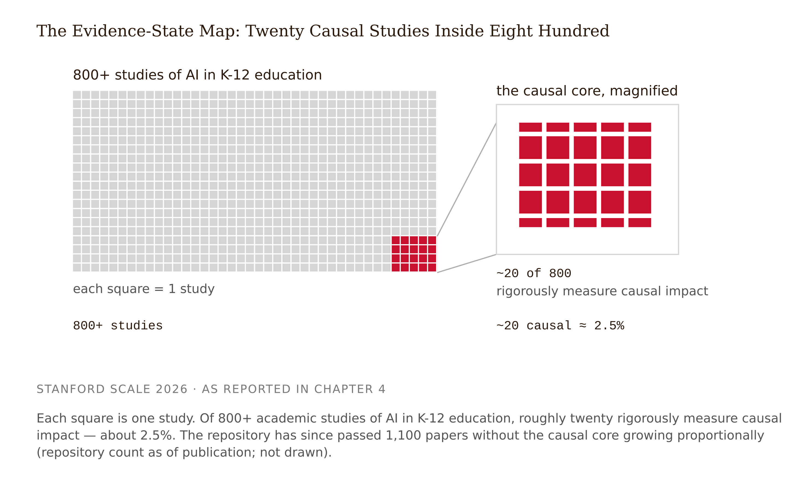

# Chapter 4 — Reading the Evidence: Thin Causal Bases, Vendor Claims, and the Durability Gap
*On the 20 studies hiding inside 800, the endpoints that cannot detect a crutch, and what to do when the honest answer is "nobody knows yet."*

Two product pages, projected side by side, names redacted.

Product A describes an adaptive mathematics tutor. The copy is dry. It mentions "mastery-based progression grounded in cognitive science" and links to a research page listing studies going back two decades — including a large randomized trial across 73 schools in seven states.
<!-- FACT-CHECK FLAG: IMPRECISE — the Pane et al. (2014) trial comprised 147 school sites (73 HIGH schools + 74 middle schools) in 51 districts across seven states; the year-2 ≈+0.20 effect is the high-school arm. "73 schools" should read "73 high schools" (or "147 schools"). Source: RAND RB-9746; EEPA 36(2). See factchecks/04-reading-the-evidence-assertions.md --> Follow the links and the news is strikingly modest: no significant effect in year one, roughly +0.20 standard deviations in year two, after schools learned to implement it (Pane et al. 2014); a federal evidence review rating its effects on algebra achievement as *mixed* (WWC 2016). Decades of work; honest, modest, implementation-dependent results.

Product B describes a conversational AI tutor. The copy is electric. "A personal tutor for every student." "Socratic by design — it never just gives the answer." "Built on the breakthrough science of one-on-one tutoring." The research page cites Bloom's two-sigma finding and a satisfaction survey. There is no randomized trial of the product itself, no comparison group anywhere, no measure of what students can do after the tutor is taken away.

Students rank the two by strength of evidence. Nearly everyone ranks A above B — the exercise makes the answer almost embarrassing. Then the reveal: the market ranked them the other way. Product B commanded the headlines, the keynotes, the district pilots, and the valuations Product A's maker never approached — the exact opposite of the evidence ranking a graduate class produced in four minutes.

This is not a story about foolish buyers. It is a structural fact you will work inside for your entire career: **evidence accumulates slowly, and marketing doesn't wait.** Market visibility and evidence maturity are not just uncorrelated — they can run inverse, because the products with the most evidence have had the most years to disappoint, and the products with the least have had the most freedom to promise.

---

Start with the number that should reorganize how you read everything else. Stanford's SCALE Initiative analyzed more than 800 academic studies of AI in K-12 education and identified only about 20 that rigorously measure causal impact — studies designed to tell whether an AI tool *changed outcomes*, rather than describing usage, perceptions, or correlations (Stanford SCALE 2026). The repository has since passed 1,100 papers without the causal core growing proportionally.



The review's other findings matter as much as the ratio. By SCALE's census criteria, there are no high-quality causal studies of student AI use conducted in U.S. K-12 classrooms — the spine RCTs of this book come from Turkey (Bastani), the UK (LearnLM/Eedi), and a tutoring-provider context (Tutor CoPilot). Most studies measure short-term outcomes. Equity, wellbeing, and social development are nearly unstudied. And the tools with pedagogical guardrails show more promising outcomes than general-purpose chatbots — the field's most systematic evidence census independently corroborates this book's thesis. One epistemic note: the "no U.S. K-12 causal studies" claim is a single organization's census with explicit inclusion criteria; quote it with the criteria attached, not as a bare fact.

The thin-base conclusion does not rest on SCALE alone. A PRISMA-guided meta-review of 35 systematic reviews of generative AI in education reached the same verdict from the opposite direction: the *reviews themselves* are methodologically inconsistent — variable database selection, opaque search strategies, weak or absent quality appraisal — so the secondary literature inherits and amplifies the weaknesses of the primary (Zhang, Deng & Shadiev 2026). Learn the structure of this argument: when the primary-study census and the review-of-reviews converge on "thin and methodologically weak," the conclusion is robust to either source being wrong.

The misconception to surrender now: "800 papers means a well-studied field." Volume of publication is not volume of evidence. Roughly 780 of those papers are descriptive, perceptual, or correlational — valuable for design insight, useless for outcome claims. The gap between "much-studied" and "well-evidenced" is where most vendor copy lives.

---

The most load-bearing distinction in this chapter — arguably in the book — is that "the AI improved learning" can mean four different measurements, and they can disagree with each other in sign.

An **assisted endpoint** reports what the learner can do with the AI present. An **unassisted endpoint** reports what the learner can do after the AI is withdrawn. A **transfer endpoint** reports performance on novel material or contexts. A **retention endpoint** reports performance after time has passed. Across the entire field, this last column is essentially empty.

The Bastani RCT is the canonical demonstration that the first two endpoints can move in opposite directions in the same condition: +48% with the tool present, −17% without it (Bastani et al. 2025). Hold that sentence still until it stops sounding like a paradox. It means any evaluation that reports only assisted performance is *structurally incapable of detecting a crutch* — not unlikely to, incapable of. It also disposes of three metrics that dominate pilot reports: engagement, satisfaction, and usage minutes are not learning endpoints. They are product metrics that correlate with assisted performance and can anti-correlate with unassisted performance.


<!-- → [TABLE: Four-endpoint classification table — columns: Endpoint Type, Definition, Detects Crutch Effect?, Representative Source — rows: assisted, unassisted, transfer, retention — showing explicitly that assisted/satisfaction/engagement metrics cannot detect the Bastani-pattern harm, and that the retention column is empty across the field] -->

Two calibration notes. "Exploratory" on the LearnLM/Eedi transfer finding — +5.5 percentage points on a novel next-topic problem, 76.4% of AI messages approved with zero or minimal edits — is the authors' own precision label for a first-of-its-kind trial, unreplicated, run within one platform with a human in the loop. The field's best positive finding comes with that modesty label attached; learn to read both facts together. And even the field's good news lives in the leftmost columns. Kestin et al. (2025) found a research-based AI tutor outperforming in-class active learning in Harvard physics — strong on immediate unassisted post-tests, silent on retention and long-run transfer, because the intervention spanned about a week. Classifying a study's endpoints before reacting to its headline is the skill this chapter installs.

---

You need just enough effect-size fluency to avoid two opposite errors: dismissing small effects that matter, and trusting large effects from small, unrepresentative studies.

A standardized mean difference — Cohen's *d* or Hedges' *g*, where *g* is *d* with a small-sample correction — expresses a between-group difference in standard-deviation units. The WWC's improvement index translates this into expected percentile change for the median comparison student: an effect of about 0.25 ≈ +10 percentile points. And then the recalibration most of the field still hasn't absorbed: **Kraft's education-specific benchmarks**. Cohen's 0.2/0.5/0.8 labels were never derived from field-based education research, where 36% of RCT effect sizes on standardized achievement outcomes fall below 0.05. Kraft proposes, for this literature: below 0.05 small, 0.05–0.20 medium, above 0.20 large — always interpreted jointly with cost and scalability (Kraft 2020).

That recalibration flips the opening case. By Cohen's labels, the Cognitive Tutor's at-scale results look pathetic. By Kraft's, a modest positive effect demonstrated across dozens of schools over two decades is *more* evidentially impressive than a +0.8 from one sixty-person lab study — because effect sizes are functions of the study, not properties of the product. Researcher-designed proximal outcomes routinely run two to four times larger than standardized distal outcomes for the same intervention.


One more habit: distrust averages without spread. AI-in-education effects are heavily heterogeneous — moderated by domain structure, implementation quality, and population — so the moderator table is usually more informative than the headline mean. And the benchmark question is itself contested: Hattie's *Visible Learning* tradition argues for a 0.40 hinge below which interventions shouldn't impress you, a standard incompatible with Kraft's; the rebuttal position is that the implementation gap explains more than the hinge concedes. That benchmarks are arguments, not facts, is itself effect-size literacy.

---

A vendor product page is a design document wearing an evidence costume. The deconstruction method separates every sentence into three piles.

**Interaction design claims** are testable descriptions of what the product does: "it never gives direct answers; it asks guiding questions." Informative about intended experience design, verifiable the cheap way — by using the product. Real information; not outcome evidence.

**Outcome claims** are assertions about learning effects: "proven to accelerate mastery." These require causal evidence that, per the 20-in-800 state, usually does not exist for the product in question.

**Borrowed evidence** cites an adjacent product class's literature — LLM tutors borrowing the cognitive-tutor evidence, or any tutor borrowing Bloom's (1984) two-sigma claim.

Pre-bunk the two-sigma move now, because you will meet it in nearly every vendor deck of your career: Bloom's claim that one-on-one tutoring yields two standard deviations of improvement was based on small studies and has never replicated at that magnitude. VanLehn's (2011) review found human tutoring at roughly *d* ≈ 0.79 — substantial, not mythical — and intelligent tutoring systems close behind at ≈ 0.76. A vendor citing two-sigma is citing a number the field retired over a decade ago, borrowed from a product class the vendor doesn't sell.

The regulatory scaffold for tiering outcome claims is the **ESSA evidence framework**: Tier 1 (Strong — well-designed RCTs), Tier 2 (Moderate — quasi-experimental), Tier 3 (Promising — correlational with controls), Tier 4 (Demonstrates a Rationale — a logic model plus an evaluation underway). Two field facts turn the tiers from checkbox into literacy: most edtech products cluster at Tiers 3–4, because correlational designs are achievable on product timelines; and "ESSA-aligned" in marketing copy frequently means Tier 4 — *the company has a theory and intends to test it*. Why do RCTs sit at Tier 1? Randomization is the only design that severs the link between who gets the intervention and every other difference between groups. The two claim-autopsy questions that work in any hallway conversation: find the comparison group; ask what the percentage is a percentage of (Bergstrom & West 2020).


The misconception to retire: "the vendor cites a study, so the product is evidence-based." The cited study is routinely of a different product version, a different product class, internal and unpublished, or Tier 3–4 dressed as Tier 1–2. A citation's existence is not the claim's support. And hold the harder, fairer thought alongside it: a product can be simultaneously *well-designed by Chapter 3's scaffold patterns* and *unevidenced by this chapter's standards*. Khanmigo's public description — Socratic moves, no direct answers, teacher visibility — is genuinely scaffold-leaning design intent with, at this writing, no published causal evaluation at the Cognitive Tutor's maturity. Holding both judgments at once is the skill.

<!-- → [TABLE: Vendor-claim deconstruction of a fictional product page — columns: Claim (verbatim sentence), Category (interaction design / outcome / borrowed evidence), ESSA Tier the actual support earns, What it licenses — rows showing several claim types including a two-sigma citation, a satisfaction metric, an interaction design description, and an internal pilot result] -->

---

Now the field's most consequential unknown.

No rigorous longitudinal studies exist anywhere in the field on whether the crutch effect persists or fades with extended use, whether learners develop appropriate reliance or deepen dependency, or what multi-year AI-mediated learning does to expertise development. Bastani measures one term. LearnLM is exploratory. Kestin spans a week. The strongest statement the field can honestly make about year-four effects is "not yet known." This is not a routine "more research is needed" footnote: the decisions being made right now — curriculum architecture, assessment policy, what early-career practice looks like — are exactly the decisions longitudinal evidence would inform, and they are being made irreversibly in its absence.

What it costs to skip this reasoning: in spring 2024, Los Angeles Unified launched "Ed," an AI student advisor built by the startup AllHere, on a contract reported at roughly $6 million. Within about three months, AllHere's CEO had departed, most staff were furloughed, the company collapsed into insolvency, and a former employee publicly warned that the system's data handling did not match what was promised. No causal evaluation of Ed's learning impact ever existed; the second-largest U.S. district procured on demo quality and vision (The 74, EdWeek, LA Times, mid-2024 — figures "as reported"). Structurally, it is the opening case's error at institutional scale: ranking by market visibility instead of evidence.

The chapter's answer to all this uncertainty is a decision discipline, not a mood. For any proposed design decision, sort into three buckets.

**Decide on current evidence.** Causal direction established, cost of error low or symmetric. Example: requiring reasoning before help — supported by Bastani plus the self-explanation literature, near-zero downside.

**Pilot with measurement.** Evidence suggestive but unestablished, and a local pilot with an *unassisted* endpoint can carry the weight. Example: an AI feedback layer on essay drafts, with a pre/post unassisted writing measure against a matched section.

**Decline.** The evidence affirmatively warns — unrestricted answer-providing access during practice — or the risk is asymmetric and unmeasurable on pilot timescales: features whose main risk is long-run dependency, which the durability gap means you cannot test locally.

The bridge concept is **risk asymmetry**, and it keeps the third bucket honest rather than timid. "Absence of evidence of harm" and "evidence of absence of harm" are different things; the durability gap means long-run harm and long-run benefit are equally unevidenced. What breaks the tie: harm to skill development compounds and is hard to reverse; foregone convenience is cheap. When you cannot measure the harm on your timescale, the burden of proof flips to the feature. "Be careful" is not a position. Risk asymmetry is.


---

Translate the framework into a case.

Priya is an LX designer at a community-college system. A vice-chancellor forwards the product page for "Mentora," a conversational AI tutor, with the note: *"Board is excited. Thoughts by Friday?"* The page says: "Mentora never gives away answers — it coaches like the world's best tutors." "Built on the science of one-on-one tutoring: students with personal tutors perform two standard deviations better (Bloom, 1984)." "In pilot programs, students improved scores by 34%." "ESSA-aligned." "Loved by 9 out of 10 students."

She cannot run an RCT by Friday. Her deliverable is a calibrated reading.

First pass goes wrong instructively: she puts "never gives away answers" in the outcome-claim pile and nearly dismisses it as puffery. It isn't — it is an interaction design claim, checkable in an afternoon with a free trial and probe problems. She tests it. Mentora holds the line on direct requests but yields a full worked solution when asked to "check my answer" against a wrong answer — a leak impossible to learn from the page.

Second dead end: an hour hunting the "34%" study. It is an internal pilot summary with no comparison group and an unstated endpoint. Bergstrom and West's question — *34% compared to what, measured how?* — closes that lane: the claim is unanchored, which is worse than false.

The Bloom citation she now recognizes on sight: borrowed evidence, from a different product class, at a magnitude the field retired. VanLehn 2011: ≈ 0.79, not 2.0.

"ESSA-aligned": she emails the vendor asking which tier. The answer — "our logic model is informed by ESSA principles" — is Tier 4, translated. "Loved by 9 out of 10 students" is a perception measure: neither a learning endpoint nor evidence of anything beyond satisfaction with the assisted experience.

The Friday memo runs one page. Design intent: genuinely scaffold-leaning, with one documented leak. Outcome evidence: nothing that survives endpoint classification — every cited number is assisted, uncontrolled, or borrowed. Disposition: *pilot with measurement* — one course section, one semester, primary endpoint a proctored unassisted exam against a business-as-usual section, the "check my answer" leak raised as a contract condition. Not *decide* (no causal support), not *decline* (the design claims are real and the pilot is cheap and measurable on her timescale).

A product page is a blueprint review, not an inspection report — it tells you what the designers intended, never what the product does to learning.

The limit: the protocol reads claims, not products. And it is silent exactly where the field is silent. Had Mentora's main risk been long-run reliance, no one-semester pilot could resolve it — that is the durability gap, and the honest memo says so.

---

## Exercises

**Warm-up**

1. *(Recall — the 20-in-800)* Without consulting the text, explain in three sentences what the SCALE finding actually says — including what the 780+ papers that are not causal studies *are* good for, and what claim they cannot support. Then write the one-sentence version you would give to a vice-chancellor who just forwarded a vendor deck.

2. *(Recall — endpoints)* Three claims about one fictional AI tutor: (a) "Students using StatTutor scored 31% higher on in-app quizzes." (b) "In a randomized study, StatTutor users scored 0.12 SD higher on a proctored, no-AI final exam." (c) "94% of students said StatTutor helped them learn." For each: name the endpoint type, state whether it can detect a crutch, and say what decision — if any — it licenses.

**Application**

3. *(Apply — vendor-page autopsy)* Choose one real AI tutoring product's public page. Produce the three-column deconstruction — interaction design claim, outcome claim, or borrowed evidence — with each row tagged for the ESSA tier its actual visible support would earn. Flag the two-sigma move if present. One page plus 150 words.

4. *(Apply — effect-size translation)* Convert *g* = 0.04, 0.20, and 0.79 into improvement-index percentile estimates and Kraft-benchmark language. Then, given three hypothetical interventions — cheap and scalable, moderately expensive, boutique-expensive — assign each a *g* from your set and defend which you would fund and why. The defense must use Kraft, not Cohen.

5. *(Apply — endpoint audit)* Using the methods sections of Bastani et al. (2025) and Kestin et al. (2025), complete the four-endpoint table for each study — assisted, unassisted, transfer, retention — and write a 150-word "what this licenses" verdict per source. Then locate one vendor white paper and do the same. If the white paper has no unassisted endpoint, say what one measurement would supply it and roughly what it would cost.

**Synthesis**

6. *(Synthesize — three-bucket memo)* For a learning product you are designing or familiar with, bucket five proposed AI features into decide / pilot with measurement / decline, with one evidence citation or one named gap per decision. Write the risk-asymmetry argument out fully for at least one decline — not "be careful," but the specific asymmetry between the reversible and irreversible outcomes.

7. *(Synthesize — the interaction design claim)* The Mentora case shows that "never gives away answers" is an interaction design claim, not an outcome claim — verifiable directly. Design a two-hour protocol for verifying an AI tutor's interaction design claims using only a free trial, probe problems, and a note-taking rubric. Specify what you would test, what a passing result looks like, and what a documented leak looks like for at least three claim types.

**Challenge**

8. *(Challenge — the durability gap)* The chapter argues that the absence of longitudinal evidence justifies conservative defaults via risk asymmetry. Construct the strongest honest case that this reasoning is *too conservative* — that the burden-of-proof flip unfairly disadvantages real benefits that exist but cannot yet be demonstrated. Then state specifically what study design, with what results, would move a "decline" feature to "pilot" or "decide" without waiting for the five-year longitudinal evidence that may never be funded.

---

## Chapter 4 Exercises: Reading the Evidence

**Project:** The Integration Specification
**This chapter adds:** `spec/04-evidence-audit.md` — the claims register for your integration: every claim-bearing sentence from your product's public copy classified as interaction design, outcome, or borrowed evidence; every number endpoint-labeled (assisted / unassisted / transfer / retention) and tagged with the ESSA tier its visible support earns; a citation verification queue you personally clear; and a three-bucket disposition — decide / pilot with measurement / decline — with the risk-asymmetry argument written out in full for anything you decline. Track A: the audit covers the vendor and research claims behind the DataWise 101 tutor's product category, spine studies included.

This is the chapter where the AI + 1 division of labor turns blunt. AI is excellent at gathering and arranging claims, and structurally untrustworthy at telling you whether they are true — because the fluency that makes a summary readable is the same fluency that makes a fabricated citation invisible. The audit is yours. The clerical scaffolding around it is not.

### Exercise 1 — When to Use AI

**Task 1 — Extract the claims register's raw material.** Paste the full text of your product's page, evidence page, or pilot summary and have the model pull every claim-bearing sentence into a numbered list, *verbatim* — no paraphrase, no classification, source location per line. *Why AI works here:* verbatim extraction against a source you hold. Every line is checkable against the page in seconds, and the model's tirelessness keeps you from skimming past claim #23, which is usually where the two-sigma move is hiding.

**Task 2 — Run the effect-size arithmetic.** Hand the model every reported effect size and have it translate: *g* into improvement-index percentile estimates, Cohen labels into Kraft labels, and every "34% improvement" into the two Bergstrom–West questions — percentage of what, measured how, against which comparison group. *Why AI works here:* deterministic translation. The formulas and benchmarks are published; you can verify every conversion with Kraft (2020) and the WWC table open beside you.

**Task 3 — Generate probe problems for the interaction design claims.** "Never gives away answers" is checkable in an afternoon — if you arrive with good probes. Have the model generate the probe set: the direct answer request, the "check my answer" move with a planted wrong answer (the leak that caught Mentora), the pasted homework problem, the answer request dressed up as a concept question. *Why AI works here:* test-case generation. Each probe is validated by running it against the actual product — the product's behavior, not the model's opinion, is the result.

**The tell:** You know you are using AI appropriately when you can evaluate the output — when you have independent criteria to judge whether it is correct, complete, and fit for purpose.

### Exercise 2 — When NOT to Use AI

**Task 1 — Do not ask the model whether the cited studies are real, or what they found.** *Why AI fails here:* fabricated authority — hallucinated and inflated citations, this chapter's signature failure mode. The model summarizes a nonexistent study with exactly the confidence it brings to a real one, and rounds a real study's numbers toward whatever framing the prompt implies. Verification means the primary source: DOI resolved, methods section read, endpoint classified by you. There is no shortcut, and the shortcut on offer is the trap.

**Task 2 — Do not delegate the classification or the endpoint labels.** *Why AI fails here:* the assisted endpoint, applied to you. Reading a claim and knowing which pile it belongs in — and which endpoint a number actually measures — is the skill this chapter installs; it is what you will do in the hallway, on the call, by Friday, with no chat window open. An audit the model produced for you reports what you can do with the model present. Chapter 2 told you what that measure is worth.

**Task 3 — Do not let the model write your three-bucket disposition.** *Why AI fails here:* missing ground truth. Disposition turns on risk asymmetry, and the asymmetry lives in facts the model does not hold — your learners' stakes, what your institution can reverse, what your pilot's timescale can and cannot detect. Asked anyway, the model produces "be careful" with a memo's formatting, and the chapter already told you: "be careful" is not a position. Risk asymmetry is, and it has to be argued from your specifics.

**The tell:** When the task is done, close the chat and explain the conclusion — and the evidence behind it — out loud, to a colleague or to the wall. If the explanation is yours, the AI was an instrument. If you could not explain the conclusion without the AI, the AI did the work that should have been yours.

**Series connection:** Tier 4 Metacognitive — evidence auditing is the unautomatable audit. You cannot use a system's fluency to check claims about systems like it, and the auditor's calibrated judgment is precisely the capability being trained. This is why, wherever this book runs as a course, the evidence-audit competency is the one assessed closed-AI: an audit you can only perform with the model open is, by this chapter's own endpoint logic, an assisted skill — and the entire point of Chapter 4 is the unassisted column.

### Exercise 3 — LLM Exercise: Build spec/04-evidence-audit.md

This exercise absorbs the chapter's standalone LLM exercise — its evidence-audit coach, with the classify-first rule and the gated comparison, becomes the engine here — and adds the citation lockout and the assembly step that turns the transcript into a spec file.

**Tool:** Claude Project "Integration Spec," with `spec/01`–`03` in Project knowledge.

**Before you start:** collect the actual text — vendor page, evidence page, pilot report — for the AI product your integration uses or resembles. Track A: pick one real AI tutoring product in the statistics homework-help category as DataWise's reference class. The prompt refuses to run without the text, on purpose.

Copy-paste prompt:

```
You are my evidence-audit coach for the Integration Specification project.
We are building spec/04-evidence-audit.md. Read spec/01-two-layer-map.md,
spec/02-reliance-risk-map.md, and spec/03-scaffold-pattern-selection.md
first — the reliance risks named in 02 are what the evidence must speak to,
and the pattern choices in 03 are themselves claims this audit must treat
exactly like a vendor's. If those files are not in this Project, ask me to
paste them.

RULE 1 — REQUIRED INPUT. I must paste the actual text of a vendor product
page, evidence page, or pilot report for the AI product my integration uses
or resembles. If I have not pasted one, your ONLY permitted response is to
ask me for it. Do not demonstrate with an invented example. Do not proceed.

RULE 2 — I CLASSIFY FIRST. Present the claim-bearing sentences as a
numbered verbatim list and require me to classify each as (a) interaction
design claim, (b) outcome claim, or (c) borrowed evidence — one sentence of
reasoning per claim. Do not reveal your own classification until I commit
to mine in writing.

RULE 3 — GATED COMPARISON. Compare classifications one claim at a time.
Where we disagree, do not simply correct me: ask one question that exposes
what I may have missed, and let me revise first.

RULE 4 — ENDPOINTS AND TIERS. For each outcome claim, require me to name
the endpoint type (assisted / unassisted / transfer / retention) and the
ESSA tier the visible support would earn. If the page doesn't say, the
correct answer is "cannot tell" — push back if I guess.

RULE 5 — CITATIONS ARE MINE. For every study the page cites, your output is
one row in a verification queue: the full citation as given, where it
appeared, and which number it is asked to support — with the status column
fixed at [learner to verify]. You never report what a cited study found,
whether it exists, or whether its numbers are accurate. If I ask you to,
refuse and remind me why this chapter exists.

RULE 6 — DISPOSITION. Require me to write the three-bucket disposition
(decide / pilot with an unassisted endpoint / decline) for each major
feature of MY integration, with the risk-asymmetry argument written out in
full for every decline. Only then give your one-paragraph critique —
including the strongest argument AGAINST my disposition.

RULE 7 — ASSEMBLY. Assemble spec/04-evidence-audit.md in markdown: the
claims register (claim verbatim, category, endpoint, tier, what it
licenses), the citation verification queue with every status still
[learner to verify], my dispositions with their risk-asymmetry arguments,
and a closing section titled THE DURABILITY GAP listing every question
about my integration that no current evidence answers.

Never produce the finished analysis for me. Your job is to make my
classification visible and contestable, not to replace it.
```

**What this produces:** your fourth spec file — the claims register with your classifications under critique, endpoint and tier tags with "cannot tell" where the page goes silent, a verification queue you still owe library time on, dispositions with the risk-asymmetry arguments written out, and a named list of what nobody knows about your integration yet.

**How to adapt:** *Own project:* paste your internal pilot reports too — redact learner data first — and give internal claims the same three piles; in-house numbers are not exempt from the unstated-denominator question. *ChatGPT/Gemini:* run in a ChatGPT Project or Gemini Gem with the spec files attached, or paste `spec/02` and `spec/03` at the top of a fresh chat — the rules travel inside the prompt. *Claude Project:* add the finished file to Project knowledge; Chapter 5 reads it directly.

**Connection to previous chapters:** `spec/02-reliance-risk-map.md` named what could go wrong; this file establishes what the evidence can actually say about those risks — usually less than the marketing implies, which is itself a finding. And `spec/03`'s scaffold-pattern selections re-enter here as interaction design claims about your own integration, audited at the same standard you just applied to the vendor.

**Preview of next chapter:** Chapter 5 turns the lens from the product to the producer. `spec/05-ai-workflow-policy.md` governs how you and your team use AI to *build* the integration — and its never-touch list will owe its rationale to exactly the durability-gap section you just wrote.

### Exercise 4 — CLI Exercise: The Claims-Register Builder

**Tool:** Claude Code or Cowork. Justification: this is source-anchored extraction — every claim quoted with its line number from a saved file — which an agent with folder access does traceably and a chat paste does lossily. And the locked status column needs a tool that follows file-level rules, not conversational vibes.

**Skill level:** Beginner. One source file in, one working file out.

**Setup checklist:**
- `spec/sources/vendor-copy.md` — the verbatim text of your product's page or evidence page, which you create now: copy, paste, save, with the URL and capture date on line one
- `spec/01`–`03` in place; `spec/04-evidence-audit.md` if Exercise 3 has already run (optional cross-reference)
- Backup or git commit of the spec folder
- `CLAUDE.md` line: *"spec/sources/ contains verbatim third-party copy — evidence documents; never modify them. Any cell marked [learner to label] belongs to me; agents never fill it."*

Paste-ready Task block:

```
Read spec/sources/vendor-copy.md. It is a read-only evidence document: do
not modify it or any other existing file.

Create spec/_working/04-claims-register.md containing one table with these
columns: # | Claim (verbatim) | Source line | Cites a study? (quote the
citation exactly as given, or "none") | Names a number? (quote the number
and state what it is a number OF, or write "unstated denominator") |
Category | Endpoint type | ESSA tier | Status.

Fill every column EXCEPT the last four. For Category, Endpoint type, ESSA
tier, and Status, write exactly [learner to label] in every row. Do not
classify, do not tier, do not assess — extraction only.

Include every sentence that asserts, implies, or borrows a claim about
learning, outcomes, or evidence. When unsure whether a sentence is
claim-bearing, include it and append "borderline" after the verbatim text.

This is Chapter 4's claims register: the audit is the human's job; your job
is to make every claim findable and quotable. Stop after writing this one
file. Do not create or modify anything else. End by reporting the row
count and how many rows cite studies.
```

**Expected output:** one new file, one table, every judgment cell reading `[learner to label]`.

**What to inspect:** spot-check five rows against the source — verbatim means verbatim, and a paraphrased claim is a claim you can no longer audit. Then read the "unstated denominator" flags: that column is where the Bergstrom–West questions bite. Then do your job — label every Category, Endpoint, and Tier cell yourself, and merge the labeled table into `spec/04-evidence-audit.md`.

**If it goes wrong:** if any Category or Status cell came back filled, the agent did your audit — delete the file, restate the lock in the prompt, re-run; do not keep the agent's labels "as a starting point," because anchoring on them is fixation with a chapter-5 preview. If claims arrive paraphrased, re-run demanding source line numbers per row. If the agent edited `vendor-copy.md`, restore from backup and confirm the `CLAUDE.md` line is in place.

**CLAUDE.md/AGENTS.md note:** both lines above are permanent; mirror them in `AGENTS.md` if your agent reads that instead. `[learner to label]` becomes this project's standing convention from here forward — it marks the cells where judgment lives, and every chapter has some.

### Exercise 5 — AI Validation Exercise: The Three-Citation Autopsy

This is the one exercise in this series that hands you a pre-built artifact instead of your own output, because the failure mode has to be experienced cold to be believed. Below is an AI-generated "evidence summary" of a fictional AI tutoring product. One of its three citations is real and reported accurately. One is real with its numbers inflated. One does not exist. Validate it before reading the answer key.

**The artifact:**

> **Research basis for StatCoach AI** *(drafted by an LLM for a procurement committee)*. StatCoach's hint-based design follows the intelligent-tutoring tradition validated by VanLehn (2011), whose review found step-based tutoring systems produce learning gains of *d* ≈ 0.76, nearly matching human tutors at *d* ≈ 0.79. Conversational AI tutoring has now confirmed these gains at scale: a 2025 randomized controlled trial published in *PNAS* found that students with GPT-4 tutor access scored 48% higher on their mathematics exams (Bastani et al., 2025). Long-term durability is established as well: a two-semester randomized study of 1,204 undergraduates found conversational AI tutoring produced *d* = 0.58 on proctored final exams, with gains fully retained at six-month follow-up (Okafor & Lindqvist, 2024, *Journal of Learning Analytics in Education*).

**Validation type:** citation-level source verification against the primary literature — the audit Exercise 2 told you the model can never run for you.

**Risk level:** **High.** This paragraph's genre is exactly what arrives in your inbox stapled to a purchase decision, and it reads better than most real evidence summaries do.

**Setup:** the artifact, library or scholar access, this chapter open, every chat window closed. Forty-five minutes. No peeking at the key.

**The checklist:**
- **Correctness.** Resolve each citation: does the paper exist — DOI, journal, author list? Do the reported numbers match the published numbers? Does each number actually support the sentence it is attached to?
- **Completeness.** For each real study: what did it find that the summary omits? Omission is the subtler fabrication.
- **Scope.** Does any cited finding cover *this* product? Mark every borrowed-evidence move — a review of one product class cited by another is the chapter's third pile, however accurate the numbers.
- **Endpoint classification (chapter-specific).** Label every number's endpoint type. Watch for laundering: an assisted result dressed in unassisted clothing.
- **Durability-gap check (chapter-specific).** The chapter says the retention column is essentially empty field-wide. Any citation that fills *exactly* that gap should be your loudest alarm, not your strongest comfort.
- **Failure-mode check.** Fabricated or inflated citations: before the key, commit in writing — which citation is real-and-accurate, which is real-but-inflated, which is nonexistent.

**Answer key** *(read only after committing)*: VanLehn (2011) is real and accurate — *d* ≈ 0.76 / 0.79, as this chapter reports — with one scope caveat: it reviews pre-LLM step-based ITS, borrowed here by an LLM product. Bastani et al. (2025) is real and laundered: +48% was the *assisted* endpoint — performance with the tutor present, during practice, not "their mathematics exams" — and the same study's unassisted finding, −17% after withdrawal, has vanished from the sentence. The numbers are real; the sentence is false. Okafor & Lindqvist (2024) does not exist, and neither does the journal as cited. The diagnostic you should have used: it is the only citation sitting in the field's empty column — a two-semester retention RCT is precisely what this chapter says nobody has run. The fabrication is detectable not by its style but by its convenience.

**What to do with findings:** score yourself. Caught all three: your audit reflexes are calibrated; now turn this exact protocol on the `[learner to verify]` queue in your own `spec/04` — every row gets the same treatment before anything downstream may cite it. Missed the laundering: reread the endpoint section — the inflated-real citation is the dangerous one, because spot-checking existence would never catch it. Missed the fabrication: you now know what plausible looks like, which was the point of building one.

**AI Use Disclosure prompt:** add exactly two sentences at the top of `spec/04-evidence-audit.md`. Sentence one states what the AI produced and what you produced (e.g., *"Claude extracted the claims, queued the citations, and coached my classification; all classifications, endpoint labels, tiers, and dispositions are mine."*). Sentence two states what you verified and what remains open (e.g., *"I verified N of M cited studies against primary sources; the rest remain [learner to verify], and nothing downstream may cite them until they clear."*).

**Series connection:** Tier 4 Metacognitive. This validation works only because you held ground truth the model cannot supply — the primary literature, opened by you. An evidence audit that ends at the model's word is the durability gap in miniature: absence of checking, dressed as presence of evidence.

---

## References

1. Stanford SCALE Initiative (2026). "The Evidence Base on AI in K-12: A 2026 Review." https://scale.stanford.edu/research-in-action/understanding-evidence-base-ai-k12-education — Confirms: 800+ papers analyzed (repository as of Oct 2025), only 20 high-quality causal studies; repository now over 1,100 papers; no high-quality causal studies of student AI use in U.S. K-12 classrooms; most studies short-term; equity/wellness/social development barely studied; guardrailed tools show more promising outcomes than general-purpose chatbots.
2. Zhang, L., Deng, X., & Shadiev, R. (2026). "A Meta-Review of Generative AI in Education: Synthesizing Findings from Systematic Reviews." *Journal of Educational Computing Research*, 64(4), 1068–1092. https://journals.sagepub.com/doi/10.1177/07356331261419689 — Paper confirmed to exist with this scope; the "35 reviews / PRISMA" details could not be checked against the abstract (paywalled) and rest on the author's research notes.
3. Bastani, H., Bastani, O., Sungu, A., Ge, H., Kabakcı, Ö., & Mariman, R. (2025). "Generative AI without guardrails can harm learning: Evidence from high school mathematics." *PNAS*, 122(26), e2422633122. https://www.pnas.org/doi/10.1073/pnas.2422633122 — Confirms +48% assisted / −17% unassisted (GPT Base) and +127% (GPT Tutor); a published correction (PNAS e2518204122) does not alter the headline findings.
4. Pane, J. F., Griffin, B. A., McCaffrey, D. F., & Karam, R. (2014). "Effectiveness of Cognitive Tutor Algebra I at Scale." *Educational Evaluation and Policy Analysis*, 36(2), 127–144. https://journals.sagepub.com/doi/abs/10.3102/0162373713507480 — Confirms null year 1, ≈+0.20 SD year 2 (high schools; 50th→58th percentile); 147 school sites (73 high schools, 74 middle schools), 51 districts, seven states. See also RAND RB-9746.
5. What Works Clearinghouse (June 2016). "Cognitive Tutor®" Intervention Report. https://ies.ed.gov/ncee/wwc/Docs/InterventionReports/wwc_cognitivetutor_062116.pdf — Confirms the "mixed effects" rating on algebra achievement for the 2016 review (the 2009 report said "potentially positive").
6. Kraft, M. A. (2020). "Interpreting Effect Sizes of Education Interventions." *Educational Researcher*, 49(4), 241–253. https://journals.sagepub.com/doi/10.3102/0013189X20912798 — Confirms: 36% of RCT effect sizes on standardized achievement outcomes fall below 0.05 SD; proposed benchmarks <0.05 small / 0.05–0.20 medium / >0.20 large, interpreted jointly with cost and scalability; Cohen's benchmarks not derived from field-based education research.
7. VanLehn, K. (2011). "The Relative Effectiveness of Human Tutoring, Intelligent Tutoring Systems, and Other Tutoring Systems." *Educational Psychologist*, 46(4), 197–221. https://www.tandfonline.com/doi/abs/10.1080/00461520.2011.611369 — Confirms human tutoring d≈0.79, ITS d≈0.76; supports the retirement of Bloom's two-sigma magnitude.
8. Kestin, G., Miller, K., Klales, A., Milbourne, T., & Ponti, G. (2025). "AI tutoring outperforms in-class active learning: an RCT introducing a novel research-based design in an authentic educational setting." *Scientific Reports*, 15, 17458. https://www.nature.com/articles/s41598-025-97652-6 — Confirms the Harvard physics RCT; AI tutor with research-based design outperformed in-class active learning on immediate post-tests; short intervention window, no retention measure.
9. LearnLM Team (Google DeepMind) & Eedi (2025). arXiv:2512.23633. https://arxiv.org/abs/2512.23633 — Confirms the "exploratory" label, 76.4% approval rate, +5.5 pp transfer (95% CrI [−1.4, +12.4]).
10. The 74 (2024). "Whistleblower: L.A. Schools' Chatbot Misused Student Data as Tech Co. Crumbled" and related coverage. https://www.the74million.org/article/whistleblower-l-a-schools-chatbot-misused-student-data-as-tech-co-crumbled/ — Confirms: LAUSD "Ed" advisor built by AllHere on a contract reported at ~$6M (up to $6.2M); launched spring 2024; by June 14, 2024 most staff furloughed and the CEO had departed; former engineer Chris Whiteley publicly alleged data-handling failures; company insolvent; no causal evaluation of learning impact existed.
11. Bergstrom, C. T., & West, J. D. (2020). *Calling Bullshit: The Art of Skepticism in a Data-Driven World*. Random House. — Source of the find-the-comparison-group / percentage-of-what claim-autopsy questions.
12. Bloom, B. S. (1984). "The 2 Sigma Problem." *Educational Researcher*, 13(6), 4–16. — The original two-sigma claim; cited here as the borrowed-evidence move to pre-bunk (magnitude never replicated; see VanLehn 2011).
