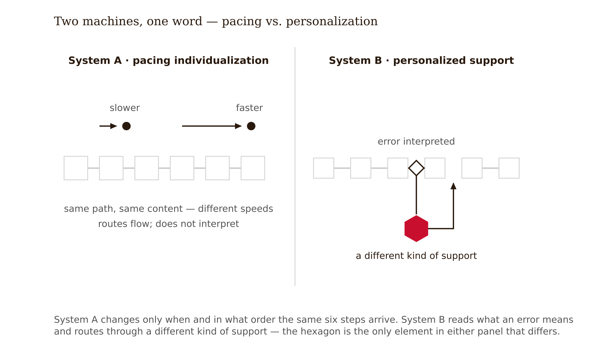
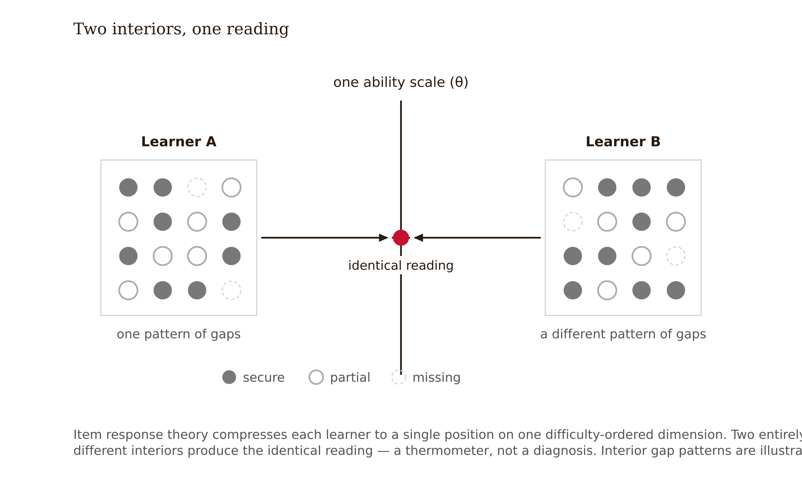
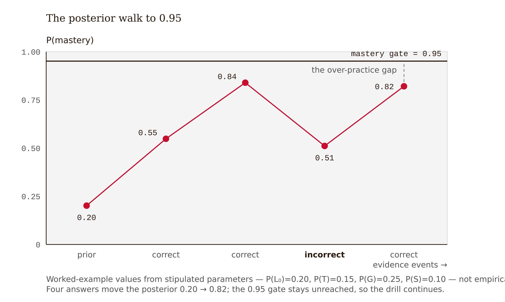
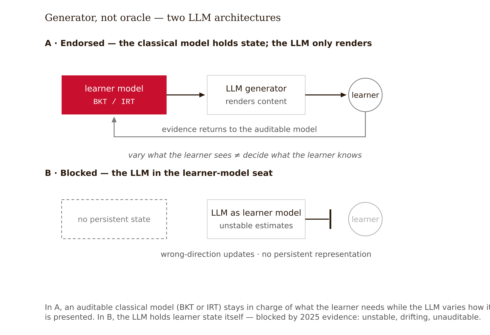

# Chapter 7 — Adaptive Systems: From Pacing to Personalization
*On thermometers that feel like mind-readers, progress bars built on four numbers, and the one word that covers two completely different machines.*

Two products are pitched to the same university in the same week. Both home pages say "personalized learning." Both demos are genuinely impressive.

System A gives every student a placement assessment of twenty-five to thirty questions, then maintains a live map of which topics the student has mastered and which they are "ready to learn." Students move through the same curriculum at radically different speeds; no two dashboards look alike.

System B does something different. When a student answers a confidence-interval question with "95% of the data falls inside the interval," the system does not serve an easier question. It recognizes that *specific wrong answer* as a known misconception — the interval is about the parameter, not the data — and responds with a contrasting case built to collide with exactly that belief.

Here is the design question the marketing language hides: System A never changes *what* a student sees — only when, and in what order. System B changes *what kind of support* arrives, based on what the student's error means. Both adapt. Both are sold with the same word. They are different machines, and by the end of this chapter you will be able to tell them apart from the outside.



---

Start with the model that lives under most adaptive assessment and a large share of adaptive learning, because it is the one most often described as "knowing what the student knows" — and understanding exactly how it works is the fastest route to understanding why that description is wrong.

Item Response Theory places learners and items on the same scale. The learner occupies a position on that scale called θ (theta), representing ability. Each item occupies a position called *b*, representing difficulty. The simplest version says:

$$P(\text{correct}) = \frac{1}{1 + e^{-(\theta - b)}}$$

In English: when your ability matches the item's difficulty exactly (θ = b), you have a 50% chance of getting it right. The further your ability sits above the difficulty, the closer your chance climbs toward certainty; the further below, the closer it falls to zero. That S-shaped relationship is the whole idea. Richer variants add a discrimination parameter — how sharply the item separates learners just below from just above its difficulty — and a guessing floor, the chance a low-ability learner gets a multiple-choice item right by luck (Lord 1980).

What this buys an adaptive system is real and valuable: learners and items share a common scale, so the system can always select the next item that tells it the most about where the learner sits. That is computerized adaptive testing, and it is why a twenty-five-item adaptive placement can locate a learner as accurately as a hundred-item fixed test.

Now the design-literacy payload — what IRT *cannot* know. Theta is a single number. It is a position on one difficulty-ordered dimension. IRT does not know *why* the learner missed the item. It does not know which misconception produced the wrong answer, whether the learner was anxious, fatigued, guessing strategically, or working in a second language. Two learners with identical θ can have entirely different gaps in their understanding. A system built on IRT alone can individualize *difficulty* with great precision while knowing nothing usable for personalizing *support*.

The analogy is worth stating plainly: **IRT is a thermometer, not a diagnosis.** A precise reading of one number is genuinely useful. It tells you nothing about what is wrong. So retire the statement "the adaptive system knows what the student knows" — the feeling of being *read* by an adaptive test is real; the underlying representation is a temperature.



When auditing any adaptive system, find the moment a learner gives a diagnostic wrong answer — an answer that reveals a specific misconception. If the system's only possible response is "easier item," you are looking at the IRT ceiling: exactly the place where difficulty adjustment is happening and support adjustment is not.

---

Where IRT estimates one continuous ability, Bayesian Knowledge Tracing models each *skill* as a coin with a hidden state: mastered or not yet. It is the canonical learner model of the intelligent-tutoring tradition — the machinery inside Carnegie Learning's Cognitive Tutor and MATHia for three decades (Corbett & Anderson 1995). Each skill carries four parameters:

- **P(L₀):** the probability the learner already knew the skill before practice
- **P(T):** the probability of transitioning to mastery at each practice opportunity
- **P(G):** the probability of guessing correctly without mastery
- **P(S):** the probability of slipping — answering wrong despite mastery

After every response, Bayes' rule updates the probability of mastery. When that probability crosses a threshold — 0.95 in the Cognitive Tutor tradition — the system declares the skill mastered and moves on. Every "skills remaining" progress bar in that product family is this arithmetic wearing a friendly interface.

A worked update, with the arithmetic done. Take the DataWise 101 skill "choose the correct hypothesis test," with P(L₀) = 0.20, P(T) = 0.15, P(G) = 0.25, P(S) = 0.10. The learner answers: correct, correct, incorrect, correct.

Start at P(mastery) = 0.20. A correct answer is more likely from a master (0.90, since slips are rare) than from a non-master (0.25, the guess rate). That evidence shifts belief to ≈ 0.47; then the learning-opportunity bump adds P(T) — call it ≈ **0.55**. Second correct: from a higher prior, belief rises to ≈ 0.82, bumps to **≈ 0.84**. One incorrect: a wrong answer from a probable master is most plausibly a slip, but slips are rare, so belief falls hard to ≈ 0.42, recovers with the bump to **≈ 0.51**. Correct again: belief climbs back to **≈ 0.82**.

After four answers: 0.82. Below the 0.95 threshold — so the system assigns more practice. Now interrogate the numbers as a designer. Who chose 0.95, and what does a learner's week look like at 0.94? What happens to a learner whose P(T) was estimated too low? The model under-credits their learning, the threshold recedes, and they drill on — over-practice. What does the model say about a learner who has mastered the wrong generalization while answering correctly? Nothing. BKT sees correctness, never the content of thought.



The honest limitations: standard BKT has no forgetting — once mastered, always mastered, which is psychologically false and matters for spacing design. Skills are binary, so partial understanding is invisible. The whole edifice rests on a human-authored *knowledge component model* — the mapping of items to skills — and a bad map produces confidently wrong mastery estimates. And the four parameters suffer identifiability problems: different parameter sets can fit the same data equally well, so they are less solid than they look.

The neural upgrade deserves a clear-eyed sentence. Deep Knowledge Tracing replaced BKT's state machine with a recurrent neural network and reported dramatically better prediction (~0.86 vs. ~0.67 AUC on a standard benchmark) (Piech et al. 2015). But re-evaluation found duplicate records inflating the benchmark gap (Xiong et al. 2016), and classical models extended with forgetting, item difficulty, and individual ability close most of the remaining distance (Khajah, Lindsey & Mozer 2016). More decisive for designers: DKT's hidden state is opaque — it predicts the next answer but yields no human-readable per-skill mastery estimate (Scruggs, Baker & McLaren 2020). When a student appeals "why am I still in remediation?", a BKT-backed system can answer. A DKT-backed one largely cannot. Interpretability is the precondition for accountability.

The progress bar is a probability. Before granting any mastery indicator authority in your design — over pacing, over assessment windows, over what a teacher believes — name the threshold, the parameters, and the knowledge component map it depends on.

<!-- → [TABLE: BKT four-parameter card plus worked update — columns: Parameter, Symbol, What it represents, Typical value range — followed by the four-step update trace with P(mastery) at each step annotated against the mastery threshold, showing the over-practice risk that accumulates at 0.94] -->

---

The newest layer uses large language models to *generate* adaptive content — varied explanations, fresh practice problems, hints at different reading levels — rather than selecting from pre-authored banks. This genuinely changes the economics: classical adaptivity was bounded by authoring budget; generation makes the content space effectively unbounded.

The serious design question is what *drives* the generation, and the 2025–2026 evidence draws a sharp line between two architectures.

In the first, the LLM is a generator on top of a classical learner model. IRT or BKT maintains learner state; the LLM renders the next intervention. The auditable model stays in charge of *what the learner needs*; the LLM supplies the words and the variations. Hallucination risk attaches to content, mitigable with retrieval grounding and human review. This is the architecture the major incumbents are converging on in production.

In the second, the LLM *is* the learner model. Recent empirical work finds LLMs unreliable for this purpose: they fail to match even DKT-level predictive performance, produce unstable mastery estimates, and sometimes update in the wrong direction — because a chat model constructs no explicit, persistent representation of evolving learner knowledge (arXiv 2412.09248; 2503.11733; 2604.08263). The research frontier's own response is telling: hybrid neural-symbolic systems that bolt a real learner model back on.



The decision rule, clean enough to memorize: **use LLMs to vary what the learner sees; be deeply skeptical of LLMs deciding what the learner knows.**

And retire this misconception directly: "ChatGPT adapts to the student, so it's adaptive learning." A chat model adapts to the *conversation*. It has no calibrated estimate of skill state, no mastery thresholds, no curriculum model, and no memory of the learner that survives the context window. Conversational responsiveness is not learner modeling.

---

Now the chapter's central distinction. Most products marketed as "personalized learning" are actually individualized pacing engines: same content, same sequence logic, different speed. Genuine personalization of support changes the *type of support* in response to the learner's reasoning, misconceptions, interests, and context (Brookings; National Student Support Accelerator). Most of the industry cannot do the second thing, and this is not an accusation of fraud — it is a direct consequence of the models in the previous two sections. Theta and P(mastery) cannot represent the content of the learner's thinking. The models that power the field are thermometers and coin-flip trackers. They route flow; they do not interpret.

The honest current state: classical models do traffic control well. Misconception-responsive support is exactly where LLMs could in principle help — they can actually *read* the wrong answer — and exactly where their learner-modeling unreliability currently bites. The layer that could finally personalize is the layer least trustworthy to route. Sit with that tension; it is the most consequential open design problem in adaptive learning.

For classification work, three probe questions applied to any demo settle the labeling dispute:

1. Can two learners at the same performance level ever receive *different kinds* of support?
2. Does any system response depend on *which* wrong answer was given — or only on wrongness?
3. Does anything other than speed and difficulty ever change?

Three no's means pacing individualization, whatever the marketing says. And pacing individualization is valuable — the point is truth in labeling. A system that can only adjust speed cannot do what "personalized" implies, and a designer who cannot tell the difference buys the wrong machine for the pedagogy.

---

Three numbers must be held in honest tension.

A 2025 review synthesizing 2019–2025 adaptive-learning literature reports large gains — 30–50% learning-time reduction and 15–25% outcome improvement (Cao, Nhu Tam Mai & Guo, *International Journal of Education and Humanities* 20(2)). Treat those specific figures with explicit caution: the review states them as a synthesis conclusion without tracing them to specific primary studies or a pooled effect, and the venue is low-prestige [contested — review-level claim, not a primary measurement]. What the same review does carry is the more important finding: reported effects cluster in structured domains — mathematics, language, coding — and in well-resourced implementation contexts.

Older intelligent-tutoring meta-analyses report substantial effects in controlled settings: VanLehn (2011) places ITS effectiveness near human tutoring (d ≈ 0.76), and Kulik & Fletcher (2016) report ≈ 0.66.

The What Works Clearinghouse evidence for Cognitive Tutor Algebra I — the most-researched adaptive system in existence — nets out to a small weighted effect across qualifying studies [verify exact pooled figure — the June 2016 WWC report shows algebra-domain averages of ≈ 0.11 and general-mathematics averages of ≈ 0.05 across all studies, so the "+0.04" cited here is not cleanly reproduced from the current report and should be recomputed or sourced before print; the underlying Pane et al. RAND study found null in year one and ≈ +0.20 (0.21) in year two — year-two figure confirmed].

Here is the reading that makes you a better designer: these numbers do not debunk each other. They are measurements taken at different distances from real classrooms — efficacy in controlled studies versus effectiveness at implementation scale — and the +0.04 is taken closest to the conditions you will deploy into. The instructive irony: the system with the deepest research pedigree produces the most modest estimate, precisely because it has been measured most honestly. When a vendor quotes a number, the reflexive question is: *at what distance from a real deployment was this measured?*

![Figure 7.5 — Distance from the classroom: effect estimates shrink as measurement approaches real deployment. Marker heights are ordinal only, not to scale — of the reported values (controlled-study d ≈ 0.66 and ≈ 0.76 [verify], year-two at-scale ≈ +0.20 [verify], WWC weighted ≈ +0.04 [verify]), only Kulik & Fletcher's ≈ 0.66 is clean-verified.](../images/07-adaptive-systems-fig-05.png)

---

The adaptivity decision is not "which model?" It is first "should this exist?"

An adaptive layer is warranted when four conditions hold: the domain is well-structured with a defensible knowledge component map; practice volume is high enough for models to calibrate; the cost of mis-routing is low or audited; and the realistic alternative is genuinely one-pace-fits-all instruction at scale. It is *not* warranted for small cohorts an instructor can actually know, for ill-structured domains where "the next item" is a judgment call, or where the adaptivity on offer is pacing-only and the pedagogy needs support-personalization.

The cautionary spine for this judgment has a name. Knewton's founder described the product, on the record, as "a robot tutor in the sky that can semi-read your mind and figure out where your strengths and weaknesses are, down to the percentile" (NPR, 2015). The company raised over $180 million on hyper-personalization claims; analyst Michael Feldstein publicly called it "selling snake oil." What the stack could actually do was respectable IRT-family proficiency estimation and sequencing — pacing individualization, per the three probe questions. In May 2019, Wiley acquired Knewton's assets for under $17 million (Inside Higher Ed, 2019). The market eventually priced the difference between the thermometer and the mind-reader. Your procurement committee should price it sooner.

---

Translate the framework into the DataWise 101 case.

The Week 6 spec gave the AI homework tutor a hint ladder, reasoning gates, and a fading schedule. The product team now proposes "full personalization": an adaptive engine controlling problem difficulty, topic sequence, remediation, and pacing, with an LLM "that learns each student." Three separate proposals are hiding inside one pitch — a learner model to drive difficulty and mastery gating, LLM-generated content variation, and LLM-inferred learner state — and the pitch's language blurs them deliberately or innocently. The designer's first job is to un-blur.

The warrant check passes: intro statistics is well-structured, the knowledge component map is defensible, homework volume is high, the alternative really is one-pace-fits-all problem sets. Some adaptive layer is warranted.

First dead end: the team specced Deep Knowledge Tracing, seduced by the accuracy numbers. When a student appeals "why am I still in remediation?", a DKT-backed system has no per-skill answer a TA can read. Back to BKT.

Second dead end: letting the LLM adjust mastery estimates from chat transcripts. The chat genuinely contains evidence BKT cannot see — a student who explains the concept clearly in conversation may have mastered it even if they answered slowly. Tempting. Declined on the 2025 instability findings: unstable estimates, unauditable updates, nothing solid for next week's routing audit to audit.

The adaptivity memo specifies: BKT learner model over the statistics knowledge component map, thresholds documented, parameters reviewed against over-practice risk; LLM as generator only — isomorphic practice problems when a skill needs more opportunities, routed through an instructor review queue before learners see them, plus canonical explanations rephrased at three reading levels; never-adapts list: every student retains access to the full problem library regardless of mastery state, assessment windows are not model-controlled, the misconception-feedback layer is deferred to the Chapter 9 boundary spec rather than faked with difficulty adjustment. Classification on the truth-in-labeling axis: pacing individualization with generated variation — and the course materials say so.

The lesson in one sentence: the adaptivity decision is three decisions, and the one vendors most want blurred — who estimates learner state — is the one to make first.

The limit: this protocol assumes a domain where "mastered / not mastered" is meaningful per skill. Point it at a design-critique course or a writing seminar and step 1 correctly returns no layer needed — but a determined team can gerrymander a knowledge component map to manufacture a warrant. The protocol checks reasoning; it cannot supply honesty.

---

## Exercises

**Warm-up**

1. *(Recall — IRT)* Without consulting the text, explain in three sentences what theta represents, what the one-parameter logistic model predicts, and what a system built on IRT alone cannot know about a learner who gave a wrong answer. Then state what design event reveals the IRT ceiling in any demo.

2. *(Recall — BKT)* Hand-walk the BKT update for the sequence *incorrect, correct, correct, correct* using the chapter's parameters (P(L₀) = 0.20, P(T) = 0.15, P(G) = 0.25, P(S) = 0.10). At each step: state P(mastery), state what the system does next, and state what a human tutor who could see the actual wrong answer might do differently. Identify where over-practice risk concentrates.

**Application**

3. *(Apply — three probe questions)* Apply the three probe questions to a real adaptive learning product you know. Classify it as pacing individualization or personalization of support. Name the specific feature — or absence of feature — that determines the classification, and state what would have to change in the product to shift it from one category to the other.

4. *(Apply — LLM boundary)* A team proposes using an LLM to infer student mastery from conversation transcripts, updating the BKT estimates when the LLM detects strong conceptual understanding in a chat exchange. State the two-sentence case for this design — it has a real motivation — and then the two-sentence case against it based on the 2025 evidence. State your decision and the measurement that would reverse it.

5. *(Apply — effect-size reading)* A vendor cites "30–50% time reduction and 15–25% outcome improvement" for their adaptive platform. Apply the measurement-distance framework to this claim: at what distance from a real deployment was this likely measured, what should the Cognitive Tutor at-scale number tell you about the vendor's number, and what single piece of information would make the vendor's number decision-relevant for your context?

**Synthesis**

6. *(Synthesize — adaptivity decision memo)* Run the full adaptivity decision for a learning product you are designing or know well. Warrant check (four conditions): pass or fail, with one sentence per condition. Classification using the three probe questions. Learner model card: one sentence per model on what it represents, what updates it, what it cannot see. Adapt/never-adapts table with at least three entries in each column. Evidence buckets: which claims you accepted on current evidence, which require pilot measurement, which you declined.

7. *(Synthesize — the defended refusal)* Your stakeholder has seen the Knewton-style demo and wants an adaptive engine. Write the one-page memo arguing against any adaptive layer for a specific learning context you name — not "be careful," but the four-condition warrant check run honestly, with the alternative you are proposing instead and the measurement that would change your answer.

**Challenge**

8. *(Challenge — the interpretive support layer)* The chapter identifies the central open problem: LLMs can read error content (which classical models cannot) but are unreliable learner models. Design the architecture you would build if you had to ship a misconception-responsive system today — not someday. What does the LLM do, what does it not do, who or what holds the mastery state, how is the LLM's content output validated before reaching the learner, and what is the minimum auditable unit that lets a teacher contest a routing decision? State the one assumption your architecture makes that current evidence cannot yet support.

---

## Chapter 7 Exercises: Adaptive Systems
**Project:** The Integration Specification
**This chapter adds:** `spec/07-adaptivity-decision.md` — the adaptivity decision for your integration: warrant verdict, pacing/personalization classification, learner model card, adapt/never-adapts table with justifications, and evidence buckets.

---

### Exercise 1 — When to Use AI

You are making the adaptivity decision this week — three decisions hiding in one pitch, as the chapter put it. Here is where AI assistance genuinely helps with the work around that decision.

**Task A — Drafting knowledge component map candidates.**
The warrant check cannot run without a candidate KC map, and drafting one from scratch is slow coverage work. Hand the AI your course objectives and a sample of assessment items, and ask for a candidate skill decomposition with item-to-skill mappings — including the items it could not place. You hold the domain knowledge to prune every candidate, and a bad mapping is exactly the kind of error you will catch on sight.

*Why AI works here:* option generation against material you supply. The judgment — which decomposition is defensible — stays yours; the AI buys you breadth and a starting structure.

**Task B — Stress-testing your mastery threshold with generated scenarios.**
Give the AI the chapter's BKT parameters and your chosen threshold, and ask it to compute P(mastery) traces for a dozen answer sequences — fast starters, slow-but-steady learners, one-slip masters. Then hand-walk one trace yourself, the way the chapter did, to confirm the arithmetic. The output shows you where over-practice risk concentrates *for your threshold* before any learner pays for it.

*Why AI works here:* computation with independently checkable output. You verified the method by hand in the warm-up exercises; the AI just runs more cases through it.

**Task C — Writing the truth-in-labeling copy.**
Once your classification is decided, give the AI your adapt/never-adapts table and your pacing-versus-personalization verdict and ask it to draft the course-materials language: what this system adapts, what it never will, and what "personalized" does and does not mean here. You are reformatting a decision already made.

*Why AI works here:* drafting against decided content. Every sentence is checkable against the table it came from.

**The tell:** You know you are using AI appropriately when you can evaluate the output — when you have independent criteria to judge whether it is correct, complete, and fit for purpose.

---

### Exercise 2 — When NOT to Use AI

The adaptivity decision itself is built from things no model can see from outside your context. Here is where delegation fails.

**Task A — Running the classification.**
Whether your system is pacing individualization or personalization of support is settled by the three probe questions run against the *actual system* — its demo, its logs, its behavior when a learner gives a diagnostic wrong answer. An AI has not seen your demo. It will classify from the vendor's description, which is precisely the document the probe questions exist to bypass.

*Why AI fails here:* missing ground truth. The classification lives in observed system behavior, and the only text available to the model is marketing.

**Task B — Choosing the mastery threshold and owning the over-practice.**
Who chose 0.95, and what does a learner's week look like at 0.94? That is a values call about whose time gets consumed by the errors you accept — under-credited learners drilling on, or premature promotions. An AI will give you a defensible-sounding number. It cannot own what the number does to a specific learner in your cohort.

*Why AI fails here:* a values trade-off wearing a parameter's clothing. There is no correct threshold to retrieve, only a chosen one to answer for.

**Task C — Taking the model's word about what it knows about learners.**
It is tempting to ask an LLM — the vendor's chatbot, or the model inside the product — whether it "adapts to each student" and how. The chapter already told you what you will get: a chat model adapts to the conversation and will fluently describe capabilities it does not have. Its self-description is not evidence; it is the thing requiring evidence.

*Why AI fails here:* self-certification. Conversational responsiveness masquerades as learner modeling, and the system's account of its own adaptivity is the least trustworthy document in the procurement folder.

**The tell:** if your memo's verdicts arrived without you ever touching the demo, the logs, or the arithmetic — if you ship a classification you could not defend probe question by probe question — the AI did the work that should have been yours.

**Series connection:** Tier 5 (Causal). The pacing-versus-personalization call requires knowing what the model cannot know about your learners — θ and P(mastery) cannot represent the content of a learner's thinking, and no AI can tell you, from outside your context, where that ceiling bites your specific pedagogy.

---

### Exercise 3 — LLM Exercise

**What you're building this chapter:** `spec/07-adaptivity-decision.md` — the signed adaptivity decision for your integration (own project, or the DataWise 101 statistics-course AI tutor from Track A), reviewed under pressure before it is finalized.

**Tool:** Claude Project "Integration Spec" — the same Project holding `spec/01-two-layer-map.md` through `spec/06-tutoring-interaction-spec.md`. The reviewer needs `spec/06-tutoring-interaction-spec.md` in particular, because your tutoring spec already made promises (hint ladder, reasoning gates, fading schedule) that the adaptivity decision must not quietly break.

**Before you run it:** draft the memo yourself — exercise 6 above is the assignment. The prompt models the reasoning gate from Chapter 6: it refuses to proceed without your attempt, because a memo the AI drafted is a memo nobody can sign.

**The Prompt:**

```
You are an adaptivity-decision reviewer working inside my "Integration Spec" Project. The Project contains spec/01-two-layer-map.md through spec/06-tutoring-interaction-spec.md. I will paste my draft adaptivity decision memo below: warrant verdict (four conditions), pacing/personalization classification, learner model card, adapt/never-adapts table, evidence buckets.

If I have not pasted a memo, do not generate an example memo, do not produce a template, and do not continue — ask me for my memo and stop.

Once you have it, proceed in strict order, one gate at a time, waiting for my answer at each:

1. Ask me to state, in my own words and without looking at the memo, what my chosen learner model cannot know about my learners. Do not evaluate anything until I answer.

2. Challenge my classification: build the strongest case that my "personalization" is actually pacing individualization (or vice versa), citing the three probe questions — different kinds of support at the same performance level, response to which wrong answer versus mere wrongness, anything beyond speed and difficulty. Require me to defend or revise.

3. Attack my never-adapts list: name two things my memo allows the system to adapt that a routing-equity auditor would question, and check the list against the commitments in spec/06-tutoring-interaction-spec.md — flag anything the tutoring spec promised that this memo now puts under model control. Ask me to justify or move each.

4. Audit my three-decisions separation: does the memo decide learner-state estimation, content generation, and pacing authority as three distinct decisions with three distinct owners? If any sentence blurs them — especially any sentence granting an LLM authority over learner-state estimation — quote it and ask me to split it.

5. Only after steps 1–4: your review — one strength, one structural gap, one claim that needs an evidence label (accepted / pilot-required / declined) it currently lacks.

6. When I say "format it," restructure my revised memo as spec/07-adaptivity-decision.md with sections: Warrant Check; Classification; Learner Model Card; Adapt / Never-Adapts Table; Evidence Buckets; Open Questions Deferred (with the chapter destination for each — e.g., misconception feedback deferred to spec/09). Preserve my wording in every judgment cell. Do not improve my justifications.

Never rewrite my memo for me. Questions and critique; the revision is mine.

My memo:
[PASTE YOUR ADAPTIVITY DECISION MEMO HERE]
```

**What this produces:** `spec/07-adaptivity-decision.md`, saved to your Project — a memo that survived a classification challenge, a never-adapts audit, and a three-decisions separation check, with every judgment still in your own words.

**How to adapt this prompt:**
- *Track A (DataWise 101):* your memo can extend the chapter's worked decision — but the reviewer should still attack it; the chapter's resolution is one defensible answer, not the answer key.
- *Own project:* if your domain is ill-structured (critique, writing, open design), expect step 2 to push you toward "no adaptive layer warranted." That is a passing result, and `spec/07` should say so in one page.
- *ChatGPT or Gemini:* works without a Project — paste the relevant section of `spec/06-tutoring-interaction-spec.md` into the prompt where step 3 references it.

**Connection to previous chapters:** the warrant check inherits the evidence discipline of `spec/04-evidence-audit.md`; the reasoning-gate refusal is the scaffold pattern you specified in `spec/03-scaffold-pattern-selection.md`, now applied to you; the never-adapts list protects commitments made in `spec/06-tutoring-interaction-spec.md`.

**Preview of next chapter:** `spec/07`'s never-adapts list is the *de jure* policy. Chapter 8's `spec/08-routing-equity-audit.md` checks it against the *de facto* one in the logs — access through a menu nobody is routed to is access in name only, and your memo is about to be audited.

---

### Exercise 4 — CLI Exercise

**What you're building:** the scaffold for `spec/07-adaptivity-decision.md` — structure generated, every judgment cell locked — using an agent that reads your prior spec files.

**Tool:** Claude Code (default). The spec lives as files; this task is file-reading plus deterministic scaffold generation with mechanical locks, which a CLI agent does well and a chat window does sloppily. Cowork works equally well if your spec folder lives in a synced workspace rather than a repo — the task text is identical.

**Skill level:** Beginner-plus. No code; just files, locks, and a verification step.

**Setup:**
- [ ] A project folder with `spec/01-two-layer-map.md` through `spec/06-tutoring-interaction-spec.md` present (at minimum `spec/06`)
- [ ] `CLAUDE.md` at the project root containing the standing line below
- [ ] Version control initialized, so the scaffold lands as a reviewable diff (recommended, not required)

CLAUDE.md line: `Integration Spec project: spec/ files are learner-authored. Agents scaffold structure only and never fill any cell marked [learner to justify].`

**The Task:**

```
You are working in my Integration Specification project. Scaffold spec/07-adaptivity-decision.md. In order:

1. Read spec/06-tutoring-interaction-spec.md. If it does not exist, stop and tell me — do not invent its contents.

2. Create spec/07-adaptivity-decision.md with exactly these sections:
   - Header: project name, date, status: DRAFT — SCAFFOLD ONLY.
   - Warrant Check: four-row table (well-structured domain with defensible knowledge component map / sufficient practice volume for calibration / mis-routing cost low or audited / realistic alternative is one-pace-fits-all). Columns: Condition, Evidence, Verdict. Fill Condition only; every Evidence and Verdict cell reads "[learner to justify]".
   - Classification: the three probe questions as numbered rows (different kinds of support at same performance level? / response depends on which wrong answer? / anything beyond speed and difficulty changes?). Answer cells: "[learner to justify]".
   - Learner Model Card: rows IRT, BKT, DKT, LLM-as-learner-model; columns Represents, Updates On, Cannot See. Fill Represents and Updates On from standard definitions. Leave every Cannot See cell as "[learner to justify]" — that column is the point of the chapter and it is mine.
   - Adapt / Never-Adapts Table: seed the never-adapts column with three candidate entries drawn from commitments actually present in spec/06 (quote the source line for each). Every justification cell: "[learner to justify]".
   - Evidence Buckets: three empty headings — Accepted on current evidence / Requires pilot measurement / Declined.

3. Do not modify spec/01 through spec/06. Do not delete anything. Do not fill any cell marked [learner to justify].

4. Verification: print the spec/ file tree and the full Adapt / Never-Adapts table so I can confirm the locks held and the seeds trace to spec/06.

Stop after verification. Do not commit anything.
```

**Expected output:** `spec/07-adaptivity-decision.md` with complete structure, three never-adapts candidates each quoting a `spec/06` source line, and every judgment cell still reading `[learner to justify]`.

**What to inspect in the output:**
- Are the seeded never-adapts candidates traceable to actual `spec/06` commitments, or generic boilerplate ("learner data privacy") the agent could have written without reading anything?
- Did every locked cell survive — including the Cannot See column, which agents find irresistible?
- Is the Warrant Check's Condition column faithful to the four conditions, not a paraphrase that softens them?

**If it goes wrong:** the most common failure is the helpful one — the agent fills the justification cells with plausible reasoning. Delete its justifications entirely rather than editing them; a justification you lightly edited is still the model's reasoning wearing your name, and Exercise 5 will catch the seam. If the agent reports `spec/06` missing, that is the scaffold working: go finish Chapter 6's artifact first.

**CLAUDE.md note:** after this exercise, confirm the standing line above is in `CLAUDE.md`. It is doing real work: every later chapter's scaffold task inherits the same lock.

---

### Exercise 5 — AI Validation Exercise

**What you're validating:** your own completed `spec/07-adaptivity-decision.md` — the memo from Exercise 3, with the locked cells from Exercise 4 now filled by you.

**Validation type:** design-decision audit — checking that a judgment document contains judgments, not laundered claims.

**Risk level:** Medium-high. This memo decides what a model is allowed to control about real learners' time and task diet. An over-generous memo fails silently: nothing errors, learners just drill at 0.94 while the system reports success.

**Setup:** the completed spec file, plus whatever vendor material or model documentation your warrant check cited. You will need both side by side.

**The Validation Task:**

```
Validation checklist for spec/07-adaptivity-decision.md — Chapter 7

Correctness
[ ] Every warrant verdict rests on evidence about my context (cohort size, domain structure, practice volume) — not on vendor or model self-description
[ ] The Learner Model Card matches the chapter's definitions: theta is one number on one dimension; BKT has no forgetting, binary skills, and a human-authored KC map it depends on; DKT predicts without per-skill interpretability
[ ] Every mastery indicator granted authority in the memo names its threshold, its parameters, and the KC map it depends on

Completeness
[ ] Adapt and never-adapts columns each have at least three entries, every entry justified in my words
[ ] Every empirical claim in the memo sits in an evidence bucket (accepted / pilot-required / declined) — no unlabeled claims
[ ] Deferred decisions name their destination (e.g., misconception feedback → spec/09-content-feedback-boundaries.md)

Scope
[ ] The memo decides learner-state estimation, content generation, and pacing authority as three separate decisions — no sentence blurs them
[ ] Nothing in the memo grants an LLM authority over learner-state estimation

Chapter-specific criterion 1 — the appeal test
[ ] For every model-controlled decision, the memo names what a TA can read when a learner asks "why am I still in remediation?" — a per-skill answer, not a dashboard gesture

Chapter-specific criterion 2 — truth in labeling
[ ] The classification stated in course-facing language matches the three probe-question answers, not the marketing register ("personalized") the probe questions exist to puncture

Failure-mode check — vendor-claim laundering
[ ] Search the memo for any sentence whose evidence for an adaptive capability is the system's, the vendor's, or the drafting LLM's description of itself ("the model learns each student," "adapts to individual needs"). Each such sentence either gets independent evidence — demo observation, log data, published evaluation — or moves to the Declined bucket. A capability claim sourced to the claimant is not evidence; it is the Knewton pitch with your signature under it.
```

**What to do with your findings:**
- All boxes checked: mark `spec/07` final in your Project and record the date — Chapter 8 audits this document.
- One box unchecked: fix that cell against the chapter section it came from, then re-check that item only.
- Multiple boxes unchecked, or the failure-mode check fails: re-run the warrant check from scratch, yourself, before touching the memo again. Laundered claims do not edit out; they re-enter through the next paragraph.

**AI Use Disclosure prompt** — append to the spec file, verbatim with your details:

```
AI Use Disclosure: Scaffolding, scenario computation, and structured review for this adaptivity decision were AI-assisted ([tool], [date]); every warrant verdict, classification answer, and never-adapts justification was authored and verified by [name] against the three probe questions and the four-condition warrant check. No claim about adaptive capability in this memo rests on a model's or vendor's description of itself.
```

**Series connection:** Tier 5 (Causal). The validation target is exactly the chapter's causal boundary — what the model can and cannot know about your learners — and the failure mode, vendor-claim laundering, is what happens when that boundary is reported by the party with the least standing to draw it.
