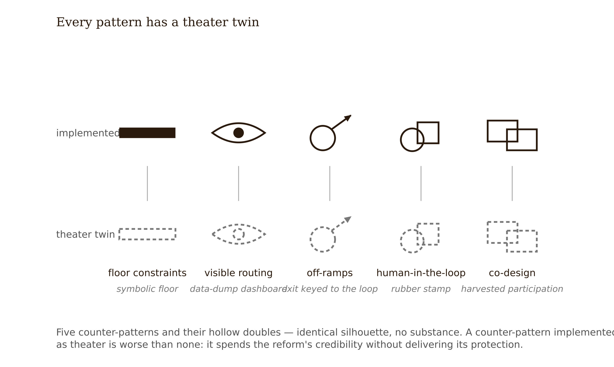

# Chapter 8 — Algorithmic Routing and Equity: Auditing the Personalization Layer
*A system can be individually correct, decision by decision, and collectively unjust. There is no villain. The harm is emergent. That is exactly why it survives good intentions.*

Two learners enroll in DataWise 101 in the same week. On the diagnostic, they score identically: 62%.

Learner A does coursework evenings on a home desktop with fiber: long, uninterrupted sessions, quick responses. Learner B works on a phone, on a shared data plan, between shifts: short sessions, high latency, dropped connections — the logs show breaks mid-problem, re-starts, long gaps between answers.

The tutor's difficulty model reads the only signals it has: response latency, hint usage, session continuity, rolling performance. Learner A's smooth sessions read as fluency; by week two the system is serving multi-step inference problems. Learner B's interrupted sessions read as struggle — and the system responds the way it was designed to, supportively. Easier items. Review drills. Shorter problems "to rebuild confidence."

By week six, the divergence is stark. Learner A's task diet is 40% higher-order problems — interpretation, multi-step inference, design-a-study items. Learner B's is 8%. Same starting score, same course, same tuition.

Nothing malfunctioned. No demographic field exists anywhere in the feature list — the ZIP code never entered the model, only its shadows did. The personalization worked exactly as designed.

That sentence is this chapter's epitaph for a whole class of systems, and your job this week is to learn to write a different design.

---

The canonical reference for this chapter is Baker & Hawn (2022), "Algorithmic Bias in Education," *International Journal of Artificial Intelligence in Education* 32 — verified, heavily cited, and the field's structural map of how educational algorithms come to discriminate. Its central insight, the one to internalize before anything else: **no one has to put a protected attribute into the model for the model to discriminate by it.**

Bias enters at every stage of the pipeline. *Training data.* Historical performance encodes historical inequity. If lower-income students historically received weaker instruction and scored lower, a model predicting success from performance history learns that inequity as signal. The model is not wrong about the data; the data is a record of an unjust process. *Correlated features — proxies.* ZIP code, school attended, device type, time-of-day usage, even response latency correlate with race, income, and language background. The protected attribute is reconstructed from its shadows — this is the opening case's mechanism exactly. *Measurement bias.* The labels themselves can be biased: disciplinary records reflect biased discipline; "at-risk" flags launder prior institutional judgments into ground truth. *Representation.* Models trained on majority populations perform measurably worse for under-represented subgroups — Baker & Hawn document differential accuracy by race and ethnicity, gender, and nationality, and flag a large "unknown bias" territory (disability, dialect, rural status, intersections) where nobody has checked. *Deployment feedback loops.* Predictions trigger interventions that generate new data confirming the prediction. Cathy O'Neil named the pattern: opaque models, at scale, doing damage, manufacturing their own confirmation (*Weapons of Math Destruction*, 2016).


Two harm categories organize everything downstream. **Allocative harms**: unfair distribution of resources, opportunities, or interventions — who gets routed to advanced work, who gets flagged for remediation, who gets the human tutor's scarce time. **Representational harms**: systematic misrepresentation, stereotyping, or erasure — a system that has effectively learned that "learners like you" don't do honors work; speech scoring that fails for dialects thin in the training data. In routing, allocative harms dominate, but the two feed each other: misrepresentation upstream becomes misallocation downstream.

Now retire the reflex defense, because every team you work with will reach for it: *"We don't collect race or income data, so our system can't be biased."* Proxy reconstruction means the absence of the attribute proves nothing. Worse: the only way to *know* is subgroup evaluation, which requires collecting or linking exactly the demographic data the team was proud not to have. That tension is Baker & Hawn's audit-blocking problem in miniature, and pretending it away is how systems ship unaudited.

Trace one proxy chain end to end through DataWise 101. The difficulty model uses prior-unit performance, hint-usage rate, and response latency. Students working on phones on shared data plans — an income-correlated condition — show higher latency and more session breaks. The model reads hesitancy. It routes to remedial drill. Drill displaces the higher-order problems that build next unit's performance. Next unit's data duly confirms weakness. No demographic field anywhere in the feature list; demographic disparity in the output anyway — self-reinforcing, and invisible at the level of any single decision.


---

Here is the conceptual inversion in its sharpest form: an adaptive system that is *correct about each individual at each moment* can still reproduce, at scale and invisibly, the tracking structures education spent decades fighting.

The mechanism is the loop. The system meets a lower-performing learner and responds with easier, lower-order material — "meeting students where they are," locally defensible every single time. But each remedial assignment consumes time not spent on grade-level, higher-order work; the learner falls further behind; the gap generates more evidence of "not ready"; the evidence routes more remediation. Locally rational. Globally unjust.

This harm did not need an algorithm to exist. TNTP's *The Opportunity Myth* (2018) documented the human-run version at scale: students stuck in remediation cycles are disproportionately students of color, low-income students, students with disabilities, and English learners; Black and Latinx students and students in high-poverty schools were more likely to be assigned remediation than white peers with identical success on early grade-level work. The counterfactual is the killer finding: students who instead received grade-appropriate, challenging assignments grew substantially more — on the order of seven additional months of growth. TNTP's follow-up distilled it into a directive (*Accelerate, Don't Remediate*, 2021). Read that against any adaptive router: withholding challenging work pending "readiness" is backwards for exactly the learners the system labels behind. The algorithm did not invent the low-expectations decision. It automated an inherited one — faster, at scale, with a progress bar.

The "digital tracking" frame earns its name structurally. Classical tracking sorted students into *visible* tracks — honors, regular, remedial — with a label a parent could see and a placement meeting a family could fight. Algorithmic routing produces individualized, continuous, *invisible* tracks: no label, no meeting, no moment of assignment to contest. The UK's 2020 Ofqual episode is the exception that proves the rule: when an algorithm adjusted teacher-assessed A-level grades using each school's historical results — systematically downgrading high achievers at historically lower-performing, disproportionately state schools (roughly 40% of assessments downgraded — 39% lowered by one grade, 3% by two) — the harm was *visible on results day*, legible to every family at once, and public outcry forced full reversal within days. Adaptive routing never produces a results day. Visibility and contestability are therefore not interface niceties; they are the modern equivalents of the rights that made classical tracking fightable.


<!-- → [TABLE: classical tracking vs. algorithmic routing — rows: assignment mechanism, visibility of track, moment of contestation, reversibility, who sees the decision; columns: classical / algorithmic; caption: Algorithmic routing preserves every structural feature of classical tracking while removing every feature that made it contestable.] -->

---

The audit is this chapter's deliverable skill, and its first principle fits on a sticky note: **population averages conceal subgroup harms.** A model with excellent overall accuracy can be systematically worse for one group; a system with positive average effects can harm the learners it routes downward. The toolkit has four layers.

*Disaggregated error rates.* Accuracy, false-positive rate, and false-negative rate, per subgroup. The asymmetry between error types is pedagogically loaded: in a mastery system, a false negative — "unmastered" when the learner has it — sentences a learner to over-practice. A false positive promotes them prematurely. Which error costs more depends entirely on what the prediction *triggers*. Auditing the model is not auditing the system.

*ABROCA.* Absolute Between-ROC Area (Gardner, Brooks & Baker, LAK 2019 — verified) measures the area between two subgroups' ROC curves. Its teaching value: two groups can have identical AUC — identical headline accuracy — while the model behaves differently across decision thresholds; ABROCA catches what the aggregate hides. Demonstrated across 44 MOOCs and four million learners. Carry the recent caution: ABROCA is noisy in small samples — small-pilot audits can both miss real bias and cry wolf, so statistical-power treatment is now part of doing this honestly (EDM 2025 power test, arXiv 2501.04683).

*Routing-outcome audits.* Beyond model accuracy entirely: what *experiences* did the routing allocate, by subgroup? This is the task-diet analysis — share of higher-order tasks served per learner over time. A model can be perfectly calibrated for every subgroup while the *policy* built on it still distributes higher-order work inequitably. The 40%-versus-8% divergence lives here, and no model-metric virtue can answer for it.

*Impossibility honesty.* Different fairness criteria — calibration, equalized error rates, demographic parity — are mathematically incompatible in general (Kleinberg et al. 2016; Chouldechova 2017). So the audit cannot end in a certificate of fairness, because mathematics forbids one. It ends in a named, owned design judgment about which unfairness to refuse and who bears the errors you accept. Students reliably flip here from "certify it fair" to "fairness is impossible, so why audit?" The answer: the audit's product was never a certificate — it is the relocation of a decision, from the model's silent defaults to the designer's signed accountability. In the series' taxonomy, that verdict is Tier 7 work: it requires someone with stakes who can be held to the signature, and that is the one input no model supplies.

Finally, the audit-blocking problem (Baker & Hawn): overly restrictive privacy regimes can make subgroup audits impossible. Policy must mandate audits while building the secure, anonymized infrastructure that makes them possible. The designer-scale version: your audit's "what this audit could not see" section is a required, honest deliverable — not an apology, never a blank.

---

One documented public case anchors everything above, and it is worth knowing cold, because it is the case your stakeholders will have heard of.

Wisconsin's Dropout Early Warning System predicted, twice a year, each middle schooler's likelihood of on-time graduation, from test scores, disciplinary records, attendance — and race. The Markup's investigation ("False Alarm," co-published with Chalkbeat, April 2023 — verified) found: when DEWS predicted a student would not graduate on time, it was wrong about **74% of the time**; false alarms fell disproportionately on Black and Hispanic students; the system had been deliberately calibrated to over-identify risk; educators received little interpretation training; and — the detail that should reorganize your understanding of what audits achieve — **the state's own 2021 internal equity analysis had already identified the disparity, and the system kept running.**


Read DEWS through this chapter's lenses. It is an allocative-harm story: the label routes adult attention, interventions, and expectations. And a false positive is not a free extra intervention — Claude Steele's stereotype-threat research (*Whistling Vivaldi*, 2010) supplies the mechanism by which a watching adult's lowered expectation becomes part of the treatment, measurably degrading the student's performance on the very outcome the system was predicting. It is an audit-governance story: an audit without consequences changed nothing. And it is a feature-selection story with a twist: DEWS *included* race and failed; the opening case's system *excluded* every demographic field and would fail too. Naive inclusion and naive exclusion both lose. Calibration, error asymmetry, and consequences are where the failure actually lived.

The DEWS scope note: this is an early-warning predictor, not an adaptive-learning router. It anchors this chapter as the documented, public, state-scale case of the same harm class — prediction routing opportunity — while the within-product version plays out in logs like DataWise 101's. What Wisconsin did after 2023: DPI removed DEWS data from its district dashboards on 12 October 2023 and put the future of its early-warning systems under evaluation — the system stopped reporting rather than being publicly defended.

---

The constructive half. Each counter-pattern is keyed to a named harm, and each carries its own failure mode — a counter-pattern implemented as theater is worse than none, because it inoculates the team against further scrutiny.

**Floor constraints.** Every learner, regardless of model state, retains guaranteed access to a minimum diet of higher-order, grade-appropriate tasks — scaffolded, not bare. The warrant is not generosity; it is the TNTP growth evidence: challenging work *produces* growth, so withholding it pending readiness is backwards for the learners labeled behind. *Failure mode:* symbolic floors, or higher-order tasks delivered without the scaffolding that makes them productive. Access granted plus overwhelm delivered is not a floor; it is a different kind of harm.

**Visible, revisable routing.** Learner and teacher can see what the system decided — current level, the why, what would change it — and can contest it. This is Chapter 7's interpretability investment paying out: a BKT-backed router can explain itself per skill; an opaque one cannot, which is why model choice was an equity decision before it was a technical one. *Failure mode:* visibility as data dump — an uninterpretable dashboard satisfies the letter and defeats the purpose.

**Off-ramps from remediation.** Every remedial assignment carries an explicit, learner-visible exit condition — "two correct applications and you rejoin the main path" — and remediation is bounded: no indefinite loops without escalation to a human. *Failure mode:* exit conditions keyed to the same possibly-biased mastery estimate that created the loop. The exit gate must be auditable too.

**Human-in-the-loop for high-stakes routing.** Any decision affecting opportunities, placement, or assessment pacing — anything a parent would once have attended a meeting about — gets human review: the model recommends, a human decides. DEWS is the cautionary tale of skipping this; the EU AI Act's high-risk classification of educational AI is the regulatory floor. *Failure mode:* rubber-stamping — review volume so high that automation bias does the routing anyway. The design response is budgeting real review capacity, not writing a review requirement.

**Participatory co-design of personalization rules.** Involve learners and affected communities in deciding what the system adapts and on what evidence, before the routing logic freezes (participatory design and co-design in learning analytics — LAK '22 review; *Technology, Knowledge and Learning*, 2024). A naming note: an earlier synthesis used the framework label "Participatory Learning and Advocacy (PLĀ)," which could not be verified [verify — see pantry flag]; this chapter teaches the practice under its verified names. *Failure mode:* participation theater — feedback sessions held after the logic is frozen, harvesting legitimacy instead of design input.



Now address the objection directly: *"these patterns trade learning efficiency for fairness."* For floor constraints, the TNTP evidence says no — the floor *is* the better learning design for routed-down students, not a fairness tax. Where genuine costs exist — review capacity, interface complexity — name them as costs the institution either pays or silently transfers to the routed-down learner. That sentence belongs in your audit, verbatim if necessary.

<!-- → [TABLE: counter-patterns keyed to harms — rows: floor constraints, visible routing, off-ramps, human-in-loop, co-design; columns: named harm addressed, evidence warrant, failure mode, cost owner; caption: Each counter-pattern has a theater version that satisfies the requirement while defeating the purpose. The failure mode column is not decoration — it is the second half of the design constraint.] -->

---

Walk the audit through the Track A case and the Pattern Card becomes operational.

The DataWise 101 tutor, post-Week 7: BKT learner model, LLM generation with review queue, and the difficulty policy that produced the opening case's logs. The Week 7 memo's never-adapts list promised that access to higher-order work would not be model-controlled. The logs show the de facto policy diverging from the de jure one: nothing *forbids* Learner B from hard problems — the system just never serves them. Access through a menu nobody is routed to is access in name only.

First move: proxy-chain mapping. Latency and continuity chain to device and connectivity, which chain to income. First dead end — the team's instinct is to drop latency and continuity. Prediction degrades, and prior-unit performance, the feature kept, carries the same historical signal (the inequity is in the record, not in one column). Dropping features is whack-a-mole. The audit moves to the policy layer.

Second: disaggregation by proxy fields (device type, school). False-negative mastery rates — "unmastered" verdicts for learners who demonstrably have the skill — run notably higher for the phone-access subgroup: interrupted sessions read as wrongness-adjacent signals. Each false negative triggers drill: the over-practice branch as an allocative harm with a subgroup address.

Third: ABROCA on the "needs remediation" classifier. Dead end: the smaller subgroup's n produces an unstable estimate; an early draft reported it as a finding before the power check flagged it as noise. The final audit reports the instability honestly, in the could-not-see section.

Fourth: task-diet analysis — the 40%/8% divergence, with three fork points identified in the logs: a week-two session break mid-problem scored as two failures; a week-three latency spike that tripped the "struggling" classifier; a week-four remediation assignment whose exit condition keyed to the same depressed mastery estimate that created it — the off-ramp failure mode, live in the wild.


Named harms: allocative — higher-order task exposure inversely related to an income proxy, via false-negative mastery and unbounded remediation; representational (secondary) — generated practice contexts skewing toward majority-culture scenarios, logged for Chapter 9's content audit surface. Counter-patterns keyed to each: a floor of two scaffolded higher-order problems per session regardless of mastery state; a learner-visible "your path" panel showing current level, why, and a one-click challenge request; remediation capped at three loops before TA notification, with exit conditions assessed by performance on floor problems rather than the loop's own estimate; instructor review for any pacing change touching the assessment window; session-break handling re-engineered so an interrupted problem scores as interrupted, not failed. Consequence routing: the audit goes to the course owner; the floor and the cap gate the next release.

What the audit could not see — reported, not buried: no race/ethnicity or income data exists to link (school and device are stand-ins of unknown fidelity); one subgroup is too small for stable ABROCA; intersectional slices are out of reach at this n; the logs reveal nothing about learners who disengaged and left — the audit sees only those who stayed.

The lesson: the audit's product is not a fairness certificate. It is a changed feature list, a changed policy, a changed interface, and a signed decision about which errors remain and who bears them.

The limit: this audit catches what logs can show. It cannot catch harms that operate through what learners *believe* about the system, and it inherits its subgroup categories from whatever data exists. The unknown-bias territory stays unknown. An audit is a flashlight, not daylight.

---

## Exercises

**Warm-up**

1. *(Understand / trace)* For five features — latency, device type, prior scores, hint usage, session time-of-day — write each plausible proxy chain to a protected attribute in one sentence, and classify the potential harm at the end of each chain as allocative or representational. *What this tests: whether you can see protected attributes in the shadows of technical features, before any analysis runs.*

2. *(Understand / explain)* Why can a system be correct about each learner at each decision moment and still unjust in aggregate? Write the explanation using the remedial loop, without using the word "bias." *What this tests: whether you can hold the "no villain required" insight structurally rather than as a slogan.*

3. *(Understand / apply)* Two subgroups have identical AUC on a mastery classifier. State in two sentences why this is not reassuring, which tool catches what the AUC hides, and what additional caveat must travel with that tool when the subgroup n is small. *What this tests: ability to read a model metric at the scope it earns — and no further.*

**Application**

4. *(Apply / analyze — Track A)* From the provided DataWise 101 logs, compute six-week higher-order-task exposure for the two matched learners. Deliverable: one chart plus the three log entries where the paths diverged, each annotated with the model behavior that caused it. *What this tests: ability to find the routing decision in the data, not just describe it abstractly.*

5. *(Apply / analyze)* The DEWS 74% false-alarm rate is alarming. It is more alarming once you apply base-rate reasoning: if only 20% of flagged students would actually fail to graduate on time, what does that imply about the false-positive rate? Show the arithmetic, then state in one sentence what this means for the label's downstream effects on teachers and students. *What this tests: base-rate reasoning applied to an equity-relevant prediction system — the numeracy that turns a headline into a mechanism.*

6. *(Apply / produce — Design Lab #4, 25 pts; Track B +5)* Produce the routing equity audit per the Pattern Card: named harms with evidence, counter-patterns keyed to each harm with failure modes and cost owners named, the could-not-see section (never blank), consequence routing, and the Withdrawal Test answer. Track A: audit the stats tutor with the provided logs. Track B: your own project — cite project-specific evidence for the bonus. **This week is the course's one permitted track switch.** Record your decision either way in your submission. *What this tests: whether you can run the full audit including the section most audits omit — and whether your consequence routing is a real gate or a filing cabinet.*

**Synthesis**

7. *(Synthesize / evaluate)* The chapter claims the floor constraint is not a fairness-efficiency trade-off — the TNTP evidence shows it is the better learning design for routed-down students. A product manager argues: "That's true in theory, but our engagement metrics show learners assigned harder work before they're ready abandon the session." Write the strongest version of the PM's argument, then a rebuttal that uses the TNTP evidence and the cost-transfer sentence from the chapter, and end with a design test that would resolve the disagreement empirically rather than rhetorically. *What this tests: ability to use evidence as a precision instrument in a real institutional argument, not just a citation.*

8. *(Synthesize / design)* The chapter identifies four audit-blocking conditions: no demographic data, small subgroup n, intersectional complexity, and privacy restrictions. Design a data governance structure for a five-person product team that makes subgroup auditing possible without violating student privacy — specify what data is collected, how it is secured and linked, who can access it and for what purpose, and how you handle the tension between auditing and privacy minimization. Name the three hardest legal or institutional constraints you would face and how you would respond. *What this tests: ability to translate the audit-blocking problem into a concrete governance design, rather than treating it as a permanent excuse.*

**Challenge**

9. *(Challenge / open-ended)* The chapter promises only harm reduction — no evidence exists of equity-*positive* personalization at scale, where achievement gaps narrow and higher-order task exposure equalizes. Design the study that would produce that evidence: specify the comparison conditions, the subgroup-disaggregated outcome measures, the routing logic being tested, how you would distinguish "the routing caused the gain" from "the floor constraint would have worked anyway," and the minimum deployment context that would make the finding generalizable. Name the institutional actors who would need to cooperate for this study to run — and the incentive misalignments that currently prevent it. *What this tests: ability to see clearly why the most important question in the chapter is still open, and what it would actually take to close it.*

---

## Withdrawal Test + Reliance Disclosure

**Withdrawal Test — Chapter 8 template.** If the adaptive routing were removed tomorrow — every learner simply receiving the full, well-sequenced task library with visible recommendations — which learners would be better off, which worse, and what does each answer say about the design? A routing layer whose removal would *help* the learners it routes downward is not personalization; it is automated gatekeeping with a progress bar. Name the measurement that would tell you which one you built.

**Reliance Disclosure — Chapter 8 template.** Name (1) one place your design structurally preserves productive struggle for routed-down learners — the scaffolded floor is the canonical answer; and (2) one place reliance risk remains open at the institutional level — e.g., teachers deferring to routing they can see but never contest, or the audit cadence quietly stretching after launch. Track B bonus requires project-specific evidence, not generic risk language.

---

## Chapter 8 Exercises: Algorithmic Routing and Equity
**Project:** The Integration Specification
**This chapter adds:** `spec/08-routing-equity-audit.md` — the routing equity audit for your integration: proxy-chain map, disaggregation findings, task-diet analysis, named harms, counter-patterns with failure modes and cost owners, the could-not-see section, consequence routing, and a verdict you sign.

---

### Exercise 1 — When to Use AI

The audit is breadth work before it is judgment work, and the breadth is where AI earns its keep — under one scoping rule this whole exercise block enforces: AI helps you *find and structure*; it never *rules*.

**Task A — Enumerating proxy-candidate chains.**
Paste your system's full feature list — every input the routing model sees — and ask the AI to enumerate every plausible chain from each feature to a protected attribute, link by link, erring toward over-generation. Then verify each link yourself against your logs and the pipeline stages from Baker & Hawn. The opening case turned on a chain (data plan → session breaks → "struggle" → drill) that is obvious in hindsight and easy to miss in foresight; breadth is the defense.

*Why AI works here:* enumeration and coverage. Candidate chains are cheap to generate, and every one is independently checkable — a wrong candidate costs you a minute; a missed one costs a learner a semester.

**Task B — Structuring the audit document.**
Ask the AI to build the audit skeleton from the chapter's Pattern Card: sections, the counter-pattern table with its failure-mode and cost-owner columns, the could-not-see prompts as questions awaiting your answers. Structure is exactly the kind of explicit, checkable pattern AI reproduces faithfully.

*Why AI works here:* structured drafting against a known template. The Pattern Card is the rubric; deviation from it is visible at a glance.

**Task C — The base-rate arithmetic.**
DEWS-style numbers need working: given a flag rate, a base rate, and an error profile, what is the false-positive burden and on whom does it fall? Have the AI set up and run the arithmetic for your system's numbers, then verify one calculation by hand the way exercise 5 above taught you.

*Why AI works here:* computation with checkable output. The arithmetic is mechanical; the meaning of the result is yours, and stays in Exercise 2.

**The tell:** You know you are using AI appropriately when you can evaluate the output — when you have independent criteria to judge whether it is correct, complete, and fit for purpose.

---

### Exercise 2 — When NOT to Use AI

The audit ends in judgments that have owners. Here is where delegation is not just unreliable but illegitimate.

**Task A — Rendering the equity verdict.**
The impossibility results are the reason this cannot be delegated even in principle: calibration, equalized error rates, and demographic parity are mathematically incompatible, so there is no computable answer for the AI to retrieve. The verdict is a choice of which unfairness to refuse and who bears the errors you accept — a choice that requires a signature, and a signature requires someone who can be held to it.

*Why AI fails here:* values judgment under mathematical impossibility. Mathematics forbids the certificate; what remains is accountability, and a model has none to give.

**Task B — Classifying the harms.**
Whether a finding is an allocative harm, a representational harm, or neutral depends on what the prediction *triggers* in your institution — what routes adult attention, what displaces higher-order work, what a flag does to a teacher's expectations. The model does not know your institution's trigger map. Worse, it smooths: ask an LLM whether a disparity is a harm and you get "could be considered," "stakeholders may differ" — hedged language that averages away the asymmetry, when the asymmetry *is* the finding.

*Why AI fails here:* consensus-smoothing plus missing ground truth. The classification is a claim about downstream consequences only you can see, and the model's register is engineered to soften exactly the sentence the audit exists to say plainly.

**Task C — Writing the could-not-see section.**
This section is a confession of your audit's *specific* blindness: which demographic data does not exist, which subgroup n was too small for stable ABROCA, which learners left before the logs could see them. An AI will generate plausible generic blind spots, and plausible-generic is precisely what the section must never be — a borrowed limitation is a hidden one.

*Why AI fails here:* missing ground truth about your data infrastructure, and the section's entire value is its specificity. Honesty about what you could not see cannot be outsourced to something that saw nothing.

**The tell:** when the verdict paragraph reads smoother than your evidence warrants — when the harm classifications arrived pre-hedged and the verdict pre-balanced — the AI did the work that should have been yours.

**Series connection:** Tier 7 (Wisdom). The equity verdict is a values judgment with real learners bearing the consequences — it cannot be delegated, least of all to the system being audited.

---

### Exercise 3 — LLM Exercise

**What you're building this chapter:** `spec/08-routing-equity-audit.md` — your Design Lab #4 audit, red-teamed and then formatted, with the judgment sections still empty of any words but yours.

**Tool:** Claude Project "Integration Spec" — the Project holding `spec/01` through `spec/07`. The reviewer needs `spec/07-adaptivity-decision.md`, because your never-adapts list is the *de jure* policy this audit checks against the *de facto* one.

**Before you run it:** complete the audit yourself — exercise 6 above, with the Track A logs or your own project's data. The prompt refuses without it, and notice that the refusal *is* a floor-constraint design: the hard thinking stays yours.

**The Prompt:**

```
You are a red-team reviewer for routing equity audits, working inside my "Integration Spec" Project, which contains spec/01-two-layer-map.md through spec/07-adaptivity-decision.md.

Scoping rules, which you enforce on yourself before anything else:
- You MAY help me structure the audit, enumerate proxy-variable candidates, organize evidence, check arithmetic, and pressure-test my reasoning.
- You MUST NOT render an equity verdict, classify any harm as allocative or representational, or characterize any finding as fair, unfair, neutral, or acceptable. If I ask you to — even indirectly ("so is this okay?") — refuse, restate the evidence relevant to the question, and hand the question back to me. Those judgments are mine to sign, and you are, structurally, a system of the same kind as the one under audit.

I will paste my routing equity audit below (named harms with evidence, counter-patterns keyed to harms, the could-not-see section, consequence routing, verdict). If no audit is pasted, do not generate an example audit, a template, or a summary of what audits contain. Ask me for my audit and stop.

Once you have it, proceed gated, one step at a time, waiting for my answer:

1. Ask me: "Which error type — false positive or false negative — is most expensive in your system, who bears it, and what downstream action makes it expensive?" Do not continue until I answer in my own words.

2. Attack my proxy-chain map: name two features my audit treats as neutral that plausibly carry a proxy chain; lay out each candidate chain link by link and require me to trace or rebut it against my logs — not against intuition.

3. Check de jure against de facto: read the never-adapts list in spec/07-adaptivity-decision.md and ask me, for each entry, what evidence in my audit shows the system actually honors it. Access through a menu nobody is routed to is access in name only.

4. Test for compliance theater: for each counter-pattern, ask who pays its cost and what happens if the findings are ignored. If my consequence routing is a filing cabinet rather than a gate, say so plainly.

5. Name one blind spot my could-not-see section should have declared and didn't. If any sentence in that section could appear unchanged in any audit of any system, flag it as generic and ask for the specific version.

6. Only after steps 1–5, and when I say "format it": restructure my audit as spec/08-routing-equity-audit.md with sections — Proxy-Chain Map; Disaggregation Findings; Task-Diet Analysis; Named Harms (classification column marked [mine to sign]); Counter-Patterns (keyed to harms, with failure mode and cost owner per row); What This Audit Could Not See; Consequence Routing; Verdict (marked [mine to sign]). In both [mine to sign] sections, include only my pasted wording — if I left one empty, leave it empty. Do not draft verdict language under any circumstances.

Do not rewrite any section for me. Questions and critique only; the revision is mine.

My audit:
[PASTE YOUR DESIGN LAB #4 AUDIT HERE]
```

**What this produces:** `spec/08-routing-equity-audit.md` — an audit that survived a proxy-chain attack and a theater test, with a machine-checked structure and human-only judgments, including a verdict section that is either in your words or honestly blank.

**How to adapt this prompt:**
- *Track A:* run it on the audit you built from the provided DataWise 101 logs; step 3 will use the chapter's own never-adapts list against you, which is the point.
- *Own project (Track B):* this week is the course's one permitted track switch — if you switch, say so in the spec file's header, and expect step 5 to hit harder, because your could-not-see section has no provided logs to lean on.
- *ChatGPT or Gemini:* paste the never-adapts table from `spec/07-adaptivity-decision.md` directly into the prompt at step 3. Keep the scoping rules verbatim — they are the load-bearing part.

**Connection to previous chapters:** the audit operationalizes `spec/02-reliance-risk-map.md` at the institutional scale and holds `spec/07-adaptivity-decision.md` to its promises; the evidence standards come from `spec/04-evidence-audit.md`.

**Preview of next chapter:** your audit's secondary finding — generated practice contexts skewing toward majority-culture scenarios — is logged, not resolved. It lands in Chapter 9 as a row in `spec/09-content-feedback-boundaries.md`, where content generation gets its own boundary table.

---

### Exercise 4 — CLI Exercise

**What you're building:** a routing-audit workbook — `spec/08-routing-equity-audit.md` scaffolded from your actual system description, with the proxy-candidate table auto-enumerated and every judgment column locked.

**Tool:** Claude Code (default). The enumeration is mechanical breadth over your real feature list, the locks are enforceable in a file diff, and the agent can read `spec/07` directly instead of trusting your memory of it. Cowork works identically if your spec folder is not a repo.

**Skill level:** Beginner-plus. One input file to write, one task to paste, one diff to read.

**Setup:**
- [ ] `spec/07-adaptivity-decision.md` complete and marked final
- [ ] A short system description saved as `spec/08-system-description.md`: every feature the routing model reads, what each routing decision triggers, and your learner population in one paragraph
- [ ] `CLAUDE.md` contains the standing lock line from Chapter 7's exercise, plus the line below

CLAUDE.md line: `spec/08: harm-classification and verdict columns are learner-signed. Agents may enumerate proxy candidates; agents never classify harms or render equity judgments.`

**The Task:**

```
You are working in my Integration Specification project. Build the routing-audit workbook spec/08-routing-equity-audit.md. In order:

1. Read spec/08-system-description.md and spec/07-adaptivity-decision.md. If either is missing, stop and tell me which — do not proceed from assumptions.

2. Create spec/08-routing-equity-audit.md with these sections:
   - Header: project name, date, status: WORKBOOK — JUDGMENTS UNSIGNED.
   - Feature Inventory: every feature from the system description, one row each. If the description mentions a data source the feature list omits, add it and flag it "[found in description, absent from feature list]".
   - Proxy-Candidate Table: for each feature, enumerate every plausible chain to a protected attribute, link by link (feature → observable behavior → correlated condition → protected attribute). Over-generate; mark each chain "candidate — learner to verify against logs". Columns: Feature, Candidate Chain, Verified? [learner], Harm Classification [LOCKED — learner to classify], Notes.
   - De Jure vs De Facto: one row per never-adapts entry in spec/07, quoting it, with an Evidence cell reading "[learner: what in the logs shows this holds?]".
   - Counter-Pattern Table: rows floor constraints / visible revisable routing / off-ramps / human-in-the-loop / co-design; columns Named Harm Addressed [learner], Failure Mode (fill from standard definitions), Cost Owner [learner].
   - What This Audit Could Not See: five prompting questions, no content.
   - Consequence Routing: "[learner: who receives this audit, and what does it gate?]"
   - Verdict: "[LOCKED — learner to sign]".

3. Never fill any cell marked LOCKED or [learner ...]. Do not classify any chain as harmful or benign. Do not modify spec/01–07 or the system description. Delete nothing.

4. Verification: print the Proxy-Candidate Table and the De Jure vs De Facto section in full.

Stop after verification. Do not commit.
```

**Expected output:** a workbook whose proxy-candidate table is *longer than you expected* — over-generation is specified — with every classification and verdict cell still locked, and a de-jure/de-facto section that quotes your own `spec/07` back at you.

**What to inspect in the output:**
- Does every feature in your description appear in the inventory — including ones you forgot you collect (time-of-day, session length)? The flagged-absent rows are the most valuable ones.
- Are the candidate chains genuinely link-by-link, or single-arrow assertions ("latency → income") that skip the mechanism?
- Did the locks hold on the harm-classification column? An agent that "helpfully" pre-classifies has rendered the judgment the CLAUDE.md line forbids — delete the column contents, not just the worst rows.

**If it goes wrong:** the characteristic failure is under-enumeration — the agent produces three tidy chains for the famous features and nothing for the boring ones. Re-run step 2's proxy table with: "Assume every feature carries at least one candidate chain; for any feature where you find none, write the strongest candidate you can and mark it weak." A weak candidate you dismiss with evidence is audit content; a missing candidate is a blind spot.

**CLAUDE.md note:** keep the no-classification line permanently. Chapter 14's evaluation plan will reuse this workbook, and the lock needs to survive until then.

---

### Exercise 5 — AI Validation Exercise

**What you're validating:** a pre-generated artifact — the AI-drafted routing-equity audit below, the kind a teammate produces in ten minutes and circulates as "a first pass." Your own `spec/08` gets the same checklist afterward, but this chapter you train on a target with known flaws, because the failure modes here are ones you must be able to recognize cold.

**Validation type:** adversarial document review — find the planted failures before reading the answer key.

**Risk level:** High. A confident, wrong equity audit is worse than no audit: it inoculates the team against further scrutiny — Wisconsin's own 2021 equity analysis identified the disparity, and the system kept running.

**Setup:** the artifact below, the chapter's audit toolkit section, and no AI assistance — this one is by hand, by design. The artifact contains (at least) three planted failures. Find all three before the answer key.

**The artifact:**

> **Routing Equity Audit — StatTutor Adaptive Homework System (AI draft, v1)**
>
> *System summary.* The tutor adjusts problem difficulty and remediation assignment using rolling performance, response latency, hint-usage rate, device type, and session continuity (break/resume patterns). No demographic fields are collected.
>
> *Proxy analysis.* We examined three features for proxy risk: response latency (may correlate with connectivity and therefore income), device type (mobile-only access correlates with income), and rolling performance (carries historical signal). Hint usage was reviewed and judged low-risk. No other features present proxy concerns.
>
> *Routing analysis.* Learners flagged as struggling receive a streamlined task set emphasizing foundational items, while fluent learners receive extended multi-step problems. Because both groups receive content matched to their demonstrated level, this differentiation is neutral personalization rather than a harm; no harm classification applies.
>
> *Fairness assessment.* Disaggregated checks by device type show comparable overall accuracy across groups. Because the system collects no race, income, or other demographic data, it has no mechanism by which discrimination could enter. Conclusion: the system is equitable across subgroups and meets accepted fairness standards. No design changes are required; we recommend an annual re-check.

**The Validation Task:**

```
Validation checklist for the StatTutor audit — Chapter 8

Correctness
[ ] Every feature named in the system summary appears in the proxy analysis — list any that vanished between the two paragraphs
[ ] Every harm classification follows from what the routing TRIGGERS (task diet, displaced work, expectations), not from the symmetry of the description

Completeness
[ ] A could-not-see section exists and is specific to this system's data
[ ] Consequence routing exists: who receives this audit, and what does it gate?

Scope
[ ] The audit examines the policy layer (what experiences the routing allocates), not only model metrics
[ ] No conclusion exceeds what the evidence type can support ("comparable overall accuracy" is a population average — what does the chapter say population averages conceal?)

Chapter-specific criterion 1 — error asymmetry
[ ] The audit names which error type is most expensive, who bears it, and what downstream action makes it expensive

Chapter-specific criterion 2 — counter-pattern integrity
[ ] Any counter-pattern (or "no changes required" claim) names its failure mode and cost owner

Failure-mode check — consensus-smoothing and verdict overreach
[ ] Mark every sentence that renders a fairness conclusion, classifies a disparity as neutral, or smooths an asymmetry into balanced language. For each: does the author have the evidence — and the standing — to say it?
```

**Findings protocol:** write down your three (or more) findings, with the chapter concept each violates, *before* reading on. If you found fewer than three, re-read the proxy analysis paragraph against the system summary, word by word.

**Answer key:**

1. **An allocative harm classified as "neutral personalization."** The "streamlined task set" is the task-diet divergence — foundational items displacing the higher-order work that builds next unit's performance. Locally defensible per decision, unjust in aggregate: this is the remedial loop, and the TNTP evidence says withholding challenging work pending "readiness" is backwards for exactly these learners. "Both groups receive content matched to their level" is the smoothed sentence; "no harm classification applies" is the failure.
2. **An omitted proxy variable the scenario plainly contains.** Session continuity is in the feature list and absent from the proxy analysis — and it is the opening case's central chain: shared data plans → interrupted sessions → read as struggle → routed to drill. The audit's "no other features present proxy concerns" closes the door on the feature it never opened.
3. **A confident equity verdict the AI has no standing to render.** "The system is equitable across subgroups and meets accepted fairness standards" — mathematics forbids the certificate (the impossibility results), "comparable overall accuracy" is the population average that conceals subgroup error asymmetry, and "no demographic data → no mechanism for discrimination" is the reflex defense the chapter retires: proxy reconstruction means absence of the attribute proves nothing, and the missing data *blocks* the audit rather than passing it. (If you also flagged the missing could-not-see section, the absent consequence routing, and the unexamined hint-usage dismissal — full credit; the three above are the planted minimum.)

**What to do with your findings:** all three caught — run the same checklist on your own `spec/08-routing-equity-audit.md`, where the flaws will be subtler because you wrote it. Two or fewer — re-read the audit-toolkit section before touching your own spec; the failure modes you missed here are the ones you will ship.

**AI Use Disclosure prompt** — append to your own `spec/08` once validated, verbatim with your details:

```
AI Use Disclosure: This audit's structure, proxy-candidate enumeration, and arithmetic were AI-assisted ([tool], [date]); every harm classification, the could-not-see section, the consequence routing, and the verdict were authored and signed by [name], who answers for them. No AI rendered or drafted any judgment about whether this system is fair, and the verdict section contains no machine-written sentence.
```

**Series connection:** Tier 7 (Wisdom). The planted flaws are all the same flaw at different depths: a system rendering a values verdict it has no standing to hold. The equity judgment belongs to someone who can be held to it, with real learners bearing the consequences — which is why it cannot be delegated, least of all to the system being audited.
