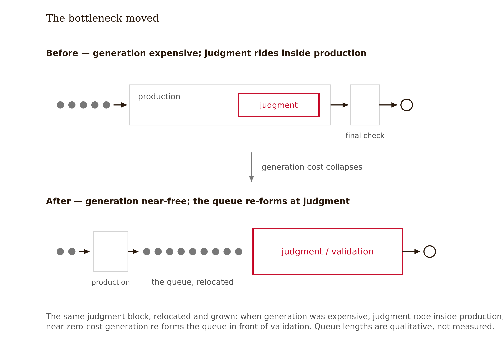
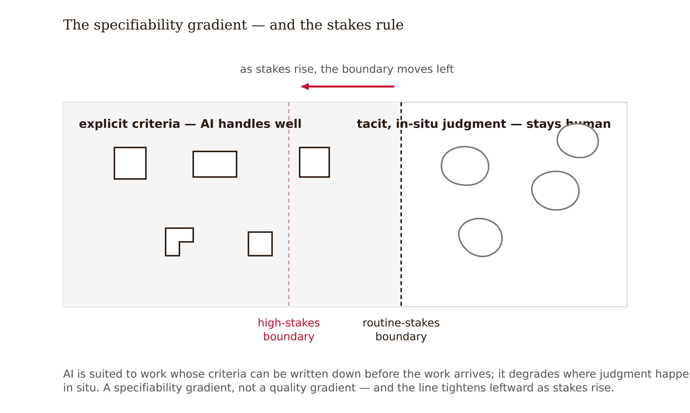

# Chapter 9 — AI-Generated Content and Feedback: Where Judgment Stays Human
*Generation is fast. Judgment is the bottleneck. The bottleneck is the job.*

A corporate L&D team faces a familiar squeeze: their most experienced instructor is retiring, forty modules need refreshing, and the budget covers six studio days. The vendor pitch writes itself — an AI-generated video lecturer: script it, render it, update it forever. The pilot goes out. Quiz scores come back indistinguishable from the human-instructor versions. The dashboard says success.

The watch-time curves say something else. Engagement sags. Learners drift, skim, abandon. A 2024 study in the *International Review of Research in Open and Distributed Learning* compared AI-generated video instructors against human-instructor versions with 108 learners: **academic performance was equivalent — and engagement was significantly lower** (IRRODL 2024, n = 108). When researchers ask learners what is going on, the words that come back are striking: *distraction, discomfort, disconnectedness*. The learners couldn't always say what was off. They behaved as if something was.

Here is the design question the dashboard cannot ask: if learners perform the same but trust it less and engage with it less, what exactly did the design lose — and does the loss compound? One module's worth of "equal performance, lower engagement" might be noise. Forty modules of it, across an entire program, in a relationship between learner and learning experience that runs for years — nobody has measured that, and this chapter will not pretend otherwise. What it will do is give you the boundary-drawing discipline that makes the question answerable for your own product.


---

GenAI has collapsed the cost of first drafts: lesson outlines, question banks, worked examples, scripts, scenarios, rubrics, feedback language, media assets. The speed gains are real, and they are not the interesting part.

The interesting part is what the speed did to the shape of the work. When generation was expensive, the queue in front of a learning experience was a *production* queue, and pedagogical judgment rode along inside it — the person writing the worked example was forced, line by line, to decide whether it taught. Near-zero-cost generation breaks that coupling. The queue is now a *validation* queue: is this item accurate? Aligned to the objective? Does its difficulty match its position? Do its distractors mean anything? Is its tone right for this learner now? **Speed moved forward in the pipeline; the bottleneck moved to judgment.**



The designer's value-add was never typing; it was the chain of judgments about whether an artifact produces learning. AI did not erode that role — it isolated it, stripped of the production work it used to hide inside. McTighe and Silver's argument in *Teaching for Deeper Learning* is useful ballast: learning happens when learners actively make meaning — compare, infer, connect, justify — and whether an artifact provokes meaning-making is precisely the property no generation pipeline checks for. Fluency, yes. Accuracy, mostly, with review. *Teaching power* — what distinguishes an explanation that produces understanding from one that merely contains the information — is tacit, contextual, and currently human.

The failure mode that follows from ignoring this has a body count of training budgets: **validation theater.** A team that generates forty modules and "reviews" them at a pace no genuine review could survive has not automated content production; it has automated the *appearance* of content production while quietly removing the judgment layer. The honest version budgets validation as the primary cost center — because it now is.

The misconception to retire: this is a tool-capability problem, and better models will fix the quality. Quality of generated prose keeps improving. Whether an artifact teaches *your* learners *this* objective at *this* point in the sequence is not a property the model can certify about its own output — it is a claim about learners, and it belongs to whoever can be held accountable for it.

---

The evidence on AI feedback sorts cleanly along one line, and once you see it you can classify almost any feedback task in a minute.

**AI feedback is strongest where criteria are explicit, outputs are structurally regular, and correctness can be checked against a rubric or solution.** Writing mechanics and organization, code correctness and efficiency, mathematical procedure, factual accuracy, format compliance. Lee and Moore's (2024) synthesis of the AI-feedback literature (*Online Learning* 28(3)) confirms the pattern: genuine strengths in timeliness, workload reduction, and communication volume — alongside persistent concerns about bias, transparency, privacy, and the standing need for human oversight. A 2025 review spanning 77 studies of AI-powered grading and feedback reaches the same shape of conclusion: capable on explicit criteria at scale, dependent on human oversight everywhere judgment thickens — alongside the bias, privacy, and transparency concerns that recur across this literature (*Discover Artificial Intelligence* 2025, "A comprehensive review of AI-powered grading and tailored feedback in universities").

**AI feedback is weakest where evaluation depends on context, tacit disciplinary norms, or judgment about a person.** Originality and creative risk-taking. Motivationally sensitive correction. Reframing the *misconception underneath* an error rather than the error itself. Assessing reflection or metacognitive quality. Notice these aren't exotic edge cases — they are the high-leverage moments of teaching. The boundary is not "AI handles easy subjects"; it is "AI handles the dimensions of feedback that can be specified in advance, and degrades on the dimensions that must be judged in situ."

The failure case that proves the boundary from the inside predates LLMs, which is exactly what makes it diagnostic. MIT's Les Perelman and colleagues built **BABEL**, a generator producing grammatically elaborate, semantically meaningless essays, and submitted them to automated essay-scoring systems. The gibberish reliably earned top scores. The lesson is precise: an automated evaluator scores the *measurable proxies* of the construct — lexical sophistication, sentence variety, length, structure — not the construct itself. Wherever the proxy can be satisfied without the construct, the evaluator can be gamed. When you hand feedback to an automated system, you are deciding the proxies are close enough to the construct for this task, at these stakes. Sometimes they are. *Saying so out loud* is the design act.

The same proxy-versus-construct failure appears on the generation side as the **plausible-distractor problem**: ask an LLM for multiple-choice distractors and you get options that look wrong in convincing ways — but a pedagogically valuable distractor encodes a *real, known misconception*, so that choosing it tells the system something. Generated distractors that are merely plausible produce items that discriminate without diagnosing. The fix is a design pattern, not a better prompt: distractors are generated *against* a curated misconception inventory, and a human subject-matter judge confirms each one maps to a misconception a real learner actually holds.




---

The comparative evidence on AI versus teacher feedback does not support parity claims — in either direction. The honest scorecard:

Where researchers have put human and AI feedback on the same student work in front of blind raters, expert human feedback wins overall on the dimensions that matter most for learning (Steiss et al. 2024, *Learning and Instruction*: 4.0 vs 3.6 on a 5-point scale, with human raters better on every scored dimension *except* criteria-based — their largest edge on "essential features," i.e. whether the suggestion suits where the writer is developmentally). <!-- FACT-CHECK CONTRADICTED 2026-06-07: original prose claimed humans win on "localization" and "criteria-linked commentary" with AI "competitive on clarity and tone." This inverts the study: the five scored dimensions were criteria-based, clear directions, accuracy, essential features, supportive tone; humans won on all but criteria-based (so tone and clarity were human wins, not AI parity), and "localization" was not a scored construct (only a qualitative observation that humans made in-line marks). ChatGPT was in fact slightly better on reasoning/argumentation/evidence. Prose revised to match; author please confirm. See factchecks/09. --> AI feedback matched expert humans only on criteria-based feedback and was slightly stronger on reasoning and use of evidence, but lagged on the judgment-heavy dimensions the boundary model predicts.

In randomized comparison with ESL writers, AI-generated feedback and human tutor feedback produced **no significant difference in short-term writing improvement**, and learner preferences split roughly evenly (Escalante, Pack & Barrett 2023, *International Journal of Educational Technology in Higher Education*). Short-term parity on explicit-criteria tasks is exactly where the boundary model says parity should appear.

The caution rows: comparative studies tracking what learners *keep* report a pattern worth designing around. Gains from teacher feedback show better retention than gains from AI feedback, and learners receiving AI feedback tend to make fewer and shallower revisions — accepting surface corrections without engaging the underlying issue (direction supported across the comparative-feedback literature — e.g., teacher feedback producing significant retention-test gains where AI feedback did not, and "more feedback, fewer revisions" findings — though no single study anchors both clauses; cite as illustrative). Both are consistent with the mechanism this whole book is built on: feedback that arrives instantly, fully formed, and frictionlessly invites the same cognitive offloading as answers-on-request tutoring. Feedback can be a crutch too.

The most consistently encouraging configuration across the comparative literature — including a 2025 scoping review of generative AI and second-language writing feedback (Crosthwaite & Sun 2025, *RELC Journal*) — is **AI plus teacher, with distinct roles**: AI handles fast, criteria-explicit passes (mechanics, structure, rubric completeness), freeing scarce human attention for the misconception-reframing and motivational work AI does worst. On current evidence this is not a compromise but the best-performing design — note its family resemblance to Tutor CoPilot's support-the-human architecture from Chapter 3, rather than the replacement architecture the procurement pitch assumes.


The defensible sentence: *AI feedback is as good as or better than teacher feedback on speed, availability, and explicit criteria; behind on retention, revision depth, misconception reframing, and the relational channel — so the design question is allocation, not substitution.*

---

Return to the opening case with the full evidence in view. The IRRODL 2024 finding — equal performance, lower engagement, n = 108 — is not an isolated result. Rapid reviews of AI-generated instructional video find the same recurring signature: short-term learning outcomes that match human-made video, alongside weaker learner experience — lower engagement, reduced perceived social presence and authenticity. And learners are not reliably able to articulate the deficit; they enact it.

Three design readings, in ascending order of importance.

**Performance-parity is real and usable.** For low-stakes, procedural, high-churn content — software walkthroughs, compliance refreshers, content that expires quarterly — synthetic delivery at equal short-term performance is a defensible trade. The boundary spec exists precisely so you can take this deal where it is the right deal.

**The engagement deficit is a leading indicator, not a rounding error.** Single-session studies measure a learner watching one video; a curriculum is a relationship — dozens of hours, sustained voluntarily. Engagement predicts whether the learner *comes back*, and the perception/performance split has only been measured at the session scale. Flat performance plus sagging engagement is not "no effect"; it is an unpriced risk taken on the learner's future attention.

**Perceived authenticity is a design variable, not decoration.** Social-presence research has established for decades that learners respond to the perceived *who* behind instruction; who or what authored an experience is part of the experience. Design it deliberately: where human presence carries pedagogical or relational load — welcome and orientation, feedback on personally significant work, anything affectively sensitive — protect it and signal it as visibly human-authored. Where it doesn't, synthetic media with honest disclosure is fine. What is not fine is the default teams drift into: synthetic media *passing* as human. The moment a learner discovers undisclosed synthetic instruction, the trust cost lands on every module, including the human-made ones. **Authenticity laundering is borrowed trust at compound interest.**

And there is a genuinely positive pole in this literature, pointing the same direction as the hybrid feedback result. Hwang and Lee (2025) found students using generative AI as a **refinement partner** in digital content creation showed significantly stronger creative problem-solving than peers using conventional tools — while simultaneously voicing concerns about authorship and over-reliance. The configuration that worked kept the human as author and the AI as challenger and iterator. Partnership architectures keep outperforming replacement architectures, on both sides of the screen.

---

Everything above converges on one artifact: the boundary spec. It answers four questions in writing, per content type and per feedback type.

**What may AI generate?** (And under what grounding — retrieval against course materials, misconception inventories, style constraints.)

**What must humans validate, and how?** (Named role, real capacity, explicit criteria — accuracy, alignment, difficulty position, distractor meaning, representational audit. A validation step without budgeted time is theater.)

**What must humans author outright?** (The tacit-judgment zone: misconception-reframing feedback, motivationally sensitive correction, anything identity-shaping or affectively loaded, the relational moments that carry the course.)

**What are learners told?** (Disclosure as relational metadata: what was AI-generated, what was human-reviewed, what is human-authored — legible at the point of contact, not buried in a syllabus appendix.)

One rule governs how the lines move: **the boundary tightens as stakes rise.** High-stakes, ambiguous, affectively sensitive, or identity-shaping content shifts left — from "AI generates" toward "human validates" toward "human authors." Low-stakes, regular, criteria-explicit, fast-expiring content shifts right. The spec is not a fixed wall; it is a priced gradient, and pricing it is the designer's job.

---

The DataWise 101 tutor enters this week with Chapter 7's adaptivity decision and Chapter 8's audit commitments. The course also needs worked examples, item-bank expansion, per-problem feedback, and weekly check-in messages — and one instructor plus two TAs to validate all of it, at approximately six human hours a week. The spec is therefore not "what can AI do?" but "what can six human hours stand behind at these stakes?"

Tag the inventory first. Isomorphic practice problems: explicit criteria, low stakes, high volume. Worked examples: explicit criteria but high teaching-power sensitivity — a worked example that is correct but pedagogically inert passes accuracy review and fails the course. Per-problem feedback splits into procedural ("your test statistic is right; the df is wrong") and conceptual ("you're treating the CI as a statement about the data"). Weekly check-ins: affective, relational, low volume.

First dead end: letting the LLM diagnose and reframe misconceptions in free conversation. Piloted internally, it produced reframings that were fluent, plausible, and wrong in untrackable ways. Declined. Second dead end: full human authorship of all feedback. The arithmetic kills it — six hours a week buys either hand-authored feedback for a fraction of learners or validated coverage for all of them. Purity that doesn't scale is inequity with better intentions. Third dead end: AI-generated distractors accepted on plausibility. Review caught the section 9.2 problem live — convincing wrong answers mapping to no misconception any student actually holds. Rebuilt against the misconception inventory: the LLM generates *candidates per named misconception*; a human confirms the mapping.

The resolved boundary table, abridged:

Isomorphic practice problems: **AI generates**, grounded in the seed bank; **TA validates** on accuracy, difficulty position, and representational audit, sampled at 30% after term one; **learner is told** "Practice items AI-generated, instructor-reviewed." Distractors: **AI generates candidates** per named misconception; **instructor confirms** the misconception mapping, 100%; misconception inventory itself is human-authored. Worked examples: **AI drafts first versions**; instructor **authors final versions** — teaching-power judgment is tacit; **learner is told** "Instructor-authored." Procedural feedback: **AI generates**, template-grounded, spot-checked weekly; **learner is told** "Automated check, instructor-reviewed system." Conceptual and misconception-reframing feedback: AI **selects from an instructor-authored reframing bank** matched by tagged error; **instructor owns and authors the bank**; **learner is told** "Written by your instructor, delivered automatically." Weekly check-ins and anything responding to learner affect: **instructor/TA always, no AI**; implicit and true.

Escalation rule: two consecutive conceptual-feedback deliveries on the same skill without resolution triggers a TA notification with the conversation attached. Disclosure lives at point of contact, one line, plain words.

<!-- → [TABLE: boundary spec — columns: Artifact, AI Generates, Human Validates (role + criteria), Human Authors, Learner Is Told. Rows as described above: practice problems, distractors, worked examples, procedural feedback, conceptual feedback, weekly check-ins. Footer row: "Escalation: two consecutive conceptual feedback failures → TA flag with transcript." Caption: "The spec converts 'what can AI do?' — unanswerable — into 'what can our validation capacity stand behind at these stakes?' — budgetable and auditable."] -->

The lesson: the spec converts "what can AI do?" — unanswerable and the wrong question — into "what can our human judgment capacity stand behind at these stakes?" — answerable, budgetable, and auditable.

The limit: this spec works because intro statistics has a mappable misconception inventory and mostly explicit criteria. Point the same protocol at a design-critique course and the human-authors column swallows nearly everything — at which point the honest output is approximately no AI-generated feedback, and the spec should say so without embarrassment.

---

## Evidence Box

<!-- → [TABLE: evidence summary — columns: Finding, Source, Endpoint type, Status.] -->

| Finding | Source | Endpoint type | Status |
|---|---|---|---|
| AI-generated video lecturers: equal academic performance, significantly lower engagement (n = 108); "distraction, discomfort, disconnectedness" | Arkün-Kocadere & Çağlar-Özhan 2024, IRRODL 25(3) | Short-term performance + engagement | **Verified; triad confirmed verbatim** |
| AI feedback strong on timeliness/workload/explicit criteria; persistent oversight, bias, transparency concerns | Lee & Moore 2024, *Online Learning* 28(3) | Systematic review | **Verified** |
| AI grading capable on explicit criteria at scale; human oversight required where judgment thickens; bias/privacy/transparency concerns recur | 77-study review, *Discover Artificial Intelligence* 2025 | Review | **Verified** |
| Expert human feedback beats AI overall (4.0 vs 3.6); humans win every dimension but criteria-based; largest edge on developmental appropriateness | Steiss et al. 2024, *Learning and Instruction* | Blind-rated feedback quality | **Verified; running prose corrected (dimension claim had been inverted)** |
| AI vs. human tutor feedback: no significant short-term ESL writing difference; preferences split | Escalante, Pack & Barrett 2023, *IJETHE* | Short-term learning outcome | **Verified** |
| Retention favors teacher feedback; AI feedback associated with fewer/shallower revisions | Comparative-feedback literature (e.g., Open Praxis 2025; *IJETHE* 2026) | Retention; revision behavior | **Direction supported; anchors illustrative** |
| Hybrid AI + teacher feedback most consistently favorable configuration | Crosthwaite & Sun 2025, *RELC Journal*; converging reviews | Review-level | **Verified** |
| GenAI as refinement partner → stronger creative problem-solving; authorship/over-reliance concerns | Hwang & Lee 2025, *IJETHE* 22:44 | Performance + self-report | **Verified** |
| BABEL gibberish essays earned top automated essay scores (e-rater era) | Perelman et al., BABEL project | Adversarial demonstration | **Verified; pre-LLM — diagnostic, not current-product claim** |

**What remains unsettled:** whether the engagement deficit compounds over a full curriculum; whether revision-depth effects persist as learners habituate to AI feedback; everything in ill-structured creative domains.

---

## What Would Change My Mind

This chapter holds the boundary line — explicit criteria to AI, tacit judgment to humans — and treats the engagement deficit of synthetic instruction as an unpriced risk. Two findings would move it. On feedback: randomized studies showing AI-delivered *misconception-reframing* feedback producing revision depth and delayed-retention outcomes matching expert teacher feedback, in more than one domain, with unassisted performance as the endpoint — that would shift the conceptual-feedback row from "human authors" toward "AI drafts, human validates," and substantially shrink the chapter's protected zone. On content: longitudinal evidence that the perception/performance split *dissipates* — that learners habituate to disclosed synthetic instruction with no attrition, trust, or effort cost over a full program — would downgrade perceived authenticity from a load-bearing design variable to a transitional preference. Neither finding exists as of this writing. Both are measurable. The next edition will report whichever way they fall.

---

## Still Puzzling

- **Does the engagement deficit compound?** Session-scale studies cannot say what forty modules of "equal performance, lower engagement" do to a learner's relationship with an institution. Nobody has run the study.
- **Is the revision-depth problem intrinsic to instant feedback, or a design artifact?** The crutch literature says friction helps. Can feedback that withholds the fix behind a reasoning gate recover revision depth? The feedback-specific evidence is thin.
- **Where does the misconception inventory come from at scale?** The boundary spec leans on curated misconception banks, which exist for statistics and school mathematics and almost nowhere else. Building them at scale may be the field's next decade of unglamorous load-bearing work.
- **What is the procedure for moving a boundary row?** As models improve, the explicit/tacit line will be probed annually. What evidence is required, and whose sign-off, so that boundary creep becomes boundary revision?

---

## Exercises

**Warm-up**

1. *(Recall — the pipeline shift)* State the pipeline shift in one sentence. Then name the failure mode that results when teams generate at speed without restructuring around the new bottleneck — give it the name this chapter uses — and describe the one observable sign that a team has already fallen into it.
*Difficulty: low. Tests: pipeline shift as a structural change, not just a speed gain; validation theater as a named and diagnosable failure mode.*

2. *(Recall — the BABEL lesson)* What did BABEL prove about automated evaluation, and what is the generation-side twin of that failure? Your answer should name the design pattern — not just the problem — that closes the generation-side version.
*Difficulty: low. Tests: proxy-versus-construct gap applied to both evaluation and generation; the misconception-inventory fix as the specific pattern.*

3. *(Recall — the defensible sentence)* A vendor claims "our AI feedback performs as well as instructors." Write the conditional sentence that is actually defensible given this chapter's evidence — specifying which endpoints support the claim and which endpoints don't, and why the difference matters for a designer making an adoption decision.
*Difficulty: low. Tests: endpoint literacy applied to a realistic vendor claim; the AI/human feedback evidence scored honestly without either dismissal or endorsement.*

**Application**

4. *(Apply — distractor audit)* Generate (or take provided) AI distractors for three statistics items covering sampling distributions. For each distractor, determine: does it encode a real misconception, merely plausible wrongness, or accidental correctness? Rewrite the weakest distractor against a named misconception from any course misconception inventory you can access, and state exactly what a learner's choice of the revised distractor would tell an adaptive system that the original version could not.
*Difficulty: moderate. Tests: the plausible-distractor problem in a realistic content domain; the distractor-as-diagnostic-signal design requirement.*

5. *(Apply — boundary classification)* Take six feedback moments from a tutoring interaction (use your own spec from Chapter 6, or the DataWise 101 example). Classify each on the explicit-criteria / tacit-judgment boundary, citing evidence from sections 9.2–9.3 for each placement. Flag any moment where the classification changes with stakes — and explain why stakes move the line.
*Difficulty: moderate. Tests: boundary classification applied to real feedback moments; stakes as a variable that shifts placement, not a separate dimension.*

6. *(Apply — the four-column table)* Build the boundary spec for one specific segment of a learning experience of your choosing — not the full course, just one content type and two feedback moments. Populate all four columns: AI generates, human validates (named role + criteria), human authors, learner is told. Then write the validation budget in hours and check whether your stated capacity can actually cover the "human validates" column. If it cannot, show which row must move left.
*Difficulty: moderate. Tests: the boundary spec as a budgeting tool, not a permissions checklist; the reconciliation between stated validation standards and real capacity.*

**Synthesis**

7. *(Synthesize — the authenticity tradeoff)* A program director argues: "If short-term performance is equal, the engagement difference doesn't justify the cost of human video production." Write a 200-word response using the three readings from section 9.4 — performance-parity, engagement as leading indicator, and authenticity as design variable — to give the argument its strongest countercase, a genuine rebuttal, and a criterion that would let a team make the call defensibly rather than by default.
*Difficulty: moderate-high. Tests: the perception/performance split read as a multi-layered design signal; the distinction between a settled finding and an unpriced risk.*

8. *(Synthesize — the validation pipeline)* The chapter argues that validation theater is the primary failure mode of AI-accelerated content production. Design a minimal viable validation pipeline for a team with two hours of human review time per week and a content inventory of 60 AI-generated practice items, 20 AI-drafted worked examples, and automated feedback on 400 learner submissions per week. Your pipeline must specify: what gets sampled vs. what gets reviewed fully, on what criteria, by what role — and which item in the inventory poses the highest risk if validation fails. Justify the triage explicitly.
*Difficulty: high. Tests: validation as a resource-allocation problem; high-stakes vs. low-stakes row differentiation under real constraints.*

**Challenge**

9. *(Challenge — boundary creep)* The chapter names boundary creep — high-stakes rows drifting right under deadline pressure — as a failure mode. Design a governance mechanism that makes boundary creep *visible* as it happens: what signal would indicate a row had moved without a formal re-pricing decision, what audit would catch it, and who would be accountable for the catch. Your mechanism must be lightweight enough that a team of three could run it without a dedicated oversight role.
*Difficulty: high. Tests: treating the boundary spec as a living document with drift risk, not a one-time deliverable; governance design as part of the content pipeline, not separate from it.*

---

## Further Reading

- **Lee & Moore (2024). *Online Learning*, 28(3).** The systematic review behind the chapter's strength/weakness map — read it for the oversight findings the abstract undersells.
- **Steiss et al. (2024). "Comparing the quality of human and ChatGPT feedback." *Learning and Instruction*.** The cleanest head-to-head quality comparison; note exactly which dimensions humans win and why they are the learning-bearing ones.
- **Escalante, Pack & Barrett (2023). *IJETHE*.** Short-term outcome parity with split learner preferences — the study to cite when someone claims AI feedback is useless or that it has made teachers redundant.
- **McTighe & Silver, *Teaching for Deeper Learning*.** The meaning-making framework behind "teaching power"; the lens that turns content validation from proofreading into pedagogy.
- **Perelman's BABEL project coverage (MIT).** The adversarial demonstration that automated evaluation scores proxies, not constructs — pre-LLM, which is precisely why it still teaches.

---

## References

*Fact-checked 2026-06-07. Sources verified against publishers/primary records. One running-prose correction (Steiss dimension claim) and one resolved retention/revision direction-flag; see `factchecks/09-ai-generated-content-and-feedback-assertions.md`.*

1. Arkün-Kocadere, S., & Çağlar-Özhan, Ş. (2024). "Video Lectures with AI-Generated Instructors: Low Video Engagement, Same Performance as Human Instructors." *IRRODL*, 25(3). — CONFIRMED: n = 108; equal performance, lower engagement; "distraction, discomfort, disconnectedness" verbatim.
2. Lee, S. S., & Moore, R. L. (2024). "Harnessing Generative AI (GenAI) for Automated Feedback in Higher Education: A Systematic Review." *Online Learning*, 28(3). DOI 10.24059/olj.v28i3.4593. — CONFIRMED (synthesizes 10 articles; bias and human-oversight concerns prominent; "privacy/transparency" better attributed to the Discover AI review below).
3. "A comprehensive review of AI-powered grading and tailored feedback in universities." (2025). *Discover Artificial Intelligence.* DOI 10.1007/s44163-025-00517-0. — CONFIRMED: 77 studies; bias, privacy, transparency, human-oversight concerns.
4. Steiss, J., Tate, T., Graham, S., et al. (2024). "Comparing the quality of human and ChatGPT feedback of students' writing." *Learning and Instruction*, 91, 101894. DOI 10.1016/j.learninstruc.2024.101894. — CONFIRMED overall (4.0 vs 3.6; humans win all dimensions but criteria-based). **Note:** the chapter's earlier dimension-level wording was inverted and has been corrected.
5. Escalante, J., Pack, A., & Barrett, A. (2023). "AI-generated feedback on writing: insights into efficacy and ENL student preference." *IJETHE*, 20(1):57. DOI 10.1186/s41239-023-00425-2. — CONFIRMED: no significant short-term difference; preferences split.
6. Crosthwaite, P., & Sun, S. (2025). "Generative AI and L2 Written Feedback Studies: A Scoping Review." *RELC Journal.* DOI 10.1177/00336882251386530. — CONFIRMED (51 studies; field map).
7. Hwang, Y., & Lee, J. H. (2025). "Exploring students' experiences and perceptions of human-AI collaboration in digital content making." *IJETHE*, 22:44. DOI 10.1186/s41239-025-00542-0. — CONFIRMED: refinement-partner group showed stronger creative problem-solving; authorship/over-reliance concerns.
8. Perelman, L. — BABEL Generator (lesperelman.com; *Chronicle of Higher Education*, 2014). — CONFIRMED: gibberish essays scored 5–6 on the GRE scale by e-rater. Pre-LLM; diagnostic.

---

## Chapter 9 Exercises: AI-Generated Content and Feedback
**Project:** The Integration Specification
**This chapter adds:** `spec/09-content-feedback-boundaries.md` — the boundary spec for your integration: the four-column table (AI generates / human validates / human authors / learner is told), the validation budget that prices it, disclosure copy, and escalation triggers.

---

### Exercise 1 — When to Use AI

The chapter's whole argument is that generation is the cheap half of the pipeline. So use it for exactly that — the explicit-criteria side of the boundary, where your validation is fast and your criteria were written before the output arrived.

**Task A — Generating distractor candidates against your misconception inventory.**
Don't ask for "plausible wrong answers" — that is the plausible-distractor problem on order. Instead, hand the AI your misconception inventory (or the slice of it covering one topic) and ask for two or three distractor candidates *per named misconception*, each tagged with the misconception it encodes. Your job is the mapping confirmation: would a real learner who holds this misconception actually choose this option?

*Why AI works here:* generation against explicit criteria. The inventory is the rubric, the volume is the value, and the mapping check is yours, fast, and decisive.

**Task B — Drafting procedural feedback templates.**
The "your test statistic is right; the df is wrong" family: feedback whose correctness is checkable against a solution and whose criteria fit in a template. Give the AI the error taxonomy for one problem type and ask for template-grounded feedback variants at two reading levels.

*Why AI works here:* explicit criteria, structurally regular outputs, checkable against the solution — the exact strength zone the Lee & Moore synthesis maps.

**Task C — Reconciling the validation budget.**
Paste your draft boundary table and your stated capacity in hours, and ask the AI to total the human hours each "human validates" row implies — at your sampling rates and volumes — and flag every row that does not reconcile. The judgment about *what* to validate happened upstream; this is arithmetic and reformatting on decisions already made.

*Why AI works here:* computation with checkable output. You verify the totals the same way you would check anyone's spreadsheet — and an unreconciled row is the most useful thing this exercise can show you.

**The tell:** You know you are using AI appropriately when you can evaluate the output — when you have independent criteria to judge whether it is correct, complete, and fit for purpose.

---

### Exercise 2 — When NOT to Use AI

The boundary spec exists because some columns must stay human. Drawing the boundary, and authoring what lives left of it, are the two places delegation defeats the artifact.

**Task A — Authoring the misconception-reframing bank and the final worked examples.**
The chapter's first dead end is the standing warning: LLM-drafted reframings that were fluent, plausible, and wrong in untrackable ways. Teaching power — what makes an explanation produce understanding rather than merely contain the information — is tacit, contextual, and precisely the property no generation pipeline checks for. A worked example can pass accuracy review and fail the course.

*Why AI fails here:* tacit judgment. Fluency is the model's strength and the reviewer's trap; correct-but-pedagogically-inert is invisible to every explicit criterion you can write down.

**Task B — Drawing the boundary itself.**
Which rows are explicit-criteria and which are tacit-judgment — and where stakes move the line — is the spec's load-bearing decision. Asking the model where the model should be trusted is the one question it cannot answer about itself: it has no access to your validation capacity, your stakes, or the difference between what it can generate and what it can certify.

*Why AI fails here:* the metacognitive call. The boundary allocates judgment, and the entity whose judgment is being bounded cannot hold the pen.

**Task C — Certifying its own feedback as rubric-aligned.**
It is one prompt away: "check that this feedback meets the rubric." BABEL is the reason not to send it. An automated evaluator scores the measurable proxies of the construct — and AI-generated feedback is *optimized* to satisfy proxies. The output will pass. That is the problem, not the reassurance.

*Why AI fails here:* proxy-versus-construct. Wherever the proxy can be satisfied without the construct, the evaluator can be gamed — and nothing games it more reliably than its own output.

**The tell:** if your boundary table says what the model suggested rather than what your validation capacity can stand behind — if the rows settled themselves without you ever doing the hours arithmetic — the AI did the work that should have been yours.

**Series connection:** Tier 4 (Metacognitive). The explicit-criteria/tacit-judgment boundary IS the metacognitive call: knowing which dimensions of feedback you can specify in advance, and which you must judge in situ, is knowledge about the limits of your own specification — the one kind of knowledge that cannot be generated on your behalf.

---

### Exercise 3 — LLM Exercise

**What you're building this chapter:** `spec/09-content-feedback-boundaries.md` — your boundary spec, stress-tested for creep, budget fiction, and dishonest disclosure before it becomes the course's content constitution.

**Tool:** Claude Project "Integration Spec" — the Project holding `spec/01` through `spec/08`. The reviewer needs three of them: `spec/06-tutoring-interaction-spec.md` (the feedback moments your tutoring spec already promised), `spec/07-adaptivity-decision.md` (the misconception-feedback layer it deferred to this chapter), and `spec/08-routing-equity-audit.md` (the representational-content finding logged for this chapter's audit surface).

**Before you run it:** build the table yourself — exercise 6 above is the minimum draft. The prompt refuses without it. And as you run it, notice which of its review moves you could not have specified in advance; that experience is data about where the boundary actually sits.

**The Prompt:**

```
You are a boundary-spec reviewer for AI-generated content and feedback, working inside my "Integration Spec" Project, which contains spec/01-two-layer-map.md through spec/08-routing-equity-audit.md.

I will paste my draft boundary spec below: the four-column table (AI generates / human validates / human authors / learner is told), validation budget, disclosure copy, and escalation triggers.

If no spec is pasted, do not generate an example spec or a template. Ask me for my spec and stop.

Once you have it, proceed gated, one step at a time, waiting for my answer:

1. Before reviewing anything, ask me: "Which row of your table would suffer boundary creep first under deadline pressure, and what would the first symptom be?" Do not continue until I answer in my own words.

2. Audit my validation budget: total the human hours my table implies — per row, at my stated sampling rates and volumes — and compare against my stated capacity. If they don't reconcile, show the arithmetic and ask which rows move left or get cut. A validation step without budgeted time is theater, and I would rather hear it from you than from the term.

3. Check my inheritance: does the table cover every feedback moment promised in spec/06-tutoring-interaction-spec.md, the misconception-feedback layer deferred by spec/07-adaptivity-decision.md, and a content-audit row for the representational finding logged in spec/08-routing-equity-audit.md? Name anything those files committed to that my table silently dropped.

4. Attack one placement: pick the row whose explicit/tacit classification is most contestable, argue the opposite placement using the retention and revision-depth evidence, and require me to defend or move it. Then ask whether the placement changes when stakes rise — and if my answer is no, ask why my spec has a stakes rule it never uses.

5. Test my disclosure copy against a skeptical learner: quote each learner-facing line back and ask me what that learner now believes about who made their feedback — and whether it's true. Flag any line that is technically accurate and practically misleading.

6. Only after steps 1–5: verdict — the spec's strongest boundary, its weakest, and the single revision with the largest learning payoff.

7. When I say "format it," restructure my revised spec as spec/09-content-feedback-boundaries.md with sections: Boundary Table (all four columns, with grounding named per AI-generates row and role + criteria + sampling rate per human-validates row); Validation Budget (reconciled); Disclosure Copy (verbatim, point-of-contact); Escalation Triggers; Stakes Rule; Boundary-Revision Procedure (what evidence, whose sign-off, so creep becomes revision). Preserve my wording in every placement rationale. Do not improve my justifications.

Do not rewrite my spec. Questions and critique only; the revision is mine.

My spec:
[PASTE YOUR BOUNDARY SPEC HERE]
```

**What this produces:** `spec/09-content-feedback-boundaries.md` — a boundary table whose budget reconciles, whose disclosure survives a skeptical reader, and whose rows cover every promise the earlier spec files made about content and feedback.

**How to adapt this prompt:**
- *Track A:* start from the chapter's resolved DataWise 101 table, then let step 4 attack the row you adopted least critically — the worked-examples row is the usual casualty.
- *Own project:* if your domain is ill-structured (critique, writing, open design), expect the human-authors column to swallow nearly everything. That is a correct output, not a failed exercise — the honest spec says "approximately no AI-generated feedback" without embarrassment.
- *ChatGPT or Gemini:* paste the relevant commitments from `spec/06`, `spec/07`, and `spec/08` inline at step 3; everything else runs unchanged.

**Connection to previous chapters:** the table operationalizes `spec/05-ai-workflow-policy.md` at the content layer, honors the interaction promises of `spec/06-tutoring-interaction-spec.md`, and receives the two open hand-offs — `spec/07`'s deferred misconception-feedback layer and `spec/08`'s representational-content finding.

**Preview of next chapter:** Chapter 10 redesigns assessment, and `spec/10-assessment-redesign.md` will lean directly on this table — what AI may generate and what humans must judge is the same boundary question asked about the artifacts that carry grades, where the stakes rule you wrote this week stops being hypothetical.

---

### Exercise 4 — CLI Exercise

**What you're building:** the boundary-table scaffold for `spec/09-content-feedback-boundaries.md` — rows generated from your actual content and feedback inventory, the rationale column locked.

**Tool:** Claude Code (default). The scaffold must be assembled *from* `spec/06`–`spec/08` — reading three files and cross-referencing their commitments into table rows is exactly what a file-level agent does better than a chat paste. Cowork works identically for a non-repo spec folder.

**Skill level:** Beginner-plus.

**Setup:**
- [ ] `spec/06-tutoring-interaction-spec.md`, `spec/07-adaptivity-decision.md`, and `spec/08-routing-equity-audit.md` complete
- [ ] A one-paragraph content inventory saved as `spec/09-content-inventory.md`: every content type and feedback type your integration produces, with rough weekly volumes and your real validation capacity in hours
- [ ] `CLAUDE.md` contains the standing lock line from Chapter 7's exercise

CLAUDE.md line (add): `spec/09: the rationale column and all disclosure copy are learner-authored. Agents build table structure and import commitments; agents never decide row placements.`

**The Task:**

```
You are working in my Integration Specification project. Scaffold spec/09-content-feedback-boundaries.md. In order:

1. Read spec/09-content-inventory.md, spec/06-tutoring-interaction-spec.md, spec/07-adaptivity-decision.md, and spec/08-routing-equity-audit.md. If any is missing, stop and name it.

2. Create spec/09-content-feedback-boundaries.md with these sections:
   - Header: project name, date, status: SCAFFOLD — PLACEMENTS UNDECIDED.
   - Boundary Table: one row per content/feedback type in my inventory. Columns: Artifact, AI Generates [learner to place], Human Validates (role + criteria + sampling rate) [learner to place], Human Authors [learner to place], Learner Is Told [learner to draft], Rationale [LOCKED — learner to justify]. Do not pre-fill any placement column — structure only.
   - Inherited Commitments: three subsections quoting verbatim (a) every feedback moment specified in spec/06, (b) the misconception-feedback deferral in spec/07, (c) the representational-content finding in spec/08 — each with the note "[learner: which table row covers this?]".
   - Validation Budget Worksheet: one row per table row; columns Volume/week (from my inventory), Sampling rate [learner], Minutes per item [learner], Hours/week implied (formula stated, cells empty), against my stated capacity quoted at the top.
   - Escalation Triggers: "[learner to define]" with one structural placeholder: "N consecutive failed conceptual-feedback deliveries on the same skill → human notification with transcript."
   - Stakes Rule: the sentence "the boundary tightens as stakes rise," followed by "[learner: name your high-stakes rows]".

3. Never fill any cell marked [learner ...] or LOCKED. Do not classify any row as AI-suitable or human-required. Do not modify spec/01–08 or the inventory. Delete nothing.

4. Verification: print the Boundary Table and the Inherited Commitments section in full so I can confirm every inventory item has a row and every quoted commitment is real.

Stop after verification. Do not commit.
```

**Expected output:** a scaffold whose boundary table has exactly your inventory's rows — no invented artifact types — and whose Inherited Commitments section quotes real lines from your three prior spec files, each waiting to be claimed by a row.

**What to inspect in the output:**
- Do the quoted commitments actually appear in your spec files, verbatim? An agent that paraphrases a commitment has already softened it.
- Did any placement column arrive pre-filled? Structure only was the instruction; a pre-placed row is the agent drawing your boundary.
- Does the budget worksheet quote your *real* stated capacity, not a rounded-up version?

**If it goes wrong:** the characteristic failure is inventory inflation — the agent adds artifact types you never listed ("discussion prompts," "summary videos") because the genre suggests them. Delete the extra rows rather than placing them; a row you never inventoried is a row nobody will validate, which is how validation theater starts before the term does. If the agent could not find a commitment in `spec/06`–`spec/08` it expected, check whether the gap is the agent's reading or your earlier spec's — both findings are worth having.

**CLAUDE.md note:** keep the placements-are-learner-authored line. Chapter 10 reuses this table for assessment artifacts, and Chapter 11's guardrail spec will reference its escalation triggers by name.

---

### Exercise 5 — AI Validation Exercise

**What you're validating:** your own completed `spec/09-content-feedback-boundaries.md` — placements made, rationale written, budget filled — plus a live-fire test of the feedback your spec authorizes.

**Validation type:** spec audit plus adversarial sample test — the document, and then the thing the document permits.

**Risk level:** High. This spec governs what reaches learners with your course's name on it and what they are told about its origin. Its failures are silent on every dashboard: feedback that rewards fluency reads as feedback that works, and undisclosed synthetic content costs nothing until the day it costs everything — borrowed trust at compound interest.

**Setup:** the completed spec; three AI-generated feedback samples produced under your spec's own rules (template-grounded, from the rows your table authorizes); and one adversarial learner submission you write yourself — fluent, confident, well-structured, and wrong in its reasoning (a BABEL-style probe: the statistics vocabulary in the right order around a broken inference).

**The Validation Task:**

```
Validation checklist for spec/09-content-feedback-boundaries.md — Chapter 9

Correctness
[ ] Every "AI generates" row names its grounding (seed bank, misconception inventory, template) — no free generation anywhere in the column
[ ] Every "human validates" row names a role, explicit criteria, and a sampling rate — a named human with named hours, not "the team reviews"
[ ] Every "learner is told" line is true — not aspirational, not technically-true-practically-misleading

Completeness
[ ] Every artifact type in my inventory has a row with all four columns decided
[ ] All three inherited commitments (spec/06 feedback moments, spec/07 misconception deferral, spec/08 representational finding) are claimed by a specific row
[ ] An escalation trigger and a boundary-revision procedure exist — creep has a named detection mechanism

Scope
[ ] Nothing in the "AI generates" column reaches learners without passing its named validation step
[ ] No row delegates misconception reframing or affectively sensitive response to free generation — the chapter's first dead end stays dead

Chapter-specific criterion 1 — budget reconciliation
[ ] The hours implied by the validates column, at stated sampling rates and volumes, total less than or equal to stated capacity — or a row has visibly moved left. If the arithmetic only works at a sampling rate I would be embarrassed to publish, the row moves.

Chapter-specific criterion 2 — point-of-contact disclosure
[ ] Each disclosure line passes the skeptical-learner test: a learner reading it at the point of contact would form a true belief about who made their feedback and who stands behind it

Failure-mode check — fluency over reasoning
[ ] Run the adversarial submission through each authorized feedback path. Mark any sample that praises structure, clarity, or completeness while missing the broken inference. A sample that looks rubric-aligned but rewards the fluency is scoring proxies, not the construct — and a learner who writes fluent nonsense will be told they are doing well, by your system, in your name. Any row that fails this check moves left until its validation step would have caught it.
```

**What to do with your findings:**
- All boxes checked: mark `spec/09` final and date it — `spec/10-assessment-redesign.md` builds on this table next chapter.
- Budget fails to reconcile: do not adjust the capacity number. Move rows left or cut sampling honestly; the chapter's arithmetic lesson is that purity that doesn't scale is inequity with better intentions — and so is a budget that only balances on paper.
- The failure-mode check fails: that row's criteria are proxies. Rewrite the validation criteria so a human checking them would catch the broken inference, then re-run the probe. Do not patch by improving the feedback sample — the sample was never the problem.

**AI Use Disclosure prompt** — append to the spec file, verbatim with your details:

```
AI Use Disclosure: The scaffold, candidate content, and budget arithmetic in this boundary spec were AI-assisted ([tool], [date]); every row placement, rationale, validation criterion, and learner-facing disclosure line was authored and verified by [name] against actual validation capacity and the chapter's stakes rule. No feedback sample in this course is certified by the system that generated it.
```

**Series connection:** Tier 4 (Metacognitive). The whole exercise is one judgment exercised twice: knowing which evaluations you can specify in advance and which you must make in person — first when you drew the table, again when the fluent-but-wrong probe showed you where you drew it on habit rather than evidence.
