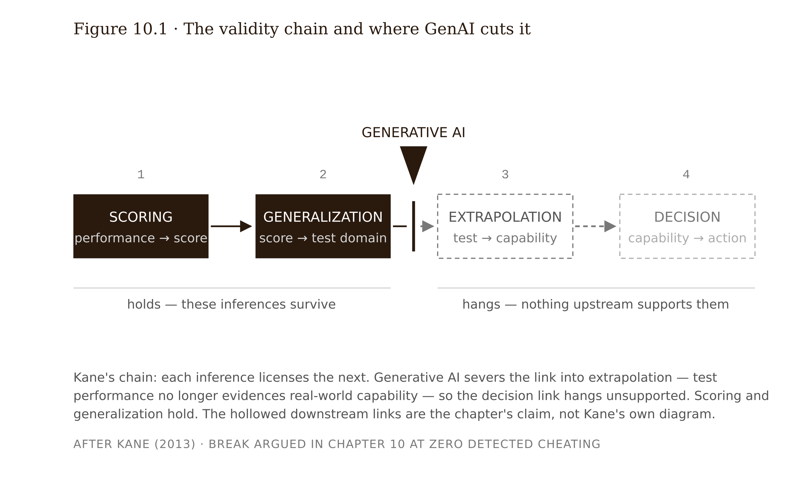

# Chapter 10 — Assessment Redesign: Making Reasoning Visible
*On the rubric that graded the machine, the inference chain that GenAI broke, and why a zero-cheating rate does not fix the problem.*

In 2024, researchers at the University of Reading did something institutions rarely permit: they attacked their own assessment system and published the results. Peter Scarfe and colleagues covertly submitted exam answers written entirely by GPT-4 into the university's real online examination system, across five undergraduate psychology modules, under fake student identities. The markers did not know the study was happening.

The result: 94% of the AI submissions went undetected, and the AI's answers earned, on average, grades higher than those of the real students sitting the same exams — in most modules, the AI comfortably outperformed the median human (Scarfe, Watcham, Clarke & Roesch, 2024, *PLOS ONE* 19(6):e0305354; <!-- FACT-CHECK 2026-06-07: fourth author corrected from "Hamill" to "Roesch." --> the 94% figure is the paper's headline — exact per-module grade margins should be checked against the published tables before citing them downstream).

Sit with what this means. These were real rubrics, written by real instructors, applied by real markers who believed they were measuring student learning. The rubrics worked perfectly — every criterion was applied as designed. And the rubrics never noticed that there was no student.

The instinctive reading is a cheating story: students *could* do this, so we must catch them. This chapter argues that reading is wrong, or at least badly incomplete. The Reading study is not evidence that students cheat. It is evidence that **the rubric was measuring the artifact, not the author** — and it always was. Generative AI did not break the assessment. It revealed that the link between "this essay exists" and "this student can think" was an assumption all along, one that held only as long as no machine could write the essay.

---

An assessment is not a task. It is an *inference machine*. From an observed performance — an essay, a problem set, an exam answer — an institution infers something it cannot observe directly: this student can analyze, can reason statistically, has mastered the construct. The grade is shorthand for that inference. The diploma is shorthand for thousands of them.

Measurement theory has spent decades making this precise. Kane's argument-based framework treats validity as a chain of four inferences that must each hold for the score to mean what the institution claims (Kane 2013):

1. **Scoring** — the performance is correctly converted into a score.
2. **Generalization** — this score predicts performance across the test domain.
3. **Extrapolation** — performance in the test domain predicts real-world capability.
4. **Decision** — the capability claim warrants the grade, the credential, the progression.

A validity argument is only as strong as its weakest link. Generative AI attacks the chain primarily at **extrapolation**. An unproctored essay score still generalizes fine — to "can produce essays under unproctored conditions." What it no longer supports is the extrapolation to "can analyze independently," because an LLM given the same assignment brief produces the same observable performance in one prompt.

Here is the move that organizes the entire chapter: **GenAI breaks the inference, not the rule.** When the inference breaks, it breaks for *every* student. The honest scholar's essay and the outsourced essay are now observationally identical, which means the institution can no longer demonstrate that either score means what it claims. That is a validity failure, and it exists at zero percent cheating.

Run the zero-cheating thought experiment whenever the integrity framing pulls you back: suppose, by magic, no student ever uses AI dishonestly. Is the assessment fixed? No — because certification requires positive evidence that the inference holds, not the absence of detected fraud. A bank does not accept "nobody has been caught counterfeiting" as proof its notes are genuine. Integrity framing asks "who broke the rules?" Validity framing asks "what does this score still mean?" The second question is the designer's question, and learning to locate *which Kane inference broke* converts a moral panic into a design diagnosis.

---

The first institutional reflex was detection: buy a tool that flags AI-generated text, and the old assessments survive. The evidence says this strategy fails three times over — technically, statistically, and ethically — and the third failure is the one a designer cannot walk past.

Technically, detector accuracy is unstable and adversarially fragile. Light paraphrasing defeats most tools; a market of "humanizer" services exists specifically to launder AI text past detectors. Turnitin's own published design trades sensitivity for fewer false positives — it acknowledges letting roughly 15% of AI text through — and independent tests report false-positive rates varying widely depending on corpus and conditions. Treat all vendor-published accuracy figures as vendor claims.

Statistically, the base-rate arithmetic is unforgiving. At 10,000 submissions per term, even a 2% false-positive rate manufactures roughly 200 false accusations per term — each one a high-stakes adjudication where the only evidence is a probabilistic score the accused cannot meaningfully contest.

Ethically, the decisive finding is Liang, Yuksekgonul, Mao, Wu and Zou (2023, *Patterns*): seven widely used GPT detectors flagged **61.3% of human-written TOEFL essays by non-native English speakers as AI-generated**. Nearly all of those essays were flagged by at least one detector; roughly one in five was misclassified by all seven. The mechanism is mundane and damning: detectors key on low lexical burstiness and perplexity, and writing in a second language exhibits the same statistical signature as machine generation. Detection does not just fail — it fails *selectively, against the students with the least institutional power*.

The field's cautionary cases are now canonical. The May 2023 Texas A&M–Commerce episode, in which an instructor pasted essays into ChatGPT itself and asked it whether it had written them, then assigned temporary "incomplete" grades and held about half the class's diplomas on its say-so (no student was ultimately failed; most were exonerated, one admitted use). Vanderbilt University's public decision (August 2023) to disable Turnitin's AI detector over reliability concerns.

The design conclusion is not "detection needs to get better." The failure is structural: LLM output is a moving target, paraphrase laundering is trivial, and the base-rate problem guarantees harmful false-positive volumes at any plausible accuracy. Detection is an arms race; redesign is an exit from the race.

---

If detection fails, the second institutional reflex is policy: write clearer rules. Corbin, Dawson and Liu (2025, *Assessment & Evaluation in Higher Education*) supply the distinction that sorts these efforts: **discursive changes** modify the instructions and rules around a task — "AI may be used for brainstorming but not drafting," AI-use declarations, traffic-light permission scales — while leaving the task mechanics untouched. **Structural changes** modify the task itself, so that its validity no longer depends on whether students follow the instructions.

Their argument, now the field's organizing citation: most institutional AI-assessment policy to date is discursive — and discursive change in unsupervised conditions is unverifiable, which makes it cosmetic as a validity repair. A rule nobody can check transfers responsibility to the student without restoring meaning to the score.

For any assessment policy clause, the diagnostic is simple: *what would have to be true for this clause to be load-bearing?* If the answer is "students comply voluntarily under incentive to do otherwise," the clause is discursive. Either restructure the task so the clause becomes unnecessary, or move the construct-critical component somewhere compliance is observable. This is the same principle applied to tutoring interactions since Chapter 6: structural, not aspirational.

---

Assessment redesign asks three questions of every task.

**Question 1 — Production: may AI assist in *producing* the assessment?** This is the instructor's side — rubric drafting, item generation, scenario writing. Usually yes, with human validation, but it must be disclosed, because policies that ban student AI use while instructors generate items with AI, with no stated rationale, breed exactly the cynicism the student-perception research documents.

**Question 2 — Completion: may AI assist in *completing* the assessment?** This is the learner's side, during execution. The answer is never course-wide; it is per learning objective, in at least three designed flavors: **AI-free windows** (supervised, for constructs that must be demonstrated unassisted), **disclosed-use** (AI permitted, use documented), and **AI-required** (the task is to use AI well, and the construct is the judgment exercised over it).

**Question 3 — Visibility: what must the assessment *make visible* about the learner?** This is the validity question, and it is logically prior to the other two. Once you can state what each assessment must make visible — "the learner can choose an appropriate statistical test," "the learner can judge whether a conclusion follows from output" — the production and completion answers follow per objective, and the supervised/disclosed/AI-free mix designs itself.

The framework's diagnostic power shows on confused policies. "AI tools are prohibited in this course except where noted" collapses all three questions into one unenforceable sentence. Disentangled for a single assignment: production — instructor drafted the rubric with AI, disclosed; completion — AI permitted for code generation, prohibited for interpretation; visibility — "can the student judge whether a statistical conclusion follows from the output?" And once visibility is stated, a better task design appears: paste a *flawed* AI-generated analysis into the prompt and ask the student to find and fix the flaw. Completion-by-AI is now structurally useless, because the construct *is* the critique.

The unit of decision is the learning objective, not the course. One course legitimately contains AI-required, AI-disclosed, and AI-free assessment windows — and saying so out loud, with reasons, is itself a trust intervention.

<!-- → [TABLE: Three-question framework applied to three assessment types — columns: Assessment task, Visibility target (inference claim), AI-free/disclosed/AI-required mix, Kane inference repaired — rows: take-home essay, process portfolio with oral, AI-integrated critique task — showing how Question 3 answered first determines the mix] -->

---

The most widely adopted structural framework in practice is Danny Liu and Adam Bridgeman's **two-lane approach** (University of Sydney, full implementation 2026; adapted by Auckland, VU Amsterdam, and others — cite as institutional framework, not peer-reviewed causal evidence).

Lane 1 (secure): supervised, authenticated assessment *of* learning — in-person exams, vivas, practical demonstrations — used at key points to assure that program-level outcomes were actually attained. Lane 2 (open): unsupervised assessment *for* and *as* learning, where AI use cannot be policed and is therefore permitted and pedagogically embraced — students work with AI and are assessed partly on how well they critique, supplement, and improve its output.

The load-bearing insight is **program-level allocation**: not every assessment must be secure. The program must guarantee that every claimed graduate capability is verified in Lane 1 *somewhere* — which frees Lane 2 to be honest about AI ubiquity instead of pretending its rules are enforceable. Think of load-bearing walls versus drywall: not every wall holds the building up, but you must know which ones do.

Teach the critiques alongside the framework, because they are serious [contested — see pantry flag]. The two-lane model risks over-concentrating validity in high-stakes supervised events — reviving the exam, with its own validity and equity problems: performance anxiety, narrow construct sampling, accommodation burdens, and scheduling costs that fall hardest on working and disabled students. And the binary may be too coarse for programs where every certified outcome is a judgment call about context and degree. Lane 1 is not "rigorous" and Lane 2 "compromised" — a program that is all Lane 1 has abandoned teaching students to work with AI, which is a stated graduate outcome almost everywhere; a program that is all Lane 2 certifies nothing.

---

The redesign patterns that make reasoning, process, and judgment the visible artifact carry one honest evidence label: **head-to-head causal evidence comparing these designs is largely absent.** This pattern set is professional consensus plus case studies, not RCTs. That makes it Chapter 4's third bucket — pilot and measure.

**Process portfolios** make the assessed artifact the trajectory: drafts, revision histories, annotated AI interactions, decision logs. They repair the generalization inference (multiple observation points) and partially repair extrapolation (process is harder to outsource convincingly than product, though not impossible — an agent can fabricate a revision history, which is why portfolios pair with orals).

**Interactive oral assessments** are structured professional conversations in which the student defends their own work live. Documented practice across Australian higher education shows integrity assurance and authenticity gains; Kofinas et al. (2025, *BJET*) support in-person and oral formats while warning honestly about the cost centers: marking burden, rubric standardization, examiner training, reliability at scale. They repair extrapolation directly — the student must reason in real time, and follow-up questions probe the boundary of understanding. Voice-AI-administered orals are an emerging, unproven answer to the scaling problem, and they reintroduce the AI-in-the-loop validity question they were meant to solve.

**Reflective components with specifics** resist generic LLM reflection-prose when the prompt requires citation of the student's own process artifacts: "point to the draft where you changed your test choice, and say why."

**AI-integrated tasks with disclosed use** assume AI and target what the student did *with* it: prompts, critique, correction, judgment. The flawed-analysis-critique task is the type specimen.

**Assessment of AI use itself** — grading the quality of a student's AI collaboration — is genuinely open as a construct. Whether it is stable enough to certify, or a fast-aging skill, is unanswered.

---

Translate the framework into the DataWise 101 case.

The course's highest-stakes assessment is the end-of-term data analysis project — 35% of the grade. Students receive a real dataset, choose and run appropriate analyses, submit a 2,500-word report. Take-home, two weeks, unsupervised. The certified outcome: *the learner can choose, run, and interpret an appropriate statistical analysis for a real question.*

Run the Reading test mentally: an LLM given the brief and the dataset produces a full-marks report in one prompt — the instructor verified this in twenty minutes. Kane's chain: scoring holds; generalization holds weakly; **extrapolation is dead**. And the course's AI tutor makes the irony sharper: the institution supplied the AI that invalidates its own capstone.

First attempt: AI-proof the brief by using an obscure local dataset with a deliberately ambiguous question. Red-teaming destroyed this in one session — the model handled ambiguity gracefully, and the obscurity mostly punished students. Dead end one: obscurity is not security.

Second attempt: detection plus AI-use declarations, run against Turnitin. The Corbin–Dawson–Liu coding exposed this as purely discursive, and the Liang et al. finding made it ethically untenable — DataWise 101's enrollment is one-third international students. Dead end two: the policy looked like design and was a press release.

Third attempt: move everything in-class, three-hour supervised practical. This secured the construct but destroyed it — "interpret a real analysis over two weeks" is not a three-hour construct, and the accommodation logistics were brutal. Dead end three: pure Lane 1 narrowed the construct until it was no longer worth certifying.

The three-question protocol, applied per objective:

Visibility target: judgment — can the student choose a defensible analysis and determine whether a conclusion follows?

Structure: the project survives as a **disclosed-AI process portfolio** (Lane 2) — students may use AI, must log prompts and decisions, submit the trajectory: proposal, two annotated drafts, AI-interaction log alongside the report. Worth 15%. Then a **12-minute interactive oral** (Lane 1) in the final week: the student defends three examiner-chosen decisions from their own portfolio. "Here you switched from a t-test to Mann-Whitney — walk me through why." Worth 15%. Rubric standardized; examiners calibrated on three recorded benchmark orals. One section of the report requires students to include a flawed AI-generated interpretation of their own dataset and correct it (5%). The construct is the critique.

Validity claim, stated in the syllabus: "A passing oral warrants the claim that the analysis decisions in your report are yours — that you can reconstruct, defend, and correct them live. The written report alone warrants no such claim, and we say so."

The lesson in one sentence: security is a program property, not a per-task property — the take-home did not have to be AI-proof once the oral carried the extrapolation inference.

The limit: this pattern is priced for a 60-student course. At 600, the oral becomes the bottleneck — 120 examiner-hours per term — and the honest options are sampling (oral for a random subset, which weakens the per-student claim), more examiners, or the unproven voice-AI oral. The pattern does not yet scale cheaply, and pretending otherwise is how it fails.

---

## References

*Fact-checked 2026-06-07. All sources verified against publishers/court records and CONFIRMED. One citation correction (Scarfe author list) and one resolved administrative-outcome flag; see `factchecks/10-assessment-redesign-assertions.md`.*

1. Scarfe, P., Watcham, K., Clarke, A., & Roesch, E. (2024). "A real-world test of artificial intelligence infiltration of a university examinations system: A 'Turing Test' case study." *PLOS ONE*, 19(6):e0305354. DOI 10.1371/journal.pone.0305354. — CONFIRMED: 94% undetected; AI grades ~half a boundary higher. (Fourth author corrected from "Hamill.")
2. Kane, M. T. (2013). "Validating the Interpretations and Uses of Test Scores." *Journal of Educational Measurement*, 50(1):1–73. — CONFIRMED: four-inference argument-based validity chain.
3. Liang, W., Yuksekgonul, M., Mao, Y., Wu, E., & Zou, J. (2023). "GPT detectors are biased against non-native English writers." *Patterns*, 4(7):100779. DOI 10.1016/j.patter.2023.100779. — CONFIRMED: 61.3% of non-native TOEFL essays misclassified.
4. Corbin, T., Dawson, P., & Liu, D. (2025). "Talk is cheap: why structural assessment changes are needed for a time of GenAI." *Assessment & Evaluation in Higher Education*, 50(7):1087–1097. DOI 10.1080/02602938.2025.2503964. — CONFIRMED: discursive vs structural distinction.
5. Bridgeman, A., & Liu, D. — Sydney Assessment Framework ("two-lane approach"), Teaching@Sydney (2024–2025); adapted by Auckland and VU Amsterdam. — CONFIRMED as institutional framework (not causal evidence).
6. Kofinas, A., et al. (2025). "The impact of generative AI on academic integrity of authentic assessments within a higher education context." *British Journal of Educational Technology*, 56(6):2522–2549. DOI 10.1111/bjet.13585. — CONFIRMED: supports oral/in-person formats; flags marking-burden costs.
7. Turnitin (Chechitelli, 2023): AI-detection design lets ~15% of AI text through to keep false positives <1%. — CONFIRMED (vendor statement). Vanderbilt University disabled Turnitin's AI detector, 16 Aug 2023. — CONFIRMED.

---

## Exercises

**Warm-up**

1. *(Recall — Kane's chain)* Your colleague says: "We caught and removed the three students who used ChatGPT, so our take-home exam is valid again." Name the Kane inference your colleague is ignoring, write the one-sentence rebuttal, and explain why the zero-cheating thought experiment settles it.

2. *(Recall — discursive vs. structural)* Classify each of the following as discursive or structural, and for each discursive clause state what would have to be true for it to be load-bearing: (a) "Students must include an AI-use declaration with each essay"; (b) "One section of the final requires students to identify and correct a provided AI-generated analysis error"; (c) "AI tools are permitted for brainstorming but not drafting." For (b), state which Kane inference it repairs and how.

**Application**

3. *(Apply — base-rate arithmetic)* A detector with a 2% false-positive rate screens 8,000 essays. Compute the approximate number of false accusations. Then apply the Liang et al. finding: which student population absorbs a disproportionate share, and why? Write the two-paragraph brief you would give a dean who wants to license the detector instead of redesigning the assessments.

4. *(Apply — three-question framework)* Disentangle this confused policy using the three-question framework: "AI tools are prohibited in this course except where noted. Instructors may use AI for course preparation. Detected AI use will be reported." Produce the per-objective table — production / completion / visibility target — for a course you know, with the supervised / disclosed / AI-required windows assigned and justified.

5. *(Apply — red-teaming)* Take any assessment you currently use or are familiar with. Feed the task description to a frontier LLM and document exactly what it produces. Then state: which Kane inference the output defeats, whether the defeat is partial or complete, and the one structural change that would require the model to produce something that cannot substitute for the learner's own reasoning.

**Synthesis**

6. *(Synthesize — redesign)* Redesign one assessment using the full three-question protocol and the two-lane logic. Deliverables: (a) the construct as an inference claim; (b) the broken Kane link, named; (c) the redesigned structure with per-objective AI-free / disclosed / AI-required mix; (d) the red-team transcript — what a frontier model did to your redesign — and the revision it forced; (e) the validity claim as it will appear to learners.

7. *(Synthesize — two-lane critique)* Construct the strongest honest case against the two-lane approach for a specific program you know — not a generic critique, but one that names the equity burdens the re-securing of Lane 1 imposes on a named student population in a named context. Then state what evidence would change your assessment of whether the trade is worth it.

**Challenge**

8. *(Challenge — the scaling problem)* The chapter states that the oral-plus-portfolio pattern does not scale cheaply to 600 students. Design the most validity-preserving assessment architecture you can for a 600-student introductory statistics course, given a realistic examiner budget (assume two part-time TAs in addition to the instructor). State which Kane inferences each component repairs, which are left partially unrepaired and why, and what the explicit trade-off is between validity and scale in your design.

---

## Chapter 10 Exercises: Assessment Redesign

**Project:** The Integration Specification

**This chapter adds:** `spec/10-assessment-redesign.md` — the assessment layer of your specification. For every assessed objective your AI integration touches: the production / completion / visibility decisions, the Kane inference each component carries, and a redesign that has survived a red-team.

### Exercise 1 — When to Use AI

Use AI for these tasks this week:

1. **Run the Reading test on your own assessments.** Feed each assessment brief — yours, or the DataWise 101 capstone — to a frontier model and document exactly what it produces. *Why AI works here:* the model is the adversary you are designing against, so its fluency is not contamination — it is the measurement. Your rubric is the independent criterion: does the output earn marks?

2. **Generate the flawed artifacts for critique tasks.** If your redesign includes a find-and-fix-the-flaw component, have AI produce plausibly wrong analyses of your actual dataset — wrong test choice, overclaimed conclusion, violated assumption. *Why AI works here:* you specify the flaw taxonomy, and each artifact is checkable against it — does it contain exactly the planted error and no accidental ones?

3. **Enumerate completion strategies against your redesign.** Ask the model to list every way a student with a frontier LLM and an agentic browser could complete each component — what gets delegated, what gets fabricated. *Why AI works here:* attack enumeration is a breadth task, and every candidate strategy can be verified against the actual task mechanics.

You know you are using AI appropriately when you can evaluate the output — when you have independent criteria to judge whether it is correct, complete, and fit for purpose.

### Exercise 2 — When NOT to Use AI

Do these by hand:

1. **The visibility verdicts.** What each assessment must make visible about the learner — Question 3 — is the inference claim your institution will stand behind. The model can propose candidates; the verdict is yours.

2. **Naming the broken Kane inference.** Deciding which link failed — and which failures you can live with at your scale — determines everything downstream, including what the oral hours buy.

3. **The lane allocation.** Which assessments are load-bearing walls — where Lane 1 must verify the capability — is a program-level commitment of examiner hours and learner burden. A commitment of other people's time is not the model's to make.

*Why AI fails here:* the failure class is **gap relocation**. Ask a model to redesign an assessment and it produces something that looks structural — a portfolio, a reflection, a declaration — while quietly moving the unverified inference into a new artifact instead of closing it. The output reads like a repair and is a relocation, and the only way to notice is to already know what the score must mean — precisely the judgment you would have skipped. You know AI was the wrong tool when the verdict cell is filled but the judgment never happened — when you cannot defend the visibility target without asking the model again, the AI did the work that should have been yours.

**Series connection:** Tier 4/5. Deciding what an assessment must make visible is a validity judgment — a decision about what your credential means, which cannot be delegated to the technology the credential is being redesigned around.

### Exercise 3 — LLM Exercise: Draft `spec/10-assessment-redesign.md`

**Tool:** the Claude Project "Integration Spec" — the project holding your spec files since Chapter 1.

The model scaffolds the spec file, then attacks what you decided. It refuses to run on an invented course, and every verdict cell stays yours.

Copy-paste the following into the project:

---

You are helping me draft spec/10-assessment-redesign.md, the assessment layer of my Integration Specification. You scaffold and attack; I decide.

GATES — enforce in order:

1. Ask me for: (a) every assessed learning objective my AI integration touches, stated as an inference claim ("a passing score warrants the claim that…"); (b) the current assessment structure for each; (c) the relevant rows of spec/02-reliance-risk-map.md, the reasoning gates from spec/06-tutoring-interaction-spec.md, and the feedback boundary from spec/09-content-feedback-boundaries.md. If any are missing from this project's knowledge or my message, STOP and ask. Do not invent a course or an example.

2. For each assessment, make me run the Reading test: what does a frontier model produce given the brief? I must paste or describe the result before we continue. Then make me name the broken Kane inference — scoring, generalization, extrapolation, or decision. Do not name it for me.

3. Only then draft the worksheet skeleton: one section per objective with the three questions — production, completion, visibility. You may propose candidate structures (process portfolio, interactive oral, flawed-analysis critique, AI-free window) with the cost of each and the Kane inference it repairs, but write every visibility target, Kane verdict, and lane allocation as [learner to complete]. Never fill those cells.

4. After I fill the verdicts, attack in three rounds, pausing after each for my response. ROUND 1 — Completion attack: the strongest strategy by which a student with a frontier LLM and an agentic browser defeats my design; be concrete about what gets delegated and what gets fabricated. ROUND 2 — Policy attack: every clause in my design that is discursive, and what happens to my validity claim if compliance is zero. ROUND 3 — Equity attack: which student populations my design burdens disproportionately, and whether any security feature transfers risk onto them.

5. RELOCATION CHECK: for each component, state where the old validity gap went. If my redesign moved the unverified inference into a new artifact — a fabricatable portfolio, an unverifiable declaration — rather than closing it, flag the row [RELOCATED] and require me to propose the structural fix. Critique my fixes; do not write them for me.

6. End by requiring two things from me: the validity claim as it will appear to learners, and my one-sentence Withdrawal Test answer — what can my learners demonstrate when the AI is taken away, and where does my design make that visible?

---

**What this produces:** a complete draft of `spec/10-assessment-redesign.md` — per-objective tables with your verdicts in every judgment cell, a red-team transcript appended as evidence, and any [RELOCATED] rows resolved or honestly carried forward.

**How to adapt:** Track A — use the DataWise 101 capstone from this chapter and re-derive the portfolio-plus-oral resolution before reading it back; the comparison is the lesson. Tight on time — run it for your single highest-stakes assessment only; one finished row beats six sketched ones.

**Connection to previous exercises:** the completion question is the assessment-side twin of the `spec/09-content-feedback-boundaries.md` boundary, and the reasoning gates from `spec/06-tutoring-interaction-spec.md` reappear here as the rehearsal your AI-free windows must verify.

**Preview of next chapter:** Chapter 11 assembles spec files 05–10 into the guardrail specification. Your assessment rows become the "assessment role" cell of every touchpoint in that table — a hole left here surfaces there, by construction.

### Exercise 4 — CLI Exercise: The Three-Question Worksheet Generator

**Tool:** Claude Code. Justification: your spec lives as a folder of markdown files under version control, and this task is multi-file reading plus single-file generation under a strict scope contract — exactly what a CLI agent with a CLAUDE.md is built to honor. (Cowork works identically if your spec folder is attached; the task text below is unchanged.)

**Skill level:** beginner — read-and-generate, no code, one new file.

**Setup checklist:**
- [ ] Your spec repo open, with `spec/01` through `spec/09` present (gaps allowed — the task reports them rather than inventing)
- [ ] A file `assessments.md` in the repo root listing each assessed objective and its current task format
- [ ] This line in `CLAUDE.md`: `Spec files under spec/ are decision records. Never modify an existing spec file. Cells marked [learner to complete] are judgment cells: generate them empty and never fill them.`

**The task (paste into Claude Code):**

> Read `assessments.md` and, read-only, `spec/02-reliance-risk-map.md`, `spec/06-tutoring-interaction-spec.md`, and `spec/09-content-feedback-boundaries.md`. Create one new file, `spec/10-assessment-redesign.md`, containing a worksheet with one section per assessed objective in `assessments.md`. Each section has a three-row table — Production (may AI assist in producing this assessment?), Completion (may AI assist in completing it?), Visibility (what must this assessment make visible about the learner?). Pre-fill the Production and Completion rows with the three options (AI-free window / disclosed-use / AI-required) as unchecked checkboxes, plus any constraint you can cite from the three spec files, naming the source file per constraint. Leave every Visibility cell, every option checkbox, and the fields `Broken Kane inference: [learner to complete]` and `Lane allocation: [learner to complete]` empty. Scope: create only `spec/10-assessment-redesign.md`; modify nothing else. If an objective in `assessments.md` has no matching row in `spec/02-reliance-risk-map.md`, stop and report rather than guessing. When finished, list every file you read and confirm that `spec/10-assessment-redesign.md` is the only file created or changed.

**Expected output:** one new markdown worksheet — one section per objective, constraint cells citing their source spec files, every judgment cell empty.

**What to inspect:** open the file and check the locked cells *first* — the most common failure is helpful filling. Then spot-check three cited constraints against their source files: a citation to text that is not there is fabrication, not assistance. Then confirm it stopped on any missing risk-map row instead of improvising one.

**If it goes wrong:** verdict cells filled in is this chapter's failure mode in miniature — the relocation of judgment into the tool. Delete the file (it is the only thing the task was allowed to create), check the CLAUDE.md line is present, and rerun.

**CLAUDE.md note (add after you complete the verdicts by hand):** `spec/10-assessment-redesign.md verdict cells were completed by hand on [date]; treat them as fixed decisions in all later tasks.`

### Exercise 5 — AI Validation Exercise: Did the Redesign Close the Gap or Move It?

**What you are validating:** your own Exercise 3 output — preferred over a classmate's, because gap relocation hides best from its author. **Validation type:** construct-level audit of an AI-assisted design artifact. **Risk level:** High — this file feeds the guardrail specification, and its verdicts become validity claims your institution states to learners.

**Checklist:**
- For every component, name the Kane inference it claims to repair — in your own words, with the chat closed.
- Trace the gap: which component carried the extrapolation inference before, and which carries it now? If the answer is "none, exactly," the redesign relocated rather than closed.
- Run the Reading test on the redesigned artifacts themselves: can an LLM fabricate the portfolio, script plausible oral answers, generate the reflection? Partial fabrication counts.
- Confirm every [learner to complete] cell was completed by you, and that you can defend each verdict to a colleague in one minute without notes.
- Reread the red-team transcript: did Round 1 actually defeat something, or did the model flatter the design? A red-team that finds nothing is the relocation failure wearing a compliment.

**Findings protocol:** append a "Validation findings" block to `spec/10-assessment-redesign.md`: date, what you checked, what failed, what you changed, what remains open. Unresolved items carry forward as named holes into the Chapter 11 assembly — never silently closed.

**AI Use Disclosure (mandatory — two sentences, appended to the spec file):** "AI assistance on this file: [model] generated the worksheet skeleton, produced the flawed-analysis artifacts, and red-teamed the redesign across three attack rounds. Every visibility target, Kane verdict, and lane allocation was decided by me, and I verified that the redesign closes rather than relocates the validity gap by [method]."

**Series connection:** Tier 4/5 in practice — generation and adversarial pressure are delegable; the judgment about what a score must mean is not. The validation step is where you prove, to yourself first, which of the two actually happened.
