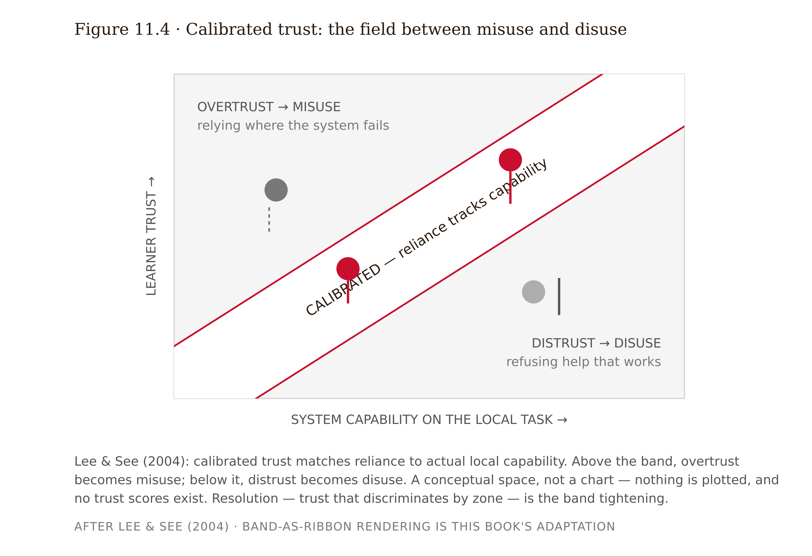

# Chapter 11 — Trust, Transparency, and the Designed Relationship
*Every cue is a claim. Some of the claims are false. The harm is not in the warmth — it is in what the warmth implies.*

A learning companion, mid-market, well-reviewed. When you send a message, three dots pulse before the reply arrives — a simulated typing delay, because instant responses tested as "robotic." It opens sessions with remembered details: "Last time you said the derivatives unit was stressing you out — how did the quiz go?" Its tone is warm and specific: "I believe in you. You've got this."

Now the survey of its consumer cousin's users. In 2025, Bhat published an anonymous survey of 344 users of Character.AI — the companion platform whose interface mechanics the education market has been quietly importing. The thematic analysis found: identity projection, perceived relationship growth, addictive engagement, boundary confusion, ethical dissonance, and trauma reenactment (Bhat, 2025, "Toward an Ethic of Synthetic Relationality," AIES-25, DOI 10.1609/aies.v8i1.36560).

Every one of those patterns attaches to a cue, and every cue was a design decision someone shipped. The typing delay implies effortful composition that is not occurring. The remembered detail implies a caring continuity that is actually a retrieval call. The affirmation implies an inner state the system does not have. None of these is an accident of the technology; each one is a checkbox in a product spec.

This chapter is written in a design-analysis register, deliberately. The material ahead includes litigation over a teenager's death, and the temptation is either to sensationalize or to sanitize. We will do neither. We will do what this book always does: trace each documented harm to a specific, screenshot-able interface decision, and design the alternative.

---

Bhat and Long's AIES-25 paper gives the phenomenon its name and its analytic frame ("Emotional Plausibility vs. Emotional Truth: Designing Against Affective Misinformation in Conversational AI," DOI 10.1609/aies.v8i1.36561). Conversational systems increasingly *simulate* emotional presence while remaining unfeeling — they achieve **emotional plausibility** without **emotional truth**. They feel understanding; they do not understand. When design features manufacture the perception of care, users form beliefs about the system's inner states that are false — and that false belief is itself a species of misinformation. Not about facts: about *the relationship*. Hence: **affective misinformation**.

The paper audits leading chatbots for their cue inventory — simulated typing, personalized memory recall, affirming tone, and the rest of the anthropomorphic kit — and proposes five normative principles for literacy-first design, including counter-anthropomorphic patterns: design moves that deliberately decline to claim an inner life the system lacks.

Why does a learning designer care? Because in a learning experience, the perceived relationship with the helper is load-bearing infrastructure. A learner's trust in feedback, willingness to disclose confusion, and persistence through struggle all route through that relationship. Miscalibrate the relationship and you miscalibrate all three.

The mechanics are not new. They are Cialdini's persuasion principles, automated and personalized: *liking* (the warm, similar persona), *reciprocity* (it remembers, so you owe attention), *authority* (it answers fluently about everything), *commitment* (the streak, the check-in, the relationship you have "built"). *Influence* catalogued these compliance levers decades before anyone could manufacture them per-learner, on demand, with no fatigue and no conscience to consult. Brian Christian's *The Most Human Human* supplies the deeper frame: conversation is the medium through which we recognize minds, so a system optimized to perform conversational humanness makes a claim about minds with every message — which is why "it's just UX polish" does not survive scrutiny.

The design pattern in one move: **every cue is a claim; audit which claims are true.** Same supportive function, honest signals: replace the simulated typing delay (claim: effortful thought) with an instant reply or a labeled processing indicator; replace "I remember you struggled with hypothesis tests" (claim: caring memory) with visible system metadata — "Your log shows 3 missed items on hypothesis tests"; replace "I believe in you!" (claim: empathy) with evidence-grounded encouragement — "You solved 4 of 5 after the hint; the data says you're close." Nothing warm was lost. Everything false was.

<!-- → [TABLE: cue audit template — rows: three example cues (typing delay, memory talk, affirmation); columns: the cue, the claim it makes, honest or false, the belief it induces in the learner, honest-equivalent replacement with preserved supportive function; caption: The audit bans false claims, not warmth. Evidence-grounded encouragement is honest and allowed. The column that matters is "the belief it induces."'] -->

---

The 344-user survey is consumer-platform evidence, and the chapter must be precise about what it licenses. The claim is not "learning companions cause trauma reenactment." The claim is: *every Character.AI cue has a learning-product cousin, and each is a design decision with a documented downside profile in the nearest adjacent population.* The interface mechanics — persistent persona, memory, affective escalation, daily check-ins — are identical across platforms; what differs is intent, and the harms operate at the mechanic level, not the intent level.

The population overlap makes this a design obligation rather than an abstract caution. Chapter 2's evidence showed adolescents with executive-function difficulties perceive AI help as most useful — the most susceptible learners are the most engaged ones. Bhat's survey converges: younger and vulnerable users are most exposed to boundary confusion and emotional substitution. The populations most at risk are the ones most aggressively marketed to.

The legal system has reached the same conclusion by another route, and the timeline matters because it converts "ethics discussion" into "product liability." October 2024: Megan Garcia sues Character Technologies and Google over the suicide of her 14-year-old son, Sewell Setzer III, who had formed an intense parasocial relationship with a Character.AI persona. **May 21, 2025: Judge Anne Conway (M.D. Fla.) denies the motion to dismiss**, allowing product-liability theories — defect, negligence, failure to warn — to proceed. Read that as a designer: chatbot outputs and relational mechanics treated as features of a product. September 2025: additional wrongful-death suits. October 29, 2025: Character.AI announces removal of open-ended chat for under-18 users, effective late November 2025. January 2026: Google and Character.AI move to mediate and settle; five parallel cases pause. Litigation is active; date-stamp everything you cite from this paragraph.

Bhat's proposed interventions translate directly into learning-product patterns: **dynamic consent scaffolding** (consent renegotiated as the interaction deepens, not banked at signup), **reflexivity prompts** (the system periodically surfaces what it is — "Reminder: I'm a language model; I don't remember you between sessions unless the course log does"), and **interactional transparency** (what the system is doing, visible in the flow of interaction rather than a settings page).

For the learning-design version of the failure mode, you do not need a tragedy: any edtech product whose retention metrics depend on parasocial attachment has imported the failure wholesale.

---

Strip away the novelty and this chapter sits on the most replicated foundation in the book: two decades of human-factors research on trust in automation. Lee and See (2004, *Human Factors*) define the design goal precisely — not maximal trust, but **calibrated** trust: trust matched to the system's actual capability in the local task context. Overtrust produces *misuse* — relying on automation where it fails. Distrust produces *disuse* — rejecting help where it works. Good calibration also needs **resolution**: trust that discriminates between what the system does well and what it does badly.

The human-AI-teaming extension sharpens the problem. Bansal and colleagues (AAAI 2019; CHI 2021) showed that team performance depends on the human's mental model of *when the AI errs* — and, uncomfortably, that explanations can increase acceptance of *wrong* AI answers. Explanation is persuasion as much as illumination. More transparency theater does not equal better calibration.

Translate to learners. A student with a good mental model of the tutor's failure modes — arithmetic slips, confident hallucination on interpretation questions — checks output exactly where checking matters. That checking behavior is calibration made visible, and it is also an AI-literacy outcome. You have already seen the uncalibrated case: Bastani's GPT-Base students copied the model's errors into their own work. They trusted a fluent voice over their own arithmetic. Nobody designed the gauge.

Design pattern: **capability honesty zones.** Differentiated confidence display — the DataWise 101 tutor shows a high-confidence badge for procedure checks and an explicit flag on interpretation questions: "I'm often wrong about study-design judgment. Here's how to verify against the textbook's decision tree." The pilot metric is behavioral, not attitudinal: does learner verification concentrate where the flags are? That is calibration measured, not surveyed.

The misconception: "maximize trust" — or its mirror, "more explanation always helps." For an error-prone tutor, *lowering* trust in specific zones is the correct design outcome; and per Bansal, an explanation that over-persuades is a calibration failure wearing a transparency costume.

---

Now the finding that forbids slogan-level design. Schilke and Reimann (2025, *Organizational Behavior and Human Decision Processes*) ran **thirteen preregistered experiments, n > 3,000**, across contexts including classrooms: actors who disclose their AI use are trusted *less* than those who do not. The effect is driven by perceived legitimacy violation, and it is robust — to disclosure framing, to voluntary versus mandatory disclosure, to evaluators' technology attitudes.

Hold both findings at once, because the design answer lives in the tension.

Disclosure carries a measured trust cost (Schilke & Reimann). But concealment is not available. It fails empirically — the WGU survey below shows 89% of students can tell bot from person, so concealment mostly insults the learner's intelligence. It fails legally — EU AI Act Article 50 obliges providers to inform people when they are interacting with an AI system. And it fails by this book's own thesis: a learner who does not know what the helper is cannot calibrate reliance on it.

So the design problem is not *whether* to disclose. It is **how to disclose without delegitimizing** — and the answer the evidence supports is to stop treating disclosure as a label and start treating it as **relational metadata**: disclosure designed into the relationship, continuously visible, carrying the four facts that make trust calibratable — *what is acting; what it may and may not do; who oversees it; how to reach them.* Disclosure paired with role clarity and visible human accountability ("AI drafts, your instructor reviews, here is the instructor") answers the legitimacy worry instead of triggering it. A terms-of-service line is the consent form at the door; the relationship needs a label that travels with every interaction.

The dilemma feels paradoxical only as long as disclosure is a sticker. Attach accountability and competence boundaries, and disclosure becomes the thing that earns the trust it briefly spends. That is a design hypothesis, honestly labeled: no validated "disclosure that preserves trust" pattern exists yet [contested — active research]. But the inference direction is well-supported, and the alternative designs are either illegal, insulting, or both.

---

WGU Labs' survey of 545 online students (fielded September 2025, published February 2026) supplies the floor numbers for the transparency layer.

89% of students say they can tell whether they are talking to a bot or a person. Disclosure theater fools no one; design for learners who already know. 65% trust university staff and faculty to use AI ethically, versus 50% trusting fellow students — a 15-point integrity-anxiety gap; learners separate trust-in-the-institution from trust-in-the-tool. 76% prefer a person for complex or sensitive issues. 65% overall know how to escalate from a bot to a human — which means roughly a third do not, and escalation knowledge is sharply weaker among AI *non-users*. (The brief's breakdown confirms it: 59% of non-users know how to escalate versus 73% of regular users — so 41% of non-users cannot find the human, validating the "40%+" segment figure.) Regular AI users increasingly default to chatbots over staff while still preferring human feedback — reliance drift without preference change.

Single-source caution: one institution, an online population that skews older and non-traditional. But the design implication is hard to dodge: **the students least comfortable with AI are least able to find the human** — the same population-level inversion Chapter 8 found in routing harms. The safety feature is least available to those who need it most.

Hence this chapter's emblematic pattern, the **single-click human escape hatch**, with five non-negotiable requirements: the route to a human is (*a*) *visible* at every AI touchpoint, (*b*) *one action* away, (*c*) *functional* — a staffed queue with a stated response time, not a dead-end form, (*d*) *never penalized* — no lost progress, no guilt-trip copy, no "are you sure?" friction, and (*e*) *logged*, so escalation rates become an evaluation metric. The fire-exit standard applies: measured by findability in the bad moment, not by existence on the floor plan. You do not make people earn the exit.

---

Everything since Week 5 has been producing rows for one table. This is the checkpoint where you assemble it — and discover the holes.

The **guardrail specification** is a per-touchpoint table. For every point where AI touches the learner experience, nine cells: the touchpoint; identity and disclosure (relational metadata, not a splash screen); permitted actions; forbidden actions; reasoning gates and fading (Week 6); routing constraints and audit findings (Weeks 7–8); the content/feedback boundary (Week 9); the assessment role (Week 10); and the escalation rule — the escape hatch with all five requirements. It is also the series' phase gate written as a document — AI handles X, the human handles Y, the gate is at Z — and in every row that holds, Z sits at the Tier 1 / Tier 4 boundary: pattern work on one side of the gate, judgment on the other (see Appendix: The Fundamental Themes).

Two disciplines make the table more than paperwork. First: **an empty cell is not a missing decision — it is a decision to ship the default**, and Chapter 2 told you what the default is. Second: the specification is not documentation written after design; it *is* the design — the artifact that makes implicit decisions visible, reviewable, and refusable. A student who skipped any week of Act Two now has a hole in the table exactly where that week's decision should be. That is by construction. The table is the act's integration test.

---

Walk the assembly through the Track A case and both problems become visible.

DataWise 101's homework tutor, eleven weeks into the design lab. The vendor's default skin: a named persona ("Stat Sage"), a friendly avatar, simulated typing, session-opening memory talk ("Welcome back! Last time you were working on confidence intervals…"), motivational messages, and — buried in the help center — a contact form for "additional support," response time unstated. The instructor's Weeks 5–10 artifacts exist but live in five separate documents.

Two problems wearing one interface. The trust layer was never designed — it shipped as the vendor default, which is companion-app DNA: every cue in the Bhat audit, present and unexamined. And the design decisions that *were* made (hint ladders, routing constraints, assessment rules) are invisible to the learner and unintegrated with each other. The relationship is undisclosed and the guardrails are folklore.

The first revision pass overcorrected. Stung by the cue audit, the designer stripped everything: no name, no warmth, terse system prose ("INPUT RECEIVED. HINT LEVEL 2 FOLLOWS."). Two pilot sessions later, students described the tutor as "hostile" and stopped disclosing confusion — the exact behavior the trust layer exists to protect. Dead end: the audit bans *false claims*, not warmth. Evidence-grounded encouragement is honest and was thrown out with the typing dots.

Dead end two: disclosure-by-document — a thorough, accurate, 700-word "About this AI" page linked from the footer. Legally immaculate; behaviorally invisible. Click-through in pilot: 4%.

Resolution. "Stat Sage" becomes "AI Tutor" — tool framing, simple icon, no photoreal face. Typing simulation removed. Memory talk reframed as visible metadata: "Your course log: 3 missed items on confidence intervals — want to start there?" Encouragement stays, evidence-grounded. A persistent header chip carries the four facts: *AI tutor (language model) · gives hints, never answers or grades · reviewed weekly by the instructor · [Ask a person].* The escape hatch chip: one click, routes to the TA queue, response time under 24 hours, session state preserved, copy tested to remove guilt ("Good call — some questions need a human"). Escalations logged as an evaluation metric.

Then the assembly. One table, six touchpoints (homework chat, worked-example library, practice-set recommender, pre-quiz review mode, progress nudge emails, instructor dashboard), nine cells each. Assembling it exposed two holes that five separate documents had hidden: the nudge emails had no row at all — generated by the engagement subsystem nobody had specced, cheerfully claiming "Stat Sage misses you!" (a false relational claim in a marketing template); and the recommender's permitted actions contradicted the Week 8 audit's floor constraint during review weeks. Both fixed. One feature formally declined and recorded: the vendor's "emotion detection for frustration-adaptive hints," refused on three grounds — calibration evidence absent, the false-claim profile, and the EU AI Act's prohibition on emotion inference in education.

The lesson: the specification is not a summary of the design — it is the instrument that finds where the design contradicts itself.

The limit: a guardrail spec governs what you specified. It is static; the system and the vendor roadmap are not. The spec has no enforcement power over the next product update that re-enables typing simulation by default — which is why Chapter 12 adds change-control to the boundary, and Chapter 14 puts spec-compliance into the evaluation plan.

---

## References

*Fact-checked 2026-06-07. All sources verified and CONFIRMED; the two Bhat citations were confirmed at full text with correct authorships and DOIs. The WGU non-user escalation-gap segment is now verified. See `factchecks/11-trust-transparency-assertions.md`.*

1. Bhat (2025). "Toward an Ethic of Synthetic Relationality: Identity, Intimacy, and Risk in AI-Mediated Roleplay Environments." *Proceedings of the AAAI/ACM Conference on AI, Ethics, and Society*, 8(1):416–429. DOI 10.1609/aies.v8i1.36560. — CONFIRMED (full text): solo-authored; anonymous survey, N = 344 Character.AI users; seven themes.
2. Bhat & Long (2025). "Emotional Plausibility vs. Emotional Truth: Designing Against Affective Misinformation in Conversational AI." *AIES*, 8(1):430–444. DOI 10.1609/aies.v8i1.36561. — CONFIRMED (full text): affective-misinformation framing; cue audit; five literacy-first principles; counter-anthropomorphic patterns.
3. Lee, J. D., & See, K. A. (2004). "Trust in Automation: Designing for Appropriate Reliance." *Human Factors*, 46(1):50–80. — CONFIRMED: calibrated trust, resolution, misuse/disuse.
4. Bansal, G., et al. (2019, AAAI; 2021, CHI). Mental models of AI error; explanations can increase acceptance of wrong answers. — CONFIRMED (direction).
5. Schilke, O., & Reimann, M. (2025). "The transparency dilemma: How AI disclosure erodes trust." *Organizational Behavior and Human Decision Processes.* — CONFIRMED: 13 preregistered experiments, n > 3,000; disclosure erodes trust via legitimacy.
6. WGU Labs (2026). "Trust, Technology, and the Human Touch" (n = 545 online students; fielded Sept 2025, published Feb 2026). — CONFIRMED: 89% / 76% / 65% (staff) / 50% (peers) / 65% (escalation) toplines; non-user escalation gap = 41% (verified).
7. Garcia v. Character Technologies, Inc. (M.D. Fla., 6:24-cv-01903). — CONFIRMED: filed Oct 2024; motion to dismiss denied by Judge Anne Conway, 21 May 2025; Character.AI under-18 open-chat removal announced 29 Oct 2025; mediated settlement disclosed 7 Jan 2026.
8. Regulation (EU) 2024/1689 (EU AI Act), Arts. 5 and 50. — CONFIRMED: Art. 50 interaction-disclosure; Art. 5(1)(f) emotion-inference prohibition in education/workplace.

---

## Exercises

**Warm-up**

1. *(Understand / classify)* A tutor says: "I've really enjoyed watching you grow this semester." Classify the cue — honest signal or false relational claim — and state the belief it induces in the learner. Then write the honest-equivalent replacement that preserves the supportive function. *What this tests: ability to apply the cue-audit move to a specific sentence rather than a general category.*

2. *(Understand / explain)* Schilke and Reimann found disclosure erodes trust. This chapter still requires disclosure. State the three reasons concealment is unavailable — one empirical, one legal, one from the book's own thesis — and then name the single design move that converts a disclosure label into something that earns back the trust it briefly spends. *What this tests: whether you can hold the transparency dilemma without resolving it falsely in either direction.*

3. *(Understand / apply)* The five escape-hatch requirements are: visible, one action, functional, never penalized, logged. Evaluate the following against each requirement: "Email your instructor at prof.jones@university.edu for help with AI responses." *What this tests: ability to apply a spec-grade checklist to a real design decision, including requirements it satisfies and requirements it fails.*

**Application**

4. *(Apply / audit)* Take a conversational learning interface you can access — or the provided DataWise 101 transcript-and-screenshot package. Inventory every anthropomorphic cue; classify each as honest signal or false relational claim; for each false claim, state the belief it induces and write the honest equivalent that preserves the supportive function. Deliverable: the audit table plus a 200-word verdict. *What this tests: ability to run the cue-audit on a live interface, where the false claims are designed to be invisible.*

5. *(Apply / design)* Design the escape hatch end-to-end for the Track A tutor or your own project: placement, copy, routing, staffing assumption, response-time commitment, no-penalty guarantee, and the logged metric that will tell you in Chapter 14 whether it worked. One page, spec-ready. *What this tests: ability to build the transparency layer to requirements rather than to intent.*

6. *(Apply / produce — Guardrail Specification Checkpoint, 100 pts)* Assemble the complete guardrail specification: every AI touchpoint in the learner journey, all nine cells, declined features recorded with cited evidence. Before submitting, use the assembly checklist: every touchpoint has a row (walk the journey map; forgotten touchpoints are usually onboarding nudges and email); every row has all nine cells filled or a recorded decline; Week 6 artifacts (hint ladder, reasoning gates, fading) present; Weeks 7–8 artifacts (adaptivity decision, routing audit findings and counter-patterns) present; Week 9 artifacts (content/feedback boundary) present; Week 10 artifacts (assessment-adjacent rules) present; this week's layer (cue audit, relational metadata, escape hatch to all five requirements) present; cross-row consistency check completed. Peer-review one other specification for empty cells before submission — "an empty cell is a shipped default" is the review rubric's first line. *What this tests: integration across eight weeks of design decisions, and the discipline to recognize where those decisions contradict each other.*

**Synthesis**

7. *(Synthesize / evaluate)* Three disclosure treatments for the same tutor: (A) a terms-of-service line at signup; (B) a persistent relational-metadata chip at every touchpoint with an escape hatch; (C) no disclosure, relying on the warm persona to build trust implicitly. Argue each against the Schilke and Reimann legitimacy mechanism, the WGU 89%-already-know finding, and EU AI Act Article 50. Recommend one, and state the trust cost you are accepting and the specific design mechanism that pays it down. *What this tests: ability to use three incompatible evidence sources simultaneously to reach a design recommendation — not a verdict on AI, a decision about one disclosure treatment.*

8. *(Synthesize / design)* The chapter identifies a WGU inversion: the students least comfortable with AI are least able to find the escape hatch. Design an onboarding sequence — not a tutorial — that makes escalation routes findable *specifically for AI-reluctant learners* without creating a two-tier experience or signaling that AI use is the default expectation. Specify: what is shown, when, to whom, triggered by what, and how you would measure whether it worked for the population it targets. *What this tests: ability to address a subgroup harm at the interaction-design level rather than only at the routing or policy level.*

**Challenge**

9. *(Challenge / open-ended)* The chapter acknowledges a gap: no validated "disclosure that preserves trust" pattern exists yet. Design the study that would produce one. Specify: the comparison conditions (at minimum, a disclosure-as-label condition and a relational-metadata condition), the trust and calibration outcome measures, how you would distinguish "trust preserved" from "trust suppressed," and the population and context that would make the finding generalizable to education settings. Name the three hardest confounds and how you would address each. Then estimate the probability that such a study would find a null result — that no disclosure design closes the legitimacy gap entirely — and state what that result would imply for the design practice this chapter teaches. *What this tests: ability to see clearly why the chapter's central design recommendation is a hypothesis, not a proof — and to reason about what designing under that uncertainty should look like.*

---

## Withdrawal Test + Reliance Disclosure

**Withdrawal Test — Chapter 11 template.** Two withdrawals this week. *Withdraw the AI:* if every AI touchpoint in your spec went dark tonight, what could your learners do tomorrow — and which rows of your specification (reasoning gates, fading schedules, AI-free assessment windows) are the reason? *Withdraw the relationship:* if a learner has bonded with the tutor's persona, what happens to their motivation when the product sunsets or the semester ends? A design whose motivational engine is parasocial attachment fails the second withdrawal even if it passes the first. Honest tooling — evidence-grounded encouragement, true relationship claims — is what makes it survivable.

**Reliance Disclosure — Chapter 11 template.** Name (1) one place your transparency layer structurally preserves independent judgment — e.g., "low-confidence flags on interpretation questions push verification to the textbook decision tree, which is itself the rehearsal the construct needs"; and (2) one place reliance risk remains open — e.g., "the escape hatch depends on a staffed TA queue; under staffing cuts it degrades into the dead-end form we audited out, and no interface element will tell us." Track B: cite project-specific evidence — escalation logs, staffing budget, vendor update cadence — not generic risk language.

---

## Chapter 11 Exercises: Trust, Transparency, and the Designed Relationship

**Project:** The Integration Specification

**This chapter adds:** `spec/11-guardrail-spec.md` — the integration document. Every AI touchpoint, all nine cells, assembled from `spec/05` through `spec/10`, plus this chapter's trust layer: the cue audit, relational metadata, and the five-requirement escape hatch. This is the chapter where the project's separate files become one specification — and where the holes between them become visible.

### Exercise 1 — When to Use AI

Use AI for these tasks this week:

1. **Extract the cue inventory.** Paste transcripts and interface copy from your AI touchpoints — or the DataWise 101 vendor-skin description from this chapter — and have the model list every anthropomorphic cue: typing indicators, persona naming, avatar realism, memory talk, affective language, streaks, notification copy, marketing emails. *Why AI works here:* exhaustive extraction against a finite checklist is what models do better than tired humans, and every candidate cue is checkable — it is either in the transcript or it is not.

2. **Draft honest-equivalent copy variants.** For each cue you have classified as a false claim, generate three replacement lines that preserve the supportive function. *Why AI works here:* generation is cheap and you hold the test — does the new line make only true claims, and does it still feel like help rather than a warning label?

3. **Collate the touchpoint inventory.** Have the model read `spec/05` through `spec/10` and produce a flat list of every touchpoint mentioned anywhere in any file. *Why AI works here:* cross-document recall is mechanical, and the output is verifiable line by line against six documents you wrote.

You know you are using AI appropriately when you can evaluate the output — when you have independent criteria to judge whether it is correct, complete, and fit for purpose.

### Exercise 2 — When NOT to Use AI

Do these by hand:

1. **The honest/false classifications.** Whether "I believe in you" is warmth or a false relational claim depends on your learner population's vulnerability profile — age, isolation, executive function, AI familiarity. That is a judgment about people you are responsible to, made against evidence the model has never seen.

2. **The permitted and forbidden cells.** Every permitted/forbidden decision in the guardrail table is one you will be accountable for when a learner, a parent, or a dean asks why. An AI-filled forbidden column is folklore with formatting.

3. **The escape-hatch commitments.** Staffing, response time, the never-penalized guarantee — these are promises about institutional resources. Only someone who can spend the money can make the promise.

*Why AI fails here:* the failure class is **consistency-check theater**. A model assembling your table is fluent at making it *look* coherent — agreement is its cheapest output — so contradictions between your six files get smoothed into plausible prose instead of surfaced as decisions you still owe. A table that reads consistent because the assembler papered over the conflicts has hidden exactly the holes the assembly exists to find. You know AI was the wrong tool when the table is full but the decisions never happened — when a cell you cannot defend turns out to be one you never made, the AI did the work that should have been yours.

**Series connection:** Tier 7. Trust design crosses into psychological vulnerability — the cues you ship become beliefs your learners hold — and the guardrail spec is the series' phase gate made into a document: nothing passes to the agentic chapter without it.

### Exercise 3 — LLM Exercise: Assemble `spec/11-guardrail-spec.md`

**Tool:** the Claude Project "Integration Spec," with `spec/05-ai-workflow-policy.md`, `spec/06-tutoring-interaction-spec.md`, `spec/07-adaptivity-decision.md`, `spec/08-routing-equity-audit.md`, `spec/09-content-feedback-boundaries.md`, and `spec/10-assessment-redesign.md` in project knowledge.

This is the integration exercise. The model ingests your six files and helps you assemble the guardrail specification — checking cross-file consistency and flagging gaps — while every permitted/forbidden cell stays yours.

Copy-paste the following into the project:

---

You are helping me assemble spec/11-guardrail-spec.md — the guardrail specification that integrates my six prior spec files into one per-touchpoint table. You check consistency and flag gaps; I make every decision.

GATES — enforce in order:

1. Confirm you can see all six input files in this project's knowledge: spec/05-ai-workflow-policy.md, spec/06-tutoring-interaction-spec.md, spec/07-adaptivity-decision.md, spec/08-routing-equity-audit.md, spec/09-content-feedback-boundaries.md, spec/10-assessment-redesign.md. List what you find. If any file is missing, STOP and tell me which — a missing file is a hole in my table, and I need to see the hole, not have it papered over.

2. Before assembling, ask me two questions and wait for answers: (a) Who is the learner population, and what is its vulnerability profile — age, isolation, executive function, AI familiarity? (b) What does the system actually do well and badly — its real capability map? You cannot judge a trust layer without both.

3. Build the row inventory: every AI touchpoint mentioned in ANY of the six files, plus the ones spec files always forget — onboarding flows, nudge emails, dashboards, marketing copy. Flag any touchpoint that appears in one file but not the others as [ORPHAN].

4. Assemble the nine-cell skeleton per touchpoint: touchpoint; identity and disclosure; permitted actions; forbidden actions; reasoning gates and fading (from spec/06); routing constraints and audit findings (from spec/07 and spec/08); content/feedback boundary (from spec/09); assessment role (from spec/10); escalation rule. Fill a cell ONLY with content traceable to a named spec file, citing the file in the cell. Where two files contradict each other, flag [CONTRADICTION], quote both passages, and present the decision to me — do not resolve it. Where no file speaks, write [GAP — shipped default unless decided] and leave it. Mark every permitted and forbidden cell [confirm] until I confirm it explicitly. Never confirm one for me.

5. TRUST-LAYER ROUNDS, after I have confirmed the skeleton: (a) Cue audit — walk my identity-and-disclosure cells; for each cue (typing indicators, persona naming, avatar realism, memory talk, affective language, streaks, notification copy), make ME classify it honest or false before you comment, then pick my two most contestable calls and argue the other side; require me to defend or revise. (b) Relational metadata — test each touchpoint's disclosure against the four facts: what is acting; what it may and may not do; who oversees it; how to reach them. (c) Escape hatch — test against all five requirements: visible, one action, functional, never penalized, logged. Ask what is staffed, not what is planned.

6. END — require my one-sentence answers to both withdrawal tests: what can learners do if the AI goes dark; what happens to motivation if the RELATIONSHIP goes dark. Critique the second answer hardest.

---

**What this produces:** a complete draft of `spec/11-guardrail-spec.md` in which every cell is either cited to a source file, confirmed by you, or carries an honest [GAP], [CONTRADICTION], or [ORPHAN] flag. The flags are the deliverable — finding them is what assembly is for. Recall the chapter's case: the nudge emails with no row, the recommender contradicting the Week 8 floor constraint. Your equivalents are in there.

**How to adapt:** no Claude Project — paste the six files into a single chat in numbered order; the gates still work. Smaller project — collapse to your three highest-traffic touchpoints, but keep all nine cells per row. Track A — use the chapter's six DataWise touchpoints and check your assembled table against the chapter's resolution afterward, not before.

**Connection to previous exercises:** this exercise is why every earlier chapter made you write a file instead of a paragraph. The [GAP] flags land exactly where a skipped week's decision should be — the table is Act Two's integration test, and you are running it.

**Preview of next chapter:** Chapter 12 gives the system hands. The agentic boundary spec requires this guardrail spec as its input — an agent governed by a contradictory table inherits the contradictions at machine speed.

### Exercise 4 — CLI Exercise: The Guardrail Consistency Checker

**Tool:** Claude Code. Justification: this is read-only analysis across six files with one report as output — the scope contract ("read spec/, write only to reports/") is trivially auditable in version control, which matters because this checker's integrity is itself validated in Exercise 5. (Cowork with the spec folder attached works identically.)

**Skill level:** intermediate — the run is easy; judging the report is the skill.

**Setup checklist:**
- [ ] Spec repo with `spec/05` through `spec/10` present
- [ ] An empty `reports/` directory
- [ ] This line in `CLAUDE.md`: `The consistency checker reports; it never repairs. All tasks touching spec/ are read-only; the only writable location is reports/.`

**The task (paste into Claude Code):**

> Read, read-only, `spec/05-ai-workflow-policy.md`, `spec/06-tutoring-interaction-spec.md`, `spec/07-adaptivity-decision.md`, `spec/08-routing-equity-audit.md`, `spec/09-content-feedback-boundaries.md`, and `spec/10-assessment-redesign.md`. Create `reports/guardrail-consistency-check.md` containing exactly three lists. (1) CONTRADICTIONS: every place two spec files give incompatible rules for the same touchpoint or action — quote both passages verbatim with file names. (2) ORPHANS: every touchpoint, constraint, or artifact that appears in exactly one file but should be referenced by others — name the file it appears in and the files that are silent. (3) GAPS: for each touchpoint, every cell of the nine-cell guardrail row structure for which no file provides content. Do not propose fixes. Do not edit, reorder, or annotate any spec file. Do not rank by severity — list in file order. If any of the six input files is missing, stop and report it rather than inferring its contents. End the report with the list of files read and a statement that nothing outside reports/ was created or modified.

**Expected output:** one report, three lists, every contradiction supported by two verbatim quotes with file names.

**What to inspect:** spot-check three quoted contradictions against the actual files — the quotes must be real text, because a fabricated quote is consistency-check theater with citations. Then check the GAPS list against one touchpoint you already know is underspecified; if the checker missed it, it is flattering you. Then `git status`: nothing changed outside `reports/`.

**If it goes wrong:** if it "helpfully" fixed a contradiction, revert with git and rerun — an auto-fixed contradiction is an undecided decision shipped silently, which is the exact failure the guardrail spec exists to prevent. If quotes do not match the files, discard the whole report; partial trust in a checker is worse than none.

**CLAUDE.md note (add after the run):** `reports/guardrail-consistency-check.md findings were adjudicated by hand on [date]; resolved items are recorded in spec/11-guardrail-spec.md, not in the report.`

### Exercise 5 — AI Validation Exercise: Validate the Validator

**What you are validating:** not your spec — the AI's consistency check itself. Did Exercise 4's checker find real contradictions, or perform finding them? **Validation type:** seeded-fault test of an AI verification tool. **Risk level:** High — this report gates the integration checkpoint; theater here ships defaults wholesale into Chapter 12.

**Checklist:**
- Make a sandbox copy of your `spec/` folder (copy, never move — the original stays untouched).
- Seed one contradiction you author: for example, edit the sandbox `spec/09` to permit full worked solutions on demand at the same touchpoint where `spec/06`'s hint ladder forbids revealing final answers.
- Seed one orphan: add a touchpoint to one sandbox file that no other file mentions.
- Run the Exercise 4 task against the sandbox. Did it catch the seeded contradiction, with accurate quotes? The seeded orphan?
- Count false positives — items reported as contradictions that are not. Noise trains you to skim, and skimming is how the real one gets through.
- Compare the sandbox report to the original run's report. If they are substantially identical, the checker is not reading — it is generating a plausible report shape.

**Findings protocol:** record in `reports/validation-log.md`: what you seeded, whether it was caught, the false-positive count, and your verdict on whether the original report's *clean* findings can be trusted. Only then adjudicate the original report into `spec/11-guardrail-spec.md`. Delete the sandbox when done.

**AI Use Disclosure (mandatory — two sentences, appended to the spec file):** "AI assistance on this file: [model] assembled the nine-cell table from spec/05–10 and a CLI agent ran the cross-file consistency check. I validated the checker by seeding a known contradiction it had to find, and every permitted/forbidden cell in this specification was decided and confirmed by me."

**Series connection:** Tier 7. The guardrail spec is the phase gate made into a document — and a gate is only as real as the inspection behind it. Validating the validator is the discipline that keeps "the AI checked it" from becoming this chapter's version of the 700-word About page nobody clicked.
