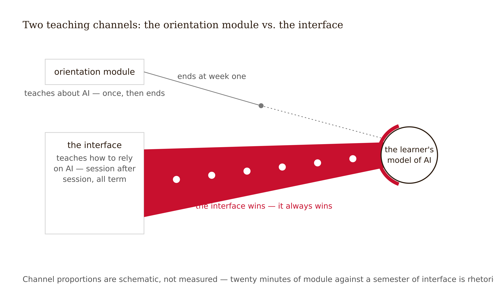
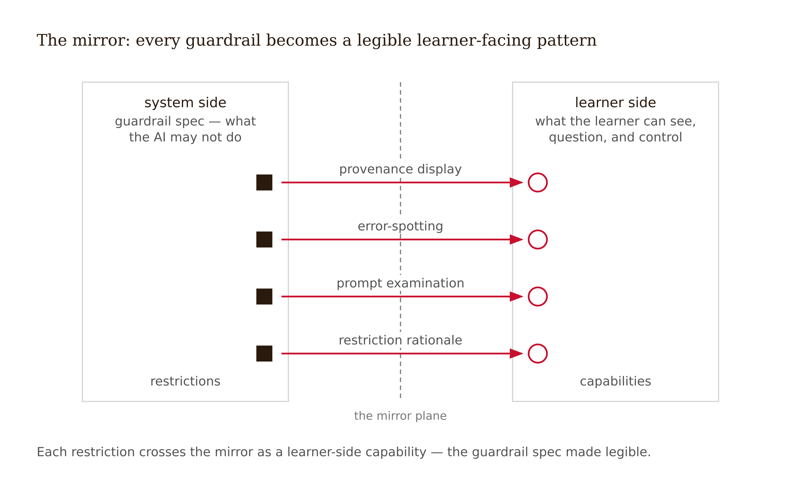
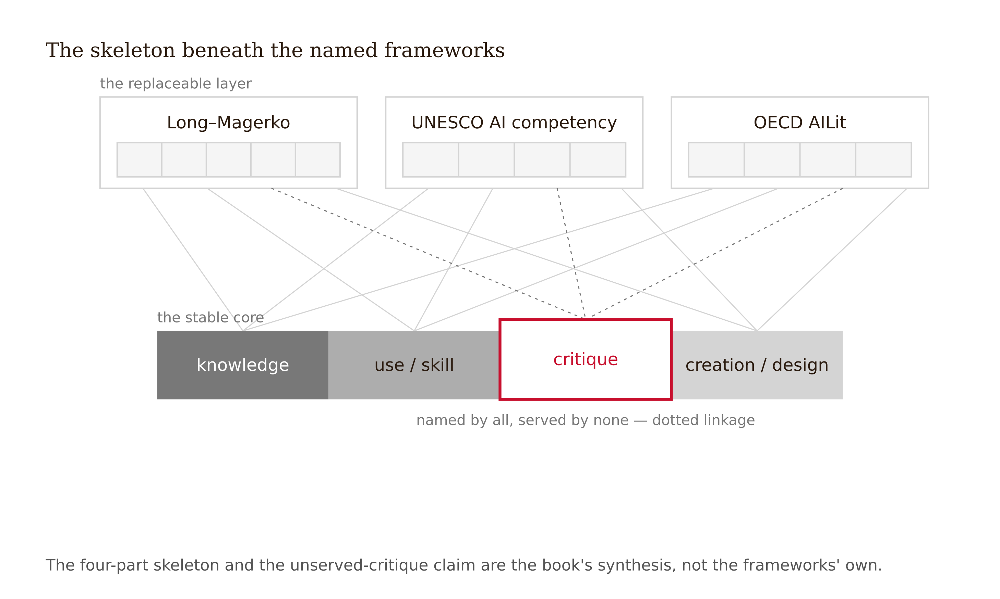

# Chapter 13 — AI Literacy and Developmental Calibration: Designing the Learner's Side
*On the hidden curriculum every interface teaches, the difference between a progression logic and a made-up number, and why "appropriate reliance" is not the same thing as "correct reliance."*

A Grade 5 classroom in Hong Kong. No lecture titled "What Is Artificial Intelligence." No vocabulary quiz on *algorithm* and *training data*. Instead, a design brief: identify a real problem in your community and build an AI-powered solution to it, through a structured design cycle. Along the way, unavoidably, the students had to figure out what the AI could do, what it couldn't, when it was wrong, and whether their users would trust it. They were not studying AI. They were *responsible for* an AI, at age ten — and responsibility turned out to be a curriculum.

The SAILD study measured AI literacy across four dimensions: knowledge, skills, ethics, and attitudes. Pre/post gains were statistically significant for knowledge, ethics, and attitudes. The skills dimension was evidenced qualitatively — through documentation of students' problem-solving processes — not by a significant quantitative gain (Yue, Jong & Dai, "Students as AI literate designers," *Journal of Research on Technology in Education*, 2025, DOI 10.1080/15391523.2025.2449942). Hold both halves of that result. The first half is the chapter's thesis demonstrated: AI literacy emerged from designed activity, not from instruction about AI. The second half is the book's discipline applied to its own favorite finding: one study, one grade level, one cultural context, pre/post with no control group. An existence proof, not an RCT — and an existence proof is all this chapter needs, because the claim it supports is not "this method works everywhere." The claim is: **the interface and the activity are always teaching the learner something about AI. The only question is whether anyone designed the lesson.**

---

Here is the reframe that makes the learner-side layer a design task rather than a curriculum-writing task: **AI literacy is not a subject your product can choose to add. It is a property your product already has.**

Every AI touchpoint teaches. A tutoring interface that delivers confident answers with no provenance teaches that AI output is final. A hint ladder that never explains why it asked what it asked teaches that the system's reasoning is none of the learner's business. A chatbot whose limits are never visible teaches that it has none. These are lessons in AI literacy — bad ones — delivered with perfect attendance, because the learner spends orders of magnitude more time inside the interface than inside any orientation module. The design question is never "should we teach AI literacy?" It is "what is our interface already teaching, and is that what we want taught?"



The practical consequence: the learner-side layer is the mirror image of the guardrail specification. The system side — the previous seven weeks of this course — says what the AI may do. The learner side says what the learner is enabled to understand, question, and control. Four recurring interaction patterns carry that layer:

**Provenance display** — which parts of this content came from a model, and what human review touched it on the way, visible at point of contact.

**Error-spotting interactions** — the AI's output is occasionally wrong, by selection or by design, and the learner is rewarded for catching it.

**Prompt examination** — the learner can see, and sometimes edit, what was actually asked of the model on their behalf.

**Restriction rationale** — "what I can't do for you, and why," written at learner level, linking each restriction to its reason.



The counter-case is so common it deserves a name: the **orientation-module fallacy**. A university deploys an AI writing assistant behind a mandatory twenty-minute "Responsible AI Use" module — definitions, policy, a quiz. Six weeks later, usage logs show the behavior Wang et al. (2024) documented among STEM students: heavy GenAI use, with over half reporting they simply ask the chatbot to solve the problem and roughly 38% pasting the assigned problem in wholesale ("Scaffold or Crutch?", arXiv:2412.02653; small interview sample, n=40 — directional). The module taught *about* AI for twenty minutes; the interface taught *how to rely on* AI for forty hours. The interface won. It always wins. Post-hoc fixes — sterner policy, a second module — fail for the same reason aspirational guardrails failed in Chapter 2: they are structural problems dressed as content problems. The fix is to move literacy into the interaction loop, where the hours are.

---

The definitional literature is genuinely unsettled. A scoping review finds AI literacy a fast-growing research topic that is nearly absent from teacher education, with definitions that sprawl across cognitive, emotional, and behavioral constructs (Sperling et al. 2024, *Computers and Education Open*). The field does not agree on what AI literacy *is*. It increasingly agrees on what it is *made of*.

Long and Magerko (2020) — the most-cited definition — frame it as competencies enabling individuals to critically evaluate AI, communicate and collaborate with it, and use it as a tool. Seventeen competencies under five questions: What is AI? What can it do? How does it work? How should it be used? How do people perceive it? Crucially, it is an HCI paper — it ships design considerations for embedding the competencies into learner-centered artifacts, which makes it this chapter's natural ancestor. Vintage warning: it predates conversational LLMs, and some competencies (recognizing AI, for instance) have shifted meaning since.

UNESCO's (2024) AI Competency Framework for Students specifies twelve competencies across four dimensions — human-centred mindset, ethics of AI, AI techniques and applications, AI system design — at three progression levels, with a companion teacher framework. The OECD–European Commission AILit framework (review draft, May 2025) structures competencies across knowledge, skills, and attitudes over four domains — engage, create, manage, and *design* AI — the design domain being the addition worth noting; the final version was released in 2026 [verify the exact competency count against the final at press — the review draft and the final differ].

Across all of them the same four-part skeleton: knowledge, use/skill, critical/ethical, creation/design. Teach the skeleton as the stable core and the named frameworks as the replaceable layer. And use them as **audit grids**, not curricula: map your interface's implicit lessons against the twelve UNESCO competencies and see which ones your product is currently teaching backwards. The gap analysis almost always shows the same hole: **critique is the unserved dimension** — and critique is exactly the dimension the crutch effect runs through. A learner who prompts brilliantly but cannot judge output quality is the over-reliance profile, not the literate one.



One regulatory beat: since 2 February 2025, Article 4 of the EU AI Act obliges providers and deployers of AI systems to ensure "a sufficient level of AI literacy" among staff and others operating the systems on their behalf — the first time AI literacy is a legal duty rather than an educational aspiration. If your integration deploys into a European institution, the adult-side literacy design is no longer optional even on paper.

---

Why does literacy-through-design work, where instruction about AI often doesn't? Three mechanisms, each continuous with earlier chapters.

Responsibility forces calibration: a student building an AI-powered solution for real users must discover where the AI fails, because their design fails with it. This is Chapter 2's productive struggle, aimed at the AI itself rather than at the content. Design externalizes the system: a learner who must decide what their AI may and may not do has to form a model of how it works, because the artifact forces the mental model. And the four literacy dimensions travel together in activity but not in lecture: a unit can teach knowledge; only use-with-stakes exercises judgment, and only judgment-with-consequences builds attitudes.

What SAILD does *not* demonstrate, stated plainly: it is a single study, one cultural context, one grade level, pre/post design, no comparison arm. There is no comparative study anywhere of literacy-through-design versus direct instruction for AI literacy. The skills dimension showed qualitative evidence only. Treat SAILD the way Chapter 2 taught you to treat promising single-source findings: a mechanism made plausible, flagged, awaiting replication.

The translation upward for designers of adult experiences: replace orientation with **micro-design tasks**. Instead of a "how to use the tutor" screen, a Week 1 task: *write the restrictions you would impose on your own AI tutor, then compare against the actual guardrail spec*. The act of designing the restriction teaches the crutch evidence, the guardrail logic, and the tutor's real boundaries in one move — and it takes four minutes, not twenty.

<!-- → [TABLE: Implicit-curriculum audit template — columns: Interface touchpoint, What it currently teaches, Literacy classification (positive/negative), UNESCO competency it touches, Pattern that repairs a negative lesson — rows populated with five examples from a generic AI tutor: confident answer delivery, never-wrong experience, invisible guardrails, hint-on-demand, no provenance — designed to model the audit structure for the studio assignment] -->

---

AI exposure should be calibrated to developmental stage. The five-tier framework expresses the calibration logic:

| Tier | Ages | Primary objective | Character of use |
|---|---|---|---|
| 0 | 3–5 | Cognitive protection | No direct student use; educators use AI to prepare offline activities |
| 1 | 6–7 | Teacher-led modeling | Brief, almost fully supervised; whole-class error-spotting |
| 2 | 8–10 | Scaffolded exploration | Bounded independent use; creative tasks with mandatory fact-checking |
| 3 | 11–13 | Collaborative inquiry + ethics | Substantially independent; dataset analysis, algorithmic-bias debate |
| 4 | 14–18 | Autonomous critical agency | Mostly independent; multi-modal projects, prompt-architecture analysis |

Now the epistemic frame, which matters as much as the table: **this framework is inference, not evidence** [contested — see pantry flag]. No study has tested these tiers. The minute-counts and supervision percentages that circulate with it — ≤15, ≤30, ≤60, ≤120 minutes per day; 95/90/80/70 percent supervision — appear in planning documents and have **no evidence base whatsoever**. That is why this table omits them. False precision of exactly the kind Chapter 4 taught you to deconstruct in vendor copy does not improve by appearing in a textbook. The **progression logic** is primary: protection → modeling → scaffolded exploration → collaborative inquiry → autonomous critical agency. If a stakeholder document needs numbers, label them illustrative placeholders with a review trigger.


Second layer: the Piagetian substrate is itself contested. The standard critiques — development is more continuous and domain-specific than stage theory implies, cross-cultural and individual variation is large, boundaries are not sharp — mean the tiers are design heuristics, not measurement instruments. Papert's constructionist counterpoint cuts deepest: well-designed technology can move the concrete/formal boundary, undermining any fixed age-to-exposure mapping. Teaching this critique is not a digression; it is the book's evidence discipline applied to its own framework.

Third layer: independent practitioner guidance converges on the same *shape*, more conservatively at the young end. Common Sense Media's AI risk assessments (2024–2026) conclude that social AI companions pose unacceptable risks for under-18s and are inappropriate for children five and under, with extreme caution to age 12, while roughly three in four US teens (72% in the 2025 national survey) have used AI companions anyway. The convergence raises confidence in the progression logic while leaving every specific parameter unevidenced. Note the distinction the convergence forces: Common Sense's hard line targets **relational, engagement-optimized companion AI** — the vulnerability vectors at maximum strength — not **task-bounded learning AI**, where calibrated use is defensible. The rationale for the youngest tiers draws on what direct, embodied experience builds that mediated experience does not — which is why "protection" at Tier 0 is a positive design objective, not an absence of design.

The misconception to retire: **developmental calibration is not age gating.** The tiers calibrate interaction design — supervision ratio, criticality demands, autonomy — not just access. A 9-year-old with mandatory fact-checking tasks is getting more developmental value than a 16-year-old with unrestricted companion access. The design, not the birthday, carries the protection. And the logic generalizes past childhood: when age calibration is moot, calibrate to expertise stage. A novice professional needs reasoning-protection for the same structural reason a Tier 2 child needs fact-checking tasks. Adult populations do not exempt you from this section; they relocate it.

---

The target learner state for everything above is **appropriate reliance**: accepting AI assistance when the AI is right *and the task warrants it*; declining or overriding when it is wrong *or when unassisted practice is the point*.

The first half of that definition comes from a mature human-factors literature on trust calibration: appropriate reliance as discriminating correct from incorrect AI advice and acting on the discrimination, bracketed by over-reliance (accepting wrong advice — amplified in low-expertise users, exactly the learner population) and algorithm aversion (rejecting right advice). The design levers are documented: friction before acceptance, explanations that invite verification rather than persuade, uncertainty display, onboarding that names over-reliance as a known failure mode (Buçinca et al. 2021; Microsoft Aether overreliance review, 2022).

The second half — *and the task warrants it* — is this book's own extension, and you should know it is ours: **in learning contexts, reliance must be calibrated to the learning objective, not just to AI accuracy** [book's framing — the decision-support literature indexes reliance to correctness; the objective-indexed extension is this book's synthesis, not an established research construct]. A learner who accepts a correct AI solution to a problem they were supposed to struggle through has relied inappropriately on a perfectly reliable system. Only the designer can encode that calibration, because only the designer knows which struggle is the point. Reasoning gates, fading schedules, and AI-free assessment windows are reliance-calibration mechanisms — and the learner-side layer's job is to make their rationale legible: "this is a no-AI zone because this skill is the point" is a literacy intervention.


Two evidence threads sharpen the design. Calibration comes from designed verification experiences — seeing the AI be wrong, being rewarded for catching it — not from exposure hours alone; fluency increases use and comfort can *decrease* scrutiny. And Klarin et al. (2024) find adolescents with executive-function challenges perceive AI as more useful and over-rely more — so appropriate-reliance design is an equity intervention, not a power-user feature.

<!-- → [TABLE: Learner-side pattern specifications — columns: Pattern, Intent, Trigger, Frequency, Fading rule, Failure mode — rows: provenance display, planted-error audit, prompt examination, restriction rationale, no-AI-zone map, reliance dashboard — designed to serve as the studio assignment template with one full row completed as an example] -->

---

Translate the framework into the DataWise 101 case.

The implicit-curriculum audit reveals three bad lessons taught fluently: the hint ladder never says why it asks what it asks (lesson: the system's reasoning is not your business); the tutor is never wrong in the learner's experience, because learners never check it (lesson: AI output is final); the guardrails are invisible until bumped into, then read as refusal (lesson: the system is withholding, not protecting).

First attempt: a Week 1 "AI literacy orientation" with a video and quiz. Killed by this chapter's own argument — twenty minutes of module against a semester of interface.

Second attempt: gamified literacy badges — "Prompt Master," "Error Hunter." Killed by the calibration evidence: badges reward *volume* of engagement, and fluency without verification worsens the over-reliance profile.

Third attempt survived: literacy designed into the loop. Every hint opens with a one-line rationale — "I'm asking about the null hypothesis because your setup skipped it." A weekly check-the-tutor item: verify one AI worked example against the textbook, credit for catching the error, scheduled so every learner sees the tutor wrong by Week 2, before trust hardens. A "what I can't do for you and why" panel translating each guardrail into student language with the crutch evidence cited. A learner-visible reliance dashboard plotting own hint requests against the fading schedule. A no-AI-zone map for the course's assessment windows, each with its one-line objective.

Five interaction patterns, each with trigger and frequency, totaling under two added minutes per week — entered into the specification as the learner-side layer.

The lesson: the learner-side layer is not new content. It is the guardrail spec made legible, plus scheduled experiences of the AI's fallibility.

The limit: this design teaches calibration *inside* DataWise. Whether it transfers — whether a learner who checks this tutor also checks ChatGPT at home — is unknown, and no study yet measures it. The instrumentation built here (verification logs, dashboard trajectories) is what the next chapter reads.

---

## Exercises

**Warm-up**

1. *(Recall — implicit curriculum)* Your product has no AI-literacy features. What is it teaching learners about AI? List three specific lessons the interface delivers through its default behavior — not through any content — and classify each as literacy-positive or literacy-negative.

2. *(Recall — epistemic status)* Which two pieces of the five-tier framework have different epistemic status? State the distinction in one sentence each, and explain why the table in this chapter omits supervision-percentage numbers that circulate in other versions of the same framework.

**Application**

3. *(Apply — implicit-curriculum audit)* Take three screenshots of a real AI learning product you did not design. List five things the interface teaches the learner about AI; classify each literacy-positive or literacy-negative; map each to the UNESCO competency or Long–Magerko question it touches. One paragraph: the single interaction change with the largest literacy effect.

4. *(Apply — pattern conversion, no module allowed)* Take one UNESCO framework competency ("evaluate AI output critically"). Design three recurring interaction patterns that build it inside an existing learning journey — Pattern Card format (trigger, structure, frequency, fading rule, failure mode). The word "module" in any pattern disqualifies the submission.

5. *(Apply — calibration)* For a target population of your choosing — 12-year-olds in an under-resourced district, or first-year nursing students — place them in the five-tier framework and design two specific calibration decisions (not access decisions). Then write the one-paragraph dissent: what the inference-based status and the Piagetian critique do to your confidence, and what observation would revise the placement.

**Synthesis**

6. *(Synthesize — learner-side layer)* Produce the learner-side design layer for a learning product you are designing or know well: (a) the implicit-curriculum audit — five lessons currently taught, classified; (b) three to five embedded literacy patterns in Pattern Card format; (c) population calibration with inference-status label and review trigger named; (d) the Withdrawal Test answer: what the learner knows about working without the AI, which interactions rehearse unassisted judgment, and what the learner could tell a peer about when *not* to use the system; (e) the Reliance Disclosure: one place the design structurally preserves productive struggle, one place reliance risk remains open that no interface pattern can close.

7. *(Synthesize — objective-indexed reliance)* Construct three scenarios in which a learner accepts a *correct* AI answer but is relying inappropriately — the task warranted unassisted practice, and the correct answer did the most damage. For each: name the learning objective being bypassed, the design feature that would have closed the bypass, and whether the learner would have experienced the bypass as a problem.

**Challenge**

8. *(Challenge — transfer)* The chapter states that no study yet measures whether in-product AI literacy calibration transfers to out-of-product AI use. Design the study that would measure it: population, measurement instruments, comparison conditions, timeline, and the specific behavioral indicator (not a survey score) that would tell you calibration transferred. Then state the one thing about the study design that would make it hard to fund, and what a lower-cost alternative would sacrifice.

---

## Chapter 13 Exercises: AI Literacy and Developmental Calibration

**Project:** The Integration Specification
**This chapter adds:** `spec/13-learner-side-design.md` — the learner-side layer: the implicit-curriculum audit with verdicts, three to five embedded literacy patterns in Pattern Card format, the population calibration with its inference-status label and review trigger, and the layer's two closing sentences — which pattern rehearses unassisted judgment, and which reliance risk no interface pattern can close.

---

### Exercise 1 — When to Use AI

**The judgment:** In this chapter's work, AI assistance is appropriate for the following tasks:

- **Enumerating your interface's AI touchpoints for the implicit-curriculum audit** — *Why AI works here:* this is enumeration over artifacts you already wrote. The hint ladder lives in `spec/06-tutoring-interaction-spec.md`, the feedback surfaces in `spec/09-content-feedback-boundaries.md`, the guardrails in `spec/11-guardrail-spec.md` — every touchpoint the model lists is checkable against a file, and a missing touchpoint is visible by inspection. The verdicts on what each touchpoint *teaches* stay yours.
- **Drafting Pattern Card skeletons** — *Why AI works here:* the card is a fixed anatomy — trigger, structure, frequency, fading rule, failure mode — and formatting an anatomy is reformatting work. The model builds five empty frames faster than you can type the headers; every cell that asserts something goes in by your hand.
- **First-pass translation of guardrail rationales into learner-level language** — *Why AI works here:* reading-level translation is reformulation against a source you hold. The rationale and its evidence are recorded in `spec/11-guardrail-spec.md`, so fidelity is checkable line by line — and you will check it, because a translated rationale that drifts from its evidence is a new claim, not a friendlier one.

**The tell:** You know you are using AI appropriately when you can evaluate the output — when you have independent criteria to judge whether it is correct, complete, and fit for purpose.

---

### Exercise 2 — When NOT to Use AI

**The judgment:** In this chapter's work, the following tasks require human judgment. Delegating them to AI is not appropriate — not because AI cannot produce output, but because AI output in these cases cannot be trusted without verification that requires the same expertise as doing the task yourself.

- **The audit verdicts — what your interface actually teaches** — *Why AI fails here:* missing ground truth. The implicit curriculum lives in defaults, latencies, and what happens when a learner bumps a wall — behavior your spec files describe aspirationally and your interface delivers actually. The model has read the files; it has not spent forty hours inside the product. It will grade the aspiration, flatter the design, and miss the lesson taught by the one interaction nobody documented.
- **Deciding which learning objectives are no-AI zones** — *Why AI fails here:* this is the chapter's own extension made operational — appropriate reliance is indexed to the learning objective, not to AI accuracy, and only the designer knows which struggle is the point. A model asked to nominate no-AI zones optimizes for plausibility; the objective it protects is the one it guessed, not the one you hold.
- **The tier placement and its dissent paragraph** — *Why AI fails here:* false precision under sycophancy. Ask a model to calibrate a population and it will return exactly the minute-counts and supervision percentages this chapter retired — confident numbers with no evidence base — and then endorse your placement on request. The placement is an inference-status judgment over a contested framework, and the dissent paragraph only has value if the doubt in it is yours.

**The tell:** You know you have crossed the line when you are using AI output as your reason for a conclusion rather than as a tool for reaching one. If you could not explain the conclusion without the AI, the AI did the work that should have been yours.

**Series connection:** This exercise trains Tier 4 Discernment — appropriate reliance is objective-indexed, and only the human holds the objective. A model can discriminate correct output from incorrect output; it cannot know that this week, for this learner, the correct answer is the damage. That asymmetry is why the no-AI-zone decision sits on your side of the table, in this exercise and in every product you will ever specify.

---

### Exercise 3 — LLM Exercise

**What you're building this chapter:** `spec/13-learner-side-design.md` — the learner-side layer, built as the mirror image of your guardrail spec and gated so the audit is yours before the model touches it.
**Tool:** Claude Project "Integration Spec" — the layer must be grounded in `spec/06-tutoring-interaction-spec.md`, `spec/10-assessment-redesign.md`, and `spec/11-guardrail-spec.md`, and the Project already holds all three.

*Productive-struggle guardrail: the protocol gates the model from proposing patterns until you have completed the audit yourself — the reasoning-before-help design it teaches, applied to you. The model critiques and drafts; the verdicts, the no-AI zones, and the calibration are yours. The deliverable is the spec file, not the transcript.*

**The Prompt:**

```
You are an AI-literacy design auditor helping me build the learner-side
layer of my AI integration specification. Work from
spec/06-tutoring-interaction-spec.md, spec/10-assessment-redesign.md, and
spec/11-guardrail-spec.md in this Project — the learner-side layer is the
guardrail spec made legible, so those files are the source of truth. Where
they are silent, say "not on file" rather than improvising. Follow this
protocol strictly:

PHASE 1 — MY AUDIT FIRST. Ask me to describe (a) my population, (b) the
learner's first AI interaction, (c) whether the learner ever sees the AI
being wrong, (d) what the learner experiences at the moment a spec/11
guardrail blocks something. Then require ME to list five lessons I believe
my interface currently teaches about AI before you add anything. Do not
answer for me.

PHASE 2 — YOUR CRITIQUE. Classify each of my five lessons as
literacy-positive or literacy-negative; challenge any I have flattered; add
at most three lessons I missed — each tied to a specific interaction in
spec/06 or a specific guardrail in spec/11, cited by name.

PHASE 3 — PATTERNS, GATED. Before proposing anything, pull the no-AI
assessment windows from spec/10-assessment-redesign.md and ask me to confirm
which learning objectives they protect — patterns may not touch those zones.
Then propose four embedded literacy patterns in Pattern Card format
(trigger, structure, frequency, fading rule, failure mode), each repairing
one negative lesson from Phase 2: a provenance display, an error-spotting
interaction, a prompt-examination affordance, and a restriction-rationale
panel that translates spec/11 guardrails into learner language. Reject any
pattern from me that is an orientation module in disguise, and say why.

PHASE 4 — CALIBRATION CHECK, LOCKED. Ask my population's developmental tier
or expertise stage. You may flag a pattern as miscalibrated for the stage I
name; you may NOT assign the tier, propose minute counts, or supply
supervision percentages — those numbers have no evidence base, and the
calibration judgment is mine. End by stating, one sentence each: which
pattern rehearses unassisted judgment, and what reliance risk remains open
that no interface pattern can close. I will adopt or rewrite both sentences,
but they must exist.
```

**What this produces:** `spec/13-learner-side-design.md` containing the implicit-curriculum audit (your five lessons plus accepted additions, with accept/reject notes), three to five adopted Pattern Cards, the population calibration labeled *inference, not evidence* with its review trigger, and the two closing sentences — the layer's Withdrawal Test answer and its honestly-open reliance risk — in your words, even if the model drafted the first version.

**How to adapt this prompt:**
- *For your own project:* if your integration has no tutoring component, run Phase 3 against `spec/09-content-feedback-boundaries.md` instead of `spec/06` — the audit logic is identical; only the touchpoints change.
- *For ChatGPT / Gemini:* paste `spec/06`, `spec/10`, and `spec/11` in full before the prompt; without the files in context the model will invent guardrails to translate, fluently.
- *For a Claude Project:* run all four phases in one conversation — the gates do the separating; what matters is that Phase 1 is answered before Phase 2 begins.

**Connection to previous chapters:** `spec/13` is the mirror of `spec/11` — Week 11 wrote what the AI may do; this file makes that legible from the learner's side. And the no-AI zones it inherits from `spec/10` become literacy interventions the moment each one carries its one-line objective: "this is a no-AI zone because this skill is the point."

**Preview of next chapter:** Chapter 14 converts this layer's claims into endpoints. The error-spotting pattern's verification logs and the reliance dashboard you just specified become instrumentation — the evaluation plan reads what this file writes, and a pattern with no loggable trace will be exactly as falsifiable as it sounds.

---

### Exercise 4 — CLI Exercise

**What you're building this chapter:** `spec/13a-learner-microcopy.md` — the learner-facing strings that ship the layer: a restriction-rationale string for every guardrail, hint-rationale templates, and no-AI-zone notices, generated from `spec/11` and `spec/13` with the calibration cells locked.
**Tool:** Cowork — this is read-two-files-write-one document work, no code involved; Cowork's attach-a-folder, paste-a-task shape fits exactly. Claude Code works identically if you already live in the terminal.
**Skill level:** Beginner — attach the spec folder, paste the task.

**Setup:**

Before running this exercise, confirm:
- [ ] `spec/11-guardrail-spec.md` and `spec/13-learner-side-design.md` are complete, and `spec/13` names its population's tier or expertise stage
- [ ] Your spec folder is attached to the session and backed up
- [ ] Your CLAUDE.md carries the calibration-lock rule (see note below) — added before running, not after

**The Task:**

```
Read spec/11-guardrail-spec.md and spec/13-learner-side-design.md. Treat
both as read-only — do not edit either file under any circumstances.

Produce spec/13a-learner-microcopy.md with three sections:

1. RESTRICTION RATIONALE STRINGS: for every guardrail in spec/11, one
   learner-facing string in the form "What I can't do for you: [restriction].
   Why: [reason]." The reason must come from the rationale recorded in
   spec/11 or spec/13; where no rationale is on file, write "NO RATIONALE
   ON FILE — designer input required." Never invent the reason.
2. HINT RATIONALE TEMPLATES: a one-line "why I'm asking this" template for
   each hint-ladder rung referenced in spec/13, at the reading level of the
   population named in spec/13.
3. NO-AI-ZONE NOTICES: one string per no-AI zone listed in spec/13, each
   naming the objective the zone protects in one sentence.

Calibration lock: use the population tier or stage exactly as written in
spec/13. Do not generate variants for other age bands, do not adjust the
tier, and leave any cell marked [CALIBRATION — LEARNER SETS] empty. If
spec/13 names no population, stop and say so instead of writing.

Register rule: every string explains or calibrates; no string promotes.
Do not use "just ask me," "anytime," "unlimited," or any phrasing that
invites more use.

Stop after writing spec/13a-learner-microcopy.md. Touch no other file.
```

**Expected output:** `spec/13a-learner-microcopy.md` — a microcopy set in which every string traces to a recorded rationale, written for exactly one named population, with the gaps marked rather than papered over.

**What to inspect in the output:**
- **Maximal-use drift:** read every string against this chapter's named failure mode — calibration copy that teaches maximal use instead of appropriate reliance. A restriction string that apologizes for the guardrail is teaching that restrictions are defects.
- **Rationale fidelity:** spot-check three rationale strings against `spec/11`. Generic safety language ("to keep your learning safe") standing where your evidence-based reason should be is invention wearing a softer face.
- **The locked cells and the gaps:** confirm `[CALIBRATION — LEARNER SETS]` cells are still empty and no "NO RATIONALE ON FILE" entry was backfilled. Each of those entries is real information: a guardrail whose reason was never written down cannot be explained to a learner until you write it.

**If it goes wrong:** the most likely failure is helpful invention — a plausible rationale for a guardrail that never had one recorded. Re-run with the NO RATIONALE rule restated, and treat each genuine gap as a `spec/11` revision task for you. The second failure is cheerleader register; delete offending strings rather than softening them — a toned-down advertisement is still an advertisement.

**CLAUDE.md / AGENTS.md note:** add: *"spec/13's calibration cells are learner-set; agents never fill or adjust them. Learner-facing microcopy explains and calibrates; it never promotes use. NO RATIONALE ON FILE means designer input required — never invent the reason."*

---

### Exercise 5 — AI Validation Exercise

**What you're validating:** your own microcopy set from Exercise 4 — string by string — against the one criterion the strings never state: does this copy teach appropriate reliance, or does it teach maximal use?
**Validation type:** Output audit — content classification against the learning objective, with a fresh model as the naive reader.
**Risk level:** Medium — no single string is dangerous, but the set teaches with perfect attendance, and its failure is invisible to every engagement metric you will collect. Copy that quietly markets the tutor will look exactly like success in the dashboard.

**Setup:**

Open a *fresh* AI session — no Project, no spec context. Paste the complete microcopy set from `spec/13a-learner-microcopy.md`, then this request:

```
Here is the learner-facing copy for an AI tutor. For each string, classify
what it teaches the learner to do: (a) use the AI more, (b) use the AI more
skillfully, (c) know when and why NOT to use the AI, or (d) understand what
the AI is and how its output was checked. Tally the four counts. Then list
the three strings most likely to increase total reliance on the tutor.
```

The fresh session is the instrument, not the judge: a model with no stake in your design reads the copy the way a learner will — as bare text, stripped of your intentions.

**The Validation Task:**

Evaluate the classification output, and your own strings, using the following checklist. For each item, record: Pass / Fail / Cannot determine — and explain your reasoning.

```
Validation Checklist — The Learner's Side

□ Correctness: Do the model's classifications hold when you re-read each
  flagged string yourself? Re-classify by hand anything you would dispute —
  the model is a reader, not an oracle.

□ Completeness: Does every guardrail string carry both the restriction and
  its why? Does every no-AI-zone notice name the objective it protects?

□ Scope: Did any string smuggle in a capability promise the specification
  never made?

□ The balance test: If categories (a)+(b) dominate and (c) is nearly empty,
  you have written marketing — the chapter's named failure: calibration
  copy that teaches maximal use instead of appropriate reliance.

□ Failure mode check: Does the set exhibit any of the following?
  - Engagement vocabulary: "anytime," "more," "faster," invitation framing
  - Apology framing for guardrails — teaching that restrictions are defects
  - The missing sentence: nowhere does the copy tell the learner when not
    to use the system
```

**What to do with your findings:**

- Classify each flagged string *keep*, *rewrite*, or *kill*. Rewrites are hand-written — the model that drifted into marketing register does not get to correct its own register.
- If the balance test fails, the fix is not softer adjectives; it is adding the missing (c)-category strings, each anchored to a no-AI zone's one-line objective from `spec/13`.
- Nothing from the fresh session is pasted into the spec. The session was instrumentation; the strings that ship carry your signature.

**AI Use Disclosure prompt:**

After completing this validation, write a two-sentence AI Use Disclosure:

> *Sentence 1:* What AI produced in this exercise and how you used it.
> *Sentence 2:* One specific thing the AI could not determine that required your judgment.

**Series connection:** This exercise trains Tier 4 Discernment. The microcopy is the learner's calibration instrument, and you just verified that it calibrates toward the objective rather than toward usage — a check no engagement metric performs and no model can perform unprompted, because appropriate reliance is objective-indexed and only the human holds the objective. The interface teaches for forty hours either way; this exercise decides what.

---

## References

The following sources were verified during fact-checking and support confirmed factual claims in this chapter. See `factchecks/13-ai-literacy-developmental-calibration-assertions.md` for the full report.

1. Yue, M., Jong, M. S.-Y., & Dai, Y. (2025). Students as AI literate designers: a pedagogical framework for learning and teaching AI literacy in elementary education. *Journal of Research on Technology in Education*. https://doi.org/10.1080/15391523.2025.2449942
2. Long, D., & Magerko, B. (2020). What is AI literacy? Competencies and design considerations. *Proceedings of the 2020 CHI Conference on Human Factors in Computing Systems*, 1–16.
3. Sperling, K., Stenberg, C.-J., McGrath, C., Åkerfeldt, A., Heintz, F., & Stenliden, L. (2024). In search of artificial intelligence (AI) literacy in teacher education: A scoping review. *Computers and Education Open*, 6, 100169.
4. UNESCO. (2024). *AI competency framework for students* (and companion framework for teachers). UNESCO.
5. OECD & European Commission. (2025). *Empowering Learners for the Age of AI: An AILit Framework for Primary and Secondary Education* (Review Draft, May 2025; final 2026).
6. Regulation (EU) 2024/1689 (EU AI Act), Article 4 (AI literacy; in application 2 Feb. 2025).
7. Wang, K. D., et al. (2024). Scaffold or crutch? Examining college students' use and views of generative AI tools for STEM education. arXiv:2412.02653.
8. Klarin, J., et al. (2024). Adolescents' use and perceived usefulness of generative AI for schoolwork: exploring their relationships with executive functioning and academic achievement. *Frontiers in Artificial Intelligence*, 7, 1415782.
9. Buçinca, Z., Malaya, M. B., & Gajos, K. Z. (2021). To trust or to think: Cognitive forcing functions can reduce overreliance on AI in AI-assisted decision-making. *Proc. ACM Hum.-Comput. Interact.*, 5(CSCW1).
10. Passi, S., & Vorvoreanu, M. (2022). *Overreliance on AI: Literature Review* (MSR-TR-2022-12). Microsoft Research (Aether).
11. Common Sense Media. (2025). *Talk, Trust, and Trade-Offs: How and Why Teens Use AI Companions*; *AI Risk Assessment: Social AI Companions* (2024–2026 risk assessments).
