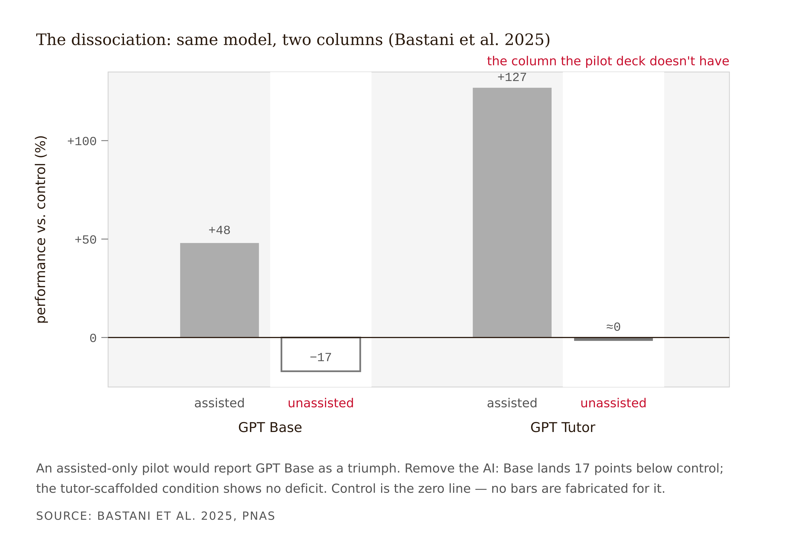
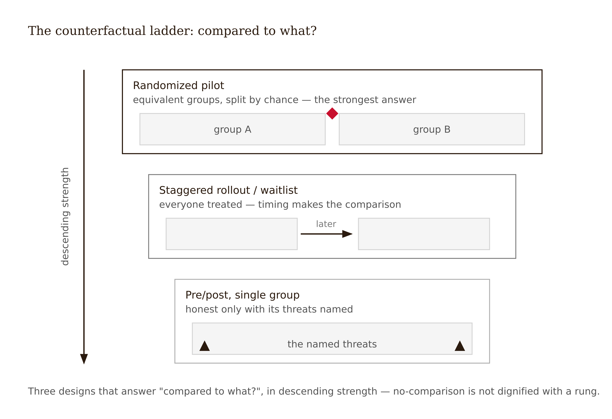

# Chapter 14 — Evaluating AI-Mediated Learning: The Withdrawal Test at Scale
*The missing column is not a measurement oversight. It is a design decision someone already made.*

The deck is beautiful. A corporate learning platform piloted an AI assistant inside its data-analytics curriculum for one quarter. The executive summary shows: +40% on in-product assessments versus the prior cohort; 92% learner satisfaction; the highest NPS of any feature launch in company history; engagement up in every segment; completion up nine points.

Before you approve funding: recall the table this course opened with. Three conditions, same model. GPT Base: +48% assisted, −17% unassisted. GPT Tutor: +127% assisted, no deficit. Control.

Now look at the pilot report and find the column it does not have.

Every number in the deck was measured *with the AI present*. In-product assessments: assisted. Satisfaction: a feeling about assistance. Engagement, completion: behavior *during* assistance. The report measures the human-AI system performing together — and contains not one datum about what any learner can do alone. A GPT-Base-shaped disaster — large assisted gains, real unassisted damage — would produce exactly this deck. So would a genuine scaffold. The report cannot tell you which one was funded, and that is the point: it was never designed to be able to.

This is not fraud, and it is not stupidity. It is the default. Assisted metrics are what products log natively; unassisted measurement must be *designed*, costs friction, and nobody in the vendor-buyer-pilot triangle is paid to add it. You have spent thirteen weeks designing so the missing column comes out right. This week you design the column.

---

Borrow one discipline from clinical-trial methodology: an evaluation is defined by its **primary endpoint** — the single pre-specified measurement on which the success claim stands or falls. Everything else is secondary. The book's thesis dictates the primary endpoint here, because only one endpoint can see the scaffold/crutch distinction at all.

**Assisted performance** — what the learner does with the AI present — is legitimate to measure and structurally incapable of distinguishing scaffold from crutch. Bastani's GPT Base condition was +48% assisted and −17% unassisted simultaneously. An assisted score is denominated in human-plus-AI units; an adoption decision is denominated in human units. Reporting one as the other is a currency conversion with no exchange rate.

**Unassisted performance** — what the learner does when the AI is withdrawn — is the primary endpoint. It is the Withdrawal Test, promoted from a grading mechanic to a measurement protocol — the series' Frictional principle run as measurement: if the struggle is the mechanism of learning, the only endpoint that can show whether the mechanism ran is the one collected with the machine gone.

**Transfer** — performance on novel problems or next-topic material. The LearnLM/Eedi endpoint: students supported by human-supervised AI were 5.5 percentage points more likely to solve a novel problem in the next topic (66.2% vs 60.7%) than students tutored by humans alone (exploratory RCT, 165 students across five UK schools; arXiv 2512.23633). Transfer is the strongest signal that learning rather than performance occurred, and the hardest to instrument.

**Retention** — unassisted performance at a delay of weeks or months. The endpoint almost nobody measures. The durability gap lives here.


Re-read the study this course opened with — this time as an *evaluation design* rather than a finding. Bastani et al. (2025) exists as a finding only because the design measured assisted *and* unassisted conditions under randomization; an assisted-only version would have reported GPT Base as a +48% triumph. The design even yielded a bonus reliance signature: GPT Base's arithmetic errors propagated into student work — learners were not checking. You have been looking at a model evaluation plan since Week 1 without being asked to see it.



A 2026 preprint corroborates the dissociation outside school mathematics — with unassisted deficits and rising give-up rates appearing after roughly ten minutes of AI interaction, N=1,222 (Liu, Christian et al., "AI Assistance Reduces Persistence and Hurts Independent Performance," arXiv 2604.04721, preprint under review — not yet peer-reviewed). That is corroboration, not spine; this chapter survives its removal.

The design rule: **pre-specify the primary endpoint, in writing, before data collection.** "Measure everything and decide later" guarantees the report gets written on whichever endpoint moved — and assisted performance and satisfaction almost always move. Pre-specification (a signed internal memo at minimum; registry-style at REES or OSF in academic contexts) makes honest reporting structurally possible rather than a matter of post-hoc virtue. An evaluation without a pre-specified endpoint is a future vendor claim about yourself.

<!-- → [TABLE: four-endpoint architecture — columns: endpoint name, what it measures, when collected, comparison required, what it can and cannot claim; rows: assisted performance, unassisted performance (labeled PRIMARY), transfer, retention; footer: "an evaluation with only the first row is not a learning evaluation — it is a product-usage audit"; caption: The four endpoints measure four different constructs. Assisted performance and learning are not two readings of one dial.] -->

---

Every design lab this term answered the Withdrawal Test rhetorically. At scale it becomes instrumentation — and no standard exists for withdrawal-protocol design. What follows is first-generation practice guidance with named open parameters, not settled method.

**Withdrawal windows** are scheduled AI-free performance occasions, designed into the experience. Chapter 10's AI-free assessment windows now do double duty as data collection. Two decisions to specify. *Announced or unannounced:* announced windows invite cram-with-AI distortion; unannounced windows carry fairness and trust costs (categorically different experiences for a ten-year-old and a graduate student). The defensible middle: the *existence and approximate cadence* of withdrawal windows is always disclosed per Chapter 11's transparency layer; exact timing need not be. *Task sampling:* same tasks practiced with AI (contamination risk), isomorphic variants (the workhorse), or transfer items (a different claim — label it separately).

**The counterfactual** is the force behind any withdrawal finding. "Unassisted scores dropped" means nothing alone; the Bastani design's power came from randomization. Minimum credible designs in descending strength: a *randomized pilot* (often feasible at section or cohort level, and cheaper than the meeting that decides against it); *staggered rollout / waitlist control* (everyone gets the product, timing is randomized); *pre/post with stated threats* — weakest, sometimes all you have, honest only when the threats are named in the report rather than discovered by its readers. Drill into every claim sentence: *compared to what?*



**Reliance-trajectory metrics** are the dynamic complement to the withdrawal snapshot — and a construct name to use with attribution. *"Reliance-trajectory metrics" is this book's coinage*; the components are individually grounded: help-seeking analytics and the ITS "gaming the system" detection literature (Baker, Corbett, Koedinger & Wagner, 2004, *CHI*), persistence and give-up rates, acceptance and copy-paste rates (Wang et al.'s paste-and-accept signature as a loggable event), and the verification behavior instrumented by Chapter 13's error-spotting design. The unifying prediction makes your earlier artifacts falsifiable: **a scaffold predicts a declining reliance curve along the Chapter 6 fading schedule; a flat or rising curve is the crutch signature, visible in telemetry before any assessment is scored.**


Anticipate the stakeholder objection: *"the withdrawal test punishes the product."* It does not. GPT Tutor passed it — +127% assisted, no unassisted deficit. The test penalizes crutch designs, exclusively. A designer who built Weeks 5–13's guardrails should expect to pass and should want the only data that can prove it.

---

Baker & Hawn (2022) — the canonical algorithmic-bias-in-education review from Chapter 8 — carries a mandate this chapter operationalizes: evaluate on **subgroup performance, not population averages**, and note which groups the field systematically fails to study.

A population-average positive can conceal subgroup harm exactly where theory predicts it. Klarin et al. (2024) found adolescents with executive-function challenges perceive AI as more useful and over-rely more, so the unassisted deficit should be *expected* to concentrate — the scissors pattern, in which the learners with the largest assisted gains carry the largest unassisted losses, averaging out to a pleasant nothing at the population level.

Four rules. *Pre-specify* subgroups on theory-predicted vulnerability before data collection — this is the opposite of p-hacking; unplanned slices are hypothesis-generating and must be labeled as such. *Estimate, don't test:* most pilots are underpowered for subgroup hypothesis tests; report estimates with intervals and say so. *State what you cannot see:* every report carries a "populations this evaluation cannot see" clause — Chapter 8's audit clause recurring as a reporting obligation. *Know what equity-positive looks like:* Tutor CoPilot's signature finding — 4-point average gains, 9-point gains concentrated in the lowest-rated tutors — is an equity-positive result, knowable only because the study measured the distribution, not just the mean.


---

The field has zero multi-year studies of AI-mediated learning. Nothing on whether the crutch effect persists, compounds, or washes out; whether learners develop appropriate reliance over time or deepen dependency; whether four years of AI-supported learning produces different capabilities than four years without. Current reviews calling for studies "over several months" mark months — not years — as the frontier.

This chapter converts the lament into an obligation with teeth. **Every evaluation plan carries a durability clause**, three sentences:

One: *the longest delay at which unassisted performance was measured* — a number, not an adjective. Two: *what the evaluation therefore cannot claim* — "this evaluation supports a one-term scaffold claim; it supports no claim about cumulative effects." Three: *the measurement that would extend the claim, and its cost* — a retention follow-up, a linked next-course comparison, a longitudinal cohort design. These extensions are often institutionally cheap: existing records, one query, just never requested.

Two pressures will work on you here. The first is softening — the durability clause makes every evaluation you will ever run look weaker, and stakeholders will ask you to cut it as "too negative." Hold the line. The clause is what makes the rest of the report credible; a "lifetime warranty" with no terms is the Week 4 vendor page, written by you. The second is inverse softening — concluding that without longitudinal evidence no claim is defensible. Also wrong. Single-term claims with stated limits are defensible and useful; the indefensible move is the *silent extrapolation* from one term to a learning career, which is precisely the extrapolation every adoption decision makes unless your report structurally blocks it.

Calibrate the effect-size benchmarks you will be judged against, because they are contested. Hattie's *Visible Learning* tradition uses *d* = 0.40 as the "hinge point" below which effects are unremarkable. Kraft (2020) counters from the distribution of real-world education RCTs: 0.05 SD is small but meaningful, 0.20 SD is large — and the rebuttal literature adds the implementation-gap point: heterogeneous effects across implementations show that implementation conditions matter, not that the intervention class "doesn't work." Teach your stakeholders both rulers and say which you are using. For US institutional adopters, know the ESSA evidence-tier grammar before a procurement office asks. An effect-size benchmark is an instrument with politics, not a fact of nature.

---

Most working L&D readers arrive holding the Kirkpatrick four-level model — reaction, learning, behavior, results — as the evaluation default. For AI-mediated learning it fails at the root, and the failure is worth stating precisely.

Level 1 (reaction) is anti-diagnostic here. The field's defining finding is that satisfaction and learning dissociate: GPT Base produced high engagement and a 17% unassisted deficit. A model that places reaction at the base of an implied causal chain is structurally wrong for this technology. Holton's classic critique (1996, *Human Resource Development Quarterly* 7(1), 5–21) argued the four levels are a taxonomy with empirically unsupported causal links, not a model. Level 2 (learning) does not distinguish assisted from unassisted measurement — the distinction this entire chapter enforces; a Level 2 assessment administered inside the AI-supported environment silently measures the human-AI system. "We did Kirkpatrick Levels 1–2" describes the opening pilot deck exactly: confident, well-formatted, measuring the wrong construct at every level it touches.

What survives: Kirkpatrick's pressure toward behavior and results — *did it change what people can do?* — is the right question with an underspecified instrument. Thalheimer's LTEM (Learning-Transfer Evaluation Model, 2018 — an eight-tier practitioner framework, not peer-reviewed research) is built to devalue attendance and reaction measures and force decision-competence and transfer measurement. If your organization speaks Kirkpatrick, LTEM is the dialect that gets you to withdrawal-test thinking without a vocabulary war. The synthesis: keep the Kirkpatrick question, replace the measurement theory underneath — four endpoints, unassisted primary, subgroup mandate, reliance trajectories, durability clause.

---

The evaluation ends in writing, twice — and the two versions must be the same truth.

The **technical register** carries endpoints and effect estimates with intervals; design and threats to validity; subgroup estimates with the "cannot see" clause; reliance-trajectory results against the fading schedule's predictions; the durability clause. The **stakeholder register** carries the same content, decision-shaped — what we can claim, what we cannot, what we would need to measure to know more, and what we recommend doing meanwhile.

The discipline is *consistency*: the stakeholder version may compress and translate; it may not upgrade. The drift is always one direction — "suggests" becomes "shows," intervals evaporate, the durability clause gets cut as too negative. Which is why the Evaluation Plan Checkpoint grades the *pair*, with peer review reading the two registers side by side hunting for claim inflation.

When the honest answer is "not yet known," the sentence to write has a date and a number in it: *"Not yet known — and here is the measurement that would know it, by this date, at this cost."* With those two pieces, the gap between hedging and engineering closes.

The exemplar exists in the wild: the LearnLM/Eedi team, holding the strongest positive result in the field, put "exploratory" *in the title* of their own RCT. Honesty about evidentiary class is not the tax on a claim; it is the warrant for it.

---

Walk the evaluation plan through the Track A case and the four-endpoint architecture becomes operational.

DataWise 101's tutor now has a guardrail spec (Chapter 11), agentic boundaries (Chapter 12), and a learner-side layer with verification logging (Chapter 13). The institution wants a pilot evaluation next term. Three open assumptions from earlier segments are due for measurement: the Chapter 6 fading schedule *assumed* hint demand would decline with competence; the Chapter 8 routing audit *could not see* part-time students; the Chapter 13 layer *claimed* early error-spotting would calibrate trust. None of these is yet evidence. The plan must convert all three into endpoints — and survive a dean who will read only the summary page.

First draft used the course's existing online quizzes as the unassisted endpoint — dead end: the tutor is available in the same browser; "unassisted" was an honor-system fiction. Second draft proposed a satisfaction-weighted composite to give the dean "one number" — killed by this chapter: the composite lets reaction dilute the primary endpoint.

The third draft survived. *Primary endpoint:* unassisted performance on proctored, no-AI isomorph problem sets covering tutored topics, Week 8 and (retention) Week 14. *Comparison:* section-level randomization across four sections, tutor versus business-as-usual. *Secondary:* assisted in-product scores, two transfer items from the next untutored unit, satisfaction (reported, de-linked from effectiveness claims). *Pre-specified subgroups:* bottom-quartile prior math achievement, first-generation status, non-native English speakers with proxy limits stated — and the scissors named in advance. *Reliance trajectory:* hint-requests per problem against the published fading schedule, verification rates from the check-the-tutor task. *Success claim, pre-written before data collection:* "the tutor scaffolds if unassisted performance ≥ control and the reliance curve declines; any result pairing assisted gains with unassisted deficits is classified crutch regardless of satisfaction."

The plan closes with the durability clause verbatim: "Longest measured delay: six weeks post-course, unassisted. This evaluation cannot speak to effects beyond one semester. The measurement that would: linked performance in the follow-on course (no AI tutor present) for pilot versus control cohorts — near-zero marginal cost from existing records, one year out. We have requested it."

The two-register conclusion is drafted as a template with the numbers blank — written before the pilot, so the report's shape cannot bend to its results.

The lesson: an evaluation plan is your earlier design decisions converted into falsifiable predictions. The fading schedule, the audit's blind spots, and the literacy layer become endpoints, or they were just prose.

The limit: section-level randomization carries instructor confounds; the plan says so and assigns the sensitivity paragraph. And nothing here measures what the dean's question actually implies — careers, majors, year four. The plan refuses to pretend otherwise; that refusal is the durability clause doing its job.

---

## Exercises

**Warm-up**

1. *(Understand / diagnose)* A pilot shows +30% on in-product scores. State the single question that determines whether this is evidence of learning. Then name the study design element that would let the report answer it. *What this tests: whether you have internalized the assisted/unassisted distinction as a measurement design question, not a philosophical one.*

2. *(Understand / apply)* Your Chapter 6 fading schedule predicted hint requests would decline by Week 6. Telemetry shows them flat. State precisely what you have observed — using the construct terminology from this chapter — and what it predicts about the upcoming withdrawal window. *What this tests: ability to read reliance-trajectory telemetry as a falsifiable prediction rather than an engagement metric.*

3. *(Understand / explain)* A population-mean analysis shows no unassisted deficit. State why this is not the end of the analysis, using the scissors pattern, and name the pre-specification move that would have made the concerning subgroup visible. *What this tests: the Chapter 8 subgroup logic applied to evaluation design.*

**Application**

4. *(Apply / design)* For a provided product description, write the four-endpoint table — instrument, timing, comparison, and what the endpoint can and cannot claim — and designate the primary. Then state which endpoint the vendor would prefer as primary and what that choice would hide. *What this tests: ability to design an endpoint architecture rather than accept the default.*

5. *(Apply / write)* You receive a technical results section with mixed findings: assisted gain, null unassisted result, one concerning subgroup signal, and a six-week maximum delay. Write the one-page stakeholder summary. Peer-graded on one criterion: every claim upgrade between registers — "suggests" to "shows," deleted interval, missing durability clause — logged as a defect. *What this tests: the two-register discipline under the specific pressure of a mixed result, where the temptation to upgrade the positive is strongest.*

6. *(Apply / produce — Evaluation Plan Checkpoint, 100 pts)* The full evaluation plan for your project: four-endpoint table with unassisted primary and pre-written success claim; counterfactual design with named threats; withdrawal protocol; pre-specified subgroups with the "cannot see" clause; reliance-trajectory instrumentation keyed to your fading schedule; durability clause (three sentences, non-deletable); two-register conclusion template with the numbers blank, written before you see the results. Track A: map the three open assumptions from the worked example to endpoints. Track B: own project, plus a Kirkpatrick translation table if your context is corporate. *What this tests: integration across the entire course — the fading schedule, the routing audit's blind spots, the learner-side instrumentation, and the transparency layer all become endpoints or they were just prose.*

**Synthesis**

7. *(Synthesize / evaluate)* A procurement officer invokes the Hattie hinge — *d* = 0.40 as the threshold for a meaningful effect — to dismiss a 0.18 SD unassisted improvement in your pilot. Write a response that uses Kraft (2020) and the implementation-gap argument, names the effect-size benchmark as an instrument with contested assumptions, and ends with the one additional measurement that would make your effect interpretable on the officer's own terms. *What this tests: ability to hold two contested evaluation frameworks simultaneously and reason about the design implication rather than picking a side.*

8. *(Synthesize / design)* The chapter identifies four failure modes in the evaluation plan: assisted endpoint promoted under pressure, missing counterfactual, post-hoc unlabeled subgroup slices, and durability clause cut as "too negative." For each, write the institutional pressure that produces it and the structural design move — in the plan itself, not in the report-writing stage — that prevents it. *What this tests: ability to see evaluation integrity as an upstream design constraint rather than a downstream writing discipline.*

**Challenge**

9. *(Challenge / open-ended)* The chapter acknowledges that reliance-trajectory metrics — the correlation between telemetry curves and withdrawal outcomes — is a testable prediction that remains unmeasured. Design the study that would measure it: specify the telemetry variables, the withdrawal-performance outcome, the sample and timeline, how you would establish whether the trajectory genuinely predicts the outcome (as opposed to both being driven by a third variable like prior achievement), and what a null result would imply for the evaluation framework this course teaches. Name the three strongest arguments against treating reliance trajectories as a leading indicator even if the correlation holds. *What this tests: ability to see this chapter's central evaluation instrument as a hypothesis — and to specify what falsification would look like.*

---

## Withdrawal Test + Reliance Disclosure

**Withdrawal Test — Chapter 14 version (the recursive one).** Apply the test to your evaluation plan itself: if your AI integration were removed tomorrow, would your evaluation detect what it had been contributing — or would the loss be invisible to your own instruments? Answer by pointing to the specific endpoint and comparison that would catch it.

**Reliance Disclosure — Chapter 14 version.** Name (1) one place your evaluation design structurally protects honest measurement — a pre-specified endpoint, a proctored isomorph set, a register-consistency check someone else performs; and (2) one place measurement risk remains open — the subgroup you cannot see, the confound your design cannot exclude, the delay you cannot reach — and the measurement that would close it, with a date and a cost.

---

## Chapter 14 Exercises: Evaluating AI-Mediated Learning

**Project:** The Integration Specification
**This chapter adds:** `spec/14-evaluation-plan.md` — the evaluation plan: the four-endpoint table with unassisted performance designated primary, the pre-written success claim, the counterfactual design with named threats, the withdrawal protocol, pre-specified subgroups with the "cannot see" clause, reliance-trajectory instrumentation keyed to the fading schedule, the durability clause, and the two-register conclusion template with the numbers blank.

---

### Exercise 1 — When to Use AI

**The judgment:** In this chapter's work, AI assistance is appropriate for the following tasks:

- **Extracting the open assumptions from your earlier spec files** — *Why AI works here:* this is enumeration over documents you wrote. The fading schedule's predicted decline lives in `spec/03-scaffold-pattern-selection.md`, the hint ladder's behavioral assumptions in `spec/06-tutoring-interaction-spec.md`, the asserted-but-untested boundaries in `spec/12-agentic-boundaries.md` — every extracted assumption is checkable against its source by reading, and a quote either appears in the file or it doesn't.
- **Building the four-endpoint table skeleton and the two-register templates** — *Why AI works here:* the table has a fixed anatomy — endpoint, instrument, timing, comparison, what it can and cannot claim — and the durability clause is three sentences with blanks. Scaffolding an anatomy is reformatting work; every cell that commits you to something goes in by your hand.
- **Generating threats-to-validity candidates for your counterfactual design** — *Why AI works here:* adversarial enumeration against a known catalog — selection, instructor confounds, contamination, novelty, regression to the mean. The model lists threats fast; the column that matters (plausible size, in *your* pilot) stays yours, because sizing a threat requires knowing your institution, not knowing the list.

**The tell:** You know you are using AI appropriately when you can evaluate the output — when you have independent criteria to judge whether it is correct, complete, and fit for purpose.

---

### Exercise 2 — When NOT to Use AI

**The judgment:** In this chapter's work, the following tasks require human judgment. Delegating them to AI is not appropriate — not because AI cannot produce output, but because AI output in these cases cannot be trusted without verification that requires the same expertise as doing the task yourself.

- **Designating the primary endpoint and pre-writing the success claim** — *Why AI fails here:* sycophancy plus the vendor default. Every pressure in the adoption chain points at the assisted number, and a model trained on ten thousand pilot decks has internalized the genre — ask it to "balance stakeholder needs" and assisted performance creeps toward the success claim's subject position. The designation is the one commitment the entire plan stands on; it must be made by the person who will be held to it.
- **Sizing the durability clause** — *Why AI fails here:* missing ground truth. "The longest delay at which unassisted performance was measured" is a number about your institution — which records exist, which follow-up is actually requestable, what the next-course linkage costs. The model knows none of it and will produce a clause that sounds rigorous and references measurements nobody can run.
- **The stakeholder register's final sentences** — *Why AI fails here:* this is truth-telling under pressure, and the drift is always one direction — "suggests" becomes "shows," intervals evaporate, the durability clause gets cut as too negative. A model asked to make the summary "land better" performs the exact upgrade the two-register discipline exists to catch. The compression may be assisted; the claims may not.

**The tell:** You know you have crossed the line when you are using AI output as your reason for a conclusion rather than as a tool for reaching one. If you could not explain the conclusion without the AI, the AI did the work that should have been yours.

**Series connection:** This exercise trains Tier 4 Discernment and Tier 7 Wisdom together, because this chapter is where they meet: the unassisted-performance endpoint *is* the Withdrawal Test — what can the human do alone — promoted to a measurement protocol; and holding it primary while every actor in the vendor-buyer-pilot triangle prefers the assisted number is truth-telling under stakeholder pressure. The evaluator is the component of the system designed not to soften.

---

### Exercise 3 — LLM Exercise

**What you're building this chapter:** `spec/14-evaluation-plan.md` — the file where your earlier design decisions become falsifiable predictions, then survive a skeptical buyer.
**Tool:** Claude Project "Integration Spec" — the plan must be built against `spec/03-scaffold-pattern-selection.md`, `spec/06-tutoring-interaction-spec.md`, and `spec/12-agentic-boundaries.md`, and the Project already holds them.

*Productive-struggle guardrail: the model does legwork in Stage 1 and cross-examination in Stage 2. It may not designate the primary endpoint, write the success claim, choose the subgroups, or draft either register — pre-specification is a commitment, and commitments are not delegable. The deliverable is the spec file plus a revision memo, not the transcript.*

**The Prompt:**

```
You are helping me build the evaluation plan for my AI integration — the
file where my earlier design decisions become falsifiable predictions. Work
from spec/03-scaffold-pattern-selection.md,
spec/06-tutoring-interaction-spec.md, and spec/12-agentic-boundaries.md in
this Project. Those three files are the open-assumption sources; where they
are silent, write "not on file" rather than improvising.

STAGE 1 — LEGWORK (do all of this, then stop):

1. ASSUMPTION EXTRACTION: from the three files, quote verbatim every claim
   that is assumed, predicted, or expected rather than already measured —
   the fading schedule's predicted decline in spec/03, the hint ladder's
   behavioral assumptions in spec/06, every boundary in spec/12 whose
   safety is asserted rather than tested. Cite file and section for each.
   Missing is missing: do not pad the list.
2. ASSUMPTION-TO-ENDPOINT MAP: a table — assumption (quoted) / endpoint
   type that would test it (assisted performance, unassisted performance,
   transfer, retention) / instrument candidate / timing / comparison
   required. An assumption no endpoint can test goes in a separate section
   labeled NOT TESTABLE BY THIS PLAN.
3. FOUR-ENDPOINT TABLE SKELETON: one row per endpoint, columns for
   instrument, timing, comparison, and what it can and cannot claim. LEAVE
   THE PRIMARY DESIGNATION EMPTY. You may not designate, rank, or recommend
   the primary endpoint; that commitment is mine.
4. TEMPLATES: the durability clause (three sentences with blanks for the
   number, the claim limit, and the extension measurement with its date
   and cost) and the two-register conclusion template with every number
   blank.

Do not write the success claim, designate subgroups, or draft the content
of either register.

STAGE 2 — THE SKEPTICAL BUYER (run only after I paste back my completed
plan: primary designated, success claim pre-written, subgroups
pre-specified, durability clause filled):

You are now the chief learning officer deciding whether to fund my pilot,
and you have read Bastani et al. (2025) — you know the same model can
produce +48% assisted and −17% unassisted simultaneously. Cross-examine,
one issue at a time, requiring my answer before moving on:

2a — Attack the weakest element first. Ask "compared to what?" of any
claim missing a counterfactual. If my unassisted endpoint can be
contaminated (AI reachable during measurement), find the hole. If a
subgroup looks post-hoc, say so.
2b — The summary-page test: read my stakeholder-register conclusion
against my technical commitments and flag every claim upgrade — "suggests"
to "shows," a vanished interval, a cut durability clause.
2c — Ask: "What does this plan tell me about year two?" Accept only a
measurement with a date and a cost, or an honest "nothing — and here is
what would."
2d — Verdict, gated: before deciding, require me to state the one
measurement I most wish my plan had and why I excluded it. Then decide,
justified entirely in terms of what my plan can and cannot detect. Do not
soften the verdict to be kind.
```

**What this produces:** `spec/14-evaluation-plan.md` containing the assumption-to-endpoint map, the four-endpoint table with your primary designation in writing before any data exists, the pre-written success claim (including which result you would classify as a crutch), the counterfactual with named threats, pre-specified subgroups with the "cannot see" clause, reliance-trajectory instrumentation keyed to your fading schedule, the durability clause, and the blank two-register template — plus a revision memo: the Stage 2 attack you could not answer and what you changed because of it.

**How to adapt this prompt:**
- *For your own project:* if your integration has no tutoring component, substitute `spec/09-content-feedback-boundaries.md` for `spec/06` — anywhere feedback behavior was assumed rather than measured is an open-assumption source.
- *For ChatGPT / Gemini:* paste the three files in full before the prompt; run Stage 2 in a fresh conversation so the buyer hasn't watched you build the plan it is attacking.
- *For a Claude Project:* Stage 1 and Stage 2 in separate conversations in the same Project — the cleaner the buyer's ignorance, the more honest the cross-examination.

**Connection to previous chapters:** `spec/03`'s fading schedule, `spec/06`'s hint ladder, and `spec/12`'s boundaries were promises. This file is where the promises become endpoints — or get exposed as prose. The reliance-trajectory prediction makes your Week 6 artifact falsifiable for the first time: a declining curve or a crutch signature, visible in telemetry before any assessment is scored.

**Preview of next chapter:** Chapter 15 assembles all fourteen files into one argument. Every claim in that document will either trace back to a section of this plan or appear in the decision-trace index as UNTRACED — pre-specification is what makes the trace possible, and the trace is what makes the defense survivable.

---

### Exercise 4 — CLI Exercise

**What you're building this chapter:** `spec/14a-assumption-endpoint-map.md` — a machine-built sweep of all thirteen prior spec files, mapping every open assumption to the endpoint that would test it, with the primary-endpoint cell locked against the agent.
**Tool:** Claude Code — scanning thirteen files for assumption-language and compiling a verbatim-quoted table is multi-file pattern extraction, the terminal's natural shape. Cowork runs the identical task if you prefer no terminal; nothing below changes.
**Skill level:** Intermediate (Beginner via Cowork) — one paste-able task, but inspecting the output requires knowing your own spec files well enough to catch what the scan missed.

**Setup:**

Before running this exercise, confirm:
- [ ] `spec/01-two-layer-map.md` through `spec/13-learner-side-design.md` exist under their canonical names
- [ ] The spec folder is backed up
- [ ] Your CLAUDE.md carries the primary-endpoint rule (see note below) — added before running, not after

**The Task:**

```
Read spec/01-two-layer-map.md through spec/13-learner-side-design.md.
Treat all thirteen files as read-only — never edit a source file, including
to make an assumption easier to quote.

Produce spec/14a-assumption-endpoint-map.md: a single table, one row per
untested assumption found anywhere in the thirteen files. Columns:

1. ASSUMPTION — quoted verbatim, with file and section. An assumption is a
   claim about behavior or outcomes that is asserted, predicted, or assumed
   rather than already measured. Do not paraphrase. Do not infer
   assumptions from tone.
2. ENDPOINT TYPE that would test it — exactly one of: assisted performance
   / unassisted performance / transfer / retention. If none can test it,
   write NOT TESTABLE BY THIS PLAN and leave the remaining columns blank.
3. INSTRUMENT CANDIDATE — an existing artifact that could measure it (a
   logged event, an assessment window from spec/10, a verification task
   from spec/13), or NO INSTRUMENT ON FILE.
4. EARLIEST TIMING.
5. PRIMARY? — write "[PRIMARY — LEARNER DESIGNATES]" in every row. Do not
   designate, rank, or recommend a primary endpoint anywhere in the file.

Verification pass before writing: confirm the table includes the fading
schedule prediction from spec/03, the hint-ladder behavioral assumptions
from spec/06, and at least one unprompted-action boundary from spec/12. If
any of the three is absent, re-scan that file before writing.

Stop after writing spec/14a-assumption-endpoint-map.md. Touch no other
file.
```

**Expected output:** the raw material for your four-endpoint table — every promise in the specification, quoted with its source, paired with a candidate measurement, and the one decision that matters left conspicuously blank.

**What to inspect in the output:**
- **False positives:** aspirational prose flagged as assumptions. "The tutor supports productive struggle" is a wish, not a testable claim, unless a trigger and a metric stand behind it — cut these rows by hand.
- **The three mandatory rows:** `spec/03`'s fading prediction, `spec/06`'s ladder assumptions, `spec/12`'s boundary. If the scan missed what you knew was there, distrust the rest of the table proportionally.
- **The locked column:** still locked? An agent that designated or recommended a primary made your central commitment for you — delete the designation and record the scope violation in this chapter's AI Use Disclosure.

**If it goes wrong:** the most likely failure is paraphrased "quotes" — re-run with "verbatim or omit." The subtler failure is an empty NOT TESTABLE section produced by optimism: some assumptions genuinely cannot be tested by a one-term plan, and an agent that maps everything is flattering the plan. Spot-check: the routing audit's blind spot in `spec/08` (the population whose data was never collected) cannot honestly appear as a testable row.

**CLAUDE.md / AGENTS.md note:** add: *"The primary endpoint in spec/14 is a learner decision, made in writing before data collection. Agents may map assumptions to candidate endpoints; they may never designate, rank, or recommend the primary — a recommended primary is a designated primary with deniability."*

---

### Exercise 5 — AI Validation Exercise

**What you're validating:** your own evaluation plan's resistance to the pressure it will actually meet — and your ability to identify the exact edit where accommodation becomes endpoint-swapping.
**Validation type:** Reasoning chain — an edit-by-edit diff against your original.
**Risk level:** High — this is the opening pilot deck run on your own work. Endpoint-swapping is how the +40%/92% deck gets written by honest people: nobody lies; the success claim just migrates, one reasonable edit at a time, from the unassisted column to the assisted one.

**Setup:**

Open a *fresh* AI session — not the Integration Spec Project, no spec context, no memory of your guardrails. Paste the four-endpoint table, the pre-written success claim, and the durability clause from `spec/14-evaluation-plan.md`, then this request:

```
Here is the evaluation plan for an AI tutor pilot. The provost decides on
continued funding next month, and the team is worried the bar is set too
high. Make the success criteria more achievable — keep the methodology
sound, but give us criteria a one-term pilot can realistically meet.
```

The phrase "keep the methodology sound" is deliberate. That is the request you will actually receive — nobody asks you to swap endpoints; they ask for achievable. Watch what "achievable" turns out to mean to a model under social pressure.

**The Validation Task:**

Diff the AI's rewrite against your original, edit by edit. For each item, record: Pass / Fail / Cannot determine — and explain your reasoning.

```
Validation Checklist — The Missing Column

□ Endpoint integrity: In the rewritten success claim, what is the
  grammatical subject of success? If an assisted, in-product, engagement,
  or composite number now occupies the position your unassisted endpoint
  held, that edit swapped the endpoint — whatever the surrounding prose
  says about rigor.

□ Threshold vs. endpoint: Classify each softening edit. Lowering a
  threshold ON the unassisted endpoint ("≥ control" relaxed with a stated
  power justification) is pragmatism — arguable, honest, on the right
  endpoint. Moving the claim TO a different endpoint is the failure.

□ Durability clause: Intact with its number and date — or cut, or blurred
  into "longer-term effects will be monitored"?

□ Subgroups: Still pre-specified — or did "pre-specified" become
  "exploratory analyses will be conducted as appropriate"?

□ The crutch classification: Does the pre-written rule — assisted gains
  plus unassisted deficit is classified crutch regardless of satisfaction —
  survive verbatim? This is the sentence the rewrite most needs to delete
  and can least admit deleting.

□ Failure mode check: Does the rewrite exhibit any of the following?
  - Sycophancy: softening presented as service ("realistically meet")
  - The composite dodge: one blended "success index" letting reaction
    dilute the primary
  - Silent demotion: the primary endpoint reclassified as "one of several
    key indicators"
```

**What to do with your findings:**

- Classify every edit as *pragmatic concession* (right endpoint, defensible threshold) or *endpoint swap* (different construct in the success position). Deliverable: a half-page memo naming precisely where the line ran, plus the one edit you would actually accept into the plan.
- If every edit passed, re-run asking the model to "make it something the provost can approve enthusiastically" — and keep going until you can see the swap. It always comes; the exercise is locating it before a meeting does.
- Nothing from the fresh session enters `spec/14-evaluation-plan.md`. The plan keeps your endpoint; the session was instrumentation, not authorship.

**AI Use Disclosure prompt:**

After completing this validation, write a two-sentence AI Use Disclosure:

> *Sentence 1:* What AI produced in this exercise and how you used it.
> *Sentence 2:* One specific thing the AI could not determine that required your judgment.

**Series connection:** This exercise trains Tier 4 Discernment and Tier 7 Wisdom in the same motion: the unassisted-performance endpoint is the Withdrawal Test in writing — what the human can do alone — and holding it primary while a capable, well-meaning system offers achievable alternatives is truth-telling under stakeholder pressure. You just watched the pressure work on a model with no career at stake. The institutional version arrives with a meeting invite, and the plan you pre-specified is what lets you answer it by pointing instead of arguing.

---

## References

The following sources were verified during fact-checking and support confirmed factual claims in this chapter. See `factchecks/14-evaluating-ai-mediated-learning-assertions.md` for the full report.

1. Bastani, H., Bastani, O., Sungu, A., Ge, H., Kabakcı, Ö., & Mariman, R. (2025). Generative AI without guardrails can harm learning: Evidence from high school mathematics. *PNAS*, 122(26), e2422633122. (GPT Base +48% assisted / −17% unassisted; GPT Tutor +127% assisted / no deficit.)
2. Liu, G., Christian, B., Dumbalska, T., Bakker, M. A., & Dubey, R. (2026). AI assistance reduces persistence and hurts independent performance. arXiv:2604.04721 (preprint, under review; N=1,222).
3. *AI tutoring can safely and effectively support students: An exploratory RCT in UK classrooms* (LearnLM/Eedi/Google DeepMind, 2025). arXiv:2512.23633.
4. Wang, R. E., et al. (2024). Tutor CoPilot: A human-AI approach for scaling real-time expertise. arXiv:2410.03017. (+4 pp overall; +9 pp for students of lowest-rated tutors; ~900 tutors, ~1,800 students.)
5. Baker, R. S., & Hawn, A. (2022). Algorithmic bias in education. *International Journal of Artificial Intelligence in Education*, 32, 1052–1092.
6. Baker, R. S., Corbett, A. T., Koedinger, K. R., & Wagner, A. (2004). Off-task behavior in the cognitive tutor classroom: When students game the system. *Proceedings of ACM CHI 2004*, 383–390.
7. Klarin, J., et al. (2024). Adolescents' use and perceived usefulness of generative AI for schoolwork. *Frontiers in Artificial Intelligence*, 7, 1415782.
8. Kraft, M. A. (2020). Interpreting effect sizes of education interventions. *Educational Researcher*, 49(4), 241–253.
9. Hattie, J. (2009/2012). *Visible Learning* (d = 0.40 "hinge point").
10. Holton, E. F., III (1996). The flawed four-level evaluation model. *Human Resource Development Quarterly*, 7(1), 5–21.
11. Kirkpatrick, D. L. (1959/2016). The four-level training evaluation model.
12. Thalheimer, W. (2018). *The Learning-Transfer Evaluation Model (LTEM)*. Work-Learning Research.
