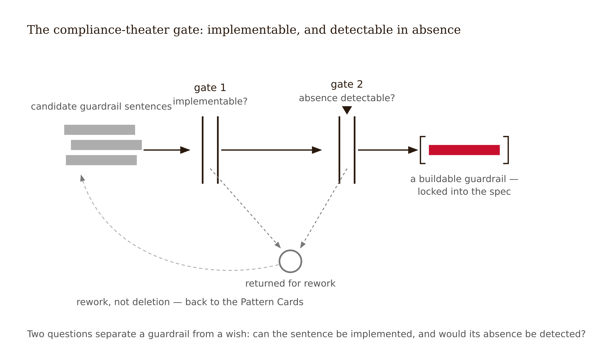

# Chapter 15 — The Full Integration: One Experience, Every Guardrail
*Done does not mean every question is closed. It means every touchpoint is accounted for.*

On the last studio day, before any student presents, the instructor presents — and takes the same review the students will face.

On screen: the complete integration specification for the AI homework tutor in DataWise 101, the statistics course this course has carried since Week 2. Fourteen sections, thirty-one pages, one spine. Walked in argument order: the experience and its learning claims; the evidence posture, bucketed into act, pilot-and-measure, and decline; the tutoring interaction spec with the hint ladder and the answer it never gives; the fading schedule; the adaptivity decision; the routing audit with its named blind spot — part-time students, data not collected; the content and feedback boundaries; the assessment redesign with its no-AI windows; the transparency layer with the single-click human escape hatch; the agentic boundaries — what the tutor may do unprompted, which is almost nothing; the learner-side layer; the evaluation plan with unassisted performance as the primary endpoint and the durability clause intact.

Then the two sections no vendor document carries. **Section 13: the negative specification** — three AI features the tutor will not have, each with the evidence for declining and the condition that would reopen it. The room reads the first one twice: the "Study Buddy" companion mode, the feature every focus group requested, declined. **Section 14: the open questions** — including the one the field cannot answer: *the longest measured delay in the evaluation plan is six weeks, and DataWise students will use tools like this for four years. What four years of this does to a learner is not known. No longitudinal study exists. Here is the next-course linkage we have requested, and the cohort comparison that would know more in three years.*

A student raises the obvious objection: "You're presenting a specification whose central long-term claim is 'not yet known.' Why does this count as done?"

The instructor's answer is this chapter: **done, in this discipline, does not mean every question is closed. It means every touchpoint is accounted for** — guardrailed by evidence, opened to measurement, or declined — and every open question named, with the measurement that would close it. A specification claiming more than that is not more finished. It is less honest, and fourteen weeks of this course have equipped the room to see exactly where.


---

The document you are assembling has ancestors, and knowing them tells you what the genre demands.

From **safety engineering** it inherits the safety case: a structured argument, supported by evidence, that a system is acceptable for a specific use in a specific context — not a description of the system, an *argument* about it, every claim traceable to evidence or flagged as assumption (the formulation standardized in UK Def Stan 00-56). From **machine-learning documentation** it inherits the model card and its relatives: Mitchell et al.'s model cards disclose intended use, out-of-scope use, and evaluation results disaggregated by subgroup (Mitchell et al. 2019); Gebru et al.'s datasheets force provenance questions a spec sheet never asked (Gebru et al. 2021); system cards from frontier model deployments extend the form to deployed behavior. The family resemblance is real: intended use, boundaries, subgroup evaluation, known limitations, stated honestly.

And then the inheritance stops, at the exact point this book exists to mark. **No industry documentation template contains a withdrawal claim.** A model card tells you how the system performs; a system card, how it behaves under adversarial pressure. None of them asks what the human can do when the system is gone. In learning, that question is not one disclosure among many; it is the product. Your specification is a new genre member: every section terminates in the Withdrawal Test, and the evaluation section stakes the success claim on unassisted performance. That is the difference between documenting an AI system and specifying an AI *integration into learning*.


Structurally, the specification is an argument, not a binder. The unit is the **decision trace**: what the learner needed to be able to do → what the evidence said → what was designed, declined, or deferred → how you will know. Each Act Two artifact appears as evidence for a step in that trace, captioned by the decision it served. A reviewer should be able to enter at any touchpoint and reach the evidence in two hops.


---

The course promised a designer who can correctly decline an AI feature the evidence says will become a crutch. Here declining becomes a documented artifact rather than a hallway anecdote.

The **negative specification** lists the AI features the integration will not include — each as a dossier: the feature as proposed, steelmanned (what made it attractive, who asked for it); the evidence for declining, with endpoint types; the harm pathway (which mechanism from this course it triggers); and the **reopen condition** — the specific evidence that would reverse the decision. The reopen condition separates evidence-disciplined declining from technophobia. A "no" with a reopen condition is a falsifiable position; a bare "no" is a mood. This book practices the form on itself — its out-of-scope table defers longitudinal reliance effects, equity-positive personalization, and the agentic pattern canon, each with its reopen condition.

Three reasons to force this into the document. First, declined features are where the thesis bites: anyone can add guardrails to what they build; the discipline shows in what they refuse to build, because the crutch is the default and the default is always somebody's feature request. Second, undocumented declines do not stay declined — next year's product manager re-proposes the companion mode, and without the dossier the argument must be re-fought from memory, against fresh enthusiasm. The negative specification is institutional memory for the word "no." Third, the dossier is the defense's strongest section: the one place the designer demonstrates judgment against their own incentives.

About holes: a missing artifact, disclosed — "the routing audit could not see part-time students; decisions it grounds are flagged accordingly" — costs points once. The same hole papered over costs the specification its credibility everywhere. Disclosure is calibration, and calibration is the product.

---

The specification is defended live, under a studio-crit protocol adapted to the course's evidence discipline.

Presentation is ten minutes: the decision spine only — six to ten traces, including at least one declined feature. Not a tour of artifacts. Peer cross-examination runs fifteen minutes: classmates armed with the scaffold/crutch diagnostic and the document, read in advance, with written findings already filed. Then the skeptical-reviewer segment, ten minutes: the instructor or an invited practitioner plays the review board that funds things. Expect four canonical attacks. *Engagement:* "your own data shows learners love the feature you declined." *Cost:* "proctored unassisted assessment is friction — justify it." *Durability:* "what does this tell me about year four?" *Vendor:* "the platform we already license does all this out of the box — why is your spec better than their brochure?"

Two answers pass that students reliably underuse. First: **"not yet known — and here is the measurement that would know it, by this date, at this cost."** Said with a date and a number, that is an engineering answer; the defense's hardest moment is saying it to a skeptical face without retreating into a claim you cannot license. Second: **pointing at the document** — "that risk is named in Section 14, with its instrumentation" — because a defense is not improvisation; it is demonstrating the document already thought of it.

What fails: claim inflation under pressure; answering the engagement attack with engagement counter-data instead of the endpoint argument; treating the vendor attack as beneath you rather than answering it on the merits. The brochure encodes interaction design intent, and the deconstruction skills you developed in Week 4 apply verbatim.

<!-- → [TABLE: defense run-sheet — four rows, one per canonical attack; columns: Attack, What it's really testing, Wrong answer, Passing answer. Row 1 Engagement: tests whether the designer will trade the endpoint argument for satisfaction data. Wrong: counter-engagement data. Pass: redirect to endpoint architecture. Row 2 Cost: tests whether unassisted assessment can be justified. Wrong: retreat to convenience. Pass: price the crutch at scale. Row 3 Durability: tests whether the designer knows the field's honest limits. Wrong: claim what no study has shown. Pass: the named measurement with date and cost. Row 4 Vendor: tests whether interaction design can be extracted from a brochure. Wrong: dismiss the brochure. Pass: deconstruct it — hint ladder, fading schedule, unassisted endpoint, subgroup reporting — then show your spec has what the brochure lacks. Caption: "The four attacks are the same every year. The run-sheet is written before the room is hostile."] -->

---

There is a way to produce all fourteen sections and still fail, and the field has documented it. Madaio et al. (2020), co-designing AI fairness checklists with practitioners, found that ethics checklists routinely decay into checkbox compliance — performed conformance that changes documents rather than systems — unless checklist items are anchored to specific decision points in the actual workflow (Madaio, Stark, Wortman Vaughan & Wallach, CHI 2020). The educational-AI version has a recognizable face: the specification whose every guardrail is policy prose — "the system shall promote academic integrity" (no mechanism), "learners will be encouraged to verify outputs" (no trigger, no frequency), "AI use will be appropriately supervised" (by whom, visible where?). Every sentence is agreeable; no sentence is buildable.

The test that catches it is mechanical: **can this sentence be implemented, and could its absence be detected?** A guardrail that names no interface element, no trigger, no log, and no failure response is not a guardrail; it is a wish wearing one's clothes. The Pattern Cards collected all term are the antidote — fourteen weeks of trigger/structure/fading-rule/failure-mode formatting exist so that nothing in the specification can be vague without looking vague.



The peer review applies this test to every guardrail: seven named defects, plus the compliance-theater sweep. Hidden answer-giving (trace the hint ladder to its floor). Missing unassisted endpoints. Vendor claims imported without deconstruction. Invisible routing. Weak human escalation. Anthropomorphic cues without a vulnerability analysis. Unbounded agent actions. The review is graded on findings quality, not politeness; the best outcome for a final grade is a peer who catches the missing withdrawal endpoint *this* week.

---

Fourteen weeks ago you met a table you could not explain. The same model — identical weights, identical capabilities — made learners dramatically better with it and measurably worse without it in one row, and better with it and no worse without it in the next. Everything since has been the explanation: the difference between the rows was a system prompt and a conversation structure. Somebody designed row one, probably without meaning to. Somebody designed row two on purpose.

That is the professional identity this course has been building: **in AI-mediated learning, the designer is the causal variable.** Not the model — capability rises every quarter and the table's lesson survives it by construction. Not the learner — Chapter 2 closed the self-regulation hatch; shortcut-seeking is rational in the moment, and structural guardrails are the answer to rational behavior. Not the vendor — the brochure encodes intent, and intent is not an endpoint. The variable left is the interaction design, the guardrails, the transparency, the fading, the audit, the evaluation keyed to what the learner can do alone — and the features declined.

This identity carries obligations adjacent professions will not enforce. The evidence base is thin — roughly twenty high-quality causal studies under the field's strictest screens — and practice is years ahead of it; institutions are making irreversible architectural decisions on pilot decks you now know how to read. The populations most at risk are the most aggressively marketed to. Nobody in the procurement chain is paid to add the missing column. The specification genre is how a single designer makes honesty structural instead of heroic: claims pre-specified, limits as clauses, the "no" with a dossier, and the withdrawal question asked in writing where no meeting can unask it. It is also the series' humans + AI division of labor, signed: AI drafts, compiles, and attacks — the Tier 1 work — while the designer holds the Tiers 4–7 work no model can carry: the audit, the causal bets, the verdicts, the name at the bottom (see Appendix: The Fundamental Themes).

---

The assembly of the DataWise 101 specification revealed three problems no single artifact had surfaced. The artifacts disagreed in places — the Week 6 fading schedule promised contraction signals the Week 13 dashboard wasn't instrumenting; assembly is where seams show. The document had two audiences with opposite failure modes — a build team that needed triggers, a review board that needed argument. And the strongest student request from the focus groups — a persistent, friendly "Study Buddy" persona with session memory — existed in no artifact, because the evidence had already said no, and that "no" existed only as a meeting memory.

The first assembly pass went chronological by course week. Reviewers couldn't trace any claim without reading everything; the document was reordered into the master argument structure. The second dead end: guardrails drafted as institution-friendly policy language, caught by the compliance-theater test, every one rewritten as trigger/structure/failure-mode. The third dead end, the instructive one: the negative specification originally read as one dismissive line ("no companion features — see Bhat & Long"). The steelman requirement forced honesty about why the feature kept returning. A one-line "no" would not survive the first product meeting after the course ends. The dossier got built properly:

> **Declined feature: "Study Buddy" companion mode** (persistent persona, session memory, affirming register, proactive check-ins). *Steelman:* highest focus-group demand; plausible retention gains; competitors ship it. *Evidence for declining:* relational cues construct illusory care (Bhat & Long, AIES 2025), with documented vulnerability patterns in companion-AI users (Bhat, AIES 2025, n=344 — two companion papers, see Evidence Box); engagement-optimization is the named crutch vector — loving a feature and learning from it dissociate (Bastani et al. 2025); independent practitioner assessment places relational companion AI in its highest risk class for younger users (Common Sense Media). *Harm pathway:* trust miscalibration → reduced verification → flattened reliance curve → unassisted deficit concentrated in exactly the anxious learners the persona comforts. *Reopen condition:* a controlled study showing relational framing improves **unassisted** outcomes without degrading verification — measured, not asserted. Until then: the tutor stays visibly a tool.

![Figure 15.3 — Anatomy of a documented no: the steelman honestly elevated, the evidence with endpoint types, the harm pathway compounding from trust miscalibration to concentrated unassisted deficit, and the reopen condition drawn as an open gate — a falsifiable position, not a mood. The Study Buddy evidence base checks out: the AIES-25 record resolves into two companion papers — Bhat (2025), the n=344 vulnerability survey, and Bhat & Long (2025), the illusory-care design audit — and Common Sense Media's unacceptable-risk classification for minors is confirmed.](../images/15-the-full-integration-fig-03.png)

The defense run-sheet came last — one row per anticipated attack — because a defense is not improvisation and the room will not wait for the argument to be invented on the spot.

The final Reliance Disclosure names three evidence-overruled decisions: companion mode declined against focus-group demand; full-solution mode declined against convenience; satisfaction demoted from every effectiveness claim against the dean's preference for one number. And Section 14 ends on the honestly-open question: *the longest measured delay is six weeks; the field has no longitudinal evidence; what four years of AI-mediated coursework does to a learner is not known.* The next-course linkage and the three-year cohort comparison are specified, costed, and — this is the point — already requested in writing, where the request cannot be quietly forgotten.

The lesson: assembly is the last design decision. The specification is one argument with fourteen exhibits, and the sections nobody requires are what make the rest believable.

The limit: this specification governs one tutor, in one course, against one term of synthetic pilot data. The genre is first-generation — no industry standard exists for integration specifications, so the document cannot inherit credibility from its form the way a safety case can. It must earn all of it from its evidence discipline. That is harder, and for now it is the job.

---

## Evidence Box

<!-- → [TABLE: evidence summary — columns: Finding, Source, Endpoint type, Status.] -->

| Finding | Source | Endpoint type | Status |
|---|---|---|---|
| Same model, opposite unassisted outcomes under different interaction designs (+48%/−17% vs. +127%/no deficit) | Bastani et al. (2025), *PNAS* | Assisted + unassisted, randomized | **Verified** — the spine; the table the book opened with and closes on |
| Self-regulated help-seeking harms long-term outcomes | Poulidis, Bastani & Bastani — chess-academy follow-up (SSRN 5604932) | Behavioral | **Working paper** — status re-checked 2026-06: still unpublished; re-verify at press |
| Human-supervised AI: +5.5pp transfer; self-labeled exploratory | LearnLM/Eedi RCT (arXiv 2512.23633) | Transfer, randomized | **Verified** against the paper — "exploratory RCT" is in its title; +5.5pp (66.2% vs. 60.7%), N=165 |
| AI support lifts weakest tutors most (+9pp) | Tutor CoPilot (arXiv 2410.03017) | Distributional, randomized | **Verified** — the equity-positive exemplar |
| Subgroup evaluation mandate | Baker & Hawn (2022), *IJAIED* 32 | Review | **Verified** — canonical |
| Human-like cues construct illusory relational care; vulnerability patterns in companion-AI users (n=344) | Two AIES-25 papers: Bhat (2025), n=344 survey, 10.1609/aies.v8i1.36560; Bhat & Long (2025), design audit, 10.1609/aies.v8i1.36561 | Survey + design analysis | **Verified** against the AIES-25 proceedings — earlier synthesis had merged the two papers; both real, same venue |
| Social AI companions: unacceptable risk for minors | Common Sense Media (2025, with Stanford Brainstorm Lab) | Practitioner risk assessment | **Verified** — risk assessment rates social AI companions unacceptable for under-18s; observational |
| Cognitive debt: declining neural engagement with generative offloading | Kosmyna et al. (2025) | Neurological (EEG), n=54 | Single study, published criticism — candidate mechanism only [contested] |
| Fairness checklists decay into compliance unless anchored to workflow decision points | Madaio et al. (2020), CHI (Best Paper) | Qualitative co-design | **Verified with a register caveat** — full text checked: the paper documents practitioner-reported checkbox-compliance *risk* and workflow-anchoring ("pause point") desiderata; "found that checklists routinely decay" reads a voiced concern as an observed regularity — soften the verb |
| Model cards / datasheets as documentation lineage | Mitchell et al. (2019), FAT* '19; Gebru et al. (2021), CACM 64(12) | Documentation frameworks | **Verified** — full texts checked: lineage accurate; neither contains a withdrawal or unassisted-performance construct |
| ~20 high-quality causal studies in 800+ papers; zero longitudinal | Stanford SCALE + converging meta-reviews | Evidence mapping | **Verified** via synthesis — the honesty floor under every defense answer |

---

## What Would Change My Mind

The specification genre this chapter installs — negative specification, withdrawal column, durability clause, two registers — is justified by the claim that honesty must be structural because no actor in the adoption chain is incentivized to supply it voluntarily. Evidence that well-run institutions reliably catch crutch designs *without* specification discipline — procurement studies showing standard pilot review rejects assisted-only evidence at high rates — would argue the genre is redundant ceremony and this chapter should shrink to a checklist. The current evidence runs the other way (the +40%/92% deck gets funded), but the claim is empirical, and the book holds itself to its own reopen conditions.

---

## Still Puzzling

These are not loose ends of a chapter. They are the open questions of the field you now practice in — the same three this book deferred to a future edition, each with its reopen condition.

**The durability gap.** Zero multi-year studies of AI-mediated learning exist. Whether the crutch effect compounds or washes out, whether appropriate reliance develops or dependency deepens, what four years does to a learner — unknown. Reopen condition: the first longitudinal cohorts land. Until then, every specification's strongest claim is a one-term claim, and the honest sentence practiced in the defense stays in service.

**Equity-positive personalization is undemonstrated.** Existing adaptive systems are at best equity-neutral and at times documented equity-negative; Tutor CoPilot's floor-lifting result shows what the positive case's evidence would look like — and remains nearly alone. Reopen condition: distributional gains demonstrated at scale, not theorized.

**The agentic pattern canon does not exist.** Chapter 12's non-negotiables are inference from policy frameworks, honestly labeled. The systems are shipping anyway. Reopen condition: design patterns validated as evidence; until then, every agentic boundary specified is first-generation practice, and the audit logs are part of how the canon gets built.

---

## Exercises

**Warm-up**

1. *(Recall — the withdrawal claim)* What does your specification contain that no model card, system card, or vendor template contains? State it in one sentence, explain why it is absent from those documents, and explain why its absence from a *learning* specification would be a category failure.
*Difficulty: low. Tests: the withdrawal claim as the genre's distinguishing element; the distinction between documenting an AI system and specifying an AI integration into learning.*

2. *(Recall — the reopen condition)* What converts a declined feature from taste into evidence-disciplined design? Name the four components of a full declined-feature dossier, and explain why the reopen condition is specifically the component that separates discipline from technophobia.
*Difficulty: low. Tests: the negative specification's structure; the reopen condition as a falsifiability criterion for a decline.*

3. *(Recall — compliance theater)* A guardrail in a peer specification reads: "The AI tutor will support academic integrity by discouraging dishonest behavior." Apply the compliance-theater test: state the two questions the test asks, evaluate this guardrail against both, and rewrite it in a form that passes.
*Difficulty: low. Tests: the implementable/detectable test applied to a specific example; the translation from policy prose to interaction design.*

**Application**

4. *(Apply — the steelman requirement)* The instructor declined the companion mode partly because the steelman requirement forced honesty about the feature's genuine appeal. Pick a real AI feature you have encountered in an educational product and write its steelman — what makes it genuinely attractive, who legitimately wants it, what real evidence supports it. Then write the one-sentence evidence-based objection that the steelman makes it *harder* to dismiss with a vague "no."
*Difficulty: moderate. Tests: the steelman as a discipline that makes "no" harder to land cheaply; the connection between honest attribution and defensible declining.*

5. *(Apply — the defense run-sheet)* Draft a defense run-sheet for a specification section of your choice — either your own or the DataWise example. One row per canonical attack (engagement, cost, durability, vendor). For each: state what the attack is really testing, name the wrong answer, and write the passing answer in full — citing the specific section of the specification the passing answer points at.
*Difficulty: moderate. Tests: anticipatory argument construction; the difference between improvising under pressure and demonstrating that the document already thought of it.*

6. *(Apply — the two registers)* Take any single finding from this chapter's Evidence Box and write two versions of a conclusion sentence: one for a technical register (a methodologist reviewing the specification) and one for a stakeholder register (a dean evaluating budget). Then write the test that would catch a stakeholder conclusion that has inflated the technical finding — and apply it to your own two sentences.
*Difficulty: moderate. Tests: two-register discipline applied to real evidence; the register test as a self-applied check, not just a peer-review catch.*

**Synthesis**

7. *(Synthesize — the negative specification)* Write a complete declined-feature dossier for one AI feature not in the DataWise 101 specification. Required components: feature-as-proposed with steelman, evidence for declining with endpoint types, harm pathway naming the specific course mechanism it triggers, reopen condition stated as a specific study design. The dossier must survive the question: would a product manager who has not taken this course understand from this document alone why the feature is declined and what would reopen it?
*Difficulty: moderate-high. Tests: full dossier execution; the institutional-memory function of the negative specification; whether the harm pathway links to a mechanism rather than a vague risk.*

8. *(Synthesize — the final Reliance Disclosure)* Draft a final Reliance Disclosure at the higher bar: three design decisions where evidence overruled the feature's appeal, one place reliance risk remains structurally open, and the measurement that would close it. The disclosure must pass the reviewer's test: would a competitor reading it learn something true about the product that marketing would never say? If any of your three "overrulings" is actually a case where the evidence agreed with you, replace it.
*Difficulty: high. Tests: the distinction between evidence that overruled preference and evidence that happened to agree with preference; the disclosure as a genuine accountability artifact, not a performance of accountability.*

**Challenge**

9. *(Challenge — the durability answer)* Practice the defense's hardest moment. A skeptical reviewer asks: "What does your integration do to a learner over four years?" Write the two-minute spoken answer that (a) gives the honest "not yet known" without retreating into a claim you cannot license, (b) names the specific measurement that would know more and when it could be available, (c) does not treat the honest answer as a weakness. Then write the version of that answer that fails — the one that inflates the one-term evidence into a multi-year claim — so you can hear the difference before the room does.
*Difficulty: high. Tests: the durability answer as an engineering statement, not a hedge; the ability to say "not yet known" with precision rather than embarrassment.*

---

## Closing the Book: The Table, Revisited

No next chapter exists, so the bridge runs backward — to Week 1, and the table you could not explain:

| Condition | Assisted | Unassisted |
|---|---|---|
| GPT Base | +48% | **−17%** |
| GPT Tutor | +127% | no deficit |
| Control | baseline | baseline |

Read it one last time with everything you now have. The rows do not differ in model — Chapter 1 told you that much. They differ in a hint ladder and the answer it never gives, in a reasoning gate the learner cannot paste through, in what the system was permitted and forbidden to do, in whether anyone would ever have *measured* the third column at all — and in a designer who either made those decisions or defaulted them. Row one is what shipping the default looks like. Row two is a specification. The difference between the rows was always design — and as of this week, the designer it depends on is you.

---

## Further Reading

- **Bastani et al. (2025). "Generative AI Can Harm Learning." *PNAS*.** Read it a third time — a finding in Week 1, an evaluation design in Week 14, and now the founding document of your professional obligation.
- **Mitchell, M., et al. (2019). "Model Cards for Model Reporting." *Proc. FAT*.** The nearest documentation ancestor of your specification — and a precise map of what it lacks: no withdrawal construct anywhere in it.
- **Madaio, M., et al. (2020). "Co-Designing Checklists." *Proc. CHI 2020*.** Why accountability documents decay into checkbox theater, and the workflow-anchoring that prevents it.
- **Baker, R.S., & Hawn, A. (2022). "Algorithmic Bias in Education." *IJAIED* 32.** The standing subgroup mandate your §6 and §12 answer to, course or no course.
- **Reich, J. (2020). *Failure to Disrupt*.** The structural skepticism this book inherited and converted into design method — worth reading whole now that you own the method.

---

## Chapter 15 Exercises: The Full Integration

**Project:** The Integration Specification
**This chapter adds:** `spec/15-integration-spec.md` — the finished specification: all fourteen prior files assembled into one argument, with the brief, the decision spine, the negative specification, the open questions, a completeness checklist, a decision-trace index, the final Reliance Disclosure, and both conclusion registers. The chapter where the spec stops being a folder and becomes an argument.

---

### Exercise 1 — When to Use AI

**The judgment:** In this chapter's work, AI assistance is appropriate for the following tasks:

- **Assembling and formatting fourteen spec files into the specification structure** — *Why AI works here:* this is compilation and reformatting. Every assembled section is checkable against a source file you wrote, which means errors are visible by inspection — the safest possible delegation, and at fourteen files, a genuinely large one.
- **Running the completeness check against the required anatomy** — *Why AI works here:* checklist verification is deterministic. Brief, spine, fourteen sections, negative specification, open questions, disclosure, two registers — each element is either present or absent, and the agent's job is to say which, not to judge how good.
- **Generating the review board's questions — rehearsing the four canonical attacks** — *Why AI works here:* adversarial option generation. You can evaluate every generated question against something the model does not have: your private knowledge of where the specification is actually weak. A question that lands, you prepare for; a question that misses, you discard — either way you stay the judge.

**The tell:** You know you are using AI appropriately when you can evaluate the output — when you have independent criteria to judge whether it is correct, complete, and fit for purpose.

---

### Exercise 2 — When NOT to Use AI

**The judgment:** In this chapter's work, the following tasks require human judgment. Delegating them to AI is not appropriate — not because AI cannot produce output, but because AI output in these cases cannot be trusted without verification that requires the same expertise as doing the task yourself.

- **The decision traces' honesty — which decisions the evidence actually drove, and which you rationalized after the fact** — *Why AI fails here:* missing ground truth. The model sees your artifacts, and the artifacts were written to read as evidence-driven; only you remember wanting the adaptive feature before you found the reason. The trace's entire value is that a human who knows the difference certified it.
- **The negative specification's decline rationales and reopen conditions** — *Why AI fails here:* the steelman a model can draft; the criterion that decided — unassisted outcomes over engagement, for these learners, at this cost — is a commitment, not an inference. A reopen condition you did not set is one you cannot hold when next year's product manager re-proposes the companion mode with fresh enthusiasm and the focus-group numbers on their side.
- **The final Reliance Disclosure** — *Why AI fails here:* the delegation falsifies itself. Asking AI to draft the document whose entire function is certifying which judgment was yours is the one delegation that cannot be disclosed honestly — and this specification ends with a disclosure precisely because everything else in it was allowed to be assisted.

**The tell:** You know you have crossed the line when you are using AI output as your reason for a conclusion rather than as a tool for reaching one. If you could not explain the conclusion without the AI, the AI did the work that should have been yours.

**Series connection:** This exercise trains Tier 7 Wisdom — the final disclosure is accountability for the whole specification. Every guardrail, decline, and open question in the document now stands under one signature, and the signature is the product: the specification's claim to be believed rests on a human who can say, under cross-examination, which decisions were theirs. That is exactly the thing that cannot be outsourced, which is why it is the last thing the course asks for.

---

### Exercise 3 — LLM Exercise

**What you're building this chapter:** the argument core of `spec/15-integration-spec.md` — brief, decision spine, captions, completeness check, decision-trace index — followed by the full red-team of your finished draft, before the human defense.
**Tool:** Claude Project "Integration Spec" — the only place all fourteen prior files exist in one context. The capstone is the payoff for having kept them there.

*The final LLM exercise runs under the strictest rule of the course: the model assembles and attacks; it authors nothing that certifies. Phase 2 runs after your peer review and before your human defense, in that order, so a human's judgment frames the machine's — not the reverse. The deliverable is the specification core plus a defense-preparation memo, not the transcript.*

**The Prompt:**

```
This Project contains my complete integration specification:
spec/01-two-layer-map.md, spec/02-reliance-risk-map.md,
spec/03-scaffold-pattern-selection.md, spec/04-evidence-audit.md,
spec/05-ai-workflow-policy.md, spec/06-tutoring-interaction-spec.md,
spec/07-adaptivity-decision.md, spec/08-routing-equity-audit.md,
spec/09-content-feedback-boundaries.md, spec/10-assessment-redesign.md,
spec/11-guardrail-spec.md, spec/12-agentic-boundaries.md,
spec/13-learner-side-design.md, spec/14-evaluation-plan.md.
Begin by listing all fourteen. If any is missing, stop and tell me — a
missing file announces itself at assembly, not at the defense.

PHASE 1 — THE ARGUMENT, DRAFTED (do all of this, then stop for my review):

1. BRIEF: a half-page statement of the experience and its learning claim,
   phrased as this genre requires — what the learner can do without the AI.
2. SPINE CANDIDATES: extract eight to twelve candidate decision traces in
   the form: what the learner needed to be able to do → what the evidence
   said (file and section pointer) → what was designed, declined, or
   deferred → how we will know (the endpoint in spec/14 that tests it, or
   "no endpoint — open"). Include every decision where something was
   declined or removed; the spine must contain the word "no." I will cut
   this list to six to ten.
3. CAPTIONS: for each of the fourteen files, one caption naming the
   decision it served — not what it is ("routing audit") but what it did
   ("why every decision this file grounds is flagged for the population it
   could not see").
4. COMPLETENESS CHECK: every required element of the specification — brief,
   spine, all fourteen sections, negative specification, open questions
   with measurement/date/cost, final Reliance Disclosure, both registers —
   marked present or MISSING, with location. Missing is missing.
5. DECISION-TRACE INDEX: every design decision asserted anywhere in the
   fourteen files → the file and section where that decision was actually
   made and evidenced. Where a decision has no source, list it under
   UNTRACED DECISIONS. Do not invent a source; do not soften the list.
   Where two files contradict each other — a signal one file promises that
   another fails to instrument — record the contradiction; do not resolve
   it.
6. Mark these sections [LEARNER WRITES — DO NOT DRAFT]: the negative
   specification's decline rationales and reopen conditions, the final
   Reliance Disclosure, and both conclusion registers.

PHASE 2 — RED TEAM (run only in a fresh conversation, after my peer review
and before my human defense, with my completed draft attached):

You are a skeptical review board cross-examining an AI integration
specification for a learning experience. You have read Bastani et al.
(2025) and Baker & Hawn (2022): you know assisted gains can coexist with
unassisted deficits, and that population means hide subgroup harm.

2a — MY WEAKEST POINTS FIRST, before you read closely. Require me to
state: (a) the section I am least confident defending and why; (b) the
guardrail most likely to fail the "implementable, and absence detectable?"
test; (c) the declined feature whose dossier I most fear attacked; (d) the
evaluation-plan claim a hostile methodologist would target first. Do not
proceed until I have answered all four in my own words.
2b — AUDIT AGAINST MY ANSWERS. Now read the specification. Tell me where
my self-assessment was wrong: the weak point I missed entirely, and any
named fear that is actually well-defended. Cite sections.
2c — THE FOUR ATTACKS, in role, one at a time, my answer required before
the next: engagement ("your own data shows learners love the feature you
declined"), cost ("proctored unassisted assessment is friction — justify
it"), durability ("what does this tell me about year four?"), vendor ("the
platform we already license does all this — why is your spec better than
their brochure?"). Flag any answer of mine that inflates a claim beyond
what spec/14 licenses.
2d — THE DISCLOSURE TEST. Read my final Reliance Disclosure and answer one
question: would a competitor learn something true about this product that
my marketing would never say? If no, name what the disclosure is avoiding
and make me write the avoided sentence. Do not suggest improved answers at
any phase — that is my work, not yours.
```

**What this produces:** a Phase 1 draft you cut and correct — brief, spine candidates, captions, the completeness check, and the index with its UNTRACED list; your hand-written certifying sections, saved as `spec/15-core-sections.md` for Exercise 4; and a Phase 2 transcript feeding a one-page defense-preparation memo: the two weakest points exposed, your revised self-written answers, one place the red-team was simply wrong and the evidence that shows it, and the question you most hope the human reviewer doesn't ask — with the honest answer ready if they do.

**How to adapt this prompt:**
- *For your own project:* gaps do not get hidden from Phase 1. A disclosed hole — "the routing audit could not see part-time students; decisions it grounds are flagged" — costs points once; the same hole papered over costs the specification its credibility everywhere. Add every known gap to the completeness check yourself.
- *For ChatGPT / Gemini:* attach or paste files 01–14 before the prompt; run Phase 2 in a fresh conversation so the board meets the document cold.
- *For a Claude Project:* Phase 1 and Phase 2 in separate conversations within the same Project — the red-team is sharper when it has not watched the assembly.

**Connection to previous chapters:** every prior Exercise 3 built one file; this one builds the argument that connects them. The spine's pointers reach back into all fourteen — and the UNTRACED list is where assembly shows you the seams no single artifact could: the schedule one file promised and another never instrumented, the decline that existed only as a meeting memory.

**Closing note — there is no next chapter:** the bridge runs backward, to the table you met in Chapter 1 and could not explain. Three conditions, same model: +48% assisted with −17% unassisted; +127% assisted with no deficit; control. Fourteen files later, the table is explicable line by line — the difference between the rows was a hint ladder and the answer it never gives, a reasoning gate, a fading schedule, an endpoint somebody chose to measure, and a designer who either made those decisions or defaulted them. Row one is what shipping the default looks like. Row two is a specification. You have just written one.

---

### Exercise 4 — CLI Exercise

**What you're building this chapter:** the assembled `spec/15-integration-spec.md` — all fourteen prior files compiled into the specification structure, with a completeness checklist and a decision-trace index in which every decision links back to the spec file where it was made.
**Tool:** Cowork — multi-file document compilation across a project folder is exactly Cowork's shape: it reads the whole spec directory, writes one document, and no code is involved. Claude Code would work, but the verification here is a document audit, not a test suite.
**Skill level:** Beginner — attach the folder, paste the task. (Intermediate if your file names have drifted from the canonical map — fix the names first.)

**Setup:**

Before running this exercise, confirm:
- [ ] All fourteen files `spec/01-two-layer-map.md` through `spec/14-evaluation-plan.md` exist under their canonical names
- [ ] `spec/15-core-sections.md` exists — your hand-written spine selection, negative-specification rationales and reopen conditions, final Reliance Disclosure, and both registers from Exercise 3
- [ ] Your CLAUDE.md carries the verbatim rule (see note below), and the spec folder is backed up

**The Task:**

```
Read spec/01-two-layer-map.md through spec/14-evaluation-plan.md, plus
spec/15-core-sections.md (my hand-written sections). Treat every file as a
read-only source.

Assemble spec/15-integration-spec.md in this structure:
1. Brief — the experience and its learning claim, stated as what the
   learner can do without the AI.
2. Decision spine — the six to ten traces selected in 15-core-sections.md,
   copied verbatim.
3. Specification sections in argument order — one per file spec/01 through
   spec/14, each opening with a one-line caption naming the decision the
   file served.
4. Negative specification — verbatim from my core sections.
5. Open questions — each with its measurement, date, and cost as recorded
   in spec/14; where none is recorded, write MISSING.
6. Final Reliance Disclosure — verbatim from my core sections.
7. Both conclusion registers — verbatim from my core sections.

Then append two audit sections:
8. COMPLETENESS CHECKLIST: every required element above, marked present or
   MISSING, with its location. A section assembled from a missing source
   is MISSING, not improvised.
9. DECISION-TRACE INDEX: a table of every design decision asserted
   anywhere in this document → the spec file and section where that
   decision was actually made. Where a decision has no source in any spec
   file, list it under UNTRACED DECISIONS. Do not invent a source. Do not
   soften the list. Where two files contradict each other, record the
   contradiction in the checklist; do not resolve it.

Rules: my core sections are copied verbatim — no rewording, no smoothing,
no qualifiers added or removed. Stop after writing
spec/15-integration-spec.md — touch no other file.
```

**Expected output:** the complete specification plus its own audit — a completeness checklist, and a decision-trace index in which every design decision links back to the file where it was made, with missing links listed, never invented.

**What to inspect in the output:**
- **Spot-check the index:** open the cited file for three random rows — does the decision actually live there? An index row pointing at a file that does not contain the decision is the documentation equivalent of a hallucinated citation.
- **Diff the verbatim sections** against `spec/15-core-sections.md`. An agent that "improves" a qualifier has changed your claim — and your claims are the only part of this document you defend under cross-examination.
- **Work the UNTRACED list:** each entry is either a decision made off the record — write the trace now, honestly dated — or a claim that does not belong in the specification. Cut or trace; never backfill a source.
- **The seam check:** the DataWise assembly surfaced a fading schedule one file promised and a dashboard another file never instrumented. Look for your version among the recorded contradictions — and treat an audit with zero contradictions across fourteen files written over fifteen weeks with suspicion, not relief.

**If it goes wrong:** the most likely failure is quiet smoothing — assembled prose that reads slightly better and means slightly differently. Recover by re-running with the verbatim rule restated, or paste the certifying sections back in by hand. The second failure is an empty UNTRACED list produced by generosity rather than completeness: if even one spot-checked index row fails, re-run the index with "when in doubt, UNTRACED."

**CLAUDE.md / AGENTS.md note:** add: *"spec/15-core-sections.md and the disclosure/register sections of spec/15-integration-spec.md are learner-written and verbatim-only. Agents compile, caption, and index; they never reword. UNTRACED means untraced — never supply a source."* This is the last standing rule the specification needs, and the one that makes the whole file map auditable.

---

### Exercise 5 — AI Validation Exercise

**What you're validating:** the red-team transcript from Exercise 3, Phase 2 — your own adversarial instrument, checked before you spend its confidence at the human defense. The question is the capstone's version of every validation exercise in this book: did the AI generate real objections, or theater?
**Validation type:** Reasoning chain — adversarial output quality.
**Risk level:** Medium — nothing false enters the specification directly, but red-team theater manufactures false confidence, and you will spend it in public, in front of the reviewer it was supposed to prepare you for.

**Setup:**

Before re-reading the transcript, write down by hand — on paper, off-screen — the one weakness in your specification you most hope nobody finds. That note is your ground truth: a red-team that cannot find what you already know is there has found nothing you didn't. Then evaluate the transcript.

**The Validation Task:**

Evaluate the red-team output using the following checklist. For each item, record: Pass / Fail / Cannot determine — and explain your reasoning.

```
Validation Checklist — The Full Integration

□ Correctness: Are the sentences the red-team quoted actually in your
  specification, verbatim? An attack on a misquote is noise, and a model
  instructed to find inflated claims will sometimes manufacture them.

□ Completeness: Is the weakness you wrote down on paper among the
  red-team's targets? If it missed the seam you already knew about — fail,
  regardless of how bruising the transcript felt.

□ Scope: Did it attack, or did it start fixing? Any suggested improved
  answers violate the exercise contract — and are not yours to use at the
  defense.

□ Objection specificity: Could each objection be pasted under any
  specification in the room unchanged? "How do you know it scales?" is
  reviewer-noise. A real objection names your trace, your guardrail, your
  endpoint, your number.

□ Steelman strength: In the engagement attack, did it argue from your own
  focus-group data and the declined feature's genuine best evidence — or
  from a strawman you could swat? A weak steelman is flattery wearing
  armor.

□ Failure mode check: Does the transcript exhibit any of the following?
  - Critique theater: fluent, severe-sounding, transferable to any
    specification, empty
  - Sycophancy disguised as attack: objections calibrated to be
    answerable, so the session ends with you feeling tested rather than
    being tested
  - Missing ground truth: only you know which decisions were rationalized
    after the fact — the red-team's silence on a trace is not that trace's
    absolution
```

**What to do with your findings:**

- If the red-team was real: fold its two best hits into your defense-preparation memo, with responses you wrote yourself.
- If it was theater: re-run Phase 2 pointing the model at the specific traces and dossiers you know are weakest. At that point you are no longer testing the red-team — you are using it, which is the correct end state.
- Either way, record one objection the model raised that was simply wrong, and the evidence that shows it. Knowing when the machine's attack fails is the same skill as knowing when its help does.

**AI Use Disclosure prompt:**

After completing this validation, write a two-sentence AI Use Disclosure:

> *Sentence 1:* What AI produced in this exercise and how you used it.
> *Sentence 2:* One specific thing the AI could not determine that required your judgment.

**The closing AI Use Disclosure — for the whole specification.** This one is written by hand, with no AI assistance of any kind, and it goes on the last page of `spec/15-integration-spec.md`. It is the book's thesis applied to its own author: fifteen chapters have claimed that the designer is the causal variable — this is where you certify, on the record, that the variable was you. Complete the following, exactly:

> *Across this specification, AI drafted, mapped, compiled, and attacked; the judgment was mine. Here is the proof.*
>
> *1. Three decisions where the evidence overruled the feature's appeal — for each: who wanted the feature (you count), the evidence that overruled it with artifact citation, and what was specified instead. Not three decisions where the evidence agreed with you; three where appeal lost.*
>
> *2. One reliance risk that remains structurally open — the risk no guardrail in this document closes — and the measurement that would close it, with its date and cost, pointing at where spec/14 already requests it.*
>
> *3. One place in this project where an AI output was wrong, fluent, and almost survived — and what caught it.*
>
> *4. The sentence: "If every claim above were audited against the spec files, every one would survive." Sign it only if it is true. Where it is not yet true, the disclosure is not finished — and neither is the specification.*

**Series connection:** This exercise trains Tier 7 Wisdom — the capstone tier. The entire series turns on the difference between AI doing work and AI replacing judgment, and the closing disclosure is the only artifact in the specification that can tell those apart, because it is the only one whose author had to be you. That is the final disclosure's function: accountability for the whole specification, signed where no meeting can unsign it.

---

## References

*Fact-checked 2026-06-07. All inline [verify] and [contested] markers in this chapter were resolved against primary sources; the lineage absence claims (no withdrawal construct in model cards or datasheets) were verified against the full texts, not abstracts. See factchecks/15-the-full-integration-assertions.md.*

1. Bastani, H., Bastani, O., Sungu, A., Ge, H., Kabakcı, Ö., & Mariman, R. (2025). Generative AI without guardrails can harm learning: Evidence from high school mathematics. *PNAS*, 122(26), e2422633122. — Practice +48% (GPT Base) / +127% (GPT Tutor); unassisted exam −17% vs. control (GPT Base), parity (GPT Tutor). The Aug 2025 correction (122(34), e2518204122) is affiliation-only.
2. Poulidis, S., Bastani, H., & Bastani, O. (2025). Self-Regulated AI Use Hinders Long-Term Learning. Wharton School Research Paper, SSRN 5604932. — The chess-academy follow-up: system-regulated vs. self-regulated AI help, 200+ students, 12 weeks; ~64% vs. ~30% of performance gains. Still a working paper as of June 2026; re-verify before press.
3. LearnLM Team (Google) & Eedi (2025). AI tutoring can safely and effectively support students: An exploratory RCT in UK classrooms. arXiv:2512.23633. — N=165, five UK secondary schools; 76.4% of drafted messages approved with zero or minimal edits; +5.5pp on novel next-topic problems (66.2% vs. 60.7%). "Exploratory" is the authors' own title label; industry-published.
4. Wang, R. E., Ribeiro, A. T., Robinson, C. D., Loeb, S., & Demszky, D. (2024). Tutor CoPilot: A Human-AI Approach for Scaling Real-Time Expertise. arXiv:2410.03017. — +4pp mastery overall, +9pp for students of lower-rated tutors, $20/tutor/year.
5. Baker, R. S., & Hawn, A. (2022). Algorithmic Bias in Education. *International Journal of Artificial Intelligence in Education*, 32, 1052–1092. doi:10.1007/s40593-021-00285-9. — The subgroup-evaluation mandate.
6. Bhat, M. (2025). Toward an Ethic of Synthetic Relationality: Identity, Intimacy, and Risk in AI-Mediated Roleplay Environments. *Proc. AIES-25*, 8(1), 416–429. doi:10.1609/aies.v8i1.36560. — The n=344 Character.AI user survey; vulnerability patterns.
7. Bhat, M., & Long, D. (2025). Emotional Plausibility vs. Emotional Truth: Designing Against Affective Misinformation in Conversational AI. *Proc. AIES-25*, 8(1), 430–444. doi:10.1609/aies.v8i1.36561. — Anthropomorphic cues construct illusory relational care; cross-system design audit.
8. Common Sense Media (2025). *Social AI Companions: AI Risk Assessment* (with Stanford Brainstorm Lab for Mental Health Innovation). — Rates social AI companions an unacceptable risk for users under 18.
9. Kosmyna, N., et al. (2025). Your Brain on ChatGPT: Accumulation of Cognitive Debt when Using an AI Assistant for Essay Writing Task. arXiv:2506.08872. — Non-peer-reviewed preprint, n=54, published methodological criticism; carried as candidate mechanism only.
10. Madaio, M. A., Stark, L., Wortman Vaughan, J., & Wallach, H. (2020). Co-Designing Checklists to Understand Organizational Challenges and Opportunities around Fairness in AI. *Proc. CHI 2020* (Best Paper). doi:10.1145/3313831.3376445. — Co-design with 48 practitioners; checkbox-compliance risk and workflow "pause point" anchoring.
11. Mitchell, M., Wu, S., Zaldivar, A., Barnes, P., Vasserman, L., Hutchinson, B., Spitzer, E., Raji, I. D., & Gebru, T. (2019). Model Cards for Model Reporting. *Proc. FAT\* '19*, 220–229. doi:10.1145/3287560.3287596. — Intended use, out-of-scope use, disaggregated evaluation; full text contains no withdrawal construct.
12. Gebru, T., Morgenstern, J., Vecchione, B., Wortman Vaughan, J., Wallach, H., Daumé III, H., & Crawford, K. (2021). Datasheets for Datasets. *Communications of the ACM*, 64(12), 86–92. — Provenance documentation; full text contains no withdrawal construct.
13. UK Ministry of Defence. Defence Standard 00-56: Safety Management Requirements for Defence Systems. — The canonical safety-case definition: "a structured argument, supported by a body of evidence, that provides a compelling, comprehensible and valid case that a system is safe for a given application in a given operating environment."
14. Stanford SCALE Initiative. Understanding the Evidence Base on AI in K-12 Education. — ~20 high-quality causal studies among 800+ repository papers (repository since expanded to 1,100+).
15. Reich, J. (2020). *Failure to Disrupt: Why Technology Alone Can't Transform Education*. Harvard University Press.
